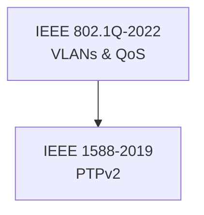
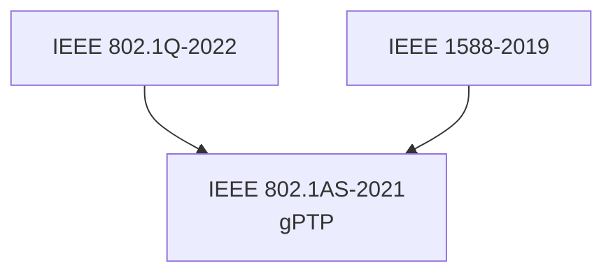
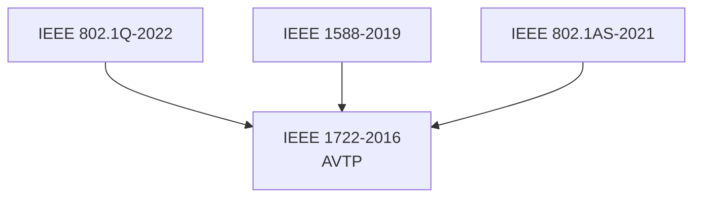
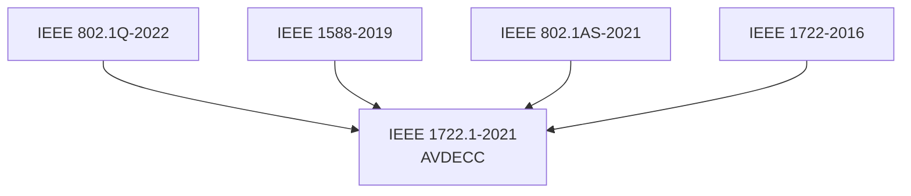
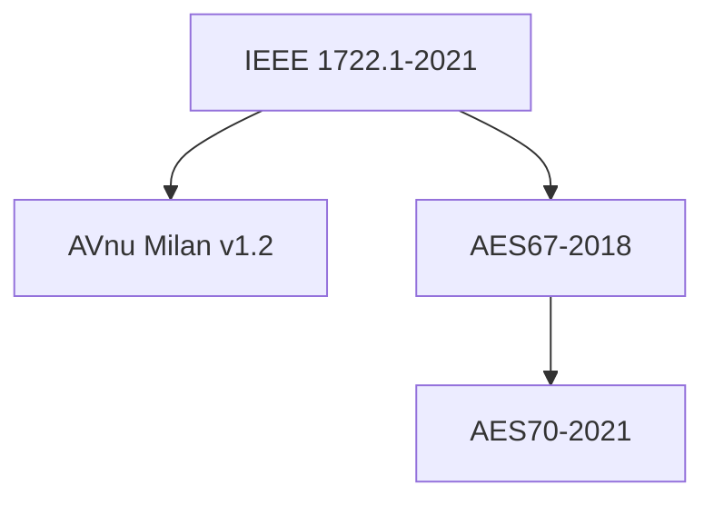

# IEEE Media Networking Standards Foundation Dependencies

> **Purpose**: Document critical dependency relationships between IEEE media networking standards
> **Status**: Active reference document for dependency validation
> **Referenced by**: `.github/prompts/ieee-media-networking-standards.prompt.md`, Implementation planning

## 🎯 Dependency Validation Rules

### Foundation-First Principle
Higher layer standards **CANNOT** begin implementation until **ALL** foundation dependencies are **100% complete** through all 9 software lifecycle phases.

### Completion Definition
A standard is considered "complete" when:
- ✅ All 9 phases completed (01-stakeholder through 09-operation)
- ✅ >80% test coverage achieved
- ✅ Authoritative document compliance verified  
- ✅ Hardware abstraction maintained
- ✅ CI pipeline integration successful

## 📊 Complete Dependency Matrix

| Standard | Depends On | Dependency Type | Rationale |
|----------|------------|-----------------|-----------|
| IEEE 802.1Q-2022 | None | Foundation | Network foundation - VLAN and QoS |
| IEEE 1588-2019 | IEEE 802.1Q-2022 | Required | PTP requires VLAN tagging and QoS |
| IEEE 802.1AS-2021 | IEEE 1588-2019, IEEE 802.1Q-2022 | Required | gPTP extends PTPv2 over Ethernet |
| IEEE 1722-2016 | IEEE 802.1AS-2021, IEEE 1588-2019, IEEE 802.1Q-2022 | Required | AVTP requires precise timing |
| IEEE 1722.1-2021 | IEEE 1722-2016, IEEE 802.1AS-2021, IEEE 1588-2019, IEEE 802.1Q-2022 | Required | AVDECC uses AVTP transport |
| AVnu Milan v1.2 | IEEE 1722.1-2021 + all lower | Required | Milan extends AVDECC |
| AES67-2018 | IEEE 1722-2016, IEEE 802.1AS-2021 + lower | Required | Audio-over-IP uses AVTP timing |
| AES70-2021 | AES67-2018, IEEE 1722.1-2021 + all lower | Required | OCA extends AES67 control |

## 🏗️ Layered Architecture Dependencies

### Layer 1: Network Foundation (No Dependencies)


### Layer 2: Network Timing (Depends on Layer 1)


### Layer 3: Media Transport (Depends on Layers 1-2)


### Layer 4: Device Control (Depends on Layers 1-3)


### Layer 5: Professional Audio (Depends on Layers 1-4)


## 📋 Detailed Dependency Analysis

### IEEE 1588-2019 Dependencies
**Requires**: IEEE 802.1Q-2022
**Why**: 
- PTP messages require VLAN tagging for network segregation
- QoS prioritization ensures timing message delivery
- Network infrastructure must support priority queues

**Technical Integration Points**:
- PTP packets use specific VLAN priority levels
- QoS ensures timing-critical messages aren't dropped
- Network switches must support PTP-aware forwarding

### IEEE 802.1AS-2021 Dependencies  
**Requires**: IEEE 1588-2019, IEEE 802.1Q-2022
**Why**:
- gPTP is ethernet-specific profile of PTPv2
- Extends PTP with 802.1 bridging and forwarding
- Requires VLAN and QoS for proper operation

**Technical Integration Points**:
- Uses PTP message formats and algorithms
- Adds 802.1 bridge-specific timing corrections
- Integrates with VLAN-aware network infrastructure

### IEEE 1722-2016 Dependencies
**Requires**: IEEE 802.1AS-2021, IEEE 1588-2019, IEEE 802.1Q-2022  
**Why**:
- AVTP streams require synchronized presentation time
- Uses gPTP for network-wide time synchronization
- Depends on VLAN infrastructure for stream identification

**Technical Integration Points**:
- AVTP presentation time calculated from gPTP time
- Stream ID includes VLAN tagging information
- Packet timing depends on synchronized network clocks

### IEEE 1722.1-2021 Dependencies
**Requires**: IEEE 1722-2016, IEEE 802.1AS-2021, IEEE 1588-2019, IEEE 802.1Q-2022
**Why**:
- AVDECC control messages transported over AVTP
- Device discovery requires time-synchronized network
- Connection management uses AVTP stream infrastructure

**Technical Integration Points**:
- AECP messages use AVTP packet format
- Discovery timing depends on gPTP synchronization
- Stream connections use AVTP stream identification

### AVnu Milan v1.2 Dependencies
**Requires**: IEEE 1722.1-2021 + all lower layers
**Why**:
- Milan is professional audio profile of AVDECC
- Adds redundancy and fast connection features
- Requires full IEEE AVB/TSN stack operational

**Technical Integration Points**:
- Extends AVDECC with Milan-specific commands
- Uses redundant AVTP streams for reliability
- Requires precise timing for fast connect/disconnect

### AES67-2018 Dependencies
**Requires**: IEEE 1722-2016, IEEE 802.1AS-2021, IEEE 1588-2019, IEEE 802.1Q-2022
**Why**:
- Audio-over-IP requires AVTP transport
- Interoperability requires synchronized timing
- Professional audio needs QoS guarantees

**Technical Integration Points**:
- Audio streams use AVTP AAF format
- Sample clock synchronization uses gPTP
- Audio VLAN separation for broadcast environments

### AES70-2021 Dependencies
**Requires**: AES67-2018, IEEE 1722.1-2021 + all lower layers
**Why**:
- OCA provides device control for AES67 devices
- Control protocol needs transport infrastructure
- Device management requires full networking stack

**Technical Integration Points**:
- OCA control messages over network infrastructure
- Device discovery extends AVDECC mechanisms
- Audio control integrates with AES67 streams

## 🚨 Dependency Validation Checklist

### Before Starting Any Standard
```markdown
Validate ALL dependencies are complete:
- [ ] Foundation dependencies identified from matrix above
- [ ] Each dependency shows 100% completion in status tracker
- [ ] Integration points verified and working
- [ ] Hardware abstraction interfaces available
- [ ] Cross-standard namespace dependencies satisfied
```

### Critical Path Analysis
```markdown
Critical Path: IEEE 802.1Q → IEEE 1588 → IEEE 802.1AS → IEEE 1722 → IEEE 1722.1

Parallel Paths (after IEEE 1722.1):
- Milan: IEEE 1722.1 → AVnu Milan v1.2
- AES Audio: IEEE 1722 → AES67-2018 → AES70-2021
- Extended Features: IEEE 1722.1 → Additional protocols
```

## 🔍 Dependency Validation Scripts

### Automated Dependency Checking
```python
# Example validation script integration
def validate_dependencies(standard_name):
    """Validate all dependencies are complete before allowing standard implementation"""
    dependencies = get_dependencies(standard_name)
    for dep in dependencies:
        if not is_standard_complete(dep):
            raise DependencyError(f"Standard {standard_name} cannot begin: {dep} not complete")
    return True
```

### CI Pipeline Integration
```yaml
# Add to existing CI pipeline
dependency-validation:
  name: Validate IEEE Standards Dependencies
  steps:
    - name: Check Foundation Dependencies
      run: python Scripts/validate-ieee-dependencies.py --standard ${{ matrix.standard }}
```

## 📅 Timeline Impact Analysis

### Sequential Implementation Impact
- **Foundation Delay**: 1 week delay in IEEE 802.1Q affects ALL 7 dependent standards
- **Timing Delay**: 1 week delay in IEEE 1588 affects 6 dependent standards  
- **Transport Delay**: 1 week delay in IEEE 1722 affects 4 dependent standards

### Parallel Opportunities
```markdown
After IEEE 1722.1-2021 complete, these can proceed in parallel:
- AVnu Milan v1.2 (extends AVDECC)
- AES67-2018 (uses AVTP directly)
- Additional professional audio standards

Estimated parallel time savings: 8-12 weeks
```

## 🔄 Document Maintenance

**Update Triggers**:
- When new standards are added to implementation plan
- When dependency relationships change
- When integration points are modified
- When standards complete implementation

**Validation Required**:
- Technical accuracy of dependency relationships
- Completeness of integration point documentation
- Alignment with implementation status tracker

---
**Last Updated**: 2025-10-12  
**Updated By**: AI Agent  
**Next Review**: When implementation plan changes or new standards added