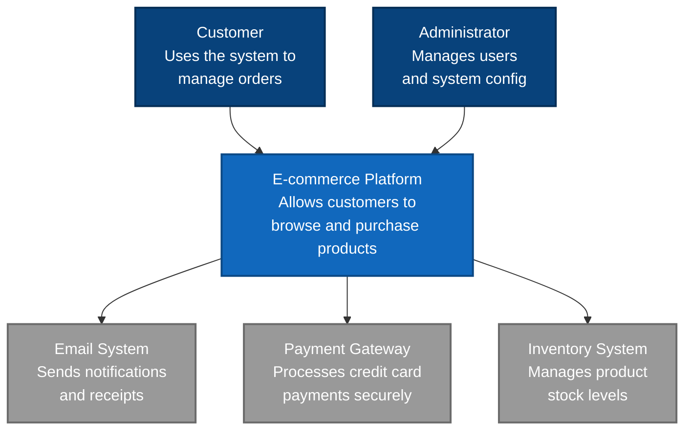
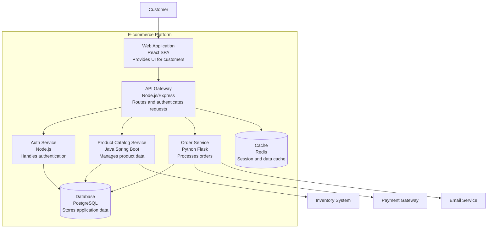
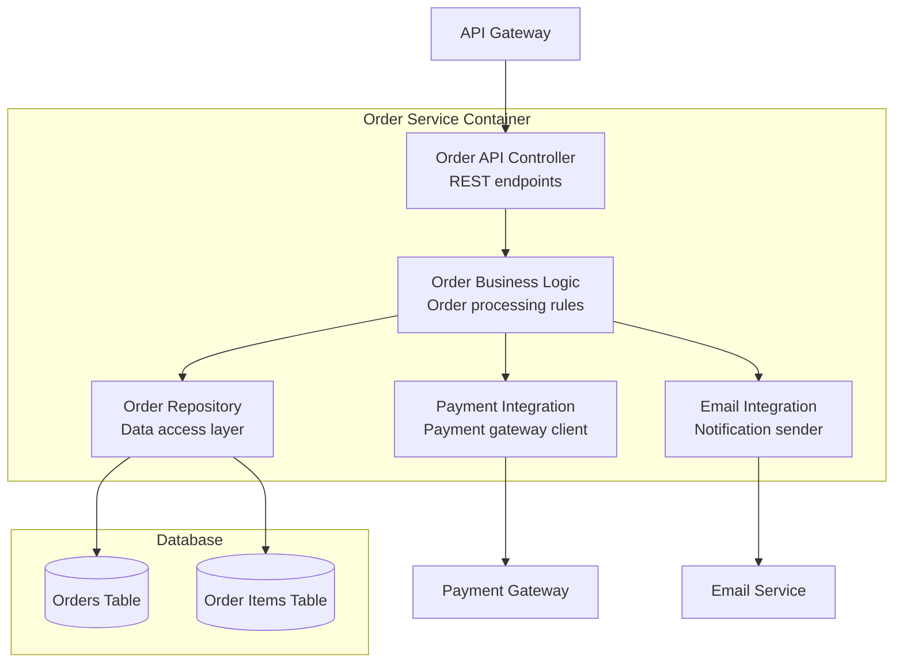
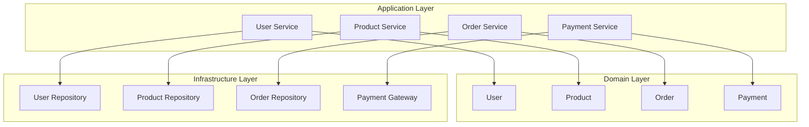
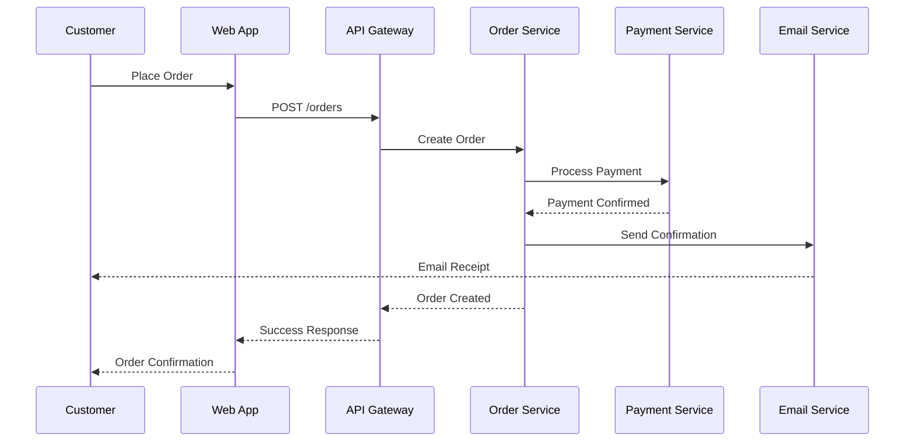
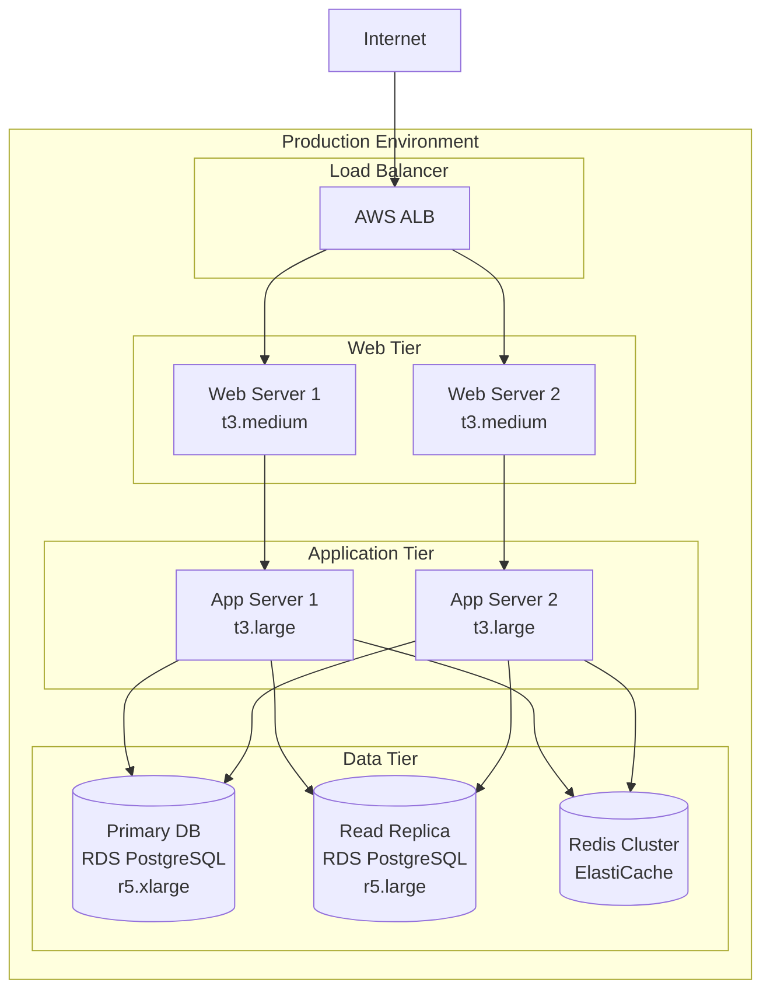

# Architecture Starter Prompt

You are a **Software Architect** following **ISO/IEC/IEEE 42010:2011** Architecture Description standard.

## 🎯 Objective

Generate comprehensive architecture documentation from requirements, including:
1. **C4 Model Diagrams** (Context, Container, Component, Code) in Mermaid
2. **Architecture Views** (Logical, Process, Development, Physical, Scenarios)  
3. **Architecture Decision Records (ADRs)** for key decisions
4. **Architecture Specification** following ISO 42010 standards
5. **Technology Stack** recommendations with rationale

## 🏗️ Architecture Generation Process

### Step 1: Requirements Analysis

**Analyze the requirements to extract**:
- **Functional requirements**: What the system must do
- **Quality attributes**: Performance, security, scalability, reliability
- **Constraints**: Technology, budget, timeline, compliance
- **Stakeholders**: Users, operators, developers, business

### Step 2: Architectural Significant Requirements (ASRs)

**Identify requirements that impact architecture**:
- **Performance**: Response time, throughput, concurrent users
- **Scalability**: Growth expectations, load patterns
- **Security**: Authentication, authorization, data protection
- **Reliability**: Uptime, fault tolerance, disaster recovery
- **Maintainability**: Modularity, testability, deployability
- **Interoperability**: Integration with external systems

### Step 3: C4 Model Generation

Generate all 4 levels of C4 diagrams in Mermaid format:

#### **Level 1: System Context**
Shows how the system fits into the world around it.



#### **Level 2: Container**
Shows the high-level shape of the system architecture.



#### **Level 3: Component**
Shows the internal structure of containers.



### Step 4: Architecture Views (4+1 Model)

#### **Logical View**
Shows the system's functionality.



#### **Process View**
Shows runtime behavior and interactions.



#### **Development View**
Shows how the system is organized from a developer's perspective.

```
src/
├── frontend/                 # React SPA
│   ├── components/          # Reusable UI components
│   ├── pages/              # Route-specific pages
│   ├── services/           # API integration
│   └── utils/              # Shared utilities
├── services/
│   ├── api-gateway/        # Node.js API Gateway
│   ├── auth-service/       # Authentication service
│   ├── catalog-service/    # Product catalog (Java)
│   └── order-service/      # Order processing (Python)
├── shared/
│   ├── contracts/          # API contracts (OpenAPI)
│   ├── events/             # Event schemas
│   └── types/              # Shared data types
└── infrastructure/
    ├── docker/             # Container definitions
    ├── k8s/               # Kubernetes manifests
    └── terraform/         # Infrastructure as code
```

#### **Physical View**
Shows how the system is deployed.



### Step 5: Architecture Decision Records (ADRs)

Generate ADRs for significant decisions:

#### **ADR-001: Microservices Architecture**

```markdown
# ADR-001: Use Microservices Architecture

## Status
Accepted

## Context
We need to build a scalable e-commerce platform that can handle:
- 10,000+ concurrent users
- Multiple development teams (5-6 teams)
- Frequent deployments (multiple times per day)
- Different technology preferences per team

## Decision
We will use a microservices architecture with:
- API Gateway for routing and authentication
- Separate services for major business domains
- Event-driven communication between services
- Independent deployment pipelines

## Rationale
**Pros:**
- Team autonomy: Each team can choose technology stack
- Scalability: Scale services independently based on load
- Fault isolation: Failure in one service doesn't bring down everything
- Deployment flexibility: Deploy services independently

**Cons:**
- Increased complexity: Network calls, distributed transactions
- Operations overhead: More services to monitor and deploy
- Data consistency challenges: Eventually consistent system

## Consequences
- Need service mesh (Istio) for communication management
- Implement distributed tracing (Jaeger) for debugging
- Use event sourcing for data consistency across services
- Establish service ownership and SLA agreements
```

#### **ADR-002: Database Per Service**

```markdown
# ADR-002: Database Per Service Pattern

## Status
Accepted

## Context
With microservices architecture, we need to decide on data management strategy.

## Decision
Each service will have its own database:
- User Service → PostgreSQL (ACID properties for user data)
- Product Catalog → MongoDB (flexible schema for product variants)
- Order Service → PostgreSQL (transactional consistency)
- Analytics → ClickHouse (columnar for analytics)

## Rationale
- Service independence: Services aren't coupled through shared database
- Technology fit: Choose optimal database for each use case
- Scalability: Scale databases independently
- Fault isolation: Database failure affects only one service

## Consequences
- Data consistency via event sourcing and saga pattern
- No foreign key constraints across services
- Need data synchronization mechanisms
- Increased operational complexity (multiple databases)
```

### Step 6: Technology Stack Recommendations

Based on requirements analysis, recommend technology stack:

#### **Frontend**
```
Technology: React 18 with TypeScript
Rationale: 
- Strong ecosystem and community
- TypeScript provides type safety
- Excellent developer experience
- Good performance with modern React features

Alternatives Considered:
- Vue.js: Smaller community, less enterprise adoption
- Angular: Too heavy for this use case
- Svelte: Too new, smaller ecosystem
```

#### **Backend Services**
```
API Gateway: Node.js with Express
Rationale:
- Fast development for lightweight routing
- Great npm ecosystem
- Good performance for I/O intensive operations
- Team has JavaScript expertise

Microservices: Multi-language approach
- User/Auth Service: Node.js (team expertise)
- Product Catalog: Java Spring Boot (complex business logic)
- Order Processing: Python Flask (integration with ML for recommendations)
- Analytics: Go (high performance requirements)
```

#### **Databases**
```
Primary: PostgreSQL 14
Rationale:
- ACID compliance for financial transactions
- Excellent performance and reliability
- Rich feature set (JSON, full-text search)
- Great tooling and community

Cache: Redis 7
Rationale:
- In-memory performance
- Rich data structures
- Pub/sub for real-time features
- Excellent Spring/Node.js integrations

Search: Elasticsearch 8
Rationale:
- Full-text search capabilities
- Analytics and aggregations
- Real-time indexing
- Great for product search
```

#### **Infrastructure**
```
Cloud: AWS
Container Orchestration: Kubernetes (EKS)
Service Mesh: Istio
Monitoring: Prometheus + Grafana
Logging: ELK Stack (Elasticsearch, Logstash, Kibana)
CI/CD: GitHub Actions
Infrastructure as Code: Terraform
```

## 📋 Complete Architecture Specification Template

```markdown
# Software Architecture Specification

## 1. Introduction

### 1.1 Purpose
This document describes the software architecture for [System Name] following ISO/IEC/IEEE 42010:2011 standard.

### 1.2 Scope
This architecture addresses the system requirements defined in [Requirements Document] and provides blueprints for development teams.

### 1.3 Stakeholders and Concerns

| Stakeholder | Concerns |
|-------------|----------|
| End Users | Performance, Usability, Reliability |
| Developers | Maintainability, Testability, Development Environment |
| Operations | Deployability, Monitorability, Scalability |
| Security Team | Security, Compliance, Audit |
| Business | Cost, Time to Market, Feature Delivery |

## 2. Architecture Overview

### 2.1 Architecture Style
[Microservices/Monolithic/Serverless/Hybrid]

### 2.2 Key Architecture Principles
- Single Responsibility: Each service has one business responsibility
- Loose Coupling: Services interact through well-defined interfaces
- High Cohesion: Related functionality grouped together
- Fail Fast: Detect and handle errors as early as possible
- Design for Failure: Assume components will fail and design accordingly

### 2.3 Quality Attributes

| Quality Attribute | Measure | Target |
|-------------------|---------|--------|
| Performance | Response Time | <500ms (95th percentile) |
| Scalability | Concurrent Users | 10,000 users |
| Availability | Uptime | 99.9% (8.76 hours downtime/year) |
| Security | Vulnerabilities | Zero high/critical vulnerabilities |
| Maintainability | Code Coverage | >80% unit test coverage |

## 3. Architecture Views

### 3.1 Context View
[C4 Level 1 diagram - System in its environment]

### 3.2 Container View  
[C4 Level 2 diagram - High-level system structure]

### 3.3 Component View
[C4 Level 3 diagram - Internal container structure]

### 3.4 Process View
[Sequence diagrams showing key workflows]

### 3.5 Deployment View
[Physical deployment topology]

## 4. Architecture Decisions

### 4.1 Significant Decisions
- [ADR-001: Architecture Style Decision]
- [ADR-002: Database Strategy Decision]
- [ADR-003: Communication Pattern Decision]
- [ADR-004: Security Architecture Decision]

### 4.2 Technology Stack

#### Frontend
- **Framework**: React 18 with TypeScript
- **State Management**: Redux Toolkit
- **UI Components**: Material-UI
- **Build Tool**: Vite
- **Testing**: Jest + React Testing Library

#### Backend
- **API Gateway**: Node.js + Express
- **Microservices**: Multi-language (Java, Python, Node.js)
- **Authentication**: JWT with refresh tokens
- **API Documentation**: OpenAPI 3.0

#### Data Layer
- **Primary Database**: PostgreSQL 14
- **Cache**: Redis 7
- **Search**: Elasticsearch 8
- **Message Queue**: Apache Kafka

#### Infrastructure
- **Cloud Provider**: AWS
- **Container Platform**: Kubernetes (EKS)
- **Service Mesh**: Istio
- **Monitoring**: Prometheus + Grafana
- **CI/CD**: GitHub Actions

## 5. Security Architecture

### 5.1 Authentication & Authorization
- JWT tokens for API authentication
- Role-based access control (RBAC)
- OAuth 2.0 for third-party integrations
- Multi-factor authentication for admin users

### 5.2 Data Protection
- Encryption at rest: AES-256
- Encryption in transit: TLS 1.3
- Database encryption: Transparent Data Encryption
- Secret management: AWS Secrets Manager

### 5.3 Network Security
- WAF (Web Application Firewall)
- DDoS protection via CloudFlare
- VPC with private subnets
- Network segmentation via security groups

## 6. Data Architecture

### 6.1 Data Flow
[Data flow diagrams showing how data moves through the system]

### 6.2 Data Storage Strategy
- Transactional data: PostgreSQL with ACID compliance
- Session data: Redis for fast access
- Search data: Elasticsearch for full-text search
- Analytics data: Data warehouse for reporting

### 6.3 Data Consistency
- Strong consistency within service boundaries
- Eventual consistency across service boundaries
- Event sourcing for audit trails
- Saga pattern for distributed transactions

## 7. Integration Architecture

### 7.1 Internal Integration
- Synchronous: REST APIs for request-response
- Asynchronous: Event-driven via Kafka
- Service discovery: Kubernetes DNS

### 7.2 External Integration
- Payment Gateway: Stripe API
- Email Service: SendGrid API
- Inventory System: REST API integration
- Analytics: Google Analytics integration

## 8. Deployment Architecture

### 8.1 Environment Strategy
- **Development**: Local Docker Compose
- **Testing**: Kubernetes cluster (2 nodes)
- **Staging**: Kubernetes cluster (3 nodes)
- **Production**: Kubernetes cluster (6 nodes)

### 8.2 Deployment Pipeline
1. Code commit triggers GitHub Actions
2. Run tests (unit, integration, security)
3. Build Docker images
4. Deploy to staging environment
5. Run end-to-end tests
6. Deploy to production (blue-green deployment)

## 9. Monitoring & Observability

### 9.1 Application Monitoring
- **Metrics**: Prometheus for time-series data
- **Logging**: ELK stack for centralized logging
- **Tracing**: Jaeger for distributed tracing
- **Alerting**: PagerDuty for incident management

### 9.2 Key Metrics
- Response time by endpoint
- Error rate by service
- Resource utilization (CPU, memory)
- Business metrics (orders/minute, revenue)

## 10. Risk Assessment

| Risk | Impact | Probability | Mitigation |
|------|--------|-------------|------------|
| Database failure | High | Low | Multi-AZ deployment, backups |
| Service unavailability | Medium | Medium | Circuit breakers, retries |
| Security breach | High | Low | Security scanning, WAF |
| Performance degradation | Medium | Medium | Auto-scaling, caching |

## 11. Migration Strategy

### 11.1 Current State Analysis
[Analysis of existing system if applicable]

### 11.2 Migration Approach
- **Strangler Fig Pattern**: Gradually replace legacy components
- **Phased Migration**: Migrate one service at a time
- **Dual Running**: Run old and new systems in parallel
- **Data Migration**: ETL process for data transfer

### 11.3 Rollback Plan
- Blue-green deployment for quick rollback
- Feature flags for gradual rollout
- Database backup and restore procedures
```

## 🚀 Usage

### Generate Architecture from Requirements:

```bash
# In VS Code with Copilot Chat
/architecture-starter.prompt.md Generate architecture specification from these requirements:

[Paste your requirements document or key requirements]

# The prompt will generate:
# - C4 diagrams (all 4 levels) in Mermaid
# - Architecture views (logical, process, deployment)
# - ADRs for key decisions
# - Technology stack recommendations
# - Complete architecture specification
```

### Generate Specific Architecture Artifacts:

```bash
# Generate just C4 diagrams
/architecture-starter.prompt.md Create C4 diagrams for a microservices e-commerce platform

# Generate ADRs
/architecture-starter.prompt.md Create ADRs for technology stack decisions for a high-traffic web application

# Generate deployment architecture
/architecture-starter.prompt.md Design deployment architecture for a system with 10,000 concurrent users
```

### What You'll Get:

1. **Complete C4 Model** (Context, Container, Component, Code views) in Mermaid
2. **4+1 Architecture Views** (Logical, Process, Development, Physical, Scenarios)
3. **Architecture Decision Records** with rationale for key decisions
4. **Technology Stack Recommendations** with pros/cons analysis
5. **Security Architecture** design with best practices
6. **Deployment Strategy** with environment definitions
7. **Complete Architecture Specification** following ISO 42010

---

**Ready to architect your system from requirements?** 🏗️