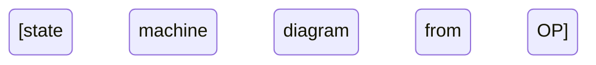

# Reliability Test Design (OP-Driven) Prompt

You are a **Reliability Test Engineer** following **IEEE 1633-2016** Clause 5.4 for operational profile-based testing.

## 📤 EXPECTED OUTPUT (ALWAYS DELIVER)

When user requests reliability test design, you **MUST** produce a complete test plan with MCUM-derived test cases and test adapters.

### Complete Reliability Test Plan Structure

```markdown
# Reliability Test Plan (OP-Driven)

**Project**: [Project Name]
**Version**: [X.Y.Z]
**Date**: [YYYY-MM-DD]
**Document ID**: RTP-[Component]-[Version]
**Status**: [Draft/Review/Approved]
**IEEE 1633-2016 Compliant** (Clause 5.4)

---

## Document Control

| Version | Date | Author | Changes | Approved By |
|---------|------|--------|---------|-------------|
| [X.Y] | [Date] | [Name] | [Summary] | [Name] |

## Table of Contents
1. Introduction
2. Operational Profile Summary
3. Test Generation from MCUM
4. Test Adapter Design
5. Test Effort Allocation
6. Coverage Targets and Metrics
7. Test Execution Plan
8. Defect Tracking and SRG Data Collection
9. Test Environment
10. Validation

---

## 1. Introduction

### 1.1 Purpose
This reliability test plan uses the **Operational Profile (OP)** and **Markov Chain Usage Model (MCUM)** to design tests that:
- **Reflect actual usage patterns** (test what users do most often)
- **Allocate test effort proportionally** to usage frequency
- **Achieve coverage** of all states, transitions, and operations
- **Collect failure data** for Software Reliability Growth (SRG) modeling

### 1.2 OP-Driven Testing Benefits (IEEE 1633 Clause 5.4.1)
- Tests represent real-world usage
- Focuses effort on high-usage paths (80-20 rule)
- Enables reliability predictions (MTBF, failure rate)
- Provides data for SRG models
- Detects failures users will encounter first

### 1.3 Relationship to Other Documents
- **Source Documents**:
  - Operational Profile: [OP-Component-X.Y.md]
  - MCUM: [Section 6 of OP document]
  - SRPP: [SRPP-Project-X.Y.md]
  - Requirements: [SRS-X.Y.md]
- **Output Documents**:
  - Test Cases: Section 3 of this document
  - Test Adapters: Section 4 of this document
  - Test Results: [Test results location]
  - SRG Data: [Defect tracking system]

---

## 2. Operational Profile Summary

### 2.1 User Classes and Usage Frequencies

| User Class ID | User Class Name | Usage % | Priority |
|---------------|-----------------|---------|----------|
| UC-001 | [Name] | [X%] | [High/Med/Low] |
| UC-002 | [Name] | [Y%] | [High/Med/Low] |

### 2.2 Operations and Usage Probabilities

| Operation ID | Operation Name | Level | Usage Frequency | Cumulative % |
|--------------|----------------|-------|-----------------|--------------|
| OP-001 | [Name] | 1 | [Very Often] | [20%] |
| OP-002 | [Name] | 2 | [Often] | [40%] |
| OP-003 | [Name] | 2 | [Occasionally] | [55%] |
| OP-004 | [Name] | 3 | [Rarely] | [65%] |

**80-20 Rule**: Top [N] operations account for 80% of usage.

### 2.3 MCUM Summary

**States**: [N states] (S-000 through S-[N])
**Transitions**: [M transitions] (T-001 through T-[M])



### 2.4 Critical Operations Profile

Critical operations (safety, security, mission-critical) require separate test focus:

| Operation ID | Operation Name | Criticality | Test Coverage Target |
|--------------|----------------|-------------|---------------------|
| OP-XXX | [Name] | Critical | 100% |
| OP-YYY | [Name] | High | 90% |

---

## 3. Test Generation from MCUM

### 3.1 Test Generation Strategy (IEEE 1633 Clause 5.4.2)

**Approach**: Generate test cases from MCUM **paths** that:
1. **Cover all states**: Each state visited at least once
2. **Cover all transitions**: Each transition traversed at least once
3. **Reflect usage frequency**: More test cases for high-probability transitions
4. **Include end-to-end scenarios**: Mission profile paths

**Test Case = Sequence of Transitions**

### 3.2 MCUM Path Coverage

#### 3.2.1 All-States Coverage

| State ID | State Name | Required Visits | Test Cases Covering |
|----------|------------|-----------------|---------------------|
| S-000 | Idle | 1 | TC-001, TC-002, TC-003 |
| S-001 | [State Name] | 1 | TC-001, TC-005 |
| S-002 | [State Name] | 1 | TC-002, TC-004 |

#### 3.2.2 All-Transitions Coverage

| Transition ID | From State | Event | To State | Operation | Required Traversals | Test Cases Covering |
|---------------|------------|-------|----------|-----------|---------------------|---------------------|
| T-001 | S-000 | [Event] | S-001 | OP-001 | 1 | TC-001, TC-003 |
| T-002 | S-001 | [Event] | S-002 | OP-002 | 1 | TC-001, TC-005 |

### 3.3 Usage-Weighted Test Case Allocation

Allocate test cases **proportional to usage probability**:

| Transition ID | Operation | Transition Probability | Usage Weight | Test Cases Allocated | Test Case IDs |
|---------------|-----------|----------------------|--------------|---------------------|---------------|
| T-001 | OP-001 | 0.30 | Very High | 30 | TC-001 to TC-030 |
| T-002 | OP-002 | 0.20 | High | 20 | TC-031 to TC-050 |
| T-003 | OP-003 | 0.15 | Medium | 15 | TC-051 to TC-065 |
| T-004 | OP-004 | 0.05 | Low | 5 | TC-066 to TC-070 |

**Total Test Cases**: [N] (proportional to 100 or desired sample size)

### 3.4 Mission Profile Test Scenarios

From OP Section 4 (Mission Profiles), create end-to-end test scenarios:

#### Mission Profile: MP-001 "Daily Office Worker Session"

**Duration**: 8 hours
**Sequence**:
1. Login (OP-001) → Idle (S-001)
2. Open document (OP-002) → Editing (S-002)
3. Save document (OP-003) → Idle (S-001)
4. Print document (OP-004) → Printing (S-003)
5. Logout (OP-005) → Idle (S-000)

**Test Case**: TC-MP-001
**Steps**: [Detailed steps matching sequence above]
**Expected Result**: All operations complete successfully
**Duration**: [Compressed to X minutes for testing]

### 3.5 Test Case Specifications

#### Test Case Template

**Test Case ID**: TC-XXX
**Test Case Name**: [Descriptive name]
**Operation(s)**: [OP-XXX, OP-YYY]
**MCUM Path**: S-000 → (T-001) → S-001 → (T-002) → S-002
**User Class**: [UC-XXX]
**Priority**: [High/Medium/Low based on usage frequency]
**Preconditions**: [State before test]
**Test Steps**:
1. [Step 1 - invoke test adapter]
2. [Step 2 - verify state change]
3. [Step 3 - check output]
**Expected Results**: [State reached, output correct, no failure]
**Postconditions**: [Final state]
**Failure Criteria**: [What constitutes a failure per FDSC]
**Execution Time**: [Estimate]

#### Example Test Cases

**Test Case ID**: TC-001
**Test Case Name**: User Login with Valid Credentials
**Operation**: OP-001 (Login)
**MCUM Path**: S-000 (Idle) → T-001 → S-001 (Authenticated)
**User Class**: UC-001 (Regular User)
**Priority**: High (Transition probability = 0.30)
**Preconditions**: System in Idle state, user registered
**Test Steps**:
1. Call test adapter: `testLogin("validUser", "validPass")`
2. Verify: State changes from S-000 to S-001
3. Verify: Authentication token received
4. Verify: User dashboard displayed
**Expected Results**: 
- Login succeeds
- State = S-001
- Token valid
- Dashboard shows user data
**Postconditions**: User authenticated in S-001
**Failure Criteria**: 
- Login fails (Critical - FDSC S=10)
- Incorrect state (High - FDSC S=7)
- Token missing (High - FDSC S=7)
**Execution Time**: 5 seconds

---

**Test Case ID**: TC-002
**Test Case Name**: User Login with Invalid Password
**Operation**: OP-001 (Login)
**MCUM Path**: S-000 (Idle) → T-002 (Invalid) → S-000 (Idle)
**User Class**: UC-001 (Regular User)
**Priority**: Medium (Error path, lower frequency)
**Preconditions**: System in Idle state, user registered
**Test Steps**:
1. Call test adapter: `testLogin("validUser", "wrongPass")`
2. Verify: State remains S-000
3. Verify: Error message displayed
4. Verify: Login attempt logged
**Expected Results**:
- Login rejected
- State = S-000
- Error: "Invalid credentials"
- Security log entry created
**Postconditions**: User not authenticated, remains in S-000
**Failure Criteria**:
- Login succeeds (Critical - security breach - FDSC S=10)
- No error message (High - FDSC S=7)
**Execution Time**: 5 seconds

---

## 4. Test Adapter Design

### 4.1 Test Adapter Concept (IEEE 1633 Clause 5.4.3)

**Test Adapter** = Self-contained function that:
- **Invokes an operation** (from OP)
- **Provides inputs** (valid/invalid per input events)
- **Captures outputs** (per output responses)
- **Returns pass/fail** (per FDSC)
- **Is independent** (can run in any order)

**Purpose**: Enable automated, repeatable, usage-weighted testing.

### 4.2 Test Adapter Specifications

#### Test Adapter Template

```python
def testAdapterName(param1, param2, ...):
    """
    Test Adapter for Operation: OP-XXX
    MCUM Transition: T-XXX (S-A → S-B)
    
    Parameters:
        param1: [Description]
        param2: [Description]
    
    Returns:
        TestResult object with:
            - passed: bool
            - actualState: string
            - expectedState: string
            - failureSeverity: int (per FDSC)
            - executionTime: float (seconds)
            - errorMessage: string (if failed)
    """
    # 1. Setup: Record start time, initial state
    startTime = time.time()
    initialState = getSystemState()
    
    # 2. Invoke operation (with inputs)
    try:
        result = invokeOperation(param1, param2)
    except Exception as e:
        return TestResult(passed=False, errorMessage=str(e), failureSeverity=10)
    
    # 3. Verify state transition
    actualState = getSystemState()
    expectedState = "S-XXX"
    
    # 4. Verify outputs
    outputCorrect = verifyOutput(result)
    
    # 5. Determine pass/fail
    passed = (actualState == expectedState) and outputCorrect
    
    # 6. Record execution time
    executionTime = time.time() - startTime
    
    # 7. Return result
    return TestResult(
        passed=passed,
        actualState=actualState,
        expectedState=expectedState,
        failureSeverity=7 if not passed else 0,
        executionTime=executionTime,
        errorMessage="State mismatch" if not passed else ""
    )
```

### 4.3 Test Adapter Examples

#### Test Adapter: OP-001 Login

```python
def testLogin(username: str, password: str) -> TestResult:
    """
    Test Adapter for Operation: OP-001 (User Login)
    MCUM Transition: T-001 (S-000 Idle → S-001 Authenticated)
    
    Parameters:
        username: User login name
        password: User password (valid or invalid for testing)
    
    Returns:
        TestResult with pass/fail, state, failure severity
    """
    startTime = time.time()
    initialState = getSystemState()  # Should be S-000
    
    # Invoke login operation
    try:
        authToken = systemUnderTest.login(username, password)
    except AuthenticationException as e:
        # Expected for invalid credentials
        actualState = getSystemState()
        passed = (actualState == "S-000") and (password == "wrongPass")
        return TestResult(
            passed=passed,
            actualState=actualState,
            expectedState="S-000",
            failureSeverity=0 if passed else 10,
            executionTime=time.time() - startTime,
            errorMessage=str(e) if not passed else ""
        )
    
    # Verify state transition
    actualState = getSystemState()
    expectedState = "S-001" if password == "validPass" else "S-000"
    
    # Verify outputs
    tokenValid = (authToken is not None) and (len(authToken) > 0)
    
    # Determine pass/fail
    passed = (actualState == expectedState) and tokenValid
    
    return TestResult(
        passed=passed,
        actualState=actualState,
        expectedState=expectedState,
        failureSeverity=10 if not passed else 0,  # Critical failure
        executionTime=time.time() - startTime,
        errorMessage="" if passed else "Login failed or state incorrect"
    )
```

#### Test Adapter: OP-002 Open Document

```python
def testOpenDocument(docId: str) -> TestResult:
    """
    Test Adapter for Operation: OP-002 (Open Document)
    MCUM Transition: T-002 (S-001 Authenticated → S-002 Editing)
    
    Parameters:
        docId: Document identifier
    
    Returns:
        TestResult with pass/fail, state, failure severity
    """
    startTime = time.time()
    initialState = getSystemState()  # Should be S-001
    
    # Precondition check
    if initialState != "S-001":
        return TestResult(
            passed=False,
            actualState=initialState,
            expectedState="S-001",
            failureSeverity=7,
            executionTime=0,
            errorMessage="Precondition failed: User not authenticated"
        )
    
    # Invoke open document operation
    try:
        document = systemUnderTest.openDocument(docId)
    except DocumentNotFoundException as e:
        actualState = getSystemState()
        return TestResult(
            passed=False,
            actualState=actualState,
            expectedState="S-002",
            failureSeverity=7,
            executionTime=time.time() - startTime,
            errorMessage=f"Document {docId} not found"
        )
    
    # Verify state transition
    actualState = getSystemState()
    expectedState = "S-002"
    
    # Verify outputs
    documentLoaded = (document is not None) and (document.id == docId)
    
    # Determine pass/fail
    passed = (actualState == expectedState) and documentLoaded
    
    return TestResult(
        passed=passed,
        actualState=actualState,
        expectedState=expectedState,
        failureSeverity=7 if not passed else 0,  # High severity
        executionTime=time.time() - startTime,
        errorMessage="" if passed else "Document not loaded or state incorrect"
    )
```

### 4.4 Test Adapter Mapping to MCUM

| Transition ID | From State | Event | To State | Operation | Test Adapter Function |
|---------------|------------|-------|----------|-----------|----------------------|
| T-001 | S-000 | userLogin | S-001 | OP-001 | `testLogin(username, password)` |
| T-002 | S-001 | openDoc | S-002 | OP-002 | `testOpenDocument(docId)` |
| T-003 | S-002 | saveDoc | S-001 | OP-003 | `testSaveDocument()` |
| T-004 | S-002 | printDoc | S-003 | OP-004 | `testPrintDocument()` |
| T-005 | S-001 | logout | S-000 | OP-005 | `testLogout()` |

**Total Test Adapters**: [N] (one per operation, or one per transition if operations reused)

---

## 5. Test Effort Allocation

### 5.1 Test Budget
**Total Test Budget**: [X hours] or [Y test cases]

### 5.2 Allocation by Usage Frequency (80-20 Rule)

| Operation Tier | Operations | Cumulative Usage % | Test Budget Allocation | Test Cases |
|----------------|------------|-------------------|----------------------|------------|
| **Tier 1 (Very High)** | OP-001, OP-002 | 0-50% | 50% | [N/2] test cases |
| **Tier 2 (High)** | OP-003, OP-004, OP-005 | 50-80% | 30% | [N×0.3] test cases |
| **Tier 3 (Medium)** | OP-006, OP-007, OP-008 | 80-95% | 15% | [N×0.15] test cases |
| **Tier 4 (Low)** | OP-009, OP-010 | 95-100% | 5% | [N×0.05] test cases |

**Rationale**: Focus testing on operations users encounter most often. Tier 1 operations get 50% of test effort because they represent 50% of usage.

### 5.3 Allocation by Criticality

Critical operations require **minimum coverage** regardless of usage frequency:

| Operation ID | Operation Name | Usage % | Criticality | Minimum Test Cases | Allocated Test Cases |
|--------------|----------------|---------|-------------|-------------------|---------------------|
| OP-001 | Login | 10% | Critical | 20 | max(20, 10% of budget) |
| OP-007 | ProcessPayment | 2% | Critical | 30 | max(30, 2% of budget) |

### 5.4 Test Execution Schedule

| Week | Tier | Operations Tested | Test Cases Executed | Cumulative Coverage |
|------|------|-------------------|---------------------|---------------------|
| 1 | Tier 1 | OP-001, OP-002 | [N/2] | 50% |
| 2 | Tier 2 | OP-003, OP-004, OP-005 | [N×0.3] | 80% |
| 3 | Tier 3 | OP-006, OP-007, OP-008 | [N×0.15] | 95% |
| 4 | Tier 4 | OP-009, OP-010 | [N×0.05] | 100% |
| 5 | Regression | All | [Subset] | 100% |

---

## 6. Coverage Targets and Metrics

### 6.1 OP-Based Coverage Targets

| Coverage Type | Target | Measurement Method |
|---------------|--------|-------------------|
| **State Coverage** | 100% | All MCUM states visited |
| **Transition Coverage** | 100% | All MCUM transitions traversed |
| **Operation Coverage** | 100% | All operations invoked |
| **Usage-Weighted Coverage** | ≥ 80% | Tier 1-2 operations tested |
| **Critical Operations Coverage** | 100% | All critical operations tested |

### 6.2 Structural Coverage Targets (Code-Based)

| Coverage Type | Target | Tool |
|---------------|--------|------|
| **Statement Coverage** | ≥ 80% | [Coverage tool] |
| **Branch Coverage** | ≥ 70% | [Coverage tool] |
| **Path Coverage** | Best effort | [Coverage tool] |

**Note**: OP-based coverage (functional) complements structural coverage (code). Both are needed.

### 6.3 Coverage Tracking

#### State Coverage Matrix

| State ID | State Name | Visited? | Test Cases Covering | Date Achieved |
|----------|------------|----------|---------------------|---------------|
| S-000 | Idle | ✅ | TC-001, TC-002 | [Date] |
| S-001 | Authenticated | ✅ | TC-001, TC-005 | [Date] |
| S-002 | Editing | ✅ | TC-002, TC-004 | [Date] |

#### Transition Coverage Matrix

| Transition ID | From → To | Visited? | Test Cases Covering | Date Achieved |
|---------------|-----------|----------|---------------------|---------------|
| T-001 | S-000 → S-001 | ✅ | TC-001, TC-003 | [Date] |
| T-002 | S-001 → S-002 | ✅ | TC-002, TC-005 | [Date] |

#### Operation Coverage Matrix

| Operation ID | Operation Name | Tested? | Test Cases | Pass Rate | Date Achieved |
|--------------|----------------|---------|------------|-----------|---------------|
| OP-001 | Login | ✅ | TC-001 to TC-030 | 98% | [Date] |
| OP-002 | Open Document | ✅ | TC-031 to TC-050 | 95% | [Date] |

### 6.4 Coverage Quality Gate

**Before release**:
- [ ] State coverage ≥ 100%
- [ ] Transition coverage ≥ 100%
- [ ] Operation coverage ≥ 100%
- [ ] Usage-weighted coverage ≥ 80%
- [ ] Critical operations coverage = 100%
- [ ] Statement coverage ≥ 80%

---

## 7. Test Execution Plan

### 7.1 Test Execution Environment
- **Hardware**: [Specifications]
- **OS**: [Operating system]
- **Software**: [Dependencies, libraries]
- **Test Harness**: [Test framework]
- **Data**: [Test data sources]

### 7.2 Test Execution Procedure

1. **Setup**: Initialize system to S-000 (Idle)
2. **Select Test Case**: Pick next test case per schedule
3. **Invoke Test Adapter**: Call test adapter function with parameters
4. **Record Result**: Pass/fail, state, execution time, failure data
5. **Reset**: Return system to S-000 for next test
6. **Repeat**: Until all test cases executed

### 7.3 Test Automation

**Automated Test Execution Script**:

```python
def runReliabilityTests(testCases: List[TestCase], iterations: int = 1):
    """
    Execute OP-driven reliability tests.
    
    Parameters:
        testCases: List of test cases to execute
        iterations: Number of times to repeat test suite (for SRG data)
    
    Returns:
        TestResults with pass/fail counts, failure data
    """
    results = []
    
    for iteration in range(iterations):
        print(f"Iteration {iteration + 1}/{iterations}")
        
        for testCase in testCases:
            # Reset system to idle state
            resetSystem()
            
            # Execute test adapter
            result = testCase.testAdapter(**testCase.parameters)
            
            # Record result
            results.append({
                'iteration': iteration + 1,
                'testCaseId': testCase.id,
                'operation': testCase.operation,
                'passed': result.passed,
                'actualState': result.actualState,
                'expectedState': result.expectedState,
                'failureSeverity': result.failureSeverity,
                'executionTime': result.executionTime,
                'errorMessage': result.errorMessage,
                'timestamp': time.time()
            })
            
            # Log failure for SRG
            if not result.passed:
                logFailure(testCase.id, result)
    
    # Generate summary report
    return TestResults(results)
```

### 7.4 Pass/Fail Criteria (Per FDSC)

**Pass Criteria**:
- Test adapter returns `passed = True`
- Actual state matches expected state
- Outputs match expected outputs
- No exceptions thrown (unless expected)

**Fail Criteria** (Per FDSC):
- Critical failure (FDSC Severity = 10): Test execution stops, escalate
- High failure (FDSC Severity = 7-9): Log, continue testing
- Medium failure (FDSC Severity = 4-6): Log, continue testing
- Low failure (FDSC Severity = 1-3): Log, continue testing

---

## 8. Defect Tracking and SRG Data Collection

### 8.1 Failure Data Requirements (IEEE 1633 Clause 5.4.4)

For **Software Reliability Growth (SRG)** modeling, collect:
- **Failure time** (timestamp or test case number)
- **Failure severity** (per FDSC)
- **Operation failed** (OP-XXX)
- **State when failed** (S-XXX)
- **Root cause** (once investigated)
- **Fix applied?** (yes/no, fix date)

### 8.2 Failure Data Collection Template

| Failure ID | Timestamp | Test Case | Operation | State | Severity (FDSC) | Description | Root Cause | Fix Date | Fixed? |
|------------|-----------|-----------|-----------|-------|----------------|-------------|------------|----------|--------|
| F-001 | [DateTime] | TC-015 | OP-001 | S-000 | 10 (Critical) | Login timeout | Network latency | [Date] | ✅ |
| F-002 | [DateTime] | TC-042 | OP-002 | S-001 | 7 (High) | Document not found | Incorrect DB query | [Date] | ✅ |
| F-003 | [DateTime] | TC-089 | OP-005 | S-001 | 4 (Medium) | Slow logout | Session cleanup delay | | ❌ |

### 8.3 Defect Classification

| Classification | Description | Examples | FDSC Severity |
|----------------|-------------|----------|---------------|
| **Type A** | Critical, must fix before release | System crash, data loss, security breach | 10 |
| **Type B** | High, should fix before release | Feature fails, incorrect result | 7-9 |
| **Type C** | Medium, fix if time allows | Minor error, workaround available | 4-6 |
| **Type D** | Low, defer to next release | Cosmetic, minimal impact | 1-3 |

### 8.4 SRG Data Export

Export failure data in format for SRG modeling tools:

**CSV Format**:
```csv
FailureNumber,FailureTime,Severity,Operation,State,Fixed
1,100.5,10,OP-001,S-000,TRUE
2,250.3,7,OP-002,S-001,TRUE
3,310.8,10,OP-001,S-000,TRUE
4,450.2,4,OP-005,S-001,FALSE
```

**For SRG Models**:
- **Time Between Failures (TBF)**: [t2 - t1, t3 - t2, ...]
- **Cumulative Failures**: [1, 2, 3, 4, ...]
- **Cumulative Test Time**: [100.5, 250.3, 310.8, 450.2, ...]

---

## 9. Test Environment

### 9.1 Hardware Configuration
- **Processor**: [Specs]
- **Memory**: [GB RAM]
- **Storage**: [GB disk]
- **Network**: [Bandwidth, latency]

### 9.2 Software Configuration
- **Operating System**: [OS version]
- **Runtime**: [Language runtime version]
- **Dependencies**: [Library versions]
- **Test Framework**: [Framework name/version]
- **Coverage Tool**: [Tool name/version]
- **SRG Tool**: [Tool name/version]

### 9.3 Test Data
- **Source**: [Database snapshot, generated data, production anonymized]
- **Volume**: [Number of records]
- **Refresh**: [How often test data updated]

### 9.4 Test Environment Validation

Before test execution:
- [ ] Environment matches operational environment (per OP)
- [ ] Test data representative of operational data
- [ ] All test adapters validated (unit tested)
- [ ] Coverage tool integrated
- [ ] Failure logging configured

---

## 10. Validation

### 10.1 Test Plan Validation Checklist

- [ ] **Traceability**: All operations in OP have test cases
- [ ] **Coverage**: All states, transitions, operations covered
- [ ] **Usage Weighting**: Test effort allocated per usage frequency
- [ ] **Critical Operations**: All critical operations tested
- [ ] **Test Adapters**: All test adapters implemented and validated
- [ ] **Automation**: Test execution automated
- [ ] **SRG Data Collection**: Failure data collection configured
- [ ] **Independent Review**: Test plan reviewed by QA/Reliability Engineer

### 10.2 Traceability Matrix (OP → Test Cases)

| Operation ID | Operation Name | Usage % | Test Cases | Coverage Status |
|--------------|----------------|---------|------------|-----------------|
| OP-001 | Login | 10% | TC-001 to TC-030 | ✅ 100% |
| OP-002 | Open Document | 8% | TC-031 to TC-050 | ✅ 100% |
| OP-003 | Save Document | 7% | TC-051 to TC-065 | 🔄 80% |

### 10.3 Test Plan Metrics

| Metric | Value | Target | Status |
|--------|-------|--------|--------|
| Total Test Cases | [N] | [Derived from OP] | ✅ |
| Test Adapters Implemented | [M] / [M_total] | 100% | ✅ |
| State Coverage | 100% | 100% | ✅ |
| Transition Coverage | 100% | 100% | ✅ |
| Usage-Weighted Coverage | 85% | ≥ 80% | ✅ |
| Critical Operations Coverage | 100% | 100% | ✅ |

### 10.4 Independent Review

| Reviewer | Role | Date | Findings | Status |
|----------|------|------|----------|--------|
| [Name] | QA Lead | [Date] | [Summary] | [Approved/Changes Requested] |
| [Name] | Reliability Engineer | [Date] | [Summary] | [Approved/Changes Requested] |

---

## Appendix A: Test Adapter Code Repository

**Location**: [Repository URL or file path]
**Language**: [Programming language]
**Framework**: [Test framework]

**Structure**:
```
tests/
  reliability/
    test_adapters/
      test_login.py           # OP-001 Login
      test_open_document.py   # OP-002 Open Document
      test_save_document.py   # OP-003 Save Document
      ...
    test_suite.py             # Main test runner
    test_results.py           # Result collection
    srg_data_export.py        # SRG data export
```

---

## Appendix B: Coverage Tool Configuration

**Tool**: [Coverage.py, JaCoCo, Istanbul, etc.]
**Configuration File**: [.coveragerc, jacoco.xml, etc.]

**Settings**:
- Source directories: [src/]
- Omit: [tests/, build/]
- Branch coverage: Enabled
- Report format: [HTML, XML, JSON]

---

## Appendix C: SRG Data Collection Script

**Script**: `srg_data_export.py`

```python
def exportSRGData(testResults: List[TestResult], outputFile: str):
    """
    Export test results in format for SRG modeling.
    
    Parameters:
        testResults: List of test results from test execution
        outputFile: CSV file to write SRG data
    """
    failures = [r for r in testResults if not r.passed]
    
    with open(outputFile, 'w') as f:
        f.write("FailureNumber,FailureTime,Severity,Operation,State,Fixed\n")
        for i, failure in enumerate(failures):
            f.write(f"{i+1},{failure.timestamp},{failure.failureSeverity}," +
                    f"{failure.operation},{failure.actualState},FALSE\n")
```

---

## Document Approval

| Role | Name | Signature | Date |
|------|------|-----------|------|
| Test Lead | [Name] | | |
| Reliability Engineer | [Name] | | |
| Software Manager | [Name] | | |
| Quality Assurance | [Name] | | |

---

**END OF RELIABILITY TEST PLAN**
```

---

## 🎯 Your Task: Design Complete OP-Driven Test Plan

### Step-by-Step Workflow (IEEE 1633 Clause 5.4):

1. **Review Operational Profile**
   - Read OP document (user classes, operations, MCUM)
   - Identify high-usage operations (Tier 1-2, 80% of usage)
   - Identify critical operations (safety, security, mission-critical)

2. **Generate Test Cases from MCUM**
   - **All-States Coverage**: Create test case visiting each state
   - **All-Transitions Coverage**: Create test case traversing each transition
   - **Usage-Weighted Allocation**: Assign more test cases to high-probability transitions
   - **Mission Profiles**: Create end-to-end scenario tests

3. **Design Test Adapters**
   - One test adapter per operation (or per transition)
   - Test adapter = self-contained function (input → operation → output → pass/fail)
   - Test adapters must be independent (run in any order)
   - Implement in test framework (Python unittest, JUnit, Jest, etc.)

4. **Allocate Test Effort**
   - Apply 80-20 rule: 80% of effort on Tier 1-2 operations
   - Ensure critical operations have minimum coverage (100%)
   - Create test execution schedule

5. **Define Coverage Targets**
   - State coverage: 100%
   - Transition coverage: 100%
   - Usage-weighted coverage: ≥ 80%
   - Structural coverage: ≥ 80% statement, ≥ 70% branch

6. **Setup Failure Data Collection**
   - Configure logging of: timestamp, test case, operation, state, severity, root cause
   - Export format for SRG modeling (CSV: FailureNumber, FailureTime, Severity, Fixed)

7. **Validate Test Plan**
   - Traceability: All OP operations → Test cases
   - Coverage: All states, transitions covered
   - Independent review by QA/Reliability Engineer

---

## ⚠️ Critical IEEE 1633 Requirements to Address

### Must Include (IEEE 1633 Clause 5.4):
- [ ] Test cases derived from MCUM (not ad-hoc)
- [ ] Usage-weighted test allocation (more tests for high-usage operations)
- [ ] All-states and all-transitions coverage
- [ ] Test adapters (self-contained, independent functions)
- [ ] Critical operations 100% coverage
- [ ] Failure data collection for SRG modeling
- [ ] Traceability: OP operations → Test cases

### Must Reference:
- [ ] Operational Profile (OP) document
- [ ] MCUM (Section 6 of OP)
- [ ] FDSC (Failure Definition and Scoring Criteria)
- [ ] SRPP (Test strategy in Section 7)

---

## 📊 Quality Checklist

Before finalizing test plan:
- [ ] **All operations have test cases**: 100% traceability
- [ ] **Test adapters implemented**: All test adapters coded and unit tested
- [ ] **Usage-weighted allocation**: Tier 1-2 operations get 80% of test effort
- [ ] **Coverage targets met**: State 100%, transition 100%, usage-weighted ≥ 80%
- [ ] **Critical operations 100% coverage**: All safety/security operations tested
- [ ] **Test automation working**: Test suite runs automatically
- [ ] **Failure logging configured**: SRG data collection ready
- [ ] **Independent review**: QA/Reliability Engineer approved

---

## 💡 OP-Driven Testing Tips

### Why OP-Driven Testing?
- **Reflects real usage**: Tests what users actually do (not just what developers think of)
- **Prioritizes effort**: Focus on high-usage paths (80-20 rule)
- **Enables predictions**: With failure data, estimate MTBF before release
- **Finds user-visible failures first**: Detects failures users will encounter

### Test Adapter Best Practices:
- **Self-contained**: Each adapter has own setup/teardown
- **Independent**: Can run in any order (no dependencies between adapters)
- **Deterministic**: Same inputs → same outputs (no randomness)
- **Fast**: Adapters should execute quickly (seconds, not minutes)
- **Reusable**: Adapters used in multiple test cases

### Common Pitfalls to Avoid:
- ❌ Generating test cases without using OP (ad-hoc testing)
- ❌ Equal effort on all operations (ignores usage frequency)
- ❌ Skipping critical operations (because usage is low)
- ❌ Test adapters with side effects (breaks independence)
- ❌ Not collecting failure data (prevents SRG modeling)

---

## 📝 Example: MCUM → Test Cases

**MCUM** (simplified):
- States: S-000 (Idle), S-001 (Authenticated), S-002 (Editing)
- Transitions:
  - T-001: S-000 → S-001 (Login, OP-001, probability = 0.30)
  - T-002: S-001 → S-002 (Open Doc, OP-002, probability = 0.25)
  - T-003: S-002 → S-001 (Save Doc, OP-003, probability = 0.20)
  - T-004: S-001 → S-000 (Logout, OP-005, probability = 0.15)

**Test Case Generation**:
- **All-States Coverage** (3 test cases minimum):
  - TC-001: Visit S-000, S-001, S-002 (path: T-001, T-002)
  - TC-002: Visit S-000, S-001 (path: T-001, T-004)
  - TC-003: Visit S-002, S-001 (path: T-003, already in S-002)

- **All-Transitions Coverage** (4 test cases minimum):
  - TC-001: T-001, T-002 ✅
  - TC-002: T-004 ✅
  - TC-003: T-003 ✅
  - All transitions covered in 3 test cases

- **Usage-Weighted Allocation** (100 test cases total):
  - T-001 (Login, 30%): 30 test cases (TC-001 to TC-030)
  - T-002 (Open Doc, 25%): 25 test cases (TC-031 to TC-055)
  - T-003 (Save Doc, 20%): 20 test cases (TC-056 to TC-075)
  - T-004 (Logout, 15%): 15 test cases (TC-076 to TC-090)
  - Remaining 10%: Edge cases, error paths

---

## 🔗 Related Artifacts

After completing test plan:
1. **Implement Test Adapters** - Code all test adapter functions
2. **Execute Tests** - Run test suite, collect failure data
3. **Update Coverage Report** - Measure state/transition/code coverage
4. **Export SRG Data** - Prepare failure data for SRG modeling (use `srg-model-fit` prompt)
5. **Update SRPP** - Report test progress in SRPP Section 7 (SRG Testing)

Test plan feeds into:
- **Test Execution** (Phase 06-07) - Run tests, collect results
- **SRG Modeling** (use `srg-model-fit.prompt.md`) - Fit models to failure data
- **Release Decision** (use `reliability-release-decision.prompt.md`) - Decide release readiness

---

## 📝 Notes for AI Assistant

- **Always deliver complete test plan** - don't just provide a template
- **Ask for OP document** - Cannot design tests without MCUM
- **Generate specific test cases** - Show actual test case specifications with steps
- **Provide test adapter code** - Show actual implementation (Python, Java, JavaScript, etc.)
- **Calculate test allocation** - Show math: usage % → number of test cases
- **Map MCUM → Test Cases** - Show explicit traceability table
- **Include SRG data collection** - Show failure logging and CSV export format
- **Validate coverage** - Show coverage matrices (states, transitions, operations)

**Remember**: OP-driven testing is the **most effective** reliability testing technique. Tests reflect actual usage, enabling accurate reliability predictions. Without OP, testing is guesswork!
