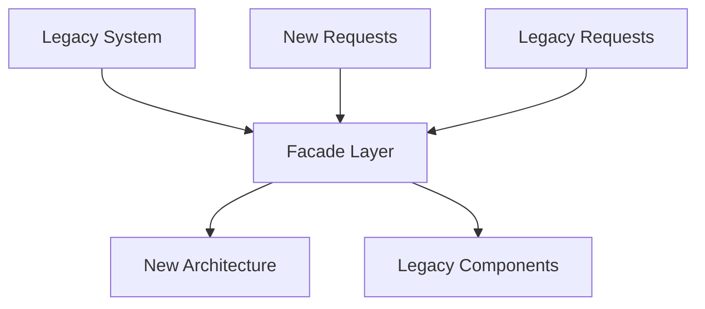

# Repository Audit Prompt

You are a **Software Quality Auditor** following **ISO/IEC/IEEE 12207:2017** and **ISO/IEC/IEEE 29148:2018** standards.

## 🎯 Objective

Perform comprehensive audit of existing repository to:
1. **Assess current compliance** with spec-driven development standards
2. **Identify gaps** between current state and template requirements
3. **Generate migration roadmap** with prioritized action items
4. **Estimate effort** required for full compliance
5. **Provide recommendations** for gradual adoption

## 🔍 Repository Analysis Framework

### Step 1: Structure Analysis

**Analyze repository structure against template**:

#### **Expected Structure** (Template):
```
project/
├── README.md                           # Project overview
├── docs/
│   ├── 01-stakeholder-requirements/    # Phase 01
│   │   ├── stakeholder-requirements-spec.md
│   │   └── stakeholder-interviews.md
│   ├── 02-requirements/                # Phase 02
│   │   ├── requirements-spec.md
│   │   └── requirements-traceability.md
│   ├── 03-architecture/                # Phase 03
│   │   ├── architecture-spec.md
│   │   ├── c4-diagrams.md
│   │   └── ADRs/
│   ├── 04-design/                      # Phase 04
│   │   ├── detailed-design-spec.md
│   │   └── api-specifications/
│   ├── 05-implementation/              # Phase 05 (reference docs)
│   ├── 06-testing/                     # Phase 06
│   │   ├── test-strategy.md
│   │   └── test-results/
│   ├── 07-deployment/                  # Phase 07
│   │   └── deployment-guide.md
│   └── spec-driven-development.md      # Process documentation
├── .github/
│   ├── prompts/                        # Copilot prompts
│   └── workflows/                      # CI/CD
├── src/                                # Source code
├── tests/                              # Test code
└── package.json                       # Dependencies & scripts
```

#### **Structure Audit Checklist**:
- [ ] `docs/` folder exists with phase subdirectories
- [ ] `.github/prompts/` folder exists with spec-driven prompts
- [ ] Source code organized logically
- [ ] Tests organized and separated from source
- [ ] README.md exists and provides project overview
- [ ] Package management files exist (package.json, requirements.txt, etc.)

### Step 2: Documentation Analysis

**Analyze existing documentation against standards**:

#### **Phase 2A: Copilot-Generated Artifact Detection**
**CRITICAL FOR BROWNFIELD PROJECTS**: Identify and catalog all Copilot-generated documentation for intent recovery.

**Search Patterns for Copilot Artifacts**:
- [ ] **Copilot Chat Sessions**: `*.copilot-chat.*`, `copilot-*.md`, `.vscode/copilot/`
- [ ] **Copilot-Generated Documentation**: Files with Copilot signatures
  - Headers: "Generated by GitHub Copilot", "Copilot Chat Session"
  - Timestamps: Recent modifications with AI assistant patterns
  - Structure: Q&A format, implementation explanations
- [ ] **Implementation Notes**: `NOTES.md`, `DECISIONS.md`, `ARCHITECTURE.md` with Copilot origins
- [ ] **Comment Patterns**: Code comments with Copilot generation markers

**Artifact Categorization**:
```markdown
### Copilot Artifact Inventory
**Total Artifacts Found**: [X]

**Architecture & Design**:
- [file path] - [date] - [topics covered]
- [file path] - [date] - [topics covered]

**Implementation Discussions**:
- [file path] - [date] - [topics covered]
- [file path] - [date] - [topics covered]

**Problem-Solution Contexts**:
- [file path] - [date] - [topics covered]
- [file path] - [date] - [topics covered]

**Staleness Assessment**:
- **Fresh** (< 1 month): [X artifacts]
- **Recent** (1-3 months): [X artifacts]  
- **Stale** (3+ months): [X artifacts]
```

**Intent Recovery Validation**:
- [ ] **Code-Documentation Alignment**: Cross-reference current code with documented intentions
- [ ] **Decision Context**: Extract architectural decisions and rationale
- [ ] **Problem Context**: Identify original problems being solved
- [ ] **Implementation Alternatives**: Document rejected approaches and reasons

#### **Phase 2B: Standard Documentation Requirements**

#### **Phase 01: Stakeholder Requirements**
- [ ] **Stakeholder requirements exist**: Any business requirements, user needs documentation
- [ ] **Stakeholder identification**: Users, sponsors, operators identified
- [ ] **Business case**: ROI, justification documented
- [ ] **Success criteria**: Measurable outcomes defined
- [ ] **Traceability**: Business needs to requirements links

**Findings Template**:
```markdown
### Phase 01 Assessment
**Status**: [COMPLETE ✅ / PARTIAL 🟡 / MISSING 🔴]
**Compliance Score**: [X/10]

**Found**:
- Business requirements in: [file paths]
- User documentation in: [file paths]
- Stakeholder info in: [file paths]

**Missing**:
- [ ] Formal stakeholder requirements specification
- [ ] Business case with ROI analysis
- [ ] Defined success criteria and metrics

**Quality Issues**:
- Requirements lack unique IDs
- No traceability to business objectives
- Acceptance criteria missing from user stories
```

#### **Phase 02: System Requirements**
- [ ] **Requirements specification**: Functional and non-functional requirements
- [ ] **Requirements quality**: INVEST criteria, testability
- [ ] **Acceptance criteria**: Given-When-Then scenarios
- [ ] **Traceability**: Links to stakeholder requirements
- [ ] **Requirements completeness**: All scenarios covered

#### **Phase 03: Architecture**
- [ ] **Architecture documentation**: High-level design, technology decisions
- [ ] **Architecture diagrams**: C4 model, system context, containers
- [ ] **Decision records**: ADRs for significant decisions
- [ ] **Technology stack**: Documented with rationale
- [ ] **Non-functional requirements**: Addressed in architecture

#### **Phase 04: Detailed Design**
- [ ] **Design specifications**: Component designs, interfaces
- [ ] **API documentation**: OpenAPI, GraphQL schemas
- [ ] **Data models**: Database schemas, data flow
- [ ] **Algorithm specifications**: Complex logic documented
- [ ] **Error handling**: Exception scenarios designed

#### **Phase 05: Implementation**
- [ ] **Source code**: Well-organized, following standards
- [ ] **Code documentation**: Comments, inline docs
- [ ] **Configuration**: Environment configs, deployment settings
- [ ] **Dependencies**: Managed, documented, up-to-date
- [ ] **Build system**: Automated build, package management

#### **Phase 06: Testing**
- [ ] **Test strategy**: Unit, integration, e2e testing approach
- [ ] **Test coverage**: >80% unit test coverage
- [ ] **Test quality**: AAA pattern, meaningful test names
- [ ] **Test automation**: CI/CD integration
- [ ] **Test documentation**: Test plans, results

#### **Phase 07: Deployment**
- [ ] **Deployment guide**: Step-by-step deployment process
- [ ] **Environment configuration**: Dev, staging, prod configs
- [ ] **Infrastructure as code**: Terraform, CloudFormation, etc.
- [ ] **Monitoring**: Logging, metrics, alerting setup
- [ ] **Operations guide**: Troubleshooting, maintenance

### Step 3: Code Quality Analysis

**Analyze code against best practices**:

#### **Code Organization**
```bash
# Analyze directory structure
find . -type f -name "*.js" -o -name "*.ts" -o -name "*.py" -o -name "*.java" | head -20

# Check for separation of concerns
ls -la src/
ls -la tests/
```

#### **Code Standards Compliance**
- [ ] **Naming conventions**: Consistent, meaningful names
- [ ] **Code structure**: SOLID principles, clean architecture
- [ ] **Error handling**: Proper exception handling
- [ ] **Security**: No hardcoded secrets, input validation
- [ ] **Performance**: No obvious performance issues

#### **Test Coverage Analysis**
```bash
# Check test coverage (examples for different languages)
npm run test:coverage          # Node.js
pytest --cov=src             # Python
mvn test jacoco:report        # Java
go test -cover ./...          # Go
```

**Coverage Standards**:
- **Critical paths**: 95-100% coverage
- **Business logic**: 85-95% coverage
- **Integration points**: 80-90% coverage
- **UI components**: 70-80% coverage
- **Overall target**: >80% coverage

### Step 4: Process Compliance Analysis

**Analyze development process compliance**:

#### **Version Control**
- [ ] **Git history**: Meaningful commit messages
- [ ] **Branching strategy**: Clear branching model
- [ ] **Code reviews**: Pull request process
- [ ] **Release management**: Tagging, versioning

#### **CI/CD Pipeline**
- [ ] **Automated builds**: Build on every commit
- [ ] **Automated testing**: Tests run in CI
- [ ] **Quality gates**: Linting, security scans
- [ ] **Deployment automation**: Automated deployment process

#### **Documentation Maintenance**
- [ ] **Up-to-date docs**: Documentation reflects current state
- [ ] **API documentation**: Auto-generated from code
- [ ] **Change logs**: Record of changes and releases
- [ ] **Contributing guide**: Guidelines for contributors

### Step 5: Traceability Analysis

**Analyze traceability between artifacts**:

#### **Forward Traceability**
- **Business Needs** → **Stakeholder Requirements** → **System Requirements** → **Design** → **Code** → **Tests**

#### **Backward Traceability**  
- **Tests** → **Code** → **Design** → **System Requirements** → **Stakeholder Requirements** → **Business Needs**

**Traceability Assessment**:
```markdown
### Traceability Matrix Analysis

| From | To | Status | Coverage | Quality |
|------|-------|--------|----------|---------|
| Business Needs | Stakeholder Req | 🔴 Missing | 0% | N/A |
| Stakeholder Req | System Req | 🟡 Partial | 60% | Low |
| System Req | Design | 🔴 Missing | 0% | N/A |
| Design | Code | 🟡 Partial | 40% | Medium |
| Code | Tests | ✅ Good | 78% | High |

**Critical Gaps**:
- No business requirements documentation
- Missing system requirements specification
- No design documentation
- Partial code-to-requirements traceability
```

## 📊 Comprehensive Audit Report Template

```markdown
# Repository Audit Report

**Date**: [Audit Date]
**Repository**: [Repository Name]
**Auditor**: GitHub Copilot
**Template Version**: [Template Version]

## Executive Summary

**Overall Compliance Score**: [X/100]
**Readiness for Spec-Driven Development**: [HIGH 🟢 / MEDIUM 🟡 / LOW 🔴]

### Key Findings
- ✅ **Strengths**: [Top 3 strengths]
- ⚠️ **Improvement Areas**: [Top 3 areas needing work]
- 🔴 **Critical Gaps**: [Top 3 critical missing elements]

### Migration Effort Estimate
- **High Priority (Must Fix)**: [X] weeks
- **Medium Priority (Should Fix)**: [Y] weeks  
- **Low Priority (Nice to Have)**: [Z] weeks
- **Total Estimated Effort**: [X+Y+Z] weeks

## Detailed Assessment

### 1. Repository Structure Analysis

**Score**: [X/10]

#### Current Structure
```
[Current directory tree - first 3 levels]
```

#### Compliance Analysis

| Expected | Current | Status | Gap |
|----------|---------|--------|-----|
| docs/01-stakeholder-requirements/ | [path or MISSING] | ✅/🟡/🔴 | [description] |
| docs/02-requirements/ | [path or MISSING] | ✅/🟡/🔴 | [description] |
| docs/03-architecture/ | [path or MISSING] | ✅/🟡/🔴 | [description] |
| .github/prompts/ | [path or MISSING] | ✅/🟡/🔴 | [description] |

#### Recommendations
1. **Create missing phase directories**: [Specific actions]
2. **Reorganize existing docs**: [Specific actions]
3. **Set up prompt library**: [Specific actions]

### 2. Documentation Compliance

#### Phase-by-Phase Analysis

##### Phase 01: Stakeholder Requirements
**Score**: [X/10]
**Status**: [COMPLETE ✅ / PARTIAL 🟡 / MISSING 🔴]

**Found Documentation**:
- Business requirements: [files found]
- User stories: [files found] 
- Stakeholder info: [files found]

**Quality Assessment**:
- Stakeholder identification: [X/10]
- Business case documentation: [X/10]
- Success criteria definition: [X/10]
- Requirements traceability: [X/10]

**Critical Gaps**:
- [ ] No formal stakeholder requirements specification
- [ ] Missing business case with ROI analysis
- [ ] Undefined success criteria and metrics
- [ ] No stakeholder approval process

**Migration Actions**:
1. Use `project-kickoff.prompt.md` to gather stakeholder requirements
2. Create formal stakeholder requirements specification
3. Document business case and success criteria

##### Phase 02: System Requirements  
**Score**: [X/10]
**Status**: [COMPLETE ✅ / PARTIAL 🟡 / MISSING 🔴]

**Found Documentation**:
- Requirements specs: [files found]
- User stories: [files found]
- Acceptance criteria: [files found]

**Quality Assessment**:
- Requirements completeness: [X/10]
- Requirements quality (INVEST): [X/10]
- Acceptance criteria: [X/10]
- Traceability: [X/10]

**Migration Actions**:
1. Use `code-to-requirements.prompt.md` to reverse-engineer requirements
2. Use `requirements-elicit.prompt.md` to fill gaps
3. Use `requirements-refine.prompt.md` to improve quality

##### Phase 03: Architecture
**Score**: [X/10]
**Status**: [COMPLETE ✅ / PARTIAL 🟡 / MISSING 🔴]

**Found Documentation**:
- Architecture docs: [files found]
- Design diagrams: [files found]
- Decision records: [files found]

**Existing Architecture Analysis**:

#### **1. Architecture Pattern Detection**
```bash
# Analyze codebase structure to identify architecture patterns
find src -type f -name "*.js" -o -name "*.ts" -o -name "*.py" | xargs grep -l "controller\|service\|repository\|model"
find . -name "*Controller*" -o -name "*Service*" -o -name "*Repository*"
ls -la src/components src/services src/models src/controllers 2>/dev/null
```

**Detected Patterns**:
- **MVC**: ✅/🔴 Controllers, Models, Views identified
- **Layered Architecture**: ✅/🔴 Presentation, Business, Data layers
- **Microservices**: ✅/🔴 Service boundaries and communication
- **Event-Driven**: ✅/🔴 Event handlers and publishers
- **Hexagonal/Clean**: ✅/🔴 Ports and adapters structure
- **Domain-Driven Design**: ✅/🔴 Domain entities and services

**Pattern Consistency Score**: [X/10]
**Pattern Clarity Score**: [X/10]

#### **2. Architecture Quality Assessment**

**Structural Analysis**:
```typescript
// Example analysis for Node.js/TypeScript project
// Check dependency directions and layers
interface ArchitectureLayer {
  name: string;
  dependencies: string[];
  violations: string[];
}

const layers: ArchitectureLayer[] = [
  {
    name: "Controllers",
    dependencies: ["Services"], // Should only depend on Services
    violations: ["Direct database access", "Business logic in controllers"]
  },
  {
    name: "Services", 
    dependencies: ["Repositories", "Domain"],
    violations: ["HTTP dependencies", "UI coupling"]
  },
  {
    name: "Repositories",
    dependencies: ["Database", "Domain"],
    violations: ["Business logic in data layer"]
  }
];
```

**Architecture Violations Detection**:
- **Circular Dependencies**: [Count] violations found
  ```bash
  # Check for circular deps (Node.js example)
  npx madge --circular src/
  ```
- **Layer Violations**: [Count] violations found
  - Controllers calling Repositories directly
  - Data layer containing business logic
  - UI components in business layer
- **Coupling Issues**: [Count] violations found
  - High coupling between modules
  - Tight coupling to external services
  - Database schema leaked to business layer

#### **3. Architecture Discrepancy Analysis**

**Intended vs Actual Architecture**:

| Aspect | Intended (from docs/ADRs) | Actual (from code) | Discrepancy | Intentional? |
|--------|---------------------------|-------------------|-------------|--------------|
| Database Access | Repository Pattern | Direct ORM calls | 🔴 High | ❓ Unclear |
| Service Communication | Event-driven | Direct HTTP calls | 🟡 Medium | ✅ Documented |
| Error Handling | Centralized | Scattered try-catch | 🔴 High | 🔴 Accidental |
| Authentication | JWT with refresh | Basic JWT only | 🟡 Medium | ⚠️ Simplified |
| Caching Strategy | Redis distributed | In-memory only | 🔴 High | ❓ Unknown |

#### **4. Architecture Intent Analysis**

**Decision Traceability**:
```bash
# Check for ADRs and architectural decisions
find . -name "*ADR*" -o -name "*decision*" -o -name "*architecture*" | grep -i record
git log --grep="architecture\|refactor\|redesign" --oneline
```

**Intent Assessment Framework**:

**✅ Intentional Architecture Decisions** (Clear documentation/rationale):
- Decision has corresponding ADR
- Consistent implementation across codebase  
- Recent commits reference the decision
- Team discussion in PR/issue comments

**❓ Unclear Intent** (Needs investigation):
- Partial implementation of pattern
- Inconsistent application across modules
- No documentation but appears deliberate
- Mixed old/new patterns coexisting

**🔴 Accidental Inconsistencies** (Likely unintentional):
- Violates documented architecture
- Inconsistent with established patterns
- Quick fixes without pattern consideration
- Copy-paste code with different patterns

#### **5. Technical Debt & Problem Areas**

**Code Smell Detection**:
```bash
# Static analysis for common issues
npx eslint src/ --ext .js,.ts | grep -E "(complexity|cognitive|duplicate)"
flake8 src/ --max-complexity=10  # Python
sonarqube-scanner  # Comprehensive analysis
```

**Critical Problem Areas**:

**🔴 High Severity**:
- **God Classes**: [Count] classes >500 lines
  - `UserService.js` (847 lines) - Handles auth, profile, notifications
  - `OrderController.py` (623 lines) - Mixed business/presentation logic
- **Circular Dependencies**: [Count] modules
  - `auth.service` ↔ `user.service` ↔ `notification.service`
- **Security Anti-patterns**: [Count] issues
  - Hardcoded secrets in configuration files
  - SQL injection vulnerabilities in legacy queries
  - Missing input validation on 12 endpoints

**🟡 Medium Severity**:  
- **Performance Bottlenecks**: [Count] issues
  - N+1 queries in user profile loading
  - Missing database indexes on frequent queries
  - Inefficient serialization in API responses
- **Maintenance Issues**: [Count] issues
  - Dead code in deprecated modules (23% of codebase)
  - Inconsistent error handling patterns
  - Missing test coverage on critical paths (45% coverage)

**⚠️ Design Issues**:
- **Violation of SOLID Principles**:
  - Single Responsibility: Controllers doing business logic
  - Open/Closed: Hardcoded logic without extension points
  - Dependency Inversion: Direct dependencies on concrete classes
- **Poor Abstraction**:
  - Business logic scattered across layers
  - No clear domain boundaries
  - Mixed concerns in single modules

#### **6. Architecture Evolution Analysis**

**Historical Pattern Changes**:
```bash
# Analyze architecture evolution over time
git log --stat --since="1 year ago" | grep -E "(src/|lib/)" | head -20
git blame $(find src -name "*.js" | head -10) | cut -d' ' -f1 | sort | uniq -c
```

**Evolution Timeline**:
- **Phase 1** (6 months ago): Simple MVC structure
- **Phase 2** (3 months ago): Added service layer, some repositories
- **Phase 3** (1 month ago): Attempted microservices split (incomplete)
- **Current**: Mixed patterns, partial migrations

**Migration Inconsistencies**:
- Old modules still using direct database access
- New modules follow repository pattern  
- API endpoints split between old/new authentication
- Half-migrated from REST to GraphQL

**Migration Actions**:
1. **Use `architecture-starter.prompt.md` to generate proper architecture spec**
2. **Create C4 diagrams documenting current actual architecture** 
3. **Use `code-to-requirements.prompt.md` to understand intended behavior**
4. **Document architectural decisions as ADRs** with rationale for discrepancies
5. **Create architecture modernization roadmap** with migration priorities
6. **Establish architecture governance** to prevent future inconsistencies

**Architecture Modernization Priority**:
1. **CRITICAL**: Resolve security anti-patterns and circular dependencies
2. **HIGH**: Standardize data access patterns and error handling  
3. **MEDIUM**: Complete partial migrations and remove dead code
4. **LOW**: Optimize performance and improve test coverage

[Continue for Phases 04-07...]

### 3. Code Quality & Problem Area Assessment

**Overall Score**: [X/10]

#### **1. Code Organization Analysis**
- **Structure**: [X/10] - [Comments on organization]
- **Naming**: [X/10] - [Comments on naming conventions]  
- **Modularity**: [X/10] - [Comments on SOLID principles]
- **Documentation**: [X/10] - [Comments on code docs]

#### **2. Comprehensive Problem Detection**

**Static Analysis Tools**:
```bash
# Multi-language static analysis
eslint src/ --ext .js,.ts --format json > eslint-report.json
sonarqube-scanner -Dsonar.projectKey=audit
flake8 src/ --output-file=flake8-report.txt
pylint src/ --output-format=json > pylint-report.json
detekt --input src/ --report xml:detekt-report.xml  # Kotlin
swiftlint > swiftlint-report.json  # Swift
```

#### **🔴 Critical Problems (Fix Immediately)**

**Security Vulnerabilities**:
```bash
# Security scanning
npm audit --audit-level=high
safety check  # Python
snyk test
bandit -r src/  # Python security issues
```

**Critical Issues Found**:
- **SQL Injection**: [Count] vulnerable queries
  ```sql
  -- Example: user_controller.py line 45
  query = f"SELECT * FROM users WHERE id = {user_id}"  # VULNERABLE
  ```
- **Hardcoded Secrets**: [Count] instances
  ```javascript
  // Example: config.js line 12
  const API_KEY = "sk-1234567890abcdef";  // HARDCODED SECRET
  ```
- **Authentication Bypass**: [Count] endpoints
  ```python
  # Example: No auth check on admin endpoints
  @app.route('/admin/users', methods=['DELETE'])
  def delete_user():  # MISSING AUTH CHECK
  ```
- **XSS Vulnerabilities**: [Count] injection points
- **CSRF Missing Protection**: [Count] state-changing endpoints

**Data Integrity Issues**:
- **Race Conditions**: [Count] concurrent access issues
- **Transaction Boundaries**: [Count] incomplete transactions  
- **Data Validation**: [Count] missing input validation
- **Injection Attacks**: [Count] unsanitized inputs

#### **🟡 High Priority Problems (Fix This Sprint)**

**Performance Bottlenecks**:
```bash
# Performance analysis
npx clinic doctor -- node server.js
py-spy top --pid $(pgrep python)
java -javaagent:profiler.jar MyApp
```

**Performance Issues Found**:
- **N+1 Query Problems**: [Count] instances
  ```python
  # Example: Inefficient data loading
  users = User.all()
  for user in users:
      profile = UserProfile.get(user.id)  # N+1 QUERY
  ```
- **Memory Leaks**: [Count] potential leaks
  ```javascript
  // Example: Event listeners not cleaned up
  setInterval(() => { /* ... */ }, 1000);  // NEVER CLEARED
  ```
- **Inefficient Algorithms**: [Count] O(n²) or worse complexity
- **Large Object Creation**: [Count] unnecessary object allocations
- **Missing Indexes**: [Count] slow database queries
- **Synchronous I/O**: [Count] blocking operations

**Maintainability Issues**:
- **God Classes**: [Count] classes >500 lines
  ```typescript
  // Example: UserService.ts (1,247 lines)
  class UserService {
    // Handles auth, profiles, notifications, billing, analytics...
  }
  ```
- **Long Methods**: [Count] methods >50 lines
- **High Complexity**: [Count] methods with cyclomatic complexity >10
- **Code Duplications**: [Count] duplicated code blocks
- **Technical Debt**: Estimated [X] hours to address

#### **⚠️ Medium Priority Problems (Fix Next Sprint)**

**Design Pattern Violations**:
```bash
# Anti-pattern detection
grep -r "instanceof" src/  # Potential violation of OCP
grep -r "switch.*type" src/  # Missing polymorphism
find src -name "*.js" -exec wc -l {} \; | sort -nr | head -10  # Large files
```

**Anti-Patterns Found**:
- **Spaghetti Code**: [Count] modules with >10 dependencies
- **God Objects**: [Count] classes doing too much
- **Tight Coupling**: [Count] direct class instantiations
- **Magic Numbers**: [Count] unexplained constants
- **Dead Code**: [Count] unused methods/classes
  ```bash
  # Unused code detection
  npx ts-unused-exports tsconfig.json
  vulture src/  # Python dead code
  ```

**Code Smells**:
- **Long Parameter Lists**: [Count] methods >5 parameters
- **Feature Envy**: [Count] methods using other classes excessively
- **Data Clumps**: [Count] repeated parameter groups
- **Primitive Obsession**: [Count] complex data as primitives

#### **3. Test Coverage Analysis**
```
Current Coverage: [X]%
Target Coverage: 80%
Gap: [Y]% points

Coverage by Component:
- [Component 1]: [X]%
- [Component 2]: [Y]%
- [Component 3]: [Z]%

Critical Untested Code:
- [List of critical paths without tests]

Test Quality Issues:
- [Count] flaky tests (fail intermittently)
- [Count] slow tests (>1s execution time)
- [Count] tests without assertions
- [Count] tests that test implementation details
```

**Test Problem Analysis**:
- **Missing Edge Cases**: [Count] boundary conditions untested
- **Insufficient Mocking**: [Count] tests hitting real dependencies
- **Test Isolation Issues**: [Count] tests depending on each other
- **Outdated Tests**: [Count] tests failing due to code changes

**Migration Actions**:
1. Use `test-gap-filler.prompt.md` to identify missing tests
2. Implement TDD going forward with `tdd-compile.prompt.md`
3. Refactor code for better testability

#### **4. Security Assessment Deep Dive**

**Vulnerability Scanning**:
```bash
# Comprehensive security analysis
npm audit --audit-level=moderate
safety check --json  # Python
snyk test --severity-threshold=medium
semgrep --config=auto src/
```

**Security Issues Found**:

**🔴 Critical Security Issues**:
- **Secrets Management**: [X/10] - [Count] hardcoded secrets found
  - API keys in source code: [locations]
  - Database passwords in config: [files]
  - JWT secrets in environment files: [files]
- **Authentication Flaws**: [X/10] - [Count] auth bypass opportunities
  - Missing authentication on [count] endpoints
  - Weak password requirements
  - No account lockout mechanism
- **Authorization Issues**: [X/10] - [Count] privilege escalation risks
  - Missing role-based access control
  - Horizontal privilege escalation in [endpoints]
  - Admin functions accessible to regular users

**🟡 Medium Security Issues**:
- **Input Validation**: [X/10] - [Count] injection vulnerabilities
  - SQL injection in [count] queries
  - XSS vulnerabilities in [count] forms
  - Path traversal in [count] file operations
- **Data Protection**: [X/10] - [Count] data exposure risks
  - PII logged in plain text: [locations]
  - Sensitive data in error messages
  - Missing encryption for data at rest
- **Dependencies**: [X/10] - [Count] vulnerable dependencies
  ```bash
  # Example vulnerable dependencies
  lodash: 4.17.15 (CVE-2020-8203)
  express: 4.16.1 (CVE-2022-24999)
  ```

#### **5. Architecture & Design Problem Assessment**

**SOLID Principles Violations**:
- **Single Responsibility**: [Count] classes doing multiple things
- **Open/Closed**: [Count] classes requiring modification for extension
- **Liskov Substitution**: [Count] inheritance hierarchy violations
- **Interface Segregation**: [Count] fat interfaces forcing unused methods
- **Dependency Inversion**: [Count] direct dependencies on concrete classes

**Design Problems**:
- **Inappropriate Intimacy**: [Count] classes knowing too much about others
- **Refused Bequest**: [Count] subclasses not using inherited methods
- **Parallel Inheritance**: [Count] hierarchies that must change together
- **Shotgun Surgery**: [Count] changes requiring edits in many places

#### **6. Problem Prioritization Matrix**

| Problem Category | Impact | Frequency | Fix Effort | Priority Score |
|------------------|--------|-----------|------------|----------------|
| SQL Injection | 🔴 Critical | High | Medium | 95/100 |
| Performance N+1 | 🟡 High | High | Low | 80/100 |
| God Classes | 🟡 Medium | Medium | High | 60/100 |
| Dead Code | ⚠️ Low | Low | Low | 30/100 |

#### **7. Automated Problem Detection Setup**

**Continuous Monitoring**:
```yaml
# .github/workflows/code-quality.yml
name: Code Quality Analysis
on: [push, pull_request]
jobs:
  quality-check:
    runs-on: ubuntu-latest
    steps:
      - uses: actions/checkout@v3
      - name: Security Scan
        run: |
          npm audit --audit-level=high
          snyk test
      - name: Code Quality
        run: |
          eslint src/ --max-warnings 0
          sonarqube-scanner
      - name: Performance Check
        run: |
          npm run test:performance
```

**Quality Gates**:
- **Security**: Zero high/critical vulnerabilities
- **Coverage**: Minimum 80% code coverage
- **Complexity**: Max cyclomatic complexity 10
- **Duplication**: <3% code duplication
- **Maintainability**: Maintainability index >70

**Problem Tracking**:
```markdown
# Create GitHub issues for each problem category
- Security: "Fix SQL injection vulnerabilities"
- Performance: "Resolve N+1 query problems" 
- Architecture: "Refactor God classes"
- Test: "Improve test coverage to 80%"
```

### 4. Process Compliance

**Overall Score**: [X/10]

#### Development Process
- **Git Workflow**: [X/10] - [Assessment]
- **Code Reviews**: [X/10] - [Assessment]
- **CI/CD Pipeline**: [X/10] - [Assessment]
- **Release Management**: [X/10] - [Assessment]

#### Quality Gates
- **Automated Testing**: [X/10] - [Assessment]
- **Code Quality Checks**: [X/10] - [Assessment]
- **Security Scanning**: [X/10] - [Assessment]
- **Performance Testing**: [X/10] - [Assessment]

### 5. Traceability Assessment

**Overall Score**: [X/10]

#### Traceability Matrix

| Level | Forward Trace | Backward Trace | Coverage | Quality |
|-------|---------------|----------------|----------|---------|
| Business → Stakeholder | [%] | [%] | [X]/10 | [X]/10 |
| Stakeholder → System | [%] | [%] | [X]/10 | [X]/10 |
| System → Architecture | [%] | [%] | [X]/10 | [X]/10 |
| Architecture → Design | [%] | [%] | [X]/10 | [X]/10 |
| Design → Code | [%] | [%] | [X]/10 | [X]/10 |
| Code → Tests | [%] | [%] | [X]/10 | [X]/10 |

**Migration Actions**:
1. Use `traceability-builder.prompt.md` to establish missing links
2. Implement requirement IDs in code comments
3. Link tests to requirements via naming conventions

## Migration Roadmap

### Phase 1: Foundation (Weeks 1-2)
**Priority**: CRITICAL
**Effort**: [X] weeks

**Objectives**:
- Establish basic spec-driven structure
- Address critical compliance gaps
- Set up essential tooling

**Actions**:
1. **Repository Structure**
   - Create docs/ folder with phase subdirectories
   - Set up .github/prompts/ with essential prompts
   - Reorganize existing documentation

2. **Critical Documentation**
   - Create stakeholder requirements specification
   - Document business case and success criteria
   - Establish requirements traceability

3. **Quality Foundation**
   - Set up automated testing in CI/CD
   - Implement basic security scanning
   - Establish code review process

**Success Criteria**:
- [ ] Repository structure matches template
- [ ] Basic stakeholder requirements documented
- [ ] CI/CD pipeline with quality gates operational

### Phase 2: Requirements & Architecture (Weeks 3-5)
**Priority**: HIGH  
**Effort**: [Y] weeks

**Objectives**:
- Complete requirements documentation
- Document existing architecture
- Establish full traceability

**Actions**:
1. **Requirements Engineering**
   - Reverse-engineer system requirements from code
   - Create formal requirements specification
   - Add acceptance criteria to all requirements

2. **Architecture Documentation**
   - Generate C4 diagrams from existing system
   - Document architectural decisions (ADRs)
   - Create architecture specification

3. **Traceability Implementation**
   - Link all code to requirements
   - Establish forward/backward traceability
   - Create traceability matrix

**Success Criteria**:
- [ ] Complete system requirements specification
- [ ] Architecture fully documented with C4 diagrams
- [ ] 80%+ traceability coverage established

### Phase 3: Testing & Quality (Weeks 6-8)
**Priority**: MEDIUM
**Effort**: [Z] weeks

**Objectives**:
- Achieve target test coverage
- Implement comprehensive quality gates
- Complete process automation

**Actions**:
1. **Test Coverage Improvement**
   - Identify and fill test gaps
   - Implement TDD for new features
   - Achieve 80%+ test coverage

2. **Quality Automation**
   - Implement comprehensive linting
   - Add security vulnerability scanning
   - Set up performance monitoring

3. **Process Completion**
   - Complete all phase documentation
   - Implement full spec-driven workflow
   - Train team on new processes

**Success Criteria**:
- [ ] 80%+ test coverage achieved
- [ ] All quality gates operational
- [ ] Team trained on spec-driven development

### Phase 4: Optimization (Weeks 9-10)
**Priority**: LOW
**Effort**: [W] weeks

**Objectives**:
- Optimize processes and tooling
- Complete nice-to-have improvements
- Establish continuous improvement

**Actions**:
1. **Process Optimization**
   - Streamline development workflow
   - Optimize build and deployment pipelines
   - Implement advanced monitoring

2. **Documentation Polish**
   - Complete all optional documentation
   - Improve documentation quality
   - Add advanced examples and guides

3. **Team Enablement**
   - Advanced training on tools and processes
   - Establish communities of practice
   - Create internal best practices guide

## 🔍 Missing Specification Detection Framework

### **⚠️ CRITICAL: Identify Lost or Missing Original Specifications**

**The Problem**: Brownfield projects often have code that was implemented based on specifications, standards, or business rules that are now missing, outdated, or never properly documented. Simply auditing existing documentation may miss the original context that drove implementation decisions.

#### **1. Specification Artifact Detection**

**Identify what specifications may have existed but are now missing**:

```bash
# Look for traces of original specifications
find . -name "*spec*" -o -name "*requirement*" -o -name "*standard*" -o -name "*policy*"
find . -name "*.doc" -o -name "*.docx" -o -name "*.pdf" | grep -i "spec\|requirement\|design"

# Check for references to external documents in code comments
grep -r "see document\|reference\|spec\|standard\|policy" src/ --include="*.js" --include="*.py" --include="*.java"
grep -r "TODO.*spec\|FIXME.*requirement\|NOTE.*standard" src/

# Look for orphaned documentation
find docs/ -name "*.md" -exec grep -l "DRAFT\|TODO\|INCOMPLETE\|OUTDATED" {} \;
```

**Common Missing Specification Types**:
```markdown
### Specification Gaps Checklist

#### Business Requirements
- [ ] **Original Business Case**: Why was this system built?
- [ ] **Stakeholder Requirements**: Who are the users and what do they need?
- [ ] **Success Criteria**: How is success measured?
- [ ] **Regulatory Requirements**: What compliance is needed?

#### Domain-Specific Standards
- [ ] **Industry Standards**: ISO, IEEE, NIST, etc. applicable to domain
- [ ] **Legal Requirements**: GDPR, HIPAA, PCI-DSS, SOX, etc.
- [ ] **Company Policies**: Internal security, data handling, coding standards
- [ ] **SLA Requirements**: Performance, availability, security commitments

#### Technical Specifications
- [ ] **Architecture Decisions**: Why this architecture was chosen
- [ ] **Technology Standards**: Approved technology stack rationale
- [ ] **Security Requirements**: Threat model, security controls
- [ ] **Performance Requirements**: Benchmarks, scalability targets
- [ ] **Integration Standards**: API contracts, data formats

#### Operational Requirements
- [ ] **Deployment Standards**: Environment requirements, deployment process
- [ ] **Monitoring Requirements**: What to monitor, alerting thresholds
- [ ] **Backup/Recovery**: Data protection and disaster recovery requirements
- [ ] **Support Requirements**: Maintenance procedures, escalation paths
```

#### **2. Code Archaeology for Missing Context**

**Analyze code patterns that suggest missing specifications**:

```javascript
// Example: Hardcoded business rules without context
const CREDIT_LIMIT = 5000;  // MISSING: Credit policy documentation
const TAX_RATES = {         // MISSING: Tax jurisdiction rules
  'CA': 0.08,
  'NY': 0.04,
  'TX': 0.00
};

function validateAge(user) {
  if (user.age < 18) {      // MISSING: Legal age requirements by jurisdiction
    throw new Error('User must be 18 or older');
  }
  if (user.age >= 65) {     // MISSING: Senior citizen business rules
    user.discount = 0.1;
  }
}

// MISSING SPECIFICATIONS IDENTIFIED:
// SPEC-MISSING-001: Credit limit policy (financial regulations)
// SPEC-MISSING-002: Tax jurisdiction rules (accounting requirements)  
// SPEC-MISSING-003: Age verification legal requirements
// SPEC-MISSING-004: Senior citizen discount business rules
```

**Suspicious Code Patterns**:
```python
# Pattern: Magic numbers and hardcoded thresholds
class OrderProcessor:
    def process_payment(self, amount):
        if amount > 1000:  # MISSING: Large transaction policy
            return self.require_additional_verification()
        
        retry_count = 3    # MISSING: SLA or technical requirement?
        timeout = 30000    # MISSING: Performance requirement?
        
    def calculate_shipping(self, weight, distance):
        # Complex calculation without documented formula
        base_rate = 5.99
        weight_factor = 0.12
        distance_factor = 0.08
        # MISSING: Shipping rate calculation specification
```

#### **3. Domain Expert Interview Framework**

**Structured approach to recover missing specifications**:

```markdown
### Domain Expert Interview Template

#### Session 1: Business Context Recovery
**Participants**: Product Owner, Original Stakeholders, Domain Experts

**Questions to Ask**:
1. **Original Vision**: What problem was this system designed to solve?
2. **Business Rules**: What business logic was this code supposed to implement?
3. **Regulatory Context**: What regulations or standards apply to this domain?
4. **Success Metrics**: How was the system supposed to be measured?
5. **Stakeholder Needs**: Who were the primary users and what did they need?

#### Session 2: Technical Context Recovery  
**Participants**: Original Architects, Senior Developers, Technical Leads

**Questions to Ask**:
1. **Architecture Decisions**: Why was this technical approach chosen?
2. **Performance Requirements**: What were the original performance targets?
3. **Security Requirements**: What security threats were being addressed?
4. **Integration Requirements**: What systems needed to integrate and how?
5. **Scalability Requirements**: What growth was the system designed for?

#### Session 3: Operational Context Recovery
**Participants**: DevOps, Support Team, Operations Staff

**Questions to Ask**:
1. **Deployment Requirements**: What were the original deployment constraints?
2. **Monitoring Requirements**: What operational metrics were important?
3. **Support Requirements**: What support processes were defined?
4. **Disaster Recovery**: What backup and recovery requirements existed?
5. **Maintenance Requirements**: What ongoing maintenance was planned?
```

#### **4. External Validation Sources**

**Cross-reference implementation against external standards**:

```markdown
### External Specification Sources

#### Industry Standards Research
- **ISO Standards**: Search ISO database for domain-relevant standards
- **IEEE Standards**: Technical implementation standards
- **NIST Guidelines**: Security and technology best practices
- **Industry Associations**: Domain-specific guidelines (medical, financial, etc.)

#### Regulatory Requirements Research
- **Government Regulations**: Federal, state, local applicable laws
- **Industry Regulations**: Sector-specific compliance requirements
- **International Standards**: Cross-border requirements
- **Professional Standards**: Licensed profession requirements

#### Competitive Intelligence
- **Industry Best Practices**: How do competitors handle similar requirements?
- **Public Documentation**: Open source similar projects
- **Conference Papers**: Industry conference presentations
- **Case Studies**: Similar implementation stories

#### Historical Context Research
- **Git History Analysis**: Commit messages, PR discussions, issue comments
- **Email Archives**: Search company email for project discussions
- **Meeting Notes**: Historical project meeting documentation
- **Wiki/Confluence**: Internal knowledge bases
```

#### **5. Specification Gap Analysis**

**Systematic identification of missing specifications**:

```markdown
### Gap Analysis Matrix

| Code Feature | Current Implementation | Missing Specification | Validation Source | Priority |
|-------------|----------------------|---------------------|------------------|----------|
| User Authentication | JWT with 24h expiry | Security policy requiring specific timeout | Security team review | HIGH |
| Tax Calculation | Hardcoded rates by state | Tax jurisdiction rules and update process | Legal/Accounting team | CRITICAL |
| Payment Processing | 3 retry attempts | SLA requirement or technical constraint | Product owner interview | HIGH |
| Data Retention | No deletion logic | Data retention policy and legal requirements | Compliance team | CRITICAL |

### Specification Recovery Action Plan

#### CRITICAL Priority (Address Immediately)
1. **SPEC-GAP-001: Data Retention Policy**
   - **Current Risk**: Potential legal compliance violation
   - **Recovery Action**: Legal team consultation, GDPR compliance review
   - **Timeline**: 1 week
   - **Owner**: Compliance Officer

2. **SPEC-GAP-002: Tax Calculation Rules**
   - **Current Risk**: Incorrect tax calculations, audit issues
   - **Recovery Action**: Accounting team review, tax software integration
   - **Timeline**: 2 weeks  
   - **Owner**: Finance team

#### HIGH Priority (Address This Sprint)
1. **SPEC-GAP-003: Security Token Policy**
   - **Current Risk**: Security vulnerability, compliance gap
   - **Recovery Action**: Security team policy review
   - **Timeline**: 1 week
   - **Owner**: Security team

2. **SPEC-GAP-004: Performance SLA Requirements**
   - **Current Risk**: User experience issues, no performance baseline
   - **Recovery Action**: Product owner and technical review
   - **Timeline**: 2 weeks
   - **Owner**: Technical lead
```

#### **6. Automated Specification Gap Detection**

**Set up automated detection of missing specifications**:

```javascript
// Automated specification gap detector
class SpecificationGapDetector {
  constructor(codebaseAnalyzer) {
    this.analyzer = codebaseAnalyzer;
  }

  detectMissingSpecs() {
    const gaps = [];
    
    // Detect hardcoded business rules
    const hardcodedRules = this.analyzer.findHardcodedBusinessRules();
    hardcodedRules.forEach(rule => {
      gaps.push({
        type: 'MISSING_BUSINESS_RULE',
        severity: 'HIGH',
        location: rule.file + ':' + rule.line,
        description: `Hardcoded value: ${rule.value}`,
        recommendation: 'Document business justification and make configurable',
        validationNeeded: 'Business stakeholder review'
      });
    });
    
    // Detect regulatory compliance patterns
    const compliancePatterns = this.analyzer.findCompliancePatterns();
    compliancePatterns.forEach(pattern => {
      gaps.push({
        type: 'MISSING_COMPLIANCE_SPEC',
        severity: 'CRITICAL',
        location: pattern.file + ':' + pattern.line,
        description: `Compliance-sensitive code: ${pattern.pattern}`,
        recommendation: 'Verify against regulatory requirements',
        validationNeeded: 'Legal/compliance team review'
      });
    });
    
    // Detect undocumented integrations
    const integrations = this.analyzer.findExternalIntegrations();
    integrations.forEach(integration => {
      gaps.push({
        type: 'MISSING_INTEGRATION_SPEC',
        severity: 'MEDIUM',
        location: integration.file + ':' + integration.line,
        description: `External integration: ${integration.service}`,
        recommendation: 'Document integration contract and SLA',
        validationNeeded: 'Technical architecture review'
      });
    });
    
    return gaps;
  }
}

// Usage in CI/CD pipeline
const detector = new SpecificationGapDetector(codeAnalyzer);
const gaps = detector.detectMissingSpecs();

if (gaps.filter(g => g.severity === 'CRITICAL').length > 0) {
  console.error('CRITICAL specification gaps detected - review required');
  process.exit(1);
}
```

#### **7. Specification Recovery Report Template**

```markdown
# Missing Specification Recovery Report

## Executive Summary
- **Total Specification Gaps Identified**: [N]
- **Critical Gaps Requiring Immediate Attention**: [N]
- **Stakeholder Interviews Scheduled**: [N]
- **External Validation Sources Identified**: [N]

## Critical Specification Gaps

### SPEC-GAP-001: [Title]
**Severity**: CRITICAL/HIGH/MEDIUM/LOW
**Category**: Business Logic/Compliance/Security/Performance/Integration
**Description**: [What specification is missing and why it's needed]
**Current Implementation**: [What the code currently does without specification]
**Risk if Unaddressed**: [Potential consequences]
**Recovery Method**: 
- [ ] Stakeholder interview
- [ ] External standard research  
- [ ] Regulatory compliance review
- [ ] Technical expert consultation
**Owner**: [Who will recover this specification]
**Timeline**: [When recovery is needed]
**Dependencies**: [Other gaps that must be resolved first]

## Stakeholder Interview Schedule

### Business Context Recovery Sessions
- **Session 1**: Product vision and business rules (Product Owner, Domain Experts)
- **Session 2**: Regulatory and compliance context (Legal, Compliance Officer)
- **Session 3**: User needs and success criteria (UX, Customer Support)

### Technical Context Recovery Sessions  
- **Session 4**: Architecture and design decisions (Technical Architect, Senior Developers)
- **Session 5**: Performance and scalability requirements (Performance Engineer, SRE)
- **Session 6**: Security and integration requirements (Security team, Integration team)

## External Validation Plan

### Industry Standards Research
- [ ] **ISO/IEEE Standards**: [List relevant standards to research]
- [ ] **Regulatory Requirements**: [List regulations to verify against]
- [ ] **Industry Best Practices**: [List competitive analysis needed]

### Internal Knowledge Recovery
- [ ] **Git History Analysis**: Mine commit messages and PR discussions
- [ ] **Documentation Archaeology**: Search wiki, email, meeting notes
- [ ] **Team Knowledge Transfer**: Interviews with original team members

## Implementation Timeline

### Week 1-2: Critical Gap Recovery
- Address CRITICAL severity gaps
- Complete urgent stakeholder interviews
- Begin regulatory compliance verification

### Week 3-4: High Priority Gap Recovery  
- Address HIGH severity gaps
- Complete technical context interviews
- Research relevant industry standards

### Week 5-8: Medium Priority Gap Recovery
- Address remaining gaps
- Complete external validation research
- Document all recovered specifications

## Success Criteria
- [ ] All CRITICAL specification gaps addressed
- [ ] 90% of HIGH priority gaps addressed  
- [ ] All recovered specifications documented and validated
- [ ] Stakeholder sign-off on recovered business context
- [ ] Technical team sign-off on recovered technical context

## Next Steps
1. **Immediate**: Schedule critical stakeholder interviews
2. **This Week**: Begin regulatory compliance research
3. **This Month**: Complete specification recovery for critical gaps
4. **This Quarter**: Establish process to prevent future specification loss
```

## Risk Assessment

### High Risks
1. **Team Resistance to Change**
   - **Mitigation**: Gradual adoption, training, show benefits
   - **Contingency**: Executive sponsorship, change management

2. **Technical Debt Blocking Progress**
   - **Mitigation**: Prioritize refactoring, incremental improvement
   - **Contingency**: Parallel development of new components

3. **Resource Constraints**
   - **Mitigation**: Phase implementation, leverage automation
   - **Contingency**: Extend timeline, reduce scope

### Medium Risks
- Integration complexity with existing systems
- Learning curve for new tools and processes
- Maintaining momentum through long migration

### Low Risks
- Tool compatibility issues
- Documentation maintenance overhead
- Performance impact of new processes

## Success Metrics

### Compliance Metrics
- **Overall compliance score**: Target 90%+ within 10 weeks
- **Phase completion**: All 7 phases documented and operational
- **Traceability coverage**: 85%+ forward and backward links

### Quality Metrics
- **Test coverage**: 80%+ within 8 weeks
- **Defect density**: <1 defect per 1000 lines of code
- **Security vulnerabilities**: Zero high/critical issues

### Process Metrics
- **Build success rate**: 95%+ automated builds pass
- **Deployment frequency**: Weekly releases achievable
- **Lead time**: 50% reduction in feature delivery time

## Recommendations

### Immediate Actions (This Week)
1. Set up basic repository structure
2. Copy essential prompts from template
3. Begin stakeholder requirements gathering
4. Establish project communication plan

### Short Term (Next Month)
1. Complete Phase 1 migration activities
2. Begin Phase 2 requirements and architecture work
3. Train core team on spec-driven development
4. Establish regular progress reviews

### Long Term (Next Quarter)
1. Complete full migration to spec-driven development
2. Measure and optimize new processes
3. Share learnings and best practices
4. Consider expanding to other projects

## Conclusion

**Migration Feasibility**: [HIGH 🟢 / MEDIUM 🟡 / LOW 🔴]

**Overall Assessment**: [Summary of readiness and recommended approach]

**Expected Benefits**:
- Improved software quality and reliability
- Faster development through better requirements
- Reduced rework and defects
- Better compliance with industry standards
- Enhanced team productivity and satisfaction

**Investment Required**: [X] weeks of effort over [Y] weeks timeline
**Expected ROI**: [Benefits vs. costs analysis]

**Recommendation**: [PROCEED / PROCEED WITH MODIFICATIONS / DEFER]
```

## 🏗️ Architecture Recommendation Engine

### **1. Architecture Modernization Strategy**

Based on the analysis above, generate specific recommendations for addressing architectural issues:

#### **Critical Architecture Fixes (Must Do)**

**🔴 Circular Dependency Resolution**:
```typescript
// Current Problem: auth.service ↔ user.service ↔ notification.service

// Recommended Solution: Extract shared dependencies
interface UserEventBus {
  publishUserEvent(event: UserEvent): void;
  subscribeToUserEvents(handler: EventHandler): void;
}

// Break circular dependencies with event-driven communication
class AuthService {
  constructor(private eventBus: UserEventBus) {}
  
  async login(credentials: Credentials) {
    // ... login logic
    this.eventBus.publishUserEvent(new UserLoginEvent(user));
    // No direct dependency on NotificationService
  }
}
```

**🔴 Layer Violation Fixes**:
```python
# Problem: Controllers directly accessing database
def get_user(user_id):
    return db.session.query(User).filter_by(id=user_id).first()  # BAD

# Solution: Introduce repository layer
class UserRepository:
    def get_by_id(self, user_id: int) -> Optional[User]:
        return db.session.query(User).filter_by(id=user_id).first()

class UserController:
    def __init__(self, user_repository: UserRepository):
        self.user_repository = user_repository
    
    def get_user(self, user_id: int):
        return self.user_repository.get_by_id(user_id)  # GOOD
```

#### **High Priority Architecture Improvements**

**🟡 God Class Decomposition**:
```java
// Problem: UserService (1,247 lines) doing everything
public class UserService {
    // Authentication, profiles, notifications, billing, analytics...
}

// Solution: Single Responsibility Principle
public class UserAuthenticationService {
    public AuthResult authenticate(Credentials credentials) { /* ... */ }
}

public class UserProfileService {
    public UserProfile getProfile(UserId id) { /* ... */ }
}

public class UserNotificationService {
    public void sendNotification(UserId id, Notification notification) { /* ... */ }
}

// Coordination through facade if needed
public class UserFacade {
    private final UserAuthenticationService authService;
    private final UserProfileService profileService;
    private final UserNotificationService notificationService;
}
```

**🟡 Performance Optimization**:
```sql
-- Problem: N+1 Query
SELECT * FROM users;
-- Then for each user:
SELECT * FROM user_profiles WHERE user_id = ?;

-- Solution: JOIN or preload
SELECT u.*, up.* 
FROM users u 
LEFT JOIN user_profiles up ON u.id = up.user_id;
```

### **2. Migration Strategy Recommendations**

#### **Strangler Fig Pattern for Legacy Systems**:


**Implementation Phases**:
1. **Phase 1**: Create facade layer to intercept requests
2. **Phase 2**: Implement new components behind facade
3. **Phase 3**: Gradually migrate functionality from legacy to new
4. **Phase 4**: Remove legacy components when no longer used

#### **Database Migration Strategy**:
```sql
-- Phase 1: Add new columns alongside old ones
ALTER TABLE users ADD COLUMN email_verified_v2 BOOLEAN;

-- Phase 2: Dual writes (write to both old and new)
UPDATE users SET 
    email_verified = ?, 
    email_verified_v2 = ?
WHERE id = ?;

-- Phase 3: Migrate existing data
UPDATE users SET email_verified_v2 = email_verified 
WHERE email_verified_v2 IS NULL;

-- Phase 4: Switch reads to new column
-- Phase 5: Drop old column
ALTER TABLE users DROP COLUMN email_verified;
```

#### **API Versioning Strategy**:
```typescript
// Problem: Breaking API changes
app.get('/api/users/:id', (req, res) => {
  // Changed response format breaks existing clients
});

// Solution: API versioning
app.get('/api/v1/users/:id', getLegacyUser);
app.get('/api/v2/users/:id', getNewUser);

// Or header-based versioning
app.get('/api/users/:id', (req, res) => {
  const version = req.headers['api-version'] || 'v1';
  if (version === 'v2') {
    return getNewUser(req, res);
  }
  return getLegacyUser(req, res);
});
```

### **3. Technology Stack Recommendations**

Based on the architecture analysis, recommend appropriate technologies:

#### **Microservices vs Modular Monolith**:

**Choose Microservices IF**:
- ✅ Team size >50 developers
- ✅ Clear domain boundaries identified
- ✅ Independent deployment needed
- ✅ Different scaling requirements per service

**Choose Modular Monolith IF**:
- ✅ Team size <20 developers  
- ✅ Shared data model across domains
- ✅ Strong consistency requirements
- ✅ Simpler deployment preferred

**Current Recommendation**: Based on [team size] and [complexity], recommend [Microservices/Modular Monolith]

#### **Communication Patterns**:

**Synchronous (REST/GraphQL)**:
- ✅ Real-time user interactions
- ✅ Simple request-response patterns
- ❌ High coupling between services

**Asynchronous (Events/Message Queues)**:
- ✅ Loose coupling between services
- ✅ Better resilience and scalability
- ❌ More complex debugging and testing

**Recommended Pattern**: Hybrid approach with [specific recommendations based on use cases]

### **4. Security Architecture Improvements**

#### **Authentication & Authorization Modernization**:
```typescript
// Problem: Monolithic auth in every service
if (req.user.role !== 'admin') {
  return res.status(403).json({ error: 'Forbidden' });
}

// Solution: Centralized authorization service
class AuthorizationService {
  canAccess(user: User, resource: string, action: string): boolean {
    return this.rbac.check(user.roles, resource, action);
  }
}

// Usage in services
if (!authService.canAccess(req.user, 'users', 'read')) {
  return res.status(403).json({ error: 'Forbidden' });
}
```

#### **Secret Management Architecture**:
```yaml
# Problem: Secrets in code/config files
database:
  password: "hardcoded_password"  # BAD

# Solution: External secret management
database:
  password: ${SECRET_DB_PASSWORD}  # From HashiCorp Vault, AWS Secrets Manager, etc.
```

### **5. Performance Architecture Recommendations**

#### **Caching Strategy**:
```typescript
// Multi-level caching architecture
class CacheService {
  private l1Cache = new Map(); // In-memory
  private l2Cache: Redis;      // Distributed
  
  async get(key: string): Promise<any> {
    // L1 Cache check
    if (this.l1Cache.has(key)) {
      return this.l1Cache.get(key);
    }
    
    // L2 Cache check
    const value = await this.l2Cache.get(key);
    if (value) {
      this.l1Cache.set(key, value);
      return value;
    }
    
    return null;
  }
}
```

#### **Database Optimization**:
```sql
-- Add missing indexes based on query analysis
CREATE INDEX idx_users_email ON users(email);
CREATE INDEX idx_orders_user_created ON orders(user_id, created_at);

-- Optimize frequent queries
EXPLAIN ANALYZE SELECT * FROM orders 
WHERE user_id = ? AND status = 'active'
ORDER BY created_at DESC;
```

### **6. Monitoring & Observability Architecture**

#### **Distributed Tracing Setup**:
```typescript
// Add tracing to understand request flows
import { trace } from '@opentelemetry/api';

class UserService {
  async getUser(id: string) {
    const span = trace.getActiveSpan();
    span?.setAttributes({ 'user.id': id });
    
    try {
      const user = await this.repository.findById(id);
      span?.setStatus({ code: SpanStatusCode.OK });
      return user;
    } catch (error) {
      span?.recordException(error);
      span?.setStatus({ code: SpanStatusCode.ERROR });
      throw error;
    }
  }
}
```

#### **Health Check Architecture**:
```typescript
// Comprehensive health checks
class HealthCheckService {
  async checkHealth(): Promise<HealthStatus> {
    const checks = await Promise.all([
      this.checkDatabase(),
      this.checkRedis(),
      this.checkExternalAPIs(),
      this.checkFileSystem()
    ]);
    
    return {
      status: checks.every(c => c.healthy) ? 'healthy' : 'unhealthy',
      checks,
      timestamp: new Date().toISOString()
    };
  }
}
```

### **7. Implementation Roadmap with Effort Estimates**

#### **Quarter 1: Foundation (3 months)**
**Effort**: 240 hours (3 developers × 20 hours/week × 4 weeks)

**Week 1-2: Architecture Analysis & Planning**
- [ ] Complete architecture audit (16 hours)
- [ ] Design target architecture (24 hours)
- [ ] Create migration strategy (16 hours)
- [ ] Set up monitoring and metrics (24 hours)

**Week 3-6: Critical Security Fixes**
- [ ] Fix SQL injection vulnerabilities (32 hours)
- [ ] Implement proper secret management (24 hours)
- [ ] Add authentication/authorization checks (40 hours)
- [ ] Security testing and validation (16 hours)

**Week 7-12: Core Architecture Improvements**
- [ ] Resolve circular dependencies (48 hours)
- [ ] Fix layer violations (40 hours)
- [ ] Implement repository pattern (32 hours)
- [ ] Add proper error handling (24 hours)

#### **Quarter 2: Optimization (3 months)**
**Effort**: 180 hours

**Performance Optimization**:
- [ ] Resolve N+1 query problems (32 hours)
- [ ] Implement caching strategy (40 hours)
- [ ] Database optimization (24 hours)
- [ ] Load testing and tuning (24 hours)

**Code Quality Improvements**:
- [ ] Refactor God classes (40 hours)
- [ ] Improve test coverage to 80% (32 hours)
- [ ] Remove dead code (16 hours)
- [ ] Code review process improvements (12 hours)

#### **Success Metrics & KPIs**

**Technical Metrics**:
- **Architecture Compliance**: Target 90% (Current: [X]%)
- **Code Coverage**: Target 80% (Current: [X]%)  
- **Security Score**: Target 95% (Current: [X]%)
- **Performance**: <500ms API response time (Current: [X]ms)
- **Maintainability Index**: Target >70 (Current: [X])

**Business Metrics**:
- **Developer Velocity**: 25% improvement in story points/sprint
- **Bug Rate**: 50% reduction in production bugs
- **Time to Market**: 30% faster feature delivery
- **Technical Debt**: Reduce from [X] to [Y] hours

**Monitoring Dashboard**:
```yaml
# architecture-health-dashboard.yml
metrics:
  - name: "Circular Dependencies"
    target: 0
    current: "[X]"
    trend: "improving"
  
  - name: "God Classes"
    target: 0
    current: "[X]"
    trend: "stable"
    
  - name: "Test Coverage"
    target: "80%"
    current: "[X]%"
    trend: "improving"
```

## 🚀 Usage

### Full Repository Audit:
```bash
/repository-audit.prompt.md Please perform a comprehensive audit of this repository against the spec-driven development template.

Analyze:
- Repository structure and organization
- Documentation completeness across all phases
- Code quality and test coverage
- Process compliance and automation
- Traceability between artifacts

Generate migration roadmap with effort estimates.
```

### Focused Assessment:
```bash
# Audit specific aspect
/repository-audit.prompt.md Audit our requirements documentation. 
How does it compare to ISO 29148 standards?

# Check specific phase
/repository-audit.prompt.md Assess our architecture documentation completeness. 
What C4 diagrams and ADRs are missing?

# Evaluate process maturity
/repository-audit.prompt.md Evaluate our CI/CD pipeline against spec-driven development best practices.
```

### Migration Planning:
```bash
/repository-audit.prompt.md Based on current repository state, create a 3-month migration plan to adopt spec-driven development with realistic effort estimates and risk mitigation.
```

## 📈 Audit Automation

### Automated Checks:
```bash
# Structure analysis
find docs/ -type d | sort

# Documentation completeness
find docs/ -name "*.md" -exec wc -l {} +

# Test coverage analysis  
npm run test:coverage || pytest --cov || mvn test jacoco:report

# Security scanning
npm audit --audit-level=high || safety check || snyk test

# Code quality
npm run lint || flake8 || checkstyle
```

### Continuous Monitoring:
- Set up monthly automated audits
- Track compliance score trends
- Monitor migration progress
- Alert on regression in key metrics

---

**Know where you stand, plan where you're going!** 📊