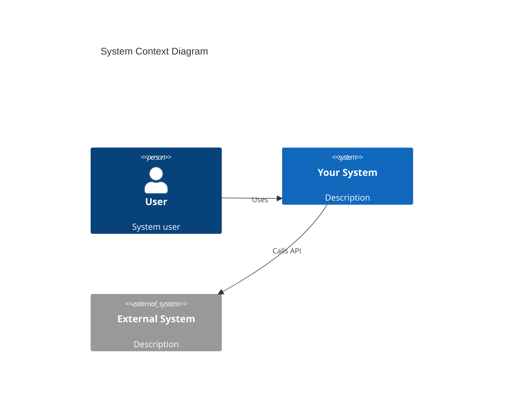

# Phase 03: Architecture Design

**Standards**: ISO/IEC/IEEE 42010:2011 (Architecture Description), IEEE 1016-2009  
**XP Integration**: Simple Design, Metaphor, Refactoring Foundation

## 🎯 Phase Objectives

1. Define system architecture and structure
2. Create architectural views for different stakeholder concerns
3. Document architectural decisions (ADRs)
4. Identify architectural patterns and styles
5. Define component boundaries and interfaces
6. Establish technical foundation for detailed design

## 📂 Working Directory Context

```yaml
applyTo:
  - "03-architecture/**/*.md"
  - "03-architecture/decisions/**"
  - "03-architecture/views/**"
  - "03-architecture/diagrams/**"
  - "03-architecture/constraints/**"
```

## ⚠️ MANDATORY: YAML Front Matter Schema Compliance

**CRITICAL**: All architecture specification files MUST use EXACT YAML front matter format defined in authoritative schema:

**Authoritative Schema**: `spec-kit-templates/schemas/architecture-spec.schema.json`

**Required YAML Front Matter Format**:
```yaml
---
specType: architecture
standard: 42010
phase: 03-architecture
version: 1.0.0
author: [Your Name]  
date: 2025-MM-DD
status: draft  # draft | review | approved | deprecated
traceability:
  requirements:
    - REQ-F-001
    - REQ-NF-001
---
```

**ENFORCEMENT**:
- Do NOT use full standard names like "ISO/IEC/IEEE 42010:2011" - use "42010" only
- Do NOT modify schema patterns - match them exactly
- MUST include ADR references and architectural viewpoints per ISO/IEC/IEEE 42010:2011
- Reference authoritative schema file for any questions
- Validation will FAIL if format deviates from schema

## 📋 ISO/IEC/IEEE 42010:2011 Compliance

### Architecture Description Framework

1. **Stakeholders and Concerns**
   - Identify architecture stakeholders
   - Document their concerns
   - Map concerns to viewpoints

2. **Architecture Viewpoints**
   - Define viewpoints to address concerns
   - Specify modeling conventions
   - Identify evaluation methods

3. **Architecture Views**
   - Create views conforming to viewpoints
   - Logical view
   - Process view
   - Development view
   - Physical view
   - Data view

4. **Architecture Decisions**
   - Document significant decisions
   - Record alternatives considered
   - Explain rationale
   - Track status and consequences

## 🎨 XP Practices for This Phase

### Simple Design
Four principles:
1. **Passes all tests** - Architecture must support testability
2. **Reveals intention** - Clear, understandable structure
3. **No duplication** - DRY at architectural level
4. **Fewest elements** - Minimal complexity (YAGNI)

### System Metaphor
- Create shared understanding through metaphor
- Use consistent naming and concepts
- Guide architectural decisions

### Refactoring Foundation
- Design for changeability
- Avoid premature optimization
- Support continuous refactoring

## 📝 Required Deliverables

### 1. Architecture Description Document
**Location**: `architecture-description.md`

```markdown
# Architecture Description

## 1. Introduction
### 1.1 Purpose
### 1.2 Scope
### 1.3 Definitions, Acronyms, Abbreviations
### 1.4 References
### 1.5 Overview

## 2. Architecture Stakeholders and Concerns

### Stakeholder: Developers
**Concerns**:
- Code organization and modularity
- Build and deployment process
- Development environment setup
- Code reusability

### Stakeholder: Operations
**Concerns**:
- Deployment architecture
- Scalability and performance
- Monitoring and observability
- Disaster recovery

### Stakeholder: Security Team
**Concerns**:
- Security controls
- Data protection
- Access control
- Compliance

## 3. Architecture Viewpoints

### Logical Viewpoint
**Concerns Addressed**: Functionality, modularity, reusability  
**Modeling Conventions**: UML Class diagrams, Component diagrams  
**Key Elements**: Components, interfaces, dependencies

### Process Viewpoint
**Concerns Addressed**: Concurrency, performance, scalability  
**Modeling Conventions**: UML Activity diagrams, Sequence diagrams  
**Key Elements**: Processes, threads, communication

### Development Viewpoint
**Concerns Addressed**: Software management, code organization  
**Modeling Conventions**: Package diagrams, Module structure  
**Key Elements**: Layers, modules, dependencies

### Physical Viewpoint
**Concerns Addressed**: Deployment, infrastructure  
**Modeling Conventions**: Deployment diagrams, Network topology  
**Key Elements**: Nodes, networks, deployment units

### Data Viewpoint
**Concerns Addressed**: Data persistence, consistency  
**Modeling Conventions**: ER diagrams, Data flow diagrams  
**Key Elements**: Entities, relationships, data stores

## 4. Architecture Views

### 4.1 Logical View
[Component diagram, class diagram]

#### Key Components
- **ARC-C-001**: [Component Name]
  - **Responsibility**: [What it does]
  - **Interfaces**: [Provided/Required interfaces]
  - **Dependencies**: [Other components]
  - **Rationale**: [Why this component]

### 4.2 Process View
[Sequence diagrams, activity diagrams]

#### Key Processes
- **ARC-P-001**: [Process Name]
  - **Description**: [Process flow]
  - **Concurrency**: [Threading model]
  - **Synchronization**: [Coordination mechanisms]

### 4.3 Development View
[Package structure, layer diagram]

#### Layered Architecture
```
┌─────────────────────────────────┐
│     Presentation Layer          │
├─────────────────────────────────┤
│     Business Logic Layer        │
├─────────────────────────────────┤
│     Data Access Layer           │
├─────────────────────────────────┤
│     Infrastructure Layer        │
└─────────────────────────────────┘
```

### 4.4 Physical View
[Deployment diagram]

#### Deployment Architecture
- Production environment
- Staging environment
- Development environment
- Infrastructure components

### 4.5 Data View
[Data model, ER diagram]

#### Data Architecture
- Database schema
- Data flow
- Data consistency strategies
- Caching strategies

## 5. Cross-Cutting Concerns

### 5.1 Security Architecture
- Authentication/Authorization
- Encryption
- Security controls

### 5.2 Performance Architecture
- Caching strategy
- Load balancing
- Database optimization

### 5.3 Reliability Architecture
- Fault tolerance
- Recovery mechanisms
- Backup strategies

### 5.4 Scalability Architecture
- Horizontal scaling approach
- Vertical scaling limits
- Bottleneck analysis

## 6. Architecture Patterns and Styles

### Primary Architectural Style
[e.g., Microservices, Layered, Event-Driven, etc.]

### Architectural Patterns Used
- [Pattern 1]: [Rationale]
- [Pattern 2]: [Rationale]

## 7. Technology Stack

### Development Technologies
- Programming languages
- Frameworks
- Libraries

### Infrastructure Technologies
- Cloud platform
- Containers/Orchestration
- Databases
- Message queues

## 8. Constraints and Assumptions

### Technical Constraints
- [Constraint 1]
- [Constraint 2]

### Business Constraints
- [Constraint 1]
- [Constraint 2]

### Assumptions
- [Assumption 1]
- [Assumption 2]

## 9. Traceability to Requirements

| Architecture Element | Requirements | Rationale |
|---------------------|-------------|-----------|
| ARC-C-001           | REQ-F-001   | [Why]     |

## 10. Architecture Evaluation

### Quality Attributes Addressed
- [Quality attribute]: [How addressed]

### Risks and Mitigations
- [Risk]: [Mitigation strategy]
```

### 2. Architecture Decision Records (ADRs)
**Location**: `decisions/ADR-XXX-[title].md`

Use Michael Nygard's ADR format:

```markdown
# ADR-001: [Decision Title]

## Status
[Proposed | Accepted | Deprecated | Superseded by ADR-XXX]

## Context
[What is the issue that we're seeing that is motivating this decision or change?]

## Decision
[What is the change that we're proposing and/or doing?]

## Consequences
### Positive
- [Benefit 1]
- [Benefit 2]

### Negative
- [Drawback 1]
- [Drawback 2]

### Neutral
- [Implication 1]

## Alternatives Considered
### Alternative 1: [Name]
**Pros**:
- [Pro 1]

**Cons**:
- [Con 1]

**Why Not Chosen**: [Reason]

### Alternative 2: [Name]
...

## Compliance and Standards
- **IEEE 42010**: [How this addresses architecture concerns]
- **Requirements**: REQ-XXX, REQ-YYY

## Implementation Notes
[Technical details, gotchas, migration path]

## Review and Approval
- **Proposed by**: [Name]
- **Reviewed by**: [Names]
- **Approved by**: [Name]
- **Date**: [YYYY-MM-DD]
```

### 3. C4 Architecture Diagrams
**Location**: `diagrams/c4-model/`

Follow C4 model (Context, Container, Component, Code):

#### Level 1: System Context
```markdown
# System Context Diagram

## Description
Shows the system in its environment with users and external systems.

## Elements
- **System**: [Your system]
- **Users**: [User types]
- **External Systems**: [Dependencies]

## Diagram
[Include Mermaid or PlantUML diagram]



#### Level 2: Container Diagram
[Shows high-level technical building blocks]

#### Level 3: Component Diagram
[Shows components within a container]

#### Level 4: Code Diagram
[Optional: Class diagrams for complex components]

### 4. Interface Specifications
**Location**: `interfaces/interface-specs.md`

```markdown
# Interface Specifications

## Component Interfaces

### INT-001: [Interface Name]
**Provided by**: ARC-C-001 [Component]  
**Used by**: ARC-C-002 [Component]

#### Operations
```typescript
interface IUserService {
  // Create new user
  createUser(userData: UserData): Promise<User>;
  
  // Get user by ID
  getUser(userId: string): Promise<User>;
  
  // Update user
  updateUser(userId: string, updates: Partial<User>): Promise<User>;
  
  // Delete user
  deleteUser(userId: string): Promise<void>;
}
```

#### Data Contracts
```typescript
interface UserData {
  username: string;
  email: string;
  role: UserRole;
}

interface User extends UserData {
  id: string;
  createdAt: Date;
  updatedAt: Date;
}
```

#### Error Handling
- `UserNotFoundError` - User ID does not exist
- `DuplicateUserError` - Username/email already exists
- `ValidationError` - Invalid input data

#### Quality Attributes
- **Performance**: < 100ms response time
- **Reliability**: 99.9% availability
- **Security**: Requires authentication token
```

### 5. Technical Constraints Document
**Location**: `constraints/technical-constraints.md`

```markdown
# Technical Constraints

## Platform Constraints
- **Operating System**: Linux (Ubuntu 20.04+)
- **Runtime**: Node.js 18+ or Python 3.10+
- **Database**: PostgreSQL 14+
- **Cloud Provider**: AWS (or Azure, GCP)

## Integration Constraints
- **External APIs**: Must support REST and/or GraphQL
- **Authentication**: OAuth 2.0 / OpenID Connect
- **Message Format**: JSON for API, Protocol Buffers for internal

## Performance Constraints
- **Response Time**: < 200ms (95th percentile)
- **Throughput**: 10,000 requests/second
- **Concurrent Users**: 100,000
- **Data Volume**: 10 TB initial, 1 TB/month growth

## Security Constraints
- **Compliance**: GDPR, SOC 2
- **Encryption**: TLS 1.3 for transit, AES-256 for rest
- **Authentication**: MFA required for admin access
- **Audit Logging**: All access must be logged

## Scalability Constraints
- **Horizontal Scaling**: Must support up to 100 nodes
- **Database Scaling**: Sharding capability required
- **Geographic Distribution**: Multi-region deployment

## Development Constraints
- **Languages**: [Approved languages]
- **Frameworks**: [Approved frameworks]
- **Dependencies**: [Approved third-party libraries]
- **Coding Standards**: [Link to standards]

## Regulatory Constraints
- **Data Residency**: EU data must stay in EU
- **Retention**: Logs retained for 7 years
- **Right to be Forgotten**: Support GDPR data deletion
```

## 🆕 Guardrail Artifacts Added
To strengthen standards compliance and evaluability, the following mandatory (or strongly recommended) artifacts are now part of this phase:

| Artifact | Location | Purpose | Standard Alignment |
|----------|----------|---------|--------------------|
| ADR Template | `decisions/ADR-template.md` | Consistent decision capture | ISO 42010 Rationale / IEEE 1016 Decisions |
| Architecture Views Overview | `views/README.md` | Defines viewpoints & view consistency rules | ISO 42010 Viewpoints/Views |
| Quality Attribute Scenarios | `architecture-quality-scenarios.md` | Concrete measurable QA scenarios | ATAM / 29148 NFR Traceability |
| Architecture Evaluation | `architecture-evaluation.md` | ATAM-style evaluation record | Risk & Tradeoff Analysis |
| Architecture Review Checklist | `standards-compliance/checklists/architecture-review-checklist.md` | Exit / readiness review | 42010 completeness, 1016 review |

### Quality Attribute Scenario Requirements
Each prioritized quality attribute (e.g., Performance, Availability, Security, Scalability, Maintainability) MUST have at least one scenario defined using the structured template (`architecture-quality-scenarios.md`). Scenarios must:
- Trace to at least one Non-Functional Requirement (REQ-NF-*)
- Reference the affected View(s) and ADR(s)
- Contain measurable response criteria (no vague terms)
- Define validation method (benchmark, chaos test, security test, inspection, simulation)

### Evaluation Requirements
An initial architecture evaluation (`architecture-evaluation.md`) MUST:
- List evaluated scenarios and outcomes (utility tree excerpt)
- Identify risks, non-risks, sensitivity points & tradeoffs
- Provide actionable mitigation items
- Record approval status & participants

### View Consistency Rules (Summary)
See `views/README.md` for full rules. Highlights:
- Every component (ARC-C-*) appears in logical + at least one runtime/deployment related view.
- Every interface (INT-*) linked to a provider component and (if used) at least one consumer.
- Every ADR references at least one requirement OR scenario.
- No orphan quality scenarios (all tie to ADR + component + view).

## 🚨 Critical Requirements for This Phase

### Always Do
✅ Document all architectural decisions with ADRs  
✅ Create multiple views addressing different concerns  
✅ Trace architecture to requirements  
✅ Identify and document architectural risks  
✅ Define clear component interfaces  
✅ Consider XP's Simple Design principles  
✅ Ensure architecture supports testability (TDD)  
✅ Document constraints explicitly  
✅ Review with stakeholders  

### Never Do
❌ Create architecture without understanding requirements  
❌ Over-engineer for future needs (YAGNI)  
❌ Skip ADRs for significant decisions  
❌ Create circular dependencies  
❌ Ignore non-functional requirements  
❌ Design without considering testability  
❌ Forget to document alternatives considered  
❌ Create architecture that can't be refactored  

## 🔍 Clarifying Questions to Ask

### About Architecture Concerns
1. What are the primary quality attributes (performance, security, scalability)?
2. What are the acceptable trade-offs?
3. What parts of the architecture are most likely to change?
4. What are the integration requirements?

### About Technical Decisions
1. Are there existing systems we must integrate with?
2. Are there mandated technologies or platforms?
3. What is the team's expertise and experience?
4. What are the licensing constraints?

### About Deployment
1. What is the deployment environment (cloud, on-premise, hybrid)?
2. What are the availability requirements?
3. What is the disaster recovery strategy?
4. What are the operational constraints?

### Example Clarification Request
```markdown
## Clarification Needed: Database Architecture Decision

**Context**: Choosing between SQL (PostgreSQL) and NoSQL (MongoDB) for primary data store

**Questions**:
1. **Data Relationships**:
   - Do we have complex relationships requiring JOINs?
   - Is data structure fixed or highly variable?

2. **Query Patterns**:
   - What are the most common queries?
   - Do we need complex aggregations?
   - Are there full-text search requirements?

3. **Scalability Needs**:
   - Expected data growth rate?
   - Read vs. write ratio?
   - Geographic distribution needs?

4. **Consistency Requirements**:
   - ACID transactions required?
   - Eventual consistency acceptable?

5. **Team Expertise**:
   - Team experience with SQL vs. NoSQL?
   - Training budget available?

**Impact**: This decision affects:
- Development complexity
- Operational costs
- Scalability approach
- Data migration effort
```

## 📊 Architecture Quality Checklist

The architecture must be:
- [ ] **Traceable** - Linked to requirements
- [ ] **Feasible** - Can be implemented with available resources
- [ ] **Complete** - Addresses all significant requirements
- [ ] **Consistent** - No contradictions
- [ ] **Testable** - Supports automated testing
- [ ] **Maintainable** - Can be understood and modified
- [ ] **Scalable** - Meets growth projections
- [ ] **Secure** - Addresses security concerns
- [ ] **Simple** - No unnecessary complexity (XP principle)
- [ ] **Documented** - All decisions recorded with rationale

## 📊 Phase Entry Criteria

✅ System Requirements Specification (SyRS) approved  
✅ Key quality attributes prioritized  
✅ Technical constraints identified  
✅ Architecture stakeholders identified  

## 📊 Phase Exit Criteria

Add the following additional mandatory exit criteria:
- ✅ Quality attribute scenarios documented and validated for all prioritized attributes
- ✅ Architecture evaluation (ATAM-lite) performed and recorded
- ✅ Risks & tradeoffs explicitly captured (architecture-evaluation.md)
- ✅ Architecture review checklist completed (standards-compliance/checklists/architecture-review-checklist.md)
- ✅ No orphan elements (every component, ADR, scenario participates in traceability chain)

Traceability completeness rule:
```
Requirement (REQ-*) ↔ Scenario (QA-SC-*) ↔ ADR (ADR-*) ↔ Component (ARC-C-*) ↔ View(s) ↔ Test (planned/implemented)
```

Additions integrate with existing criteria; failure to satisfy any above blocks transition to Phase 04 unless explicitly risk-accepted.

## 🔗 Traceability

Augment existing traceability guidance with scenario layer:
```
REQ-NF-P-001
  → QA-SC-001 (Performance Latency)
    → ADR-002 (Adopt Redis Cache Layer)
      → ARC-C-007 (CacheService)
        → Logical / Process / Deployment Views
          → Performance Benchmark Test (TEST-PERF-001)
```

Include a machine-checkable matrix in `07-verification-validation/traceability/architecture-traceability-matrix.md` (see Phase 07 addition) for CI validation.

## 📚 Standards References

Add:
- **ATAM** (Architecture Tradeoff Analysis Method) – Scenario-based evaluation
- **SAAM** (Scenario-Based Architecture Analysis Method) – Optional lightweight alternative

---

**Remember**: Architecture defines the high-level structure. Keep it simple (XP), document decisions (IEEE 42010), and ensure it addresses stakeholder concerns. Good architecture enables agility and testability!
