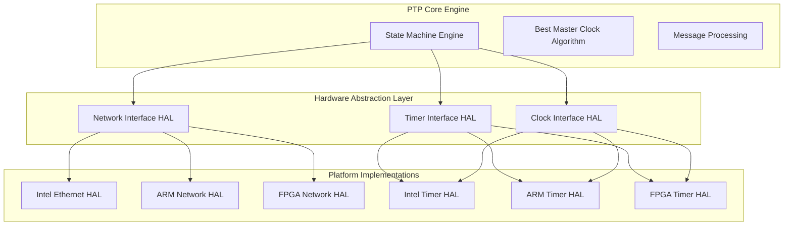

> **Architecture ID**: ARCH-1588-001-HAL
> **Purpose**: Define hardware abstraction layer for cross-platform IEEE 1588-2019 implementation
> **Scope**: Network interface, timer interface, clock interface abstraction
> **Standard**: ISO/IEC/IEEE 42010:2011

## Requirements Traceability

### Upstream Requirements
- **REQ-SYS-PTP-006**: Hardware abstraction layer for cross-platform deployment
- **REQ-STK-PTP-014**: Hardware abstraction for cross-platform development
- **REQ-FUN-PTP-036**: Platform-independent implementation

### Downstream Design Elements
- **DES-1588-HAL-001**: Hardware abstraction interface design (to be created)
- **DES-1588-NET-001**: Network interface implementation design (to be created)
- **DES-1588-TIMER-001**: Timer interface implementation design (to be created)

## Architecture Overview

The Hardware Abstraction Layer (HAL) provides a unified interface for accessing platform-specific timing and networking capabilities required by IEEE 1588-2019.

### Key Architectural Concerns

1. **Platform Independence**: Support Intel x86, ARM, FPGA platforms
2. **Performance**: Minimize abstraction overhead for timing-critical operations
3. **Precision**: Preserve nanosecond-level timing accuracy
4. **Extensibility**: Allow platform-specific optimizations

### Component Structure



## Interface Definitions

### Network Interface HAL
```cpp
namespace IEEE::_1588::_2019::HAL {
    
class NetworkInterface {
public:
    // Packet transmission with hardware timestamping
    virtual int send_packet(const void* packet, size_t length, 
                           timestamp_t* tx_timestamp) = 0;
    
    // Packet reception with hardware timestamping
    virtual int receive_packet(void* buffer, size_t buffer_size,
                              timestamp_t* rx_timestamp) = 0;
    
    // Hardware capabilities query
    virtual bool supports_hardware_timestamping() const = 0;
    virtual uint32_t get_timestamp_precision_ns() const = 0;
    
    // Network configuration
    virtual int set_multicast_filter(const uint8_t* mac_address) = 0;
    virtual int enable_promiscuous_mode(bool enable) = 0;
};

} // namespace IEEE::_1588::_2019::HAL
```

### Timer Interface HAL
```cpp
namespace IEEE::_1588::_2019::HAL {

class TimerInterface {
public:
    // High-precision time access
    virtual timestamp_t get_current_time() const = 0;
    virtual int set_periodic_timer(uint32_t interval_ns, 
                                  timer_callback_t callback) = 0;
    
    // Clock adjustment capabilities
    virtual int adjust_clock_frequency(int32_t ppb_adjustment) = 0;
    virtual int step_clock(int64_t offset_ns) = 0;
    
    // Clock characteristics
    virtual uint32_t get_clock_resolution_ns() const = 0;
    virtual bool supports_frequency_adjustment() const = 0;
};

} // namespace IEEE::_1588::_2019::HAL
```

## Quality Attributes

### Performance Requirements
- **Timestamp Precision**: Sub-microsecond accuracy
- **Latency**: <100ns abstraction overhead
- **Throughput**: Support 1000+ PTP packets/second

### Platform Support Matrix

| Platform | Network HAL | Timer HAL | Hardware Timestamps | Frequency Adjustment |
|----------|-------------|-----------|-------------------|-------------------|
| Intel x86 | ✅ | ✅ | ✅ | ✅ |
| ARM Cortex-A | ✅ | ✅ | Platform dependent | ✅ |
| FPGA | ✅ | ✅ | ✅ | ✅ |
| Generic Linux | ✅ | ✅ | ❌ | Software only |
| Windows | ✅ | ✅ | ❌ | Software only |

## Dependencies

### Internal Dependencies
- Common::interfaces for base abstraction patterns
- IEEE::_1588::_2019::core for timestamp types and constants

### External Dependencies
- Platform-specific drivers (Intel AVB, ARM ethernet, FPGA IP cores)
- Operating system timing services
- Hardware-specific timestamp units

## Constraints

### Technical Constraints
- Must maintain IEEE 1588-2019 timing precision
- Zero dynamic memory allocation in critical paths
- Thread-safe for multi-threaded applications

### Implementation Constraints
- C++17 compatible interface
- Header-only base classes for performance
- Platform-specific implementations in separate libraries

## Architectural Decisions

This component implements **ADR-001** hardware abstraction interface principles for cross-platform IEEE 1588-2019 deployment.

### ADR-HAL-001: Dependency Injection Pattern
**Decision**: Use dependency injection for HAL interface provision
**Rationale**: Enables testing with mock implementations, clean separation
**Consequences**: Requires interface registration at startup

### ADR-HAL-002: Zero-Copy Packet Interface
**Decision**: Packet interfaces use direct buffer pointers
**Rationale**: Minimize data copying for performance
**Consequences**: Caller responsible for buffer management

### ADR-HAL-003: Synchronous Interface Design
**Decision**: HAL interfaces are synchronous, not callback-based
**Rationale**: Simpler integration, deterministic behavior
**Consequences**: Caller handles asynchronous operations if needed

## Validation

### Architecture Compliance
- ✅ Supports REQ-SYS-PTP-006 cross-platform deployment
- ✅ Enables REQ-FUN-PTP-036 platform independence
- ✅ Maintains REQ-SYS-PTP-005 deterministic performance

### Design Completeness
- ✅ Network interface abstraction defined
- ✅ Timer interface abstraction defined
- ✅ Platform support matrix established
- 🔄 Implementation designs needed (DES-1588-HAL-001)

## References

- IEEE 1588-2019: Precision Clock Synchronization Protocol
- ISO/IEC/IEEE 42010:2011: Architecture Description Standard
- REQ-SYS-PTP-006: Hardware abstraction layer requirement