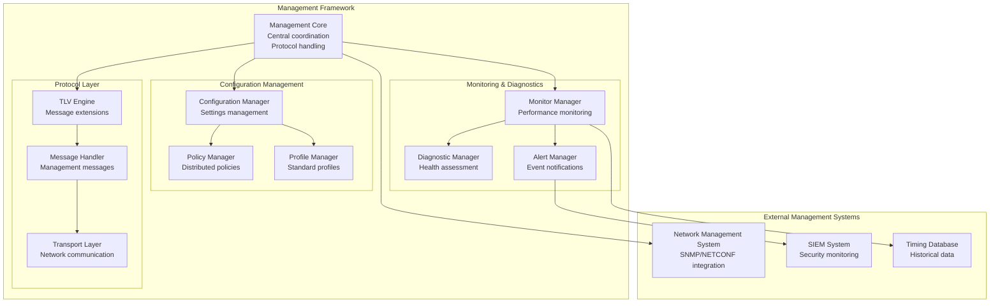

# IEEE 1588-2019 Management Protocol Architecture

> **Architecture ID**: ARCH-1588-005-Management
> **Purpose**: Define comprehensive management protocol for configuration and monitoring
> **Scope**: Configuration management, monitoring, diagnostics, remote administration
> **Standard**: ISO/IEC/IEEE 42010:2011

## Requirements Traceability

### Upstream Requirements  
- **REQ-SYS-PTP-004**: Comprehensive management protocol for configuration and monitoring
- **REQ-FUN-PTP-008**: TLV (Type-Length-Value) framework for protocol extensions
- **REQ-FUN-PTP-030**: Management protocol implementation for configuration and monitoring

### Downstream Design Elements
- **DES-1588-MGMT-001**: Management protocol implementation design (to be created)
- **DES-1588-TLV-001**: TLV framework design (to be created)  
- **DES-1588-CONFIG-001**: Configuration management design (to be created)

## Architecture Overview

The Management Protocol Architecture provides comprehensive configuration, monitoring, and diagnostic capabilities for IEEE 1588-2019 deployments, enabling centralized administration of timing networks.

### Management Architecture Components



## Management Protocol Framework

### Core Management Interface
```cpp
namespace IEEE::_1588::_2019::Management {

class ManagementEngine {
public:
    // Configuration management
    int set_clock_configuration(const ClockIdentity& clock_id,
                               const ClockConfiguration& config);
    int get_clock_configuration(const ClockIdentity& clock_id,
                               ClockConfiguration* config);
    
    // Port management
    int set_port_configuration(const ClockIdentity& clock_id,
                              uint16_t port_number,
                              const PortConfiguration& config);
    int get_port_state(const ClockIdentity& clock_id,
                      uint16_t port_number,
                      PortState* state);
    
    // Domain management
    int create_timing_domain(uint8_t domain_number,
                           const DomainConfiguration& config);
    int delete_timing_domain(uint8_t domain_number);
    int get_domain_statistics(uint8_t domain_number,
                             DomainStatistics* stats);
    
    // Performance monitoring
    int get_synchronization_metrics(const ClockIdentity& clock_id,
                                   SynchronizationMetrics* metrics);
    int get_network_performance(const ClockIdentity& clock_id,
                              NetworkPerformance* performance);
    
    // Diagnostic operations
    int run_clock_diagnostic(const ClockIdentity& clock_id,
                           DiagnosticType diagnostic_type,
                           DiagnosticResult* result);
    int get_error_log(const ClockIdentity& clock_id,
                     ErrorLog* error_log);
    
private:
    ConfigurationManager config_manager_;
    MonitoringManager monitor_manager_;
    DiagnosticManager diagnostic_manager_;
    TLVProcessor tlv_processor_;
};

} // namespace IEEE::_1588::_2019::Management
```

### TLV Framework Architecture
```cpp
namespace IEEE::_1588::_2019::Management {

class TLVProcessor {
public:
    // TLV message processing
    int process_management_message(const PTPMessage& message,
                                  ManagementResponse* response);
    int create_management_message(const ManagementRequest& request,
                                 PTPMessage* message);
    
    // TLV encoding/decoding
    int encode_tlv(const ManagementTLV& tlv, uint8_t* buffer, 
                   size_t* length);
    int decode_tlv(const uint8_t* buffer, size_t length,
                   ManagementTLV* tlv);
    
    // Custom TLV registration
    int register_custom_tlv(TLVType tlv_type,
                           TLVEncoder encoder,
                           TLVDecoder decoder);
    int unregister_custom_tlv(TLVType tlv_type);
    
    // TLV validation
    int validate_tlv_format(const ManagementTLV& tlv);
    int validate_tlv_permissions(const ManagementTLV& tlv,
                                const SecurityContext& context);
    
private:
    TLVRegistry tlv_registry_;
    TLVValidator tlv_validator_;
    SecurityValidator security_validator_;
};

} // namespace IEEE::_1588::_2019::Management
```

## Configuration Management Framework

### Configuration Data Model
```cpp
namespace IEEE::_1588::_2019::Management {

struct ClockConfiguration {
    // Clock identity and basic settings
    ClockIdentity clock_id;
    ClockClass clock_class;
    ClockAccuracy clock_accuracy;
    uint16_t offset_scaled_log_variance;
    
    // Priority and BMCA settings
    Priority1 priority1;
    Priority2 priority2;
    uint8_t domain_number;
    
    // Timing parameters
    int8_t log_announce_interval;
    int8_t log_sync_interval;
    int8_t log_delay_req_interval;
    
    // Security settings
    bool security_enabled;
    AuthenticationMode auth_mode;
    KeyId primary_key_id;
    
    // Performance settings
    uint16_t max_steps_removed;
    TimeSource time_source;
    bool two_step_flag;
};

struct PortConfiguration {
    uint16_t port_number;
    PortState port_state;
    DelayMechanism delay_mechanism;
    
    // Network settings
    NetworkProtocol network_protocol;
    uint16_t transport_port;
    bool multicast_enabled;
    
    // Timing settings
    int8_t log_min_delay_req_interval;
    int8_t log_min_pdelay_req_interval;
    bool version_compatibility;
    
    // Quality settings
    bool master_only;
    uint16_t announce_receipt_timeout;
    uint16_t sync_receipt_timeout;
};

struct DomainConfiguration {
    uint8_t domain_number;
    DomainProfile profile_type;
    
    // Network isolation
    std::vector<uint8_t> allowed_vlans;
    std::vector<IPAddress> multicast_addresses;
    
    // Security policy
    SecurityPolicy security_policy;
    bool inter_domain_sync_allowed;
    
    // Quality attributes
    TimingAccuracy required_accuracy;
    uint32_t max_network_delay_ns;
    uint16_t max_clock_hierarchy_depth;
};

} // namespace IEEE::_1588::_2019::Management
```

### Configuration Management Operations
```cpp
namespace IEEE::_1588::_2019::Management {

class ConfigurationManager {
public:
    // Configuration lifecycle
    int load_configuration(const ConfigurationFile& config_file);
    int save_configuration(const ConfigurationFile& config_file);
    int validate_configuration(const Configuration& config);
    int apply_configuration(const Configuration& config);
    
    // Runtime configuration changes
    int update_clock_settings(const ClockIdentity& clock_id,
                             const ClockSettings& settings);
    int update_port_settings(const ClockIdentity& clock_id,
                           uint16_t port_number,
                           const PortSettings& settings);
    
    // Configuration templates and profiles
    int load_profile_template(ProfileType profile_type,
                            Configuration* config);
    int create_custom_profile(const std::string& profile_name,
                            const Configuration& config);
    
    // Configuration backup and restore
    int backup_configuration(const std::string& backup_name);
    int restore_configuration(const std::string& backup_name);
    int list_configuration_backups(std::vector<std::string>* backups);
    
    // Configuration validation and testing
    int test_configuration(const Configuration& config,
                         ConfigurationTestResult* result);
    int rollback_configuration(const ConfigurationVersion& version);
    
private:
    ConfigurationStore config_store_;
    ConfigurationValidator config_validator_;
    ConfigurationBackupManager backup_manager_;
    ProfileRegistry profile_registry_;
};

} // namespace IEEE::_1588::_2019::Management
```

## Monitoring and Diagnostics Framework  

### Performance Monitoring
```cpp
namespace IEEE::_1588::_2019::Management {

class MonitoringManager {
public:
    // Real-time monitoring
    int start_monitoring(const ClockIdentity& clock_id,
                        MonitoringConfiguration config);
    int stop_monitoring(const ClockIdentity& clock_id);
    int get_current_metrics(const ClockIdentity& clock_id,
                           PerformanceMetrics* metrics);
    
    // Historical data collection
    int query_historical_data(const ClockIdentity& clock_id,
                             TimeRange time_range,
                             HistoricalData* data);
    int set_data_retention_policy(DataRetentionPolicy policy);
    
    // Threshold monitoring and alerting
    int set_performance_threshold(const ClockIdentity& clock_id,
                                 MetricType metric_type,
                                 ThresholdConfiguration threshold);
    int get_active_alerts(std::vector<Alert>* alerts);
    int acknowledge_alert(const AlertId& alert_id);
    
    // Statistical analysis
    int generate_performance_report(const ClockIdentity& clock_id,
                                   TimeRange time_range,
                                   PerformanceReport* report);
    int analyze_synchronization_trends(const ClockIdentity& clock_id,
                                      TrendAnalysis* analysis);
    
private:
    MetricsCollector metrics_collector_;
    DataRepository data_repository_;
    AlertEngine alert_engine_;
    AnalyticsEngine analytics_engine_;
};

struct PerformanceMetrics {
    // Synchronization accuracy
    int64_t offset_from_master_ns;
    int64_t mean_path_delay_ns;
    uint32_t synchronization_uncertainty_ns;
    
    // Network performance  
    uint32_t packets_transmitted;
    uint32_t packets_received;
    uint32_t packets_lost;
    double packet_loss_rate;
    
    // Timing statistics
    uint32_t sync_messages_received;
    uint32_t delay_req_messages_sent;
    uint32_t announce_messages_received;
    
    // Quality metrics
    ClockClass current_clock_class;
    ClockAccuracy current_clock_accuracy;
    uint16_t steps_removed;
    bool grandmaster_present;
    
    // Error counters
    uint32_t crc_errors;
    uint32_t timeout_errors;
    uint32_t protocol_errors;
    uint32_t security_errors;
};

} // namespace IEEE::_1588::_2019::Management
```

### Diagnostic Framework
```cpp
namespace IEEE::_1588::_2019::Management {

class DiagnosticManager {
public:
    // Built-in diagnostics
    int run_connectivity_test(const ClockIdentity& target_clock,
                             ConnectivityResult* result);
    int run_synchronization_test(const ClockIdentity& clock_id,
                               SynchronizationResult* result);
    int run_performance_benchmark(const ClockIdentity& clock_id,
                                BenchmarkResult* result);
    
    // Network diagnostics
    int trace_timing_path(const ClockIdentity& source_clock,
                         const ClockIdentity& target_clock,
                         TimingPath* path);
    int measure_network_delay(const ClockIdentity& clock_id,
                            NetworkDelayMeasurement* measurement);
    
    // Clock health assessment
    int assess_clock_health(const ClockIdentity& clock_id,
                           HealthAssessment* assessment);
    int get_clock_capabilities(const ClockIdentity& clock_id,
                             ClockCapabilities* capabilities);
    
    // Troubleshooting assistance
    int diagnose_synchronization_issue(const ClockIdentity& clock_id,
                                     DiagnosticReport* report);
    int recommend_configuration_changes(const ClockIdentity& clock_id,
                                      ConfigurationRecommendations* recommendations);
    
private:
    ConnectivityTester connectivity_tester_;
    PerformanceTester performance_tester_;
    HealthAssessor health_assessor_;
    TroubleshootingEngine troubleshooting_engine_;
};

} // namespace IEEE::_1588::_2019::Management
```

## External System Integration

### Network Management System Integration
```cpp
namespace IEEE::_1588::_2019::Management {

class NMSIntegration {
public:
    // SNMP integration
    int initialize_snmp_agent(const SNMPConfiguration& config);
    int register_snmp_objects(const std::vector<SNMPObject>& objects);
    int handle_snmp_request(const SNMPRequest& request,
                           SNMPResponse* response);
    
    // NETCONF integration  
    int initialize_netconf_server(const NETCONFConfiguration& config);
    int register_yang_models(const std::vector<YANGModel>& models);
    int handle_netconf_operation(const NETCONFOperation& operation,
                               NETCONFResult* result);
    
    // REST API integration
    int initialize_rest_api(const RESTConfiguration& config);
    int register_api_endpoints(const std::vector<APIEndpoint>& endpoints);
    int handle_rest_request(const HTTPRequest& request,
                           HTTPResponse* response);
    
private:
    SNMPAgent snmp_agent_;
    NETCONFServer netconf_server_;
    RESTAPIServer rest_api_server_;
};

} // namespace IEEE::_1588::_2019::Management
```

## Quality Attributes

### Performance Requirements
- **Management Response Time**: <100ms for configuration queries
- **Monitoring Data Collection**: <1ms overhead per metric sample  
- **Diagnostic Test Duration**: <30 seconds for comprehensive tests
- **Configuration Apply Time**: <5 seconds for non-disruptive changes

### Scalability Requirements
- **Managed Clocks**: Support 1000+ clocks per management instance
- **Concurrent Operations**: Handle 100+ concurrent management operations
- **Data Storage**: 1 year retention for performance metrics
- **Alert Processing**: <1 second alert generation and notification

### Reliability Requirements
- **Management Availability**: 99.9% uptime for management services
- **Data Integrity**: Zero data loss for configuration and monitoring
- **Failover**: <30 seconds failover to backup management system  
- **Configuration Rollback**: <10 seconds rollback to previous configuration

## Architectural Decisions

### ADR-MGMT-001: RESTful API Design
**Decision**: Use RESTful APIs as primary management interface
**Rationale**: Industry standard, tool compatibility, ease of integration
**Consequences**: HTTP dependency, stateless operations required

### ADR-MGMT-002: TLV-Based Protocol Extensions  
**Decision**: Use IEEE 1588-2019 TLV framework for management protocol
**Rationale**: Standards compliance, extensibility, protocol integration
**Consequences**: Binary protocol complexity, custom tooling required

### ADR-MGMT-003: Distributed Configuration Model
**Decision**: Support both centralized and distributed configuration
**Rationale**: Flexibility for different network topologies and requirements  
**Consequences**: Configuration synchronization complexity, conflict resolution needed

## Validation

### Architecture Compliance
- ✅ Supports REQ-SYS-PTP-004 comprehensive management protocol
- ✅ Implements REQ-FUN-PTP-008 TLV framework for extensions
- ✅ Provides REQ-FUN-PTP-030 configuration and monitoring capabilities

### Design Completeness
- ✅ Management protocol framework defined
- ✅ Configuration management architecture specified
- ✅ Monitoring and diagnostics framework established
- 🔄 Implementation designs needed (DES-1588-MGMT-001)

## References

- IEEE 1588-2019: Management messages and TLV framework
- RFC 6241: Network Configuration Protocol (NETCONF)
- RFC 3411: Simple Network Management Protocol (SNMP)
- ITU-T G.8275: Telecom profiles for timing management