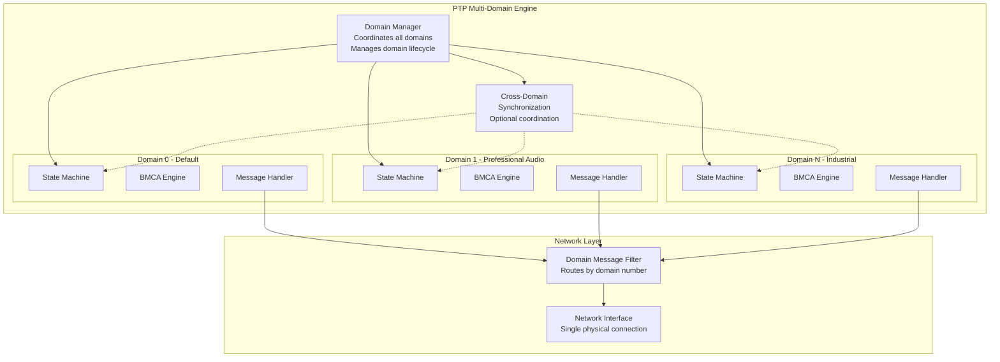
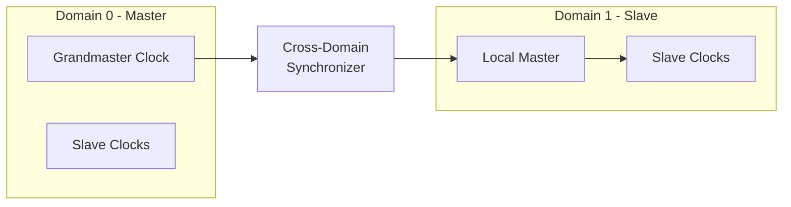
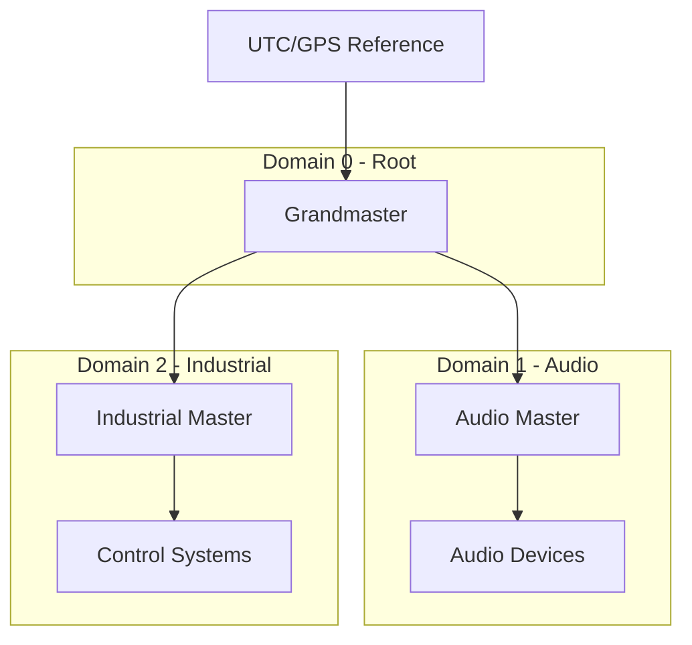

# IEEE 1588-2019 Multi-Domain Architecture

> **Architecture ID**: ARCH-1588-003-MultiDomain
> **Purpose**: Define multi-domain timing architecture for network isolation and coordination
> **Scope**: Domain management, isolation mechanisms, cross-domain synchronization
> **Standard**: ISO/IEC/IEEE 42010:2011

## Requirements Traceability

### Upstream Requirements
- **REQ-SYS-PTP-002**: Multi-domain timing architecture for network isolation and coordination
- **REQ-FUN-PTP-021**: Support multiple PTP domains (0-127) with domain isolation
- **REQ-FUN-PTP-022**: Cross-domain synchronization capabilities where required
- **REQ-FUN-PTP-023**: Domain-specific configuration and management

### Downstream Design Elements
- **DES-1588-DOMAIN-001**: Domain manager implementation design (to be created)
- **DES-1588-ISOLATION-001**: Domain isolation mechanism design (to be created)

## Architecture Overview

The Multi-Domain Architecture enables IEEE 1588-2019 to operate multiple independent timing domains on the same network infrastructure while maintaining strict isolation and optional coordination.

### Key Architectural Concerns

1. **Domain Isolation**: Prevent cross-domain message interference
2. **Scalability**: Support up to 128 concurrent domains (0-127)
3. **Performance**: Minimal overhead for domain switching
4. **Coordination**: Enable controlled cross-domain synchronization

### Domain Architecture



## Domain Management Framework

### Domain State Management
```cpp
namespace IEEE::_1588::_2019::MultiDomain {

class DomainManager {
public:
    // Domain lifecycle management
    int create_domain(uint8_t domain_number, const DomainConfig& config);
    int destroy_domain(uint8_t domain_number);
    int activate_domain(uint8_t domain_number);
    int deactivate_domain(uint8_t domain_number);
    
    // Domain state access
    DomainState* get_domain_state(uint8_t domain_number);
    std::vector<uint8_t> get_active_domains() const;
    
    // Cross-domain coordination
    int enable_cross_domain_sync(uint8_t master_domain, uint8_t slave_domain);
    int disable_cross_domain_sync(uint8_t slave_domain);
    
private:
    std::array<std::unique_ptr<DomainState>, 128> domains_;
    CrossDomainCoordinator cross_sync_;
    DomainMessageRouter message_router_;
};

} // namespace IEEE::_1588::_2019::MultiDomain
```

### Domain Isolation Mechanisms
```cpp
namespace IEEE::_1588::_2019::MultiDomain {

class DomainMessageRouter {
public:
    // Message routing by domain
    int route_outbound_message(uint8_t domain_number, 
                              const PTPMessage& message);
    int route_inbound_message(const PTPMessage& message,
                             uint8_t* target_domain);
    
    // Domain filtering
    int set_domain_filter(uint8_t domain_number, bool enabled);
    bool is_domain_filtered(uint8_t domain_number) const;
    
private:
    std::array<bool, 128> domain_filters_;
    MessageQueue per_domain_queues_[128];
};

} // namespace IEEE::_1588::_2019::MultiDomain
```

## Quality Attributes

### Performance Requirements
- **Domain Switching**: <10μs context switch time
- **Message Routing**: <1μs per message routing decision
- **Memory Usage**: <1MB per active domain
- **Concurrent Domains**: Support up to 128 active domains

### Isolation Requirements
- **Message Isolation**: 100% domain message separation
- **State Isolation**: Independent state machines per domain
- **Configuration Isolation**: Domain-specific configurations
- **Error Isolation**: Domain failures don't affect other domains

## Domain Configuration

### Per-Domain Settings
```cpp
struct DomainConfig {
    uint8_t domain_number;              // 0-127
    ClockClass clock_class;             // Default clock class
    ClockAccuracy clock_accuracy;       // Default accuracy
    uint16_t offset_scaled_log_variance; // Default variance
    Priority1 priority1;                // BMCA priority1
    Priority2 priority2;                // BMCA priority2
    bool allow_cross_domain_sync;       // Enable coordination
    NetworkProfile network_profile;     // Domain-specific networking
};
```

### Network Profiles by Domain
| Domain Range | Purpose | Profile | Multicast Address |
|-------------|---------|---------|------------------|
| 0 | Default/General | General | 224.0.1.129 |
| 1-3 | Professional Audio | Milan/AES67 | 224.0.1.130-132 |
| 4-15 | Industrial Automation | TSN Profile | 224.0.1.133-144 |
| 16-31 | Telecommunications | Telecom Profile | 224.0.1.145-160 |
| 32-127 | Custom Applications | User Defined | 224.0.1.161-255 |

## Cross-Domain Synchronization

### Synchronization Topologies

#### Master-Slave Cross-Domain


#### Hierarchical Cross-Domain


## Constraints

### Technical Constraints
- Maximum 128 concurrent domains (IEEE 1588-2019 limit)
- Domain isolation must be maintained under all conditions
- Cross-domain synchronization accuracy ±1μs additional error
- Single network interface supports all domains

### Implementation Constraints
- Thread-safe domain operations
- Zero domain interference guarantee
- Deterministic message routing
- Bounded memory usage per domain

## Architectural Decisions

### ADR-DOMAIN-001: Single Network Interface
**Decision**: All domains share single network interface
**Rationale**: Hardware limitation, cost effectiveness
**Consequences**: Requires software-based domain routing

### ADR-DOMAIN-002: Independent State Machines
**Decision**: Each domain has independent state machine
**Rationale**: Complete domain isolation, parallel processing
**Consequences**: Higher memory usage, increased complexity

### ADR-DOMAIN-003: Optional Cross-Domain Sync
**Decision**: Cross-domain synchronization is configurable
**Rationale**: Not all applications need coordination
**Consequences**: Additional complexity for coordination cases

## Validation

### Architecture Compliance
- ✅ Supports REQ-SYS-PTP-002 multi-domain architecture
- ✅ Enables REQ-FUN-PTP-021 domain isolation (0-127)
- ✅ Provides REQ-FUN-PTP-022 cross-domain synchronization
- ✅ Implements REQ-FUN-PTP-023 domain-specific configuration

### Design Completeness
- ✅ Domain manager architecture defined
- ✅ Isolation mechanisms specified
- ✅ Cross-domain coordination designed
- 🔄 Implementation designs needed (DES-1588-DOMAIN-001)

## References

- IEEE 1588-2019: Section 7.1 "Domain concept"
- IEEE 1588-2019: Section 16.1 "Domain attribute"
- Milan Specification v1.2: Domain usage guidelines