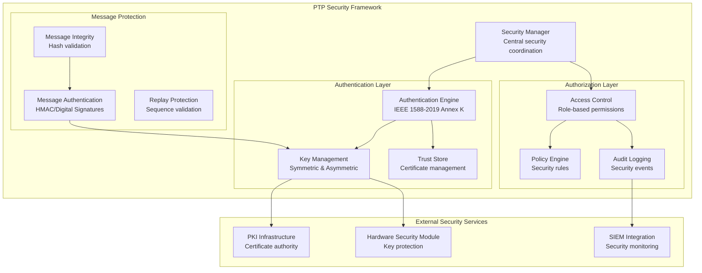
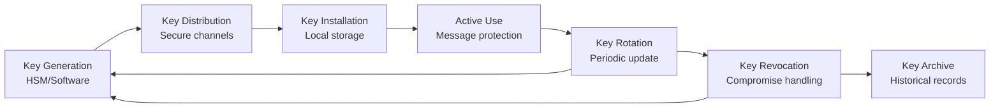

# IEEE 1588-2019 Security Architecture

> **Architecture ID**: ARCH-1588-004-Security
> **Purpose**: Define security mechanisms for IEEE 1588-2019 implementation
> **Scope**: Authentication, authorization, integrity protection, key management
> **Standard**: ISO/IEC/IEEE 42010:2011

## Requirements Traceability

### Upstream Requirements
- **REQ-SYS-PTP-003**: Enhanced security mechanisms including authentication and authorization
- **REQ-STK-PTP-018**: Security framework compliance for critical infrastructure
- **REQ-STK-PTP-019**: Traceability to UTC for regulatory compliance

### Downstream Design Elements
- **DES-1588-SEC-001**: Security protocol implementation design (to be created)
- **DES-1588-AUTH-001**: Authentication mechanism design (to be created)
- **DES-1588-KEY-001**: Key management system design (to be created)

## Architecture Overview

The Security Architecture implements IEEE 1588-2019 Annex K security mechanisms and additional enterprise-grade security features for critical infrastructure deployment.

### Security Architecture Components



## Security Framework Design

### Authentication Architecture
```cpp
namespace IEEE::_1588::_2019::Security {

class AuthenticationEngine {
public:
    // IEEE 1588-2019 Annex K authentication
    int authenticate_message(const PTPMessage& message, 
                            const AuthenticationTLV& auth_tlv);
    int create_authentication_tlv(const PTPMessage& message,
                                 AuthenticationTLV* auth_tlv);
    
    // Certificate-based authentication  
    int validate_certificate_chain(const Certificate& cert_chain);
    int create_digital_signature(const void* data, size_t length,
                                DigitalSignature* signature);
    
    // Key management integration
    int register_shared_key(const KeyId& key_id, const SharedKey& key);
    int register_certificate(const CertificateId& cert_id, 
                           const Certificate& certificate);
    
private:
    KeyManager key_manager_;
    TrustStore trust_store_;
    CryptoProvider crypto_provider_;
};

} // namespace IEEE::_1588::_2019::Security
```

### Message Protection Framework
```cpp
namespace IEEE::_1588::_2019::Security {

class MessageProtection {
public:
    // Message authentication
    int sign_message(PTPMessage* message, const SecurityContext& context);
    int verify_message(const PTPMessage& message, 
                      const SecurityContext& context);
    
    // Replay protection
    int update_sequence_number(const ClockIdentity& clock_id);
    int validate_sequence_number(const ClockIdentity& clock_id,
                                uint16_t sequence_id);
    
    // Integrity protection
    int calculate_message_hash(const PTPMessage& message, Hash* hash);
    int verify_message_integrity(const PTPMessage& message,
                               const Hash& expected_hash);
    
private:
    SequenceNumberTracker sequence_tracker_;
    MessageAuthenticator authenticator_;
    IntegrityValidator integrity_validator_;
};

} // namespace IEEE::_1588::_2019::Security
```

## Security Policies and Access Control

### Role-Based Access Control
```cpp
namespace IEEE::_1588::_2019::Security {

enum class PTPRole {
    GRANDMASTER_ADMIN,    // Full control over timing hierarchy
    BOUNDARY_CLOCK_ADMIN, // Manage boundary clock operations
    ORDINARY_CLOCK_USER,  // Basic clock synchronization
    MONITOR_READONLY,     // Read-only monitoring access
    GUEST_LIMITED        // Limited diagnostic access
};

class AccessControlEngine {
public:
    // Permission validation
    bool authorize_operation(const SecurityContext& context,
                           PTPOperation operation);
    bool authorize_message_type(const SecurityContext& context,
                              PTPMessageType msg_type);
    
    // Role management
    int assign_role(const ClockIdentity& clock_id, PTPRole role);
    int revoke_role(const ClockIdentity& clock_id);
    PTPRole get_clock_role(const ClockIdentity& clock_id);
    
    // Policy enforcement
    int load_security_policy(const SecurityPolicy& policy);
    int validate_policy_compliance(const PTPMessage& message);
    
private:
    RoleRegistry role_registry_;
    PolicyEngine policy_engine_;
    AuditLogger audit_logger_;
};

} // namespace IEEE::_1588::_2019::Security
```

## Key Management Architecture

### Cryptographic Key Lifecycle


### Key Management Implementation
```cpp
namespace IEEE::_1588::_2019::Security {

class KeyManager {
public:
    // Symmetric key management
    int generate_shared_key(KeyId* key_id, SharedKey* key);
    int distribute_shared_key(const KeyId& key_id, 
                             const ClockIdentity& target_clock);
    int rotate_shared_key(const KeyId& key_id);
    
    // Certificate management  
    int generate_key_pair(KeyPairId* key_pair_id);
    int create_certificate_request(const KeyPairId& key_pair_id,
                                  CertificateRequest* csr);
    int install_certificate(const Certificate& certificate);
    
    // Key lifecycle
    int activate_key(const KeyId& key_id);
    int deactivate_key(const KeyId& key_id);
    int revoke_key(const KeyId& key_id, RevocationReason reason);
    
    // Security provider integration
    int configure_hsm_provider(const HSMConfig& config);
    int configure_software_provider(const SoftwareConfig& config);
    
private:
    CryptoProvider crypto_provider_;
    KeyStore key_store_;
    RevocationList revocation_list_;
};

} // namespace IEEE::_1588::_2019::Security
```

## Security Quality Attributes

### Security Requirements
- **Authentication**: Multi-factor authentication for administrative access
- **Authorization**: Role-based access control with principle of least privilege
- **Confidentiality**: Optional message encryption for sensitive deployments
- **Integrity**: Message integrity protection with cryptographic signatures
- **Non-repudiation**: Digital signatures for audit trail and accountability

### Performance Requirements
- **Authentication Overhead**: <1ms per message authentication
- **Key Operations**: <10ms for key generation, <1ms for key lookup
- **Certificate Validation**: <5ms per certificate chain validation
- **Memory Usage**: <5MB for key store, <1MB for active security context

### Availability Requirements
- **Security Service Uptime**: 99.99% availability for security services
- **Failover**: <100ms failover to backup security provider
- **Recovery**: <30 seconds recovery from security service failure

## Threat Model and Mitigations

### Identified Threats
| Threat | Impact | Likelihood | Mitigation |
|--------|--------|------------|------------|
| Man-in-the-Middle Attack | High | Medium | Message authentication, certificate validation |
| Replay Attack | High | Medium | Sequence number validation, timestamp verification |
| Key Compromise | Critical | Low | Key rotation, HSM protection, access logging |
| Unauthorized Access | High | Medium | Role-based access control, strong authentication |
| Denial of Service | Medium | High | Rate limiting, resource protection, monitoring |

### Security Controls
- **Preventive**: Authentication, authorization, input validation
- **Detective**: Audit logging, anomaly detection, integrity monitoring  
- **Corrective**: Key revocation, access termination, incident response

## Compliance and Standards

### Regulatory Compliance
- **NIST Cybersecurity Framework**: Comprehensive security controls
- **IEC 62443**: Industrial automation security standards
- **Common Criteria**: Security evaluation criteria compliance
- **FIPS 140-2**: Cryptographic module security requirements

### IEEE 1588-2019 Security Features
- **Annex K Authentication**: Mandatory authentication mechanisms
- **Security TLV Support**: Extensible security information transport
- **Clock Identity Validation**: Secure clock identification
- **Message Integrity**: Cryptographic message protection

## Architectural Decisions

### ADR-SEC-001: Hybrid Authentication Model
**Decision**: Support both shared key and certificate-based authentication
**Rationale**: Flexibility for different deployment scenarios and security requirements
**Consequences**: Increased complexity but broader deployment applicability

### ADR-SEC-002: Hardware Security Module Integration
**Decision**: Optional HSM support for high-security deployments
**Rationale**: Meet critical infrastructure security requirements
**Consequences**: Additional configuration complexity, hardware dependency

### ADR-SEC-003: Backward Compatibility Mode
**Decision**: Support operation with legacy non-secure PTP implementations
**Rationale**: Gradual migration path for existing installations
**Consequences**: Security warnings when operating in mixed mode

## Deployment Configurations

### High-Security Configuration
- Certificate-based authentication required
- All messages digitally signed
- HSM-based key protection
- Comprehensive audit logging
- Real-time security monitoring

### Balanced Security Configuration  
- Shared key authentication
- Critical messages signed
- Software-based key management
- Audit logging enabled
- Periodic security validation

### Legacy Compatibility Configuration
- Optional authentication
- Backward compatibility with non-secure PTP
- Security warnings and monitoring
- Gradual migration support

## Validation

### Security Architecture Compliance
- ✅ Supports REQ-SYS-PTP-003 enhanced security mechanisms
- ✅ Implements REQ-STK-PTP-018 security framework compliance
- ✅ Provides REQ-STK-PTP-019 UTC traceability with integrity

### Design Completeness
- ✅ Authentication framework defined
- ✅ Authorization model specified  
- ✅ Key management architecture established
- 🔄 Implementation designs needed (DES-1588-SEC-001)

## References

- IEEE 1588-2019 Annex K: Security mechanisms
- NIST Special Publication 800-53: Security controls
- IEC 62443: Industrial cybersecurity standards
- RFC 7384: Security requirements for time protocols