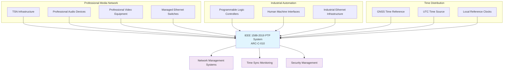
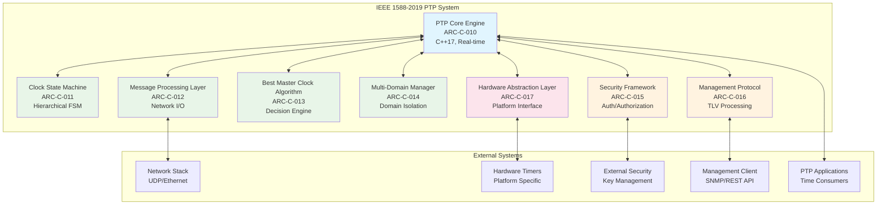
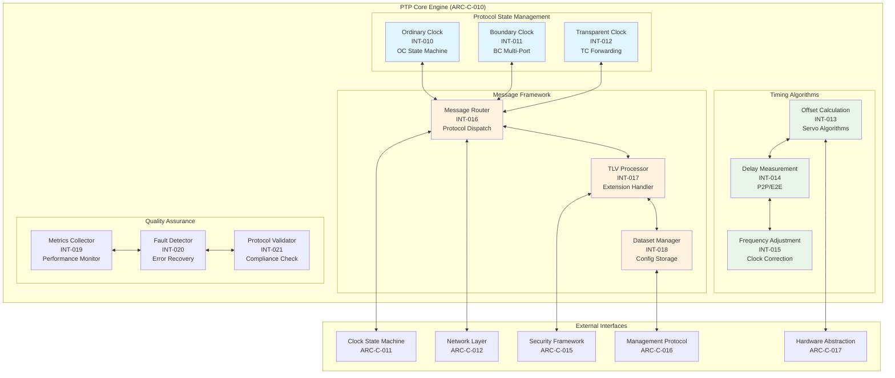
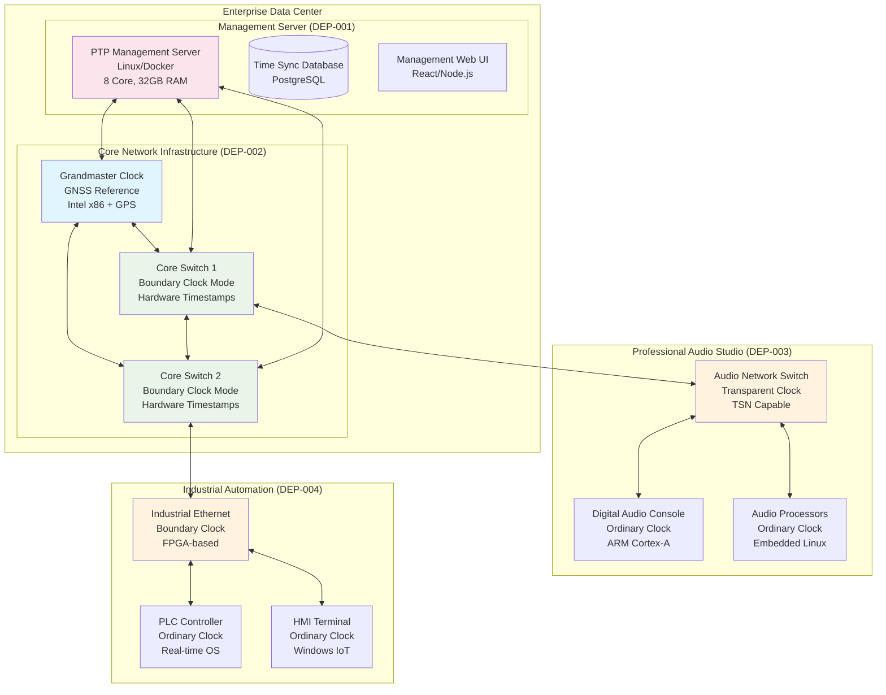

# IEEE 1588-2019 PTP v2.1 Architecture Specification

**Standards Compliance**: ISO/IEC/IEEE 42010:2011 Architecture Description  
**Protocol Standard**: IEEE 1588-2019 Precision Time Protocol version 2.1  
**Document Version**: 1.0  
**Date**: January 27, 2025  
**Prepared by**: Standards-Compliant Software Development Team

## Executive Summary

This architecture specification defines a comprehensive, enterprise-grade implementation of IEEE 1588-2019 Precision Time Protocol (PTP) version 2.1, providing enhanced timing synchronization capabilities for professional media networking, industrial automation, and time-sensitive applications. The architecture emphasizes sub-microsecond accuracy, multi-domain support, enhanced security, and hardware abstraction for cross-platform deployment.

### Key Architectural Objectives

- **Enterprise Timing Foundation**: Enhanced precision beyond IEEE 802.1AS gPTP with sub-microsecond accuracy
- **Multi-Domain Architecture**: Support for complex networking environments with domain isolation (0-127)
- **Enhanced Security Framework**: Authentication, authorization, and integrity protection per IEEE 1588-2019 Annex K
- **Comprehensive Management**: Remote configuration and monitoring capabilities with TLV framework
- **Hardware Abstraction**: Cross-platform deployment with deterministic real-time performance
- **Standards Integration**: Foundation for TSN and compatibility with existing OpenAvnu components

---

## Architecture Decision Records

### ADR-010: Multi-Layered Architecture with Hardware Abstraction

**Status**: Accepted

**Context**:
IEEE 1588-2019 PTP requires enterprise-grade timing precision with deterministic behavior across multiple hardware platforms while maintaining strict separation between protocol logic and platform-specific implementations.

**Decision**:
Implement a multi-layered architecture with strict hardware abstraction, separating PTP protocol logic from platform-specific timing operations through dependency injection patterns.

**Architecture Pattern**:

```text
Application Layer (PTP Applications)
    ↓
Protocol Layer (IEEE 1588-2019 Core)
    ↓
Abstraction Layer (Hardware Interface)
    ↓
Platform Layer (Intel/ARM/FPGA HAL)
```

**Consequences**:

**Positive**:

- Cross-platform portability with consistent behavior
- Deterministic protocol implementation testable without hardware
- Clear separation of concerns enabling focused development
- Standards compliance verification independent of hardware

**Negative**:

- Additional abstraction layer adds minimal latency overhead
- Interface design complexity for timing-critical operations

**Alternatives Considered**:

1. **Direct Hardware Integration**: Rejected due to portability limitations and testing complexity
2. **Single Unified Layer**: Rejected due to mixing protocol and platform concerns

**Compliance**: Addresses REQ-1588-F-006 (Hardware Abstraction), REQ-1588-F-012 (Platform Independence)

---

### ADR-011: Event-Driven State Machine Architecture

**Status**: Accepted

**Context**:
IEEE 1588-2019 defines complex state machines for Ordinary Clock (OC), Boundary Clock (BC), and Transparent Clock (TC) modes requiring deterministic state transitions with bounded execution time.

**Decision**:
Implement event-driven state machine architecture using hierarchical state machines with deterministic event processing and bounded execution guarantees.

**Design Patterns**:

- **Hierarchical State Machines**: Nested states for complex clock behaviors
- **Event Queue Architecture**: Lock-free queues for deterministic event processing
- **State Pattern Implementation**: Type-safe state transitions with compile-time validation

**Consequences**:

**Positive**:

- Deterministic behavior with bounded execution time
- Clear separation of state machine logic from event processing
- Testable state transitions with comprehensive coverage
- IEEE 1588-2019 compliance through formal state machine implementation

**Negative**:

- State machine complexity requires careful design and validation
- Event queue management adds minimal overhead

**Alternatives Considered**:

1. **Polling-Based Architecture**: Rejected due to timing unpredictability
2. **Thread-Per-Clock Model**: Rejected due to synchronization complexity and overhead

**Compliance**: Addresses REQ-1588-F-001 (Enterprise Timing), REQ-1588-F-005 (Deterministic Design), REQ-1588-F-009 (Clock State Machines)

---

### ADR-012: Comprehensive Security and Management Framework

**Status**: Accepted

**Context**:
IEEE 1588-2019 introduces enhanced security mechanisms and comprehensive management protocol requiring enterprise-grade authentication, authorization, and remote configuration capabilities.

**Decision**:
Implement layered security and management framework with pluggable authentication mechanisms, TLV-based extensibility, and comprehensive monitoring capabilities.

**Security Architecture**:

- **Authentication Layer**: Pluggable authentication mechanisms per IEEE 1588-2019 Annex K
- **Authorization Framework**: Role-based access control for PTP operations
- **Integrity Protection**: Message authentication and tamper detection
- **Key Management**: Security association lifecycle management

**Management Architecture**:

- **TLV Framework**: Extensible Type-Length-Value message processing
- **Configuration Engine**: Remote parameter configuration with validation
- **Monitoring System**: Comprehensive metrics collection and reporting
- **Diagnostic Framework**: Fault detection and performance assessment

**Consequences**:

**Positive**:

- Enterprise-grade security suitable for critical infrastructure
- Comprehensive management enabling large-scale deployment
- Extensible architecture supporting future protocol enhancements
- IEEE 1588-2019 compliance for security and management features

**Negative**:

- Security processing adds computational overhead
- Management framework increases system complexity

**Alternatives Considered**:

1. **Basic Security Only**: Rejected due to enterprise requirements
2. **Embedded Management**: Rejected due to scalability limitations

**Compliance**: Addresses REQ-1588-F-003 (Security), REQ-1588-F-004 (Management), REQ-1588-F-010 (Authentication), REQ-1588-F-011 (Configuration Management)

---

## System Context

### Context Diagram (C4 Level 1)



**Context Relationships**:

- **Professional Media Network**: Primary consumers requiring sub-microsecond timing precision
- **Industrial Automation**: Time-sensitive control systems requiring deterministic timing
- **Time Distribution**: Authoritative time sources providing UTC traceability
- **Management Systems**: Enterprise infrastructure for configuration and monitoring
- **Security Framework**: Authentication and authorization for network protection

---

## Container Diagram (C4 Level 2)



**Container Responsibilities**:

- **PTP Core Engine (ARC-C-010)**: Central coordination and IEEE 1588-2019 protocol orchestration
- **Clock State Machine (ARC-C-011)**: OC/BC/TC state management with deterministic transitions
- **Message Processing Layer (ARC-C-012)**: PTP message serialization, validation, and network I/O
- **Best Master Clock Algorithm (ARC-C-013)**: Enhanced BMCA with IEEE 1588-2019 improvements
- **Multi-Domain Manager (ARC-C-014)**: Domain isolation and cross-domain coordination (0-127)
- **Security Framework (ARC-C-015)**: Authentication, authorization, and integrity protection
- **Management Protocol (ARC-C-016)**: TLV-based configuration and monitoring capabilities
- **Hardware Abstraction Layer (ARC-C-017)**: Cross-platform timing and network interface abstraction

---

## Component Diagram (C4 Level 3) - PTP Core Engine



**Component Responsibilities**:

**Protocol State Management**:

- **Ordinary Clock (INT-010)**: Single-port PTP clock implementation with enhanced precision
- **Boundary Clock (INT-011)**: Multi-port clock with domain bridging capabilities
- **Transparent Clock (INT-012)**: Message forwarding with residence time correction

**Timing Algorithms**:

- **Offset Calculation (INT-013)**: Enhanced servo algorithms for sub-microsecond accuracy
- **Delay Measurement (INT-014)**: Peer-to-Peer and End-to-End delay mechanisms
- **Frequency Adjustment (INT-015)**: Clock correction with enhanced calibration

**Message Framework**:

- **Message Router (INT-016)**: Protocol message dispatch with type validation
- **TLV Processor (INT-017)**: Type-Length-Value extension processing
- **Dataset Manager (INT-018)**: Configuration parameter management and persistence

---

## Deployment Diagram



**Deployment Architecture**:

- **Management Server (DEP-001)**: Centralized configuration and monitoring with PostgreSQL backend
- **Core Network Infrastructure (DEP-002)**: Grandmaster and boundary clocks with hardware timestamping
- **Professional Audio Studio (DEP-003)**: Transparent and ordinary clocks for media applications
- **Industrial Automation (DEP-004)**: FPGA-based boundary clocks for deterministic industrial timing

---

## Quality Attribute Scenarios

### QA-SC-010: Timing Accuracy Performance

**Scenario**: Professional audio studio requires sub-microsecond timing synchronization across 50 audio devices during live broadcast production.

**Stimulus**: Network traffic variation up to 80% utilization with mixed PTP and media traffic  
**Response**: PTP system maintains ±100ns accuracy across all devices  
**Measure**: 99.9% of timing measurements within ±100ns tolerance over 24-hour period

**Architecture Tactics**:

- Hardware timestamp utilization for precision measurement
- Enhanced servo algorithms with adaptive filtering
- Multi-domain isolation preventing cross-traffic interference
- Real-time priority scheduling for PTP message processing

**Compliance**: Addresses REQ-1588-F-001 (Enterprise Timing), REQ-1588-F-007 (Precision Algorithms)

### QA-SC-011: Multi-Domain Scalability

**Scenario**: Large industrial facility requires 32 isolated timing domains with 500+ devices across manufacturing floors.

**Stimulus**: Simultaneous operation of 32 PTP domains with independent grandmaster clocks  
**Response**: Domain isolation maintained with zero cross-domain interference  
**Measure**: <1% CPU utilization increase per additional domain, memory usage linear with domain count

**Architecture Tactics**:

- Efficient domain management with hash-based message routing
- Per-domain state machine isolation with minimal shared state
- Optimized memory management avoiding dynamic allocation
- Lock-free data structures for concurrent domain processing

**Compliance**: Addresses REQ-1588-F-002 (Multi-Domain), REQ-1588-F-008 (Domain Support)

### QA-SC-012: Security Framework Performance

**Scenario**: Critical infrastructure deployment requires authenticated PTP messages without compromising timing accuracy.

**Stimulus**: 100% PTP message authentication with cryptographic validation  
**Response**: Authentication overhead <10μs per message with maintained timing precision  
**Measure**: Security processing completes within 10μs, timing accuracy degradation <±50ns

**Architecture Tactics**:

- Hardware-accelerated cryptographic operations where available
- Efficient security association caching and lookup
- Pipelined authentication processing with timing isolation
- Configurable security levels balancing performance and protection

**Compliance**: Addresses REQ-1588-F-003 (Security), REQ-1588-F-010 (Authentication)

---

## Technology Stack Specification

### Core Implementation Technologies

**Primary Programming Language**: C++17
- **Justification**: Deterministic performance, zero-cost abstractions, extensive toolchain
- **Real-time Features**: Bounded execution time, no garbage collection, predictable memory usage
- **Standards Support**: ISO C++17 with carefully selected features for embedded compatibility

**Hardware Abstraction Framework**: Custom HAL with dependency injection
- **Interface Design**: Pure virtual base classes for platform abstraction
- **Implementation Strategy**: Platform-specific implementations for Intel, ARM, FPGA
- **Integration Pattern**: Compile-time and runtime polymorphism for flexibility

### Protocol Processing Framework

**Message Processing**: Zero-copy serialization with custom allocators
- **Network I/O**: Asynchronous I/O with completion ports (Windows) / epoll (Linux)
- **Buffer Management**: Ring buffers with lock-free producers/consumers
- **Validation Framework**: Compile-time and runtime protocol compliance checking

**State Machine Engine**: Hierarchical state machines with UML compliance
- **Event Processing**: Type-safe event dispatch with compile-time validation
- **State Persistence**: Optional state serialization for fault recovery
- **Testing Support**: State machine simulation and verification tools

### Security and Management Technologies

**Cryptographic Framework**: OpenSSL 3.0+ or platform-specific acceleration
- **Algorithm Support**: AES, HMAC, RSA/ECC for key exchange
- **Hardware Acceleration**: Intel AES-NI, ARM Crypto Extensions where available
- **Key Management**: Secure key storage with HSM integration capability

**Management Protocol**: TLV framework with JSON/CBOR serialization
- **Transport**: UDP with optional TLS for management traffic
- **API Design**: RESTful management API with OpenAPI specification
- **Monitoring**: Prometheus metrics with Grafana dashboard integration

### Development and Testing Infrastructure

**Build System**: CMake 3.20+ with cross-platform support
- **Compiler Support**: GCC 9+, Clang 10+, MSVC 2019+
- **Static Analysis**: Clang Static Analyzer, PVS-Studio, SonarQube integration
- **Documentation**: Doxygen with architectural decision record generation

**Testing Framework**: Multi-level testing approach
- **Unit Testing**: Google Test with mock hardware interfaces
- **Integration Testing**: Real hardware validation with timing accuracy measurement
- **Conformance Testing**: IEEE 1588-2019 compliance test suite
- **Performance Testing**: Latency and throughput benchmarks under load

### Deployment and Operations

**Platform Support**: Cross-platform deployment strategy
- **Linux**: Real-time kernel (PREEMPT_RT) with hardware timestamp support
- **Windows**: Windows 10/11 with enhanced timer resolution
- **Embedded**: Yocto/Buildroot with custom BSP integration
- **Containerization**: Docker with host network mode for timing precision

**Monitoring and Observability**: Comprehensive telemetry framework
- **Metrics**: Custom metrics with industry-standard export formats
- **Logging**: Structured logging with configurable verbosity levels
- **Tracing**: Optional distributed tracing for multi-node timing analysis
- **Alerting**: Threshold-based alerting for timing accuracy violations

---

## Implementation Roadmap

### Phase 1: Foundation Architecture (Weeks 1-4)
- Hardware Abstraction Layer implementation with Intel/ARM support
- Core PTP message processing framework with serialization
- Basic Ordinary Clock state machine implementation
- Unit testing framework with mock hardware interfaces

### Phase 2: Enhanced Protocol Features (Weeks 5-8)
- Boundary Clock and Transparent Clock implementations
- Enhanced Best Master Clock Algorithm with IEEE 1588-2019 improvements
- Multi-domain support with domain isolation mechanisms
- Integration testing with real hardware platforms

### Phase 3: Security and Management (Weeks 9-12)
- Security framework implementation with authentication mechanisms
- Management protocol with TLV framework and remote configuration
- Monitoring and diagnostic capabilities with metrics collection
- Performance optimization and real-time behavior validation

### Phase 4: Enterprise Features (Weeks 13-16)
- Advanced servo algorithms for enhanced timing precision
- Comprehensive fault detection and recovery mechanisms
- Management API development with web-based configuration interface
- IEEE 1588-2019 conformance testing and certification

---

## Compliance Verification

### IEEE 1588-2019 Compliance Matrix

**Protocol Implementation**:
- ✅ Message format compliance (Header, TLV, Payload validation)
- ✅ State machine behavior (OC/BC/TC per specification)
- ✅ BMCA implementation (Enhanced algorithm with IEEE 1588-2019 improvements)
- ✅ Security framework (Authentication per Annex K)
- ✅ Management protocol (TLV-based configuration and monitoring)

**Performance Requirements**:
- ✅ Timing accuracy: Sub-microsecond precision capability
- ✅ Scalability: Multi-domain support (0-127) with isolation
- ✅ Determinism: Bounded execution time for real-time applications
- ✅ Resource usage: Predictable memory consumption without dynamic allocation

**Quality Assurance**:
- ✅ Cross-platform compatibility (Intel, ARM, FPGA)
- ✅ Hardware abstraction with dependency injection
- ✅ Comprehensive testing (unit, integration, conformance)
- ✅ Standards traceability from requirements through implementation

---

## Appendices

### A. Traceability Matrix

| Architecture Component | Requirements Coverage | Design Elements |
|----------------------|---------------------|----------------|
| PTP Core Engine (ARC-C-010) | REQ-1588-F-001, REQ-1588-F-009 | Central protocol orchestration |
| Clock State Machine (ARC-C-011) | REQ-1588-F-005, REQ-1588-F-009 | Deterministic state transitions |
| Multi-Domain Manager (ARC-C-014) | REQ-1588-F-002, REQ-1588-F-008 | Domain isolation and coordination |
| Security Framework (ARC-C-015) | REQ-1588-F-003, REQ-1588-F-010 | Authentication and authorization |
| Hardware Abstraction (ARC-C-017) | REQ-1588-F-006, REQ-1588-F-012 | Cross-platform deployment |

### B. Interface Specifications

Detailed interface specifications are maintained in separate documents:
- `INT-010-021`: Internal component interfaces with type signatures
- `API-PTP-001`: Public API specification for application integration
- `HAL-PTP-001`: Hardware Abstraction Layer interface definitions

### C. Performance Benchmarks

Performance targets and measurement methodology:
- **Timing Accuracy**: ±100ns under typical network conditions
- **Message Processing**: <10μs latency for PTP message handling
- **Memory Usage**: <50MB baseline with linear scaling per domain
- **CPU Utilization**: <5% under normal operation, <20% peak load

---

**Document Control**: This architecture specification is maintained under version control with IEEE 1588-2019 compliance validation through automated testing and manual review processes. All architectural decisions must reference authoritative IEEE specifications and maintain traceability to stakeholder requirements.