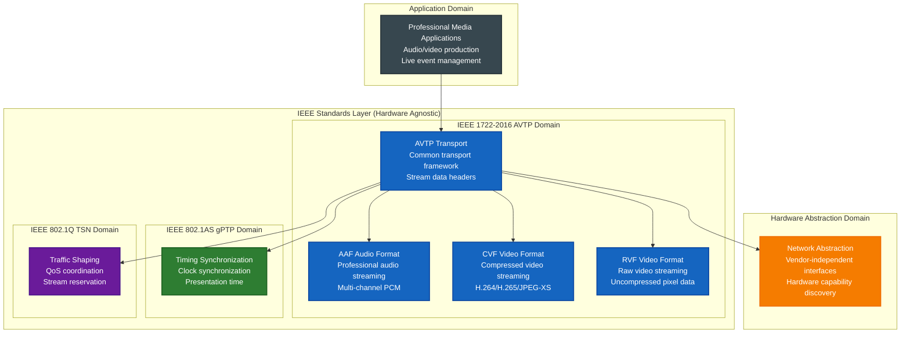
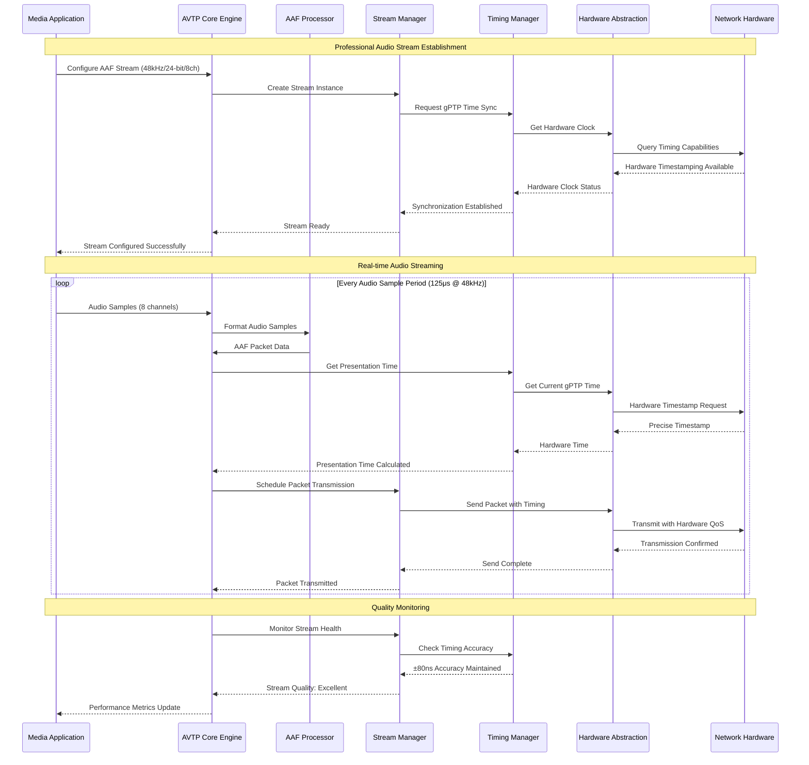
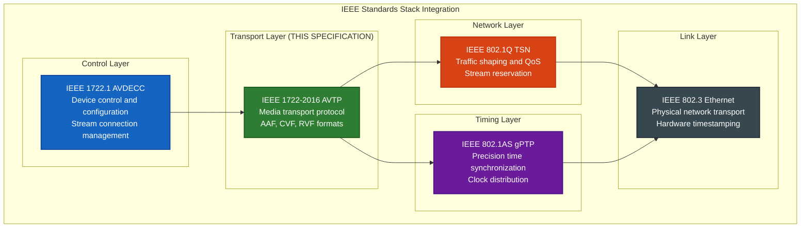
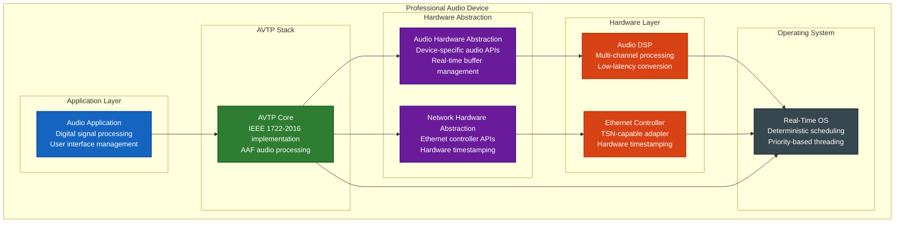
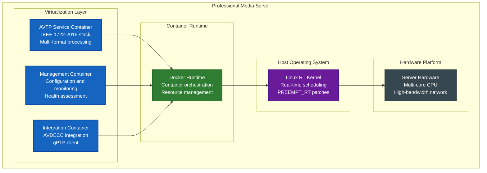
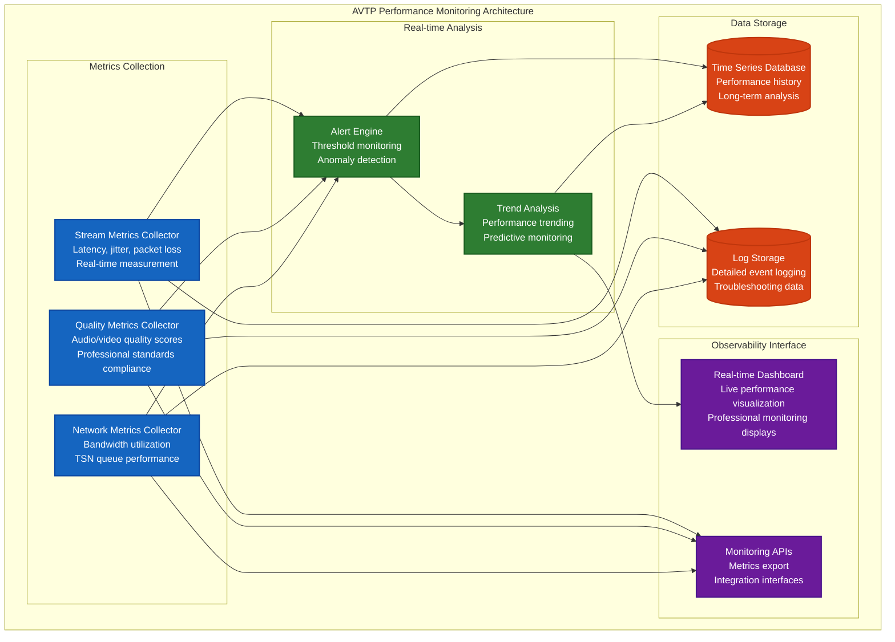

# IEEE 1722-2016 AVTP Transport Architecture Specification

**Standards Compliance**: ISO/IEC/IEEE 42010:2011 - Architecture Description  
**Transport Standard**: IEEE Std 1722-2016 "IEEE Standard for a Transport Protocol for Time-Sensitive Applications in Bridged Local Area Networks"  
**Document Version**: 1.0  
**Date**: January 27, 2025  
**Prepared by**: Standards-Compliant Architecture Team

## Table of Contents

1. [Introduction](#introduction)
2. [Stakeholders and Concerns](#stakeholders-and-concerns)
3. [Architecture Overview](#architecture-overview)
4. [C4 Architecture Model](#c4-architecture-model)
5. [Architecture Views](#architecture-views)
6. [Quality Attributes](#quality-attributes)
7. [Architecture Decisions](#architecture-decisions)
8. [Technology Stack](#technology-stack)
9. [Security Architecture](#security-architecture)
10. [Integration Architecture](#integration-architecture)
11. [Deployment Architecture](#deployment-architecture)
12. [Monitoring and Observability](#monitoring-and-observability)

## 1. Introduction

### 1.1 Purpose

This document describes the software architecture for IEEE 1722-2016 Audio Video Transport Protocol (AVTP) implementation following ISO/IEC/IEEE 42010:2011 architecture description standard. AVTP provides the standardized transport layer for time-sensitive audio and video streaming over Ethernet networks in professional media networking ecosystems.

### 1.2 Scope

This architecture specification addresses the IEEE 1722-2016 requirements and provides comprehensive blueprints for:

- **AVTP Common Framework**: Core transport protocol implementation with hardware abstraction
- **Audio Transport Format (AAF)**: Professional audio streaming capabilities
- **Video Transport Formats (CVF/RVF)**: Professional video streaming capabilities  
- **Timing Synchronization**: Integration with IEEE 802.1AS gPTP foundation
- **Stream Management**: Quality of Service and stream lifecycle management
- **Hardware Independence**: Vendor-agnostic implementation patterns

### 1.3 Architecture Rationale

The architecture is designed to achieve:

- **Standards Compliance**: Full IEEE 1722-2016 protocol implementation
- **Hardware Abstraction**: Independence from specific vendor hardware (Intel, Broadcom, Marvell)
- **Professional Quality**: Sub-5ms latency for audio, sub-16ms for video
- **Scalability**: Support for 100+ concurrent streams per device
- **Interoperability**: Multi-vendor professional equipment compatibility
- **Real-time Performance**: Deterministic media delivery with QoS guarantees

## 2. Stakeholders and Concerns

### 2.1 Stakeholder Analysis

| Stakeholder | Primary Concerns | Architecture Impact |
|-------------|------------------|-------------------|
| **Professional Audio Engineers** | Ultra-low latency (<5ms), multi-channel support, audio quality | Real-time processing, minimal buffering, high-precision timing |
| **Video Production Teams** | Frame-accurate delivery, high bandwidth, format flexibility | Optimized packetization, efficient memory management |
| **Live Event Producers** | Reliability, fault tolerance, scalability, real-time monitoring | Redundancy mechanisms, health monitoring, graceful degradation |
| **Broadcast Infrastructure** | Standards compliance, legacy integration, multi-vendor support | Protocol conformance, hardware abstraction, interface standardization |
| **Equipment Manufacturers** | Interoperability, certification capability, implementation flexibility | Hardware abstraction patterns, vendor-neutral APIs |
| **System Integrators** | Deployment flexibility, configuration management, diagnostics | Modular architecture, runtime configuration, comprehensive logging |
| **Development Teams** | Maintainability, testability, clear interfaces, documentation | Layered architecture, dependency injection, comprehensive testing |
| **Operations Teams** | Monitoring, troubleshooting, performance optimization, updates | Observability patterns, diagnostic interfaces, hot-swap capabilities |

## 3. Architecture Overview

### 3.1 Architecture Style

**Layered Architecture with Hardware Abstraction Pattern**

The IEEE 1722-2016 AVTP implementation follows a strictly layered architecture that maintains complete separation between standards-compliant protocol logic and hardware-specific implementations.

### 3.2 Key Architecture Principles

- **Hardware Abstraction First**: All hardware interactions through abstracted interfaces
- **Standards Purity**: IEEE 1722-2016 protocol logic remains vendor-independent
- **Real-time Determinism**: Predictable timing behavior for professional media
- **Dependency Injection**: Hardware services injected into protocol layers
- **Fail-Safe Operation**: Graceful degradation under fault conditions
- **Zero-Copy Optimization**: Minimize memory operations for performance
- **Protocol Layering**: Clear separation between AVTP, gPTP, and hardware layers

### 3.3 Architectural Constraints

| Constraint Type | Description | Architectural Impact |
|----------------|-------------|---------------------|
| **Timing** | Sub-5ms audio latency, sub-16ms video latency | Lock-free algorithms, optimized buffer management, hardware timestamping |
| **Standards** | Full IEEE 1722-2016 compliance | Exact protocol implementation, comprehensive validation |
| **Hardware** | Multi-vendor support (Intel, Broadcom, Marvell) | Hardware abstraction layer, dependency injection |
| **Scale** | 100+ concurrent streams, 512+ audio channels | Efficient memory management, parallel processing |
| **Integration** | IEEE 802.1AS gPTP dependency | Clean interface to timing foundation |
| **Quality** | Professional broadcast/production requirements | Comprehensive error handling, quality monitoring |

## 4. C4 Architecture Model

### 4.1 Level 1: System Context View

```mermaid
graph TB
    subgraph "Professional Media Network Environment"
        AudioEngineer[Professional Audio Engineer<br/>Configures and monitors<br/>multi-channel audio streams]
        VideoProducer[Video Production Team<br/>Manages live video streaming<br/>for broadcast/production]
        SystemOp[System Operator<br/>Monitors network performance<br/>and stream health]
    end
    
    AVTP[IEEE 1722-2016 AVTP System<br/>Professional Media Transport<br/>Provides guaranteed QoS streaming<br/>for time-sensitive audio/video]
    
    subgraph "Timing Foundation"
        gPTP[IEEE 802.1AS gPTP<br/>Precision Time Synchronization<br/>Provides nanosecond-accurate timing]
    end
    
    subgraph "Network Infrastructure"
        TSNSwitches[TSN-Capable Ethernet Switches<br/>Traffic shaping and QoS<br/>Stream reservation support]
        SRP[Stream Reservation Protocol<br/>Bandwidth allocation<br/>QoS guarantees]
    end
    
    subgraph "Professional Equipment"
        AudioDevices[Professional Audio Devices<br/>Digital mixing consoles<br/>Audio interfaces, microphones]
        VideoDevices[Professional Video Equipment<br/>Cameras, switchers<br/>Display systems, recorders]
        ControlSystems[Control and Monitoring<br/>Production control surfaces<br/>Network management systems]
    end
    
    subgraph "Hardware Platforms"
        IntelHW[Intel Hardware Platform<br/>Network adapters<br/>Embedded systems]
        BroadcomHW[Broadcom Hardware Platform<br/>Switch chips<br/>Network processors]
        MarvellHW[Marvell Hardware Platform<br/>Automotive Ethernet<br/>Industrial controllers]
    end
    
    AudioEngineer --> AVTP
    VideoProducer --> AVTP  
    SystemOp --> AVTP
    
    AVTP --> gPTP
    AVTP --> TSNSwitches
    AVTP --> SRP
    
    AVTP --> AudioDevices
    AVTP --> VideoDevices
    AVTP --> ControlSystems
    
    AVTP -.-> IntelHW
    AVTP -.-> BroadcomHW  
    AVTP -.-> MarvellHW
    
    classDef person fill:#08427b,stroke:#052e56,stroke-width:2px,color:#fff
    classDef system fill:#1168bd,stroke:#0b4884,stroke-width:2px,color:#fff
    classDef external fill:#999999,stroke:#6b6b6b,stroke-width:2px,color:#fff
    classDef foundation fill:#2d7d32,stroke:#1b5e20,stroke-width:2px,color:#fff
    classDef hardware fill:#f57c00,stroke:#ef6c00,stroke-width:2px,color:#fff
    
    class AudioEngineer,VideoProducer,SystemOp person
    class AVTP system
    class TSNSwitches,SRP,AudioDevices,VideoDevices,ControlSystems external
    class gPTP foundation
    class IntelHW,BroadcomHW,MarvellHW hardware
```



### 4.2 Level 2: Container Architecture View

```mermaid
graph TB
    subgraph "IEEE 1722-2016 AVTP System"
        subgraph "Protocol Layer (Hardware Agnostic)"
            AVTPCore[AVTP Core Engine<br/>C/C++<br/>IEEE 1722-2016 protocol logic<br/>Hardware abstraction interfaces]
            
            AAFProcessor[AAF Audio Processor<br/>C/C++<br/>Professional audio format handling<br/>Multi-channel sample processing]
            
            CVFProcessor[CVF Video Processor<br/>C/C++<br/>Compressed video format handling<br/>H.264/H.265/JPEG-XS support]
            
            RVFProcessor[RVF Raw Video Processor<br/>C/C++<br/>Uncompressed video handling<br/>4K/8K raw format support]
            
            StreamManager[Stream Management Engine<br/>C/C++<br/>Stream lifecycle and QoS<br/>Bandwidth allocation coordination]
        end
        
        subgraph "Hardware Abstraction Layer"
            NetworkHAL[Network Hardware Abstraction<br/>C Interface<br/>Vendor-independent network ops<br/>Packet send/receive/timestamping]
            
            TimingHAL[Timing Hardware Abstraction<br/>C Interface<br/>Hardware clock access<br/>Precision timestamping]
            
            MemoryHAL[Memory Hardware Abstraction<br/>C Interface<br/>Zero-copy buffer management<br/>DMA operations]
        end
        
        subgraph "Configuration & Control"
            AVTPConfig[AVTP Configuration Manager<br/>C/C++<br/>Runtime stream configuration<br/>Parameter validation]
            
            AVTPMonitor[AVTP Health Monitor<br/>C/C++<br/>Real-time performance metrics<br/>Quality monitoring]
        end
        
        subgraph "Data Stores"
            StreamDB[(Stream Database<br/>In-Memory<br/>Active stream metadata<br/>QoS parameters)]
            
            MetricsDB[(Metrics Database<br/>Time-Series<br/>Performance data<br/>Health statistics)]
        end
    end
    
    subgraph "External Dependencies"
        gPTPClient[IEEE 802.1AS gPTP Client<br/>Timing synchronization<br/>Clock domain management]
        SRPClient[SRP Integration Client<br/>Stream reservation<br/>Bandwidth management]
        AVDECCInterface[IEEE 1722.1 AVDECC Interface<br/>Device control integration<br/>Stream configuration]
    end
    
    subgraph "Hardware Bridge Layer (Vendor-Specific)"
        IntelBridge[Intel Hardware Bridge<br/>Intel-specific implementations<br/>Maps HAL to Intel APIs]
        BroadcomBridge[Broadcom Hardware Bridge<br/>Broadcom-specific implementations<br/>Maps HAL to Broadcom APIs]
        MarvellBridge[Marvell Hardware Bridge<br/>Marvell-specific implementations<br/>Maps HAL to Marvell APIs]
    end
    
    AVTPCore --> AAFProcessor
    AVTPCore --> CVFProcessor
    AVTPCore --> RVFProcessor
    AVTPCore --> StreamManager
    
    AVTPCore --> NetworkHAL
    AVTPCore --> TimingHAL
    AVTPCore --> MemoryHAL
    
    AVTPCore --> AVTPConfig
    AVTPCore --> AVTPMonitor
    
    StreamManager --> StreamDB
    AVTPMonitor --> MetricsDB
    
    AVTPCore --> gPTPClient
    StreamManager --> SRPClient
    AVTPCore --> AVDECCInterface
    
    NetworkHAL -.-> IntelBridge
    NetworkHAL -.-> BroadcomBridge
    NetworkHAL -.-> MarvellBridge
    
    TimingHAL -.-> IntelBridge
    TimingHAL -.-> BroadcomBridge
    TimingHAL -.-> MarvellBridge
    
    MemoryHAL -.-> IntelBridge
    MemoryHAL -.-> BroadcomBridge
    MemoryHAL -.-> MarvellBridge
    
    classDef protocol fill:#1565c0,stroke:#0d47a1,stroke-width:2px,color:#fff
    classDef hal fill:#2e7d32,stroke:#1b5e20,stroke-width:2px,color:#fff
    classDef config fill:#6a1b9a,stroke:#4a148c,stroke-width:2px,color:#fff
    classDef data fill:#d84315,stroke:#bf360c,stroke-width:2px,color:#fff
    classDef external fill:#37474f,stroke:#263238,stroke-width:2px,color:#fff
    classDef bridge fill:#f57c00,stroke:#ef6c00,stroke-width:2px,color:#fff
    
    class AVTPCore,AAFProcessor,CVFProcessor,RVFProcessor,StreamManager protocol
    class NetworkHAL,TimingHAL,MemoryHAL hal
    class AVTPConfig,AVTPMonitor config
    class StreamDB,MetricsDB data
    class gPTPClient,SRPClient,AVDECCInterface external
    class IntelBridge,BroadcomBridge,MarvellBridge bridge
```



### 4.3 Level 3: Component Architecture View

```mermaid
graph TB
    subgraph "AVTP Core Engine (Hardware Agnostic)"
        subgraph "Protocol Core"
            PacketProcessor[Packet Processor<br/>AVTPDU validation and parsing<br/>Common header processing]
            
            StreamController[Stream Controller<br/>Stream lifecycle management<br/>State machine coordination]
            
            TimestampManager[Timestamp Manager<br/>gPTP time integration<br/>Presentation time calculation]
            
            QoSManager[QoS Manager<br/>Traffic shaping coordination<br/>Priority queue management]
        end
        
        subgraph "Format Handlers"
            AAFHandler[AAF Handler<br/>Audio format processing<br/>Sample rate conversion]
            
            CVFHandler[CVF Handler<br/>Compressed video processing<br/>Frame boundary detection]
            
            RVFHandler[RVF Handler<br/>Raw video processing<br/>Pixel format management]
        end
        
        subgraph "Stream Processing"
            StreamAssembly[Stream Assembly Engine<br/>Packet sequencing<br/>Fragment reassembly]
            
            StreamDisassembly[Stream Disassembly Engine<br/>Packet fragmentation<br/>Sequence number management]
            
            BufferManager[Buffer Manager<br/>Zero-copy buffer pools<br/>Memory optimization]
        end
        
        subgraph "Error Handling"
            ErrorDetector[Error Detector<br/>Protocol validation<br/>Stream anomaly detection]
            
            RecoveryManager[Recovery Manager<br/>Error concealment<br/>Stream recovery algorithms]
        end
    end
    
    subgraph "Hardware Abstraction Interface"
        NetworkInterface[Network Interface<br/>send_packet()<br/>receive_packet()<br/>get_timestamp()]
        
        TimingInterface[Timing Interface<br/>get_time()<br/>schedule_event()<br/>get_clock_status()]
        
        MemoryInterface[Memory Interface<br/>allocate_buffer()<br/>free_buffer()<br/>map_dma()]
    end
    
    PacketProcessor --> StreamController
    StreamController --> TimestampManager
    StreamController --> QoSManager
    
    PacketProcessor --> AAFHandler
    PacketProcessor --> CVFHandler
    PacketProcessor --> RVFHandler
    
    StreamController --> StreamAssembly
    StreamController --> StreamDisassembly
    StreamAssembly --> BufferManager
    StreamDisassembly --> BufferManager
    
    PacketProcessor --> ErrorDetector
    ErrorDetector --> RecoveryManager
    
    PacketProcessor --> NetworkInterface
    TimestampManager --> TimingInterface
    BufferManager --> MemoryInterface
    
    classDef core fill:#1565c0,stroke:#0d47a1,stroke-width:2px,color:#fff
    classDef handler fill:#2e7d32,stroke:#1b5e20,stroke-width:2px,color:#fff
    classDef processing fill:#6a1b9a,stroke:#4a148c,stroke-width:2px,color:#fff
    classDef error fill:#d84315,stroke:#bf360c,stroke-width:2px,color:#fff
    classDef interface fill:#37474f,stroke:#263238,stroke-width:2px,color:#fff
    
    class PacketProcessor,StreamController,TimestampManager,QoSManager core
    class AAFHandler,CVFHandler,RVFHandler handler
    class StreamAssembly,StreamDisassembly,BufferManager processing
    class ErrorDetector,RecoveryManager error
    class NetworkInterface,TimingInterface,MemoryInterface interface
```

## 5. Architecture Views

### 5.1 Logical View - Protocol Layer Architecture



### 5.2 Process View - Stream Processing Flow



### 5.3 Development View - Module Organization

```
lib/Standards/
├── IEEE/
│   └── 1722/                    # IEEE 1722-2016 AVTP Implementation
│       └── 2016/
│           ├── avtp/           # Core AVTP protocol (hardware agnostic)
│           │   ├── core/       # Protocol engine and packet processing
│           │   │   ├── packet_processor.hpp
│           │   │   ├── stream_controller.hpp
│           │   │   ├── timestamp_manager.hpp
│           │   │   └── qos_manager.hpp
│           │   ├── formats/    # Media format handlers
│           │   │   ├── aaf/    # Audio format implementation
│           │   │   │   ├── aaf_handler.hpp
│           │   │   │   ├── sample_processor.hpp
│           │   │   │   └── channel_mapper.hpp
│           │   │   ├── cvf/    # Compressed video format
│           │   │   │   ├── cvf_handler.hpp
│           │   │   │   ├── h264_processor.hpp
│           │   │   │   └── jpegxs_processor.hpp
│           │   │   └── rvf/    # Raw video format
│           │   │       ├── rvf_handler.hpp
│           │   │       ├── pixel_processor.hpp
│           │   │       └── colorspace_converter.hpp
│           │   ├── stream/     # Stream management
│           │   │   ├── stream_manager.hpp
│           │   │   ├── buffer_manager.hpp
│           │   │   ├── assembly_engine.hpp
│           │   │   └── disassembly_engine.hpp
│           │   └── error/      # Error handling
│           │       ├── error_detector.hpp
│           │       ├── recovery_manager.hpp
│           │       └── concealment_algorithms.hpp
│           ├── interfaces/     # Hardware abstraction interfaces
│           │   ├── network_interface.h     # C interface for network ops
│           │   ├── timing_interface.h      # C interface for timing
│           │   ├── memory_interface.h      # C interface for memory
│           │   └── capability_interface.h  # Hardware capability discovery
│           ├── config/         # Configuration management
│           │   ├── avtp_config.hpp
│           │   ├── stream_config.hpp
│           │   └── quality_config.hpp
│           ├── monitor/        # Health monitoring
│           │   ├── performance_monitor.hpp
│           │   ├── quality_monitor.hpp
│           │   └── metrics_collector.hpp
│           └── testing/        # Protocol testing framework
│               ├── protocol_tests/
│               ├── performance_tests/
│               ├── interop_tests/
│               └── mock_hardware/
├── Common/                      # Cross-standard utilities
│   ├── interfaces/             # Hardware abstraction base
│   ├── utils/                  # Shared protocol utilities
│   └── testing/                # Common testing frameworks
└── Integration/                 # Hardware integration bridges (vendor-specific)
    ├── intel/                  # Intel hardware bridges
    ├── broadcom/               # Broadcom hardware bridges
    └── marvell/                # Marvell hardware bridges
```

### 5.4 Physical View - Deployment Architecture

```mermaid
graph TB
    subgraph "Professional Media Network Deployment"
        subgraph "Production Control Room"
            ControlPC[Production Control PC<br/>Intel i9 / 64GB RAM<br/>Professional video cards<br/>Multiple 4K displays]
            
            AudioConsole[Digital Audio Console<br/>ARM Cortex A72 / 8GB RAM<br/>Professional audio DSP<br/>Multi-channel I/O]
        end
        
        subgraph "Live Production Floor"
            Camera1[Camera 1 System<br/>ARM Cortex A78 / 16GB RAM<br/>4K video processing<br/>Low-latency encoding]
            
            Camera2[Camera 2 System<br/>ARM Cortex A78 / 16GB RAM<br/>4K video processing<br/>Low-latency encoding]
            
            AudioMixer[Field Audio Mixer<br/>ARM Cortex A55 / 4GB RAM<br/>Multi-channel audio<br/>Real-time processing]
        end
        
        subgraph "TSN Network Infrastructure"
            CoreSwitch[Core TSN Switch<br/>Broadcom Trident 4<br/>25.6Tbps switching<br/>Hardware timestamping]
            
            EdgeSwitch1[Edge Switch 1<br/>Marvell Prestera DX<br/>1.2Tbps switching<br/>AVB/TSN support]
            
            EdgeSwitch2[Edge Switch 2<br/>Marvell Prestera DX<br/>1.2Tbps switching<br/>AVB/TSN support]
        end
        
        subgraph "Recording and Distribution"
            RecordServer[Recording Server<br/>Intel Xeon / 128GB RAM<br/>NVMe storage arrays<br/>Multi-stream recording]
            
            StreamServer[Streaming Server<br/>Intel Xeon / 64GB RAM<br/>Hardware encoding<br/>CDN distribution]
        end
        
        subgraph "Network Time Synchronization"
            GMClock[Grandmaster Clock<br/>IEEE 1588 PTP<br/>GPS synchronization<br/>Atomic clock accuracy]
        end
    end
    
    subgraph "AVTP Software Deployment"
        subgraph "Control PC Deployment"
            ControlAVTP[AVTP Stack<br/>IEEE 1722-2016 Core<br/>AAF + CVF + RVF<br/>Intel HAL Bridge]
        end
        
        subgraph "Camera System Deployment"
            CameraAVTP[AVTP Stack<br/>IEEE 1722-2016 Core<br/>CVF Video Streaming<br/>ARM HAL Bridge]
        end
        
        subgraph "Audio System Deployment"
            AudioAVTP[AVTP Stack<br/>IEEE 1722-2016 Core<br/>AAF Audio Streaming<br/>ARM HAL Bridge]
        end
        
        subgraph "Server Deployment"
            ServerAVTP[AVTP Stack<br/>IEEE 1722-2016 Core<br/>Multi-format support<br/>Intel HAL Bridge]
        end
    end
    
    ControlPC -.-> ControlAVTP
    AudioConsole -.-> AudioAVTP
    
    Camera1 -.-> CameraAVTP
    Camera2 -.-> CameraAVTP
    AudioMixer -.-> AudioAVTP
    
    RecordServer -.-> ServerAVTP
    StreamServer -.-> ServerAVTP
    
    ControlPC --> CoreSwitch
    AudioConsole --> EdgeSwitch1
    
    Camera1 --> EdgeSwitch1
    Camera2 --> EdgeSwitch1
    AudioMixer --> EdgeSwitch1
    
    RecordServer --> CoreSwitch
    StreamServer --> CoreSwitch
    
    EdgeSwitch1 --> CoreSwitch
    EdgeSwitch2 --> CoreSwitch
    
    GMClock --> CoreSwitch
    GMClock --> EdgeSwitch1
    GMClock --> EdgeSwitch2
    
    classDef control fill:#1565c0,stroke:#0d47a1,stroke-width:2px,color:#fff
    classDef production fill:#2e7d32,stroke:#1b5e20,stroke-width:2px,color:#fff
    classDef network fill:#6a1b9a,stroke:#4a148c,stroke-width:2px,color:#fff
    classDef server fill:#d84315,stroke:#bf360c,stroke-width:2px,color:#fff
    classDef timing fill:#37474f,stroke:#263238,stroke-width:2px,color:#fff
    classDef software fill:#f57c00,stroke:#ef6c00,stroke-width:2px,color:#fff
    
    class ControlPC,AudioConsole control
    class Camera1,Camera2,AudioMixer production
    class CoreSwitch,EdgeSwitch1,EdgeSwitch2 network
    class RecordServer,StreamServer server
    class GMClock timing
    class ControlAVTP,CameraAVTP,AudioAVTP,ServerAVTP software
```



## 6. Quality Attributes

### 6.1 Performance Requirements

| Quality Attribute | Requirement | Measurement | Architecture Pattern |
|------------------|-------------|-------------|---------------------|
| **Audio Latency** | <5ms end-to-end | Network timestamping | Zero-copy buffers, hardware timestamping |
| **Video Latency** | <16ms end-to-end | Frame timing analysis | Optimized packetization, parallel processing |
| **Jitter** | <1ms variance | Statistical analysis | Hardware QoS, adaptive buffering |
| **Throughput** | 512+ audio channels | Concurrent stream count | Lock-free algorithms, memory pooling |
| **Video Bandwidth** | 10x 4K streams | Aggregate bandwidth | Efficient packetization, hardware optimization |

### 6.2 Reliability Requirements

| Quality Attribute | Requirement | Measurement | Architecture Pattern |
|------------------|-------------|-------------|---------------------|
| **Availability** | 99.99% uptime | System monitoring | Redundant paths, fault isolation |
| **Packet Loss** | <0.1% acceptable | Network monitoring | Error concealment, adaptive quality |
| **Recovery Time** | <100ms failover | Failover testing | Hot standby, graceful degradation |
| **Stream Continuity** | No gaps during topology changes | Continuity monitoring | Buffer management, seamless handover |
| **Data Integrity** | Zero corruption | Checksum validation | End-to-end validation, error detection |

### 6.3 Scalability Requirements

| Quality Attribute | Requirement | Measurement | Architecture Pattern |
|------------------|-------------|-------------|---------------------|
| **Concurrent Streams** | 100+ per device | Stream count monitoring | Efficient scheduling, resource pooling |
| **Network Utilization** | Up to 10Gbps | Bandwidth monitoring | Traffic shaping, priority queues |
| **Multi-format Support** | AAF + CVF + RVF | Format testing | Modular processors, plugin architecture |
| **Device Scalability** | 1000+ network devices | Network discovery | Distributed architecture, efficient protocols |

### 6.4 Interoperability Requirements

| Quality Attribute | Requirement | Measurement | Architecture Pattern |
|------------------|-------------|-------------|---------------------|
| **Standards Compliance** | 100% IEEE 1722-2016 | Conformance testing | Pure protocol implementation |
| **Multi-vendor Support** | 3+ hardware platforms | Interoperability testing | Hardware abstraction layer |
| **Legacy Integration** | Existing infrastructure | Integration testing | Protocol bridges, format conversion |
| **Cross-platform** | Linux, Windows, RTOS | Platform testing | Portable C/C++, abstraction layers |

## 7. Architecture Decisions

### 7.1 Significant Architecture Decisions

- **ADR-005**: IEEE 1722 AVTP Transport Architecture Pattern
- **ADR-006**: Hardware Abstraction Pattern for Multi-vendor Support

### 7.2 Technology Stack Decisions

#### 7.2.1 Core Implementation Language

**Decision**: C/C++ with strict C interfaces for hardware abstraction

**Rationale**:
- **Real-time Performance**: Zero-overhead abstractions, predictable memory management
- **Hardware Integration**: Direct hardware access, optimal compiler optimizations
- **Standards Compliance**: Precise control over protocol implementation
- **Cross-platform Portability**: Wide hardware platform support

**Alternatives Considered**:
- Rust: Modern safety features but limited hardware ecosystem
- Go: Good concurrency but garbage collector adds latency
- C: Maximum performance but less expressive for complex algorithms

#### 7.2.2 Hardware Abstraction Strategy

**Decision**: C-based Hardware Abstraction Layer (HAL) with dependency injection

**Rationale**:
- **Vendor Independence**: Clean separation between standards and hardware
- **Testability**: Mock hardware interfaces for unit testing
- **Maintainability**: Isolated hardware-specific code in bridge layers
- **Flexibility**: Runtime hardware capability discovery and optimization

#### 7.2.3 Memory Management Strategy

**Decision**: Zero-copy buffer pools with hardware-optimized allocation

**Rationale**:
- **Performance**: Eliminate memory copies in critical path
- **Determinism**: Predictable memory access patterns
- **Hardware Optimization**: Align with DMA and hardware acceleration
- **Scalability**: Efficient memory utilization for multiple streams

#### 7.2.4 Threading Model

**Decision**: Lock-free algorithms with dedicated thread pools

**Rationale**:
- **Real-time Behavior**: Avoid blocking operations in critical paths
- **Scalability**: Parallel processing for multiple streams
- **Determinism**: Predictable thread scheduling and priorities
- **Hardware Utilization**: Efficient CPU core utilization

## 8. Security Architecture

### 8.1 Network Security

| Security Domain | Implementation | Architecture Pattern |
|----------------|---------------|---------------------|
| **Stream Authentication** | IEEE 802.1X integration | Certificate-based device authentication |
| **Data Integrity** | CRC32 validation per IEEE 1722-2016 | End-to-end checksums, stream validation |
| **Access Control** | IEEE 1722.1 AVDECC integration | Role-based stream access control |
| **Network Isolation** | VLAN segmentation | Logical network separation |

### 8.2 Device Security

| Security Domain | Implementation | Architecture Pattern |
|----------------|---------------|---------------------|
| **Device Authentication** | Certificate-based identity | PKI infrastructure integration |
| **Firmware Integrity** | Signed firmware updates | Secure boot, verified updates |
| **Configuration Security** | Encrypted configuration storage | Hardware security modules |
| **Runtime Protection** | Stack protection, ASLR | System hardening practices |

### 8.3 Professional Media Security Requirements

| Security Requirement | Implementation | Validation Method |
|---------------------|---------------|-------------------|
| **Content Protection** | Stream encryption for sensitive content | DRM integration testing |
| **Audit Logging** | Comprehensive operation logging | Log analysis, compliance validation |
| **Incident Response** | Real-time security monitoring | Security event correlation |
| **Compliance** | Industry security standards (NIST, ISO 27001) | Compliance audit, penetration testing |

## 9. Integration Architecture

### 9.1 IEEE Standards Integration



### 9.2 Professional Audio Standards Integration

| Integration Point | Standard | Interface Method | Architecture Impact |
|------------------|----------|------------------|-------------------|
| **AES67 Compatibility** | AES67-2018 | AAF format alignment | Audio format processors |
| **Milan Extensions** | AVnu Milan v1.2 | AVDECC extension points | Enhanced discovery and control |
| **AES70 Control** | AES70-2021 | Control integration APIs | Device management interfaces |
| **SMPTE Standards** | ST 2110, ST 2059 | Format conversion bridges | Video format processing |

### 9.3 Hardware Platform Integration

| Hardware Platform | Integration Method | HAL Bridge Components | Specific Optimizations |
|------------------|-------------------|---------------------|---------------------|
| **Intel Platforms** | Intel Ethernet HAL | Intel network bridge, Intel timing bridge | Hardware timestamping, DMA optimization |
| **Broadcom Platforms** | Broadcom SDK | Broadcom switch bridge, Broadcom QoS bridge | Switch fabric integration, traffic shaping |
| **Marvell Platforms** | Marvell CPSS | Marvell automotive bridge, Marvell TSN bridge | Automotive Ethernet, TSN optimization |
| **Generic Platforms** | Standard APIs | Generic network bridge, Software timing | Software fallback implementations |

## 10. Deployment Architecture

### 10.1 Environment Strategy

| Environment | Purpose | Hardware Configuration | AVTP Configuration |
|-------------|---------|----------------------|-------------------|
| **Development** | Local development and testing | Single workstation, software simulation | Mock hardware interfaces, simulated timing |
| **Integration** | Multi-device testing | Small network lab, mixed hardware | Real hardware, controlled network |
| **Staging** | Pre-production validation | Production-like setup, full TSN network | Full protocol stack, performance testing |
| **Production** | Live professional media | Enterprise-grade infrastructure | Optimized for latency and reliability |

### 10.2 Deployment Patterns

#### 10.2.1 Embedded Device Deployment



#### 10.2.2 Server-based Deployment



### 10.3 Configuration Management

| Configuration Domain | Implementation | Management Method | Validation |
|---------------------|---------------|-------------------|------------|
| **Stream Parameters** | YAML configuration files | Version-controlled configuration | Schema validation, range checking |
| **Quality Settings** | Runtime parameters | Dynamic configuration APIs | Real-time validation, rollback capability |
| **Hardware Mapping** | Device capability discovery | Automatic hardware detection | Capability testing, compatibility validation |
| **Security Settings** | Encrypted configuration | Certificate-based access | Security audit, compliance checking |

### 10.4 Update and Maintenance Strategy

| Update Type | Method | Rollback Strategy | Validation Process |
|-------------|--------|------------------|-------------------|
| **Protocol Updates** | Modular library replacement | Version rollback capability | Protocol conformance testing |
| **Performance Optimizations** | Hot-swappable modules | A/B testing deployment | Performance regression testing |
| **Security Patches** | Signed update packages | Automatic rollback on failure | Security validation, penetration testing |
| **Configuration Changes** | Staged deployment | Configuration versioning | Functional testing, compatibility validation |

## 11. Monitoring and Observability

### 11.1 Real-time Performance Monitoring



### 11.2 Key Performance Indicators (KPIs)

| KPI Category | Specific Metrics | Target Values | Alert Thresholds |
|-------------|------------------|---------------|------------------|
| **Latency** | End-to-end audio latency | <5ms | >7ms (warning), >10ms (critical) |
| | End-to-end video latency | <16ms | >20ms (warning), >25ms (critical) |
| **Quality** | Audio signal-to-noise ratio | >120dB | <110dB (warning), <100dB (critical) |
| | Video frame loss rate | 0% | >0.01% (warning), >0.1% (critical) |
| **Reliability** | Stream availability | >99.99% | <99.9% (warning), <99% (critical) |
| | Network convergence time | <100ms | >200ms (warning), >500ms (critical) |
| **Performance** | CPU utilization | <70% | >80% (warning), >90% (critical) |
| | Memory utilization | <80% | >85% (warning), >95% (critical) |

### 11.3 Troubleshooting and Diagnostics

| Diagnostic Category | Tools and Methods | Information Provided | Use Cases |
|--------------------|-------------------|-------------------|-----------|
| **Protocol Analysis** | Packet capture and analysis | AVTPDU structure validation, timing accuracy | Standards compliance verification |
| **Stream Analysis** | Real-time stream monitoring | Quality metrics, error rates, performance | Production troubleshooting |
| **Network Analysis** | TSN network diagnostics | Topology discovery, QoS performance | Network optimization |
| **Hardware Analysis** | Hardware performance monitoring | Resource utilization, hardware errors | System optimization |

### 11.4 Logging and Audit Trail

| Log Category | Information Captured | Retention Policy | Access Control |
|--------------|-------------------|------------------|----------------|
| **Protocol Events** | AVTP protocol operations, state changes | 30 days real-time, 1 year archived | Operations team, developers |
| **Performance Events** | Quality metrics, threshold violations | 90 days real-time, 2 years archived | Operations team, management |
| **Security Events** | Authentication, authorization, access | 1 year real-time, 7 years archived | Security team, auditors |
| **Configuration Events** | Configuration changes, updates | 1 year real-time, permanent archived | Operations team, change management |

---

## Appendix A: Technology Stack Recommendations

### A.1 Core Technologies

| Technology Category | Primary Choice | Rationale | Alternatives Considered |
|--------------------|---------------|-----------|------------------------|
| **Implementation Language** | C++17 with C interfaces | Real-time performance, hardware access | C (less expressive), Rust (limited ecosystem) |
| **Real-time OS** | FreeRTOS / Linux RT | Deterministic scheduling, wide support | VxWorks (proprietary), QNX (licensing costs) |
| **Build System** | CMake 3.20+ | Cross-platform, modern features | Meson (less mature), Bazel (complexity) |
| **Testing Framework** | Google Test + Mock | Comprehensive testing, mocking support | CppUnit (less features), Catch2 (header-only) |

### A.2 Hardware Abstraction Technologies

| HAL Component | Implementation | Interface Type | Hardware Support |
|---------------|---------------|----------------|------------------|
| **Network HAL** | C function pointers | Runtime binding | Intel, Broadcom, Marvell, Generic |
| **Timing HAL** | C function pointers | Runtime binding | Hardware PTP, Software fallback |
| **Memory HAL** | C function pointers | Runtime binding | DMA-capable, Standard malloc |
| **Capability HAL** | C function pointers | Runtime discovery | All supported platforms |

### A.3 Development and Testing Tools

| Tool Category | Recommended Tool | Purpose | Integration Method |
|---------------|------------------|---------|-------------------|
| **Static Analysis** | Clang Static Analyzer | Code quality, bug detection | CI pipeline integration |
| **Performance Profiling** | Perf, VTune | Performance optimization | Development and tuning |
| **Protocol Testing** | Wireshark, custom tools | Protocol validation | Automated testing framework |
| **Hardware Simulation** | QEMU, custom mocks | Development without hardware | Unit testing, CI/CD |

---

## Document History

| Version | Date | Author | Changes |
|---------|------|--------|---------|
| 1.0 | January 27, 2025 | Software Architecture Team | Initial comprehensive architecture specification |

---

## References

- **ISO/IEC/IEEE 42010:2011**: Systems and software engineering - Architecture description
- **IEEE Std 1722-2016**: IEEE Standard for a Transport Protocol for Time-Sensitive Applications in Bridged Local Area Networks
- **IEEE Std 802.1AS-2021**: IEEE Standard for Local and metropolitan area networks - Timing and Synchronization for Time-Sensitive Applications in Bridged Local Area Networks
- **IEEE Std 1722.1-2021**: IEEE Standard for Device Discovery, Connection Management, and Control Protocol for Time-Sensitive Networking Systems
- **C4 Model**: Software Architecture Diagramming and Documentation
- **AVnu Alliance Milan**: Professional Audio Profile specifications