# IEEE Cross-Standard Integration Comprehensive Architecture Specification  

---

## 📋 Document Properties

| Property | Value |
|----------|--------|
| **Document ID** | ARCH-CROSS-STD-INT-001 |
| **Classification** | Architecture Specification |
| **Audience** | System Architects, Senior Developers, Integration Engineers |
| **Prerequisites** | IEEE 802.1AS Architecture, IEEE 1722 Architecture, IEEE 1722.1 Architecture |
| **Approval** | Architecture Review Board |

---

## 🎯 Executive Summary

This specification defines the **Cross-Standard Integration Architecture** for IEEE media networking standards, showing how IEEE 802.1AS (timing), IEEE 1722 (transport), and IEEE 1722.1 (control) operate as a unified system. The architecture ensures standards compliance, proper dependency management, and efficient cross-standard coordination.

### Key Architectural Principles

1. **Layered Dependencies**: Clear upward-only dependencies (802.1AS → 1722 → 1722.1)
2. **Interface-Based Integration**: Well-defined APIs between standards
3. **Timing Coordination**: Synchronized timing propagation across all layers
4. **Error Propagation**: Fault tolerance with graceful degradation
5. **Unified Management**: Centralized configuration and monitoring

### Success Metrics

- **Integration Latency**: <50ns cross-standard message passing
- **Timing Accuracy**: <±100ns synchronized time propagation
- **Fault Tolerance**: 99.9% availability with graceful degradation
- **Configuration Consistency**: 100% configuration validation across standards

---

## 📚 Table of Contents

1. [Architectural Context](#-architectural-context)
2. [Architecture Stakeholders](#-architecture-stakeholders)
3. [System Context Architecture (C4 Level 1)](#-system-context-architecture-c4-level-1)
4. [Container Architecture (C4 Level 2)](#-container-architecture-c4-level-2)
5. [Component Architecture (C4 Level 3)](#-component-architecture-c4-level-3)
6. [Code Architecture (C4 Level 4)](#-code-architecture-c4-level-4)
7. [Architecture Views (4+1)](#-architecture-views-41)
8. [Architecture Decisions](#-architecture-decisions)
9. [Technology Stack](#-technology-stack)
10. [Security Architecture](#-security-architecture)
11. [Performance Architecture](#-performance-architecture)
12. [Integration Points](#-integration-points)
13. [Implementation Roadmap](#-implementation-roadmap)
14. [Quality Assurance](#-quality-assurance)
15. [Acceptance Criteria](#-acceptance-criteria)

---

## 🏛️ Architectural Context

### System Purpose

The Cross-Standard Integration Architecture provides:

1. **Unified IEEE Standards Coordination** - Seamless operation between IEEE 802.1AS, 1722, and 1722.1
2. **Timing Synchronization Management** - Coordinated timing propagation from 802.1AS through all layers
3. **Transport Layer Integration** - Unified stream management across control and data planes
4. **Configuration Management** - Centralized configuration with cross-standard validation
5. **Error Handling Coordination** - Fault tolerance with proper error propagation

### Architectural Concerns

| Concern | Impact | Mitigation Strategy |
|---------|--------|-------------------|
| **Timing Accuracy** | Critical for media sync | Hardware timestamping, multi-domain support |
| **Cross-Standard Dependencies** | Architecture complexity | Clean interface design, dependency injection |
| **Performance** | Real-time media requirements | Lock-free programming, hardware acceleration |
| **Fault Tolerance** | System reliability | Graceful degradation, error isolation |
| **Configuration Consistency** | Integration reliability | Unified configuration validation |

### Quality Attributes (ISO 25010)

| Quality Attribute | Target | Measurement |
|------------------|--------|-------------|
| **Performance** | <50ns cross-standard latency | Timing measurements |
| **Reliability** | 99.9% uptime | MTBF analysis |
| **Maintainability** | <4 hours change implementation | Code metrics |
| **Compatibility** | 100% IEEE compliance | Conformance testing |
| **Security** | Zero unauthorized access | Security audit |

---

## 👥 Architecture Stakeholders

### Primary Stakeholders

| Stakeholder | Concerns | Responsibilities |
|-------------|----------|------------------|
| **System Architects** | Integration complexity, performance | Architecture design and validation |
| **Integration Engineers** | Cross-standard coordination | Implementation and testing |
| **Network Engineers** | Timing accuracy, fault tolerance | Network design and monitoring |
| **Application Developers** | API consistency, ease of use | Application development |
| **Quality Engineers** | Standards compliance, testing | Quality assurance and validation |

### Secondary Stakeholders

| Stakeholder | Concerns | Involvement |
|-------------|----------|-------------|
| **AVnu Alliance** | Professional audio certification | Certification requirements |
| **IEEE Standards Bodies** | Standards compliance | Specification guidance |
| **Hardware Vendors** | Hardware integration | Driver interfaces |
| **End Users** | System reliability | User acceptance testing |

---

## 🌐 System Context Architecture (C4 Level 1)

### System Context Diagram


### System Responsibilities

| System | Primary Responsibility | Interface |
|--------|----------------------|-----------|
| **Audio/Video Applications** | Media streaming and control | AVDECC API, Stream API |
| **Network Infrastructure** | Packet transport, QoS | TSN interfaces, gPTP ports |
| **Hardware Platforms** | Timing, packet processing | Hardware abstraction layer |
| **Management Systems** | Configuration, monitoring | SNMP, REST API |
| **Test Equipment** | Conformance testing | Test automation interfaces |

---

## 📦 Container Architecture (C4 Level 2)

### Container Diagram


### Container Responsibilities

| Container | Technology | Responsibilities |
|-----------|------------|-----------------|
| **IEEE 1722.1 AVDECC** | C++17, Event-driven | Device discovery, stream management, entity model |
| **IEEE 1722 AVTP** | C++17, Lock-free | Media transport, real-time streaming, packet processing |
| **IEEE 802.1AS gPTP** | C++17, Real-time | Time synchronization, clock coordination, domain management |
| **Standards Coordinator** | C++17, Observer pattern | Cross-standard messaging, lifecycle management |
| **Configuration Manager** | C++17, JSON validation | Configuration management, validation, consistency |
| **Timing Coordinator** | C++17, Hardware timestamping | Time propagation, accuracy management |
| **Hardware Abstraction Layer** | C++17, Platform-specific | Hardware interfaces, driver coordination |

---

## 🔧 Component Architecture (C4 Level 3)

### Integration Layer Components


### Cross-Standard Interface Components


---

## 💻 Code Architecture (C4 Level 4)

### Standards Coordinator Implementation

```cpp
// Cross-Standard Integration - Standards Coordinator
namespace Common::integration {
    
    class StandardsCoordinator {
    public:
        // Singleton pattern for global coordination
        static StandardsCoordinator& getInstance() {
            static StandardsCoordinator instance;
            return instance;
        }
        
        // Standard registration and lifecycle
        int register_standard(const std::string& name, void* implementation) {
            std::lock_guard<std::mutex> lock(coordination_mutex_);
            
            if (!validate_standard_registration(name, implementation)) {
                return -EINVAL;
            }
            
            auto info = std::make_unique<StandardInfo>();
            info->name = name;
            info->implementation = implementation;
            info->status = StandardStatus::REGISTERED;
            
            registered_standards_[name] = std::move(info);
            
            // Notify lifecycle callbacks
            notify_lifecycle_event(LifecycleEvents::STANDARD_REGISTERED, name);
            
            return 0;
        }
        
        // Cross-standard message passing with timing guarantees
        int send_cross_standard_message(const std::string& from_standard,
                                       const std::string& to_standard,
                                       uint32_t message_type,
                                       const void* message,
                                       size_t length) {
            std::lock_guard<std::mutex> lock(coordination_mutex_);
            
            if (!cross_communication_enabled_) {
                return -EPERM;  // Communication disabled
            }
            
            auto from_it = registered_standards_.find(from_standard);
            auto to_it = registered_standards_.find(to_standard);
            
            if (from_it == registered_standards_.end() || 
                to_it == registered_standards_.end()) {
                return -ENOENT;  // Standard not found
            }
            
            // Validate dependency relationship
            if (!validate_message_dependency(from_standard, to_standard)) {
                return -EACCES;  // Invalid dependency
            }
            
            // Route message to handler
            return route_message_to_handler(to_standard, message_type, message, length);
        }
        
        // Initialize standards in dependency order
        int initialize_all_standards() {
            std::lock_guard<std::mutex> lock(coordination_mutex_);
            
            auto init_order = get_initialization_order();
            
            for (const auto& standard_name : init_order) {
                auto it = registered_standards_.find(standard_name);
                if (it != registered_standards_.end()) {
                    int result = initialize_standard(standard_name);
                    if (result != 0) {
                        return result;  // Initialization failed
                    }
                }
            }
            
            initialized_ = true;
            return 0;
        }
        
    private:
        struct StandardInfo {
            void* implementation;
            std::string name;
            StandardStatus status;
            std::unordered_map<uint32_t, MessageHandler> message_handlers;
            uint64_t last_heartbeat_ns;
        };
        
        std::mutex coordination_mutex_;
        std::unordered_map<std::string, std::unique_ptr<StandardInfo>> registered_standards_;
        bool cross_communication_enabled_{true};
        bool initialized_{false};
        
        // Dependency validation matrix
        static const bool DEPENDENCY_MATRIX[NUM_STANDARDS][NUM_STANDARDS];
    };
}
```

### Timing Coordination Implementation

```cpp
// Cross-Standard Integration - Timing Coordinator
namespace Common::integration {
    
    class TimingCoordinator {
    public:
        // Register timing provider (IEEE 802.1AS)
        void register_timing_provider(Common::interfaces::TimingSyncInterface* provider) {
            std::lock_guard<std::mutex> lock(timing_mutex_);
            
            timing_provider_ = provider;
            
            // Register for synchronization callbacks
            provider->register_sync_callback([this](bool synchronized) {
                handle_sync_state_change(synchronized);
            });
            
            // Start timing propagation if synchronized
            if (provider->is_synchronized()) {
                start_timing_propagation();
            }
        }
        
        // Register timing consumer (IEEE 1722, IEEE 1722.1)
        void register_timing_consumer(const std::string& consumer_name,
                                    TimingUpdateCallback callback) {
            std::lock_guard<std::mutex> lock(timing_mutex_);
            
            timing_consumers_[consumer_name] = callback;
            
            // Provide current synchronized time if available
            if (timing_provider_ && timing_provider_->is_synchronized()) {
                uint64_t sync_time = timing_provider_->get_synchronized_time();
                callback(sync_time);
            }
        }
        
        // Propagate timing updates to all consumers
        void propagate_timing_update() {
            std::lock_guard<std::mutex> lock(timing_mutex_);
            
            if (!timing_provider_ || !timing_provider_->is_synchronized()) {
                return;  // No timing available
            }
            
            uint64_t sync_time = timing_provider_->get_synchronized_time();
            int32_t accuracy_ns = timing_provider_->get_sync_accuracy_ns();
            
            // Update timing statistics
            update_timing_statistics(sync_time, accuracy_ns);
            
            // Propagate to all consumers
            for (const auto& [consumer_name, callback] : timing_consumers_) {
                try {
                    callback(sync_time);
                } catch (const std::exception& e) {
                    // Log error but continue to other consumers
                    log_timing_error(consumer_name, e.what());
                }
            }
        }
        
        // Get timing coordination status
        TimingStatus get_timing_status() const {
            std::lock_guard<std::mutex> lock(timing_mutex_);
            
            TimingStatus status;
            status.provider_synchronized = (timing_provider_ && 
                                          timing_provider_->is_synchronized());
            status.active_consumers = timing_consumers_.size();
            status.accuracy_ns = timing_stats_.current_accuracy_ns;
            status.last_update_time = timing_stats_.last_update_time;
            
            return status;
        }
        
    private:
        mutable std::mutex timing_mutex_;
        Common::interfaces::TimingSyncInterface* timing_provider_{nullptr};
        std::unordered_map<std::string, TimingUpdateCallback> timing_consumers_;
        
        struct TimingStatistics {
            int32_t current_accuracy_ns{0};
            uint64_t last_update_time{0};
            uint64_t update_count{0};
            int32_t min_accuracy_ns{INT32_MAX};
            int32_t max_accuracy_ns{0};
        } timing_stats_;
        
        void handle_sync_state_change(bool synchronized) {
            if (synchronized) {
                start_timing_propagation();
            } else {
                stop_timing_propagation();
                notify_sync_loss();
            }
        }
    };
}
```

### Cross-Standard Interface Implementation

```cpp
// Cross-Standard Integration - Interface Implementations
namespace Common::interfaces {
    
    // Timing synchronization interface for 802.1AS → 1722/1722.1 coordination
    class TimingSyncInterface {
    public:
        virtual ~TimingSyncInterface() = default;
        
        // Core timing services
        virtual uint64_t get_synchronized_time() = 0;
        virtual bool is_synchronized() = 0;
        virtual int32_t get_sync_accuracy_ns() = 0;
        
        // Timing domain management
        virtual uint8_t get_domain_number() = 0;
        virtual int get_grandmaster_identity(uint8_t clock_identity[8]) = 0;
        virtual uint64_t get_path_delay_ns() = 0;
        
        // Callback registration for sync state changes
        virtual int register_sync_callback(std::function<void(bool)> callback) = 0;
        
        // Presentation time calculation for AVTP
        virtual uint64_t calculate_presentation_time(uint32_t delay_ns) = 0;
        
        // Timing validation for IEEE compliance
        virtual bool validate_timing_requirements(uint32_t required_accuracy_ns) = 0;
    };
    
    // Transport interface for 1722 → 1722.1 coordination
    class TransportInterface {
    public:
        virtual ~TransportInterface() = default;
        
        // Stream management
        virtual int send_avtp_packet(const void* packet, size_t length) = 0;
        virtual int register_stream_handler(uint64_t stream_id, StreamHandler* handler) = 0;
        virtual bool is_stream_connected(uint64_t stream_id) = 0;
        
        // Stream information
        virtual StreamInfo get_stream_info(uint64_t stream_id) = 0;
        virtual std::vector<uint64_t> get_active_streams() = 0;
        
        // Quality of service
        virtual int set_stream_qos(uint64_t stream_id, const QoSParams& qos) = 0;
        virtual QoSStatus get_stream_qos_status(uint64_t stream_id) = 0;
        
        // Bandwidth management
        virtual BandwidthInfo get_available_bandwidth() = 0;
        virtual int reserve_bandwidth(uint64_t stream_id, uint32_t bandwidth_bps) = 0;
    };
    
    // Control interface for 1722.1 → Management coordination
    class ControlInterface {
    public:
        virtual ~ControlInterface() = default;
        
        // Entity management
        virtual EntityInfo get_entity_info(uint64_t entity_id) = 0;
        virtual std::vector<uint64_t> discover_entities() = 0;
        
        // Configuration management
        virtual int set_entity_configuration(uint64_t entity_id, 
                                           const ConfigurationData& config) = 0;
        virtual ConfigurationData get_entity_configuration(uint64_t entity_id) = 0;
        
        // Stream connection management
        virtual int connect_stream(uint64_t talker_id, uint64_t listener_id,
                                 uint16_t talker_unique_id, uint16_t listener_unique_id) = 0;
        virtual int disconnect_stream(uint64_t talker_id, uint16_t talker_unique_id) = 0;
        
        // Status and monitoring
        virtual EntityStatus get_entity_status(uint64_t entity_id) = 0;
        virtual std::vector<StreamConnection> get_stream_connections() = 0;
    };
}
```

---

## 🏗️ Architecture Views (4+1)

### Logical View


### Process View


### Development View

```mermaid
graph TB
    subgraph "Development Architecture - Cross-Standard Integration"
        subgraph "Integration Module"
            COORD_SRC["standards_coordinator.cpp/.h<br/>Cross-standard coordination<br/>Message routing"]
            TIMING_SRC["timing_coordinator.cpp/.h<br/>Timing propagation<br/>Accuracy management"]
            CONFIG_SRC["configuration_manager.cpp/.h<br/>Configuration management<br/>Validation services"]
        end
        
        subgraph "Interface Module"
            TIMING_INT["timing_sync_interface.h<br/>Timing synchronization API<br/>802.1AS → 1722/1722.1"]
            TRANSPORT_INT["transport_interface.h<br/>Transport services API<br/>1722 → 1722.1"]
            CONTROL_INT["control_interface.h<br/>Control services API<br/>1722.1 → Management"]
        end
        
        subgraph "Standards Modules"
            IEEE_1722_1["ieee_1722_1_integration.cpp<br/>AVDECC integration<br/>Entity management"]
            IEEE_1722["ieee_1722_integration.cpp<br/>AVTP integration<br/>Stream management"]
            IEEE_802_1AS["ieee_802_1as_integration.cpp<br/>gPTP integration<br/>Timing services"]
        end
        
        subgraph "Test Module"
            INTEGRATION_TESTS["test_cross_standard_integration.cpp<br/>Integration testing<br/>End-to-end validation"]
            COORD_TESTS["test_standards_coordinator.cpp<br/>Coordinator testing<br/>Message routing validation"]
            TIMING_TESTS["test_timing_coordinator.cpp<br/>Timing testing<br/>Accuracy validation"]
        end
    end
    
    COORD_SRC -->|Uses| TIMING_INT
    COORD_SRC -->|Uses| TRANSPORT_INT
    TIMING_SRC -->|Uses| TIMING_INT
    CONFIG_SRC -->|Uses| CONTROL_INT
    
    IEEE_1722_1 -->|Implements| CONTROL_INT
    IEEE_1722 -->|Implements| TRANSPORT_INT
    IEEE_802_1AS -->|Implements| TIMING_INT
    
    INTEGRATION_TESTS -->|Tests| COORD_SRC
    COORD_TESTS -->|Tests| COORD_SRC
    TIMING_TESTS -->|Tests| TIMING_SRC
```



### Physical View


### Scenario View


---

## 🎯 Architecture Decisions

### ADR-001: Standards Layering Architecture

**Date**: 2025-01-26  
**Status**: Accepted  
**Deciders**: Architecture Team  

#### Context
Need to define clear layering relationships between IEEE 802.1AS, IEEE 1722, and IEEE 1722.1 to prevent architectural violations and ensure proper dependency management.

#### Decision
Implement strict upward-only dependencies:
- IEEE 802.1AS (foundation timing layer) 
- IEEE 1722 (transport layer, depends on 802.1AS)
- IEEE 1722.1 (control layer, depends on 1722 and 802.1AS)

#### Consequences
**Positive:**
- Clear separation of concerns
- Prevents circular dependencies
- Enables independent testing
- Supports graceful degradation

**Negative:**
- Requires interface-based communication
- May introduce slight performance overhead
- Increases architectural complexity

#### Implementation
```cpp
// Dependency validation matrix
const bool DEPENDENCY_MATRIX[NUM_STANDARDS][NUM_STANDARDS] = {
    // To:   802.1AS  1722   1722.1
    /*802.1AS*/ {true,  false, false}, // From 802.1AS
    /*1722*/    {true,  true,  false}, // From 1722  
    /*1722.1*/  {true,  true,  true}   // From 1722.1
};
```

---

### ADR-002: Interface-Based Integration

**Date**: 2025-01-26  
**Status**: Accepted  
**Deciders**: Architecture Team  

#### Context
Need to enable loose coupling between IEEE standards while maintaining performance for real-time media applications.

#### Decision
Use abstract interfaces for cross-standard communication:
- `TimingSyncInterface` for 802.1AS → 1722/1722.1
- `TransportInterface` for 1722 → 1722.1
- `ControlInterface` for 1722.1 → Management

#### Consequences
**Positive:**
- Enables unit testing with mocks
- Supports multiple implementations
- Reduces compile-time dependencies
- Enables dependency injection

**Negative:**
- Virtual function call overhead
- Additional abstraction layer
- Interface evolution complexity

#### Implementation
```cpp
// Example interface usage with dependency injection
class AVTPEngine {
public:
    AVTPEngine(TimingSyncInterface* timing) : timing_sync_(timing) {}
    
    void set_presentation_time(uint64_t stream_id, uint32_t delay_ns) {
        uint64_t sync_time = timing_sync_->get_synchronized_time();
        uint64_t presentation_time = sync_time + delay_ns;
        // Set presentation time for stream
    }
    
private:
    TimingSyncInterface* timing_sync_;
};
```

---

### ADR-003: Centralized Coordination Model

**Date**: 2025-01-26  
**Status**: Accepted  
**Deciders**: Architecture Team  

#### Context
Need to coordinate lifecycle, configuration, and error handling across multiple IEEE standards implementations.

#### Decision
Implement a centralized `StandardsCoordinator` with:
- Standard registration and discovery
- Cross-standard message routing
- Unified lifecycle management
- Configuration coordination

#### Consequences
**Positive:**
- Single point of control
- Consistent error handling
- Unified configuration management
- Simplified monitoring

**Negative:**
- Single point of failure
- Potential performance bottleneck
- Increased complexity
- Coordinator must be highly reliable

#### Implementation
```cpp
// Singleton coordinator with thread safety
class StandardsCoordinator {
public:
    static StandardsCoordinator& getInstance() {
        static StandardsCoordinator instance;
        return instance;
    }
    
    // Thread-safe standard registration
    int register_standard(const std::string& name, void* impl) {
        std::lock_guard<std::mutex> lock(coordination_mutex_);
        // Registration logic
    }
};
```

---

### ADR-004: Hardware Abstraction Strategy

**Date**: 2025-01-26  
**Status**: Accepted  
**Deciders**: Architecture Team  

#### Context
Need to support multiple hardware platforms while maintaining real-time performance for timing and packet processing.

#### Decision
Implement a thin hardware abstraction layer with:
- Platform-specific implementations
- Direct hardware access for timing
- Lock-free data structures
- Hardware-accelerated packet processing

#### Consequences
**Positive:**
- Platform portability
- Optimal performance per platform
- Consistent API across platforms
- Hardware acceleration support

**Negative:**
- Platform-specific code maintenance
- Hardware abstraction overhead
- Complex platform testing
- Hardware-specific optimization needed

#### Implementation
```cpp
// Hardware abstraction with platform optimization
class HardwareTimingInterface {
public:
    virtual ~HardwareTimingInterface() = default;
    virtual uint64_t get_hardware_timestamp() = 0;
    virtual int adjust_clock_frequency(int32_t ppb) = 0;
};

// Platform-specific implementation
class LinuxPTPHardwareTiming : public HardwareTimingInterface {
    uint64_t get_hardware_timestamp() override {
        // Direct PTP hardware clock access
        return read_ptp_clock_ns();
    }
};
```

---

## 🛠️ Technology Stack

### Core Technologies

| Layer | Technology | Version | Purpose |
|-------|------------|---------|---------|
| **Language** | C++17 | C++17/20 | Core implementation language |
| **Build System** | CMake | 3.20+ | Cross-platform build management |
| **Testing** | Google Test | 1.12+ | Unit testing framework |
| **Mocking** | Google Mock | 1.12+ | Interface mocking for tests |
| **Threading** | std::thread | C++17 | Concurrent programming |
| **Synchronization** | std::atomic | C++17 | Lock-free programming |
| **Networking** | POSIX sockets | - | Network communication |
| **Time** | std::chrono | C++17 | High-resolution timing |

### Integration Technologies

| Component | Technology | Rationale |
|-----------|------------|-----------|
| **Message Passing** | Lock-free queues | Low-latency cross-standard communication |
| **Configuration** | JSON Schema | Structured configuration with validation |
| **Logging** | spdlog | High-performance structured logging |
| **Metrics** | Prometheus | Standards-compliant monitoring |
| **Documentation** | Doxygen | API documentation generation |
| **Code Analysis** | Clang-tidy | Static code analysis |

### Platform-Specific Technologies

| Platform | Technology | Integration |
|----------|------------|-------------|
| **Linux** | PTP Hardware Clock | Direct hardware timestamp access |
| **Linux** | AF_PACKET sockets | Raw packet processing |
| **Linux** | Real-time scheduling | Priority-based process scheduling |
| **Windows** | WinPcap | Packet capture and injection |
| **Windows** | Windows PTP | Windows timing services |
| **macOS** | IOKit | Hardware abstraction framework |

### Hardware Acceleration

| Feature | Technology | Benefit |
|---------|------------|---------|
| **Timestamping** | Hardware PTP clocks | Sub-microsecond accuracy |
| **Packet Processing** | Network offload engines | Reduced CPU load |
| **Queue Management** | Hardware traffic shaping | Deterministic latency |
| **Cryptography** | Hardware security modules | Accelerated security operations |

---

## 🔒 Security Architecture

### Security Objectives

| Objective | Implementation | Validation |
|-----------|---------------|------------|
| **Authentication** | Entity identity verification | Certificate-based validation |
| **Authorization** | Role-based access control | Permission matrix validation |
| **Integrity** | Message authentication codes | Cryptographic verification |
| **Confidentiality** | Stream encryption | End-to-end encryption |
| **Availability** | Fault tolerance | Redundancy and failover |

### Security Domains


### Security Controls

| Control Type | Implementation | Standards Compliance |
|--------------|---------------|-------------------|
| **Identity Management** | X.509 certificates, IEEE 1722.1 authentication | IEEE 1722.1-2021 |
| **Access Control** | RBAC with entity permissions | IEEE 1722.1-2021 |
| **Key Management** | ECDH key exchange, AES-256 | IEEE 1722.1-2021 |
| **Network Security** | VLAN isolation, MAC filtering | IEEE 802.1Q |
| **Timing Security** | gPTP authentication, anti-replay | IEEE 802.1AS-2020 |

### Threat Model

| Threat | Impact | Mitigation |
|--------|--------|------------|
| **Entity Spoofing** | High | Certificate-based authentication |
| **Command Injection** | High | Input validation and sanitization |
| **Stream Hijacking** | Medium | Stream encryption and authentication |
| **Timing Attack** | Medium | Authenticated gPTP messages |
| **DoS Attack** | Medium | Rate limiting and traffic shaping |

---

## ⚡ Performance Architecture

### Performance Objectives

| Metric | Target | Measurement Method |
|--------|--------|--------------------|
| **Cross-Standard Latency** | <50ns | Hardware timestamping |
| **Timing Propagation** | <100ns | End-to-end timing measurement |
| **Message Processing** | <1μs | Message timing analysis |
| **Memory Footprint** | <100MB | Runtime memory profiling |
| **CPU Utilization** | <20% | Performance monitoring |

### Performance Optimization Strategies


### Performance Monitoring

| Component | Metrics | Tools |
|-----------|---------|-------|
| **Timing Accuracy** | Synchronization offset, jitter | Hardware timestamps |
| **Message Latency** | Processing time, queue depth | Performance counters |
| **Memory Usage** | Heap allocation, stack usage | Memory profilers |
| **CPU Performance** | Utilization, context switches | System monitoring |
| **Network Performance** | Bandwidth, packet loss | Network analyzers |

### Scalability Considerations

| Aspect | Current Limit | Scaling Strategy |
|--------|---------------|-----------------|
| **Concurrent Streams** | 1000 | Lock-free data structures |
| **Entity Count** | 10,000 | Distributed entity management |
| **Timing Domains** | 256 | Domain-specific coordinators |
| **Hardware Platforms** | 10 | Abstract hardware interfaces |
| **Configuration Size** | 10MB | Lazy configuration loading |

---

## 🔗 Integration Points

### Internal Integration Points

| Source | Target | Interface | Protocol |
|--------|--------|-----------|----------|
| **IEEE 802.1AS** | IEEE 1722 | TimingSyncInterface | Timing updates |
| **IEEE 802.1AS** | IEEE 1722.1 | TimingSyncInterface | Timing coordination |
| **IEEE 1722** | IEEE 1722.1 | TransportInterface | Stream transport |
| **Standards Coordinator** | All Standards | Message routing | Cross-standard messages |
| **Configuration Manager** | All Standards | Configuration API | Settings updates |

### External Integration Points

| External System | Integration Method | Data Format | Security |
|-----------------|-------------------|-------------|----------|
| **Management Systems** | REST API | JSON | HTTPS/TLS |
| **Monitoring Systems** | Metrics API | Prometheus format | Authentication |
| **Configuration Systems** | File-based | JSON/YAML | File permissions |
| **Test Equipment** | Socket API | Binary protocols | Network isolation |
| **Hardware Drivers** | System calls | Binary interfaces | Kernel security |

### Integration Patterns


---

## 🚀 Implementation Roadmap

### Phase 1: Foundation (Weeks 1-4)

| Week | Deliverable | Acceptance Criteria |
|------|-------------|-------------------|
| **Week 1** | Interface definitions | All cross-standard interfaces defined and documented |
| **Week 2** | Standards Coordinator skeleton | Basic registration and message routing implemented |
| **Week 3** | Timing Coordinator implementation | Time propagation working with mock providers |
| **Week 4** | Configuration Manager | Configuration loading and validation working |

### Phase 2: Core Integration (Weeks 5-8)

| Week | Deliverable | Acceptance Criteria |
|------|-------------|-------------------|
| **Week 5** | IEEE 802.1AS integration | gPTP timing provider interface implemented |
| **Week 6** | IEEE 1722 integration | AVTP transport interface implemented |
| **Week 7** | IEEE 1722.1 integration | AVDECC control interface implemented |
| **Week 8** | End-to-end testing | Basic cross-standard communication working |

### Phase 3: Advanced Features (Weeks 9-12)

| Week | Deliverable | Acceptance Criteria |
|------|-------------|-------------------|
| **Week 9** | Hardware abstraction | Platform-specific implementations working |
| **Week 10** | Performance optimization | Latency and throughput targets met |
| **Week 11** | Security implementation | Authentication and encryption working |
| **Week 12** | Documentation and testing | Complete test suite and documentation |

### Implementation Dependencies


---

## ✅ Quality Assurance

### Test Strategy

| Test Type | Coverage | Automation | Tools |
|-----------|----------|------------|-------|
| **Unit Tests** | >95% code coverage | Fully automated | Google Test/Mock |
| **Integration Tests** | All interfaces | Fully automated | Custom framework |
| **Performance Tests** | All critical paths | Automated | Performance counters |
| **Security Tests** | All attack vectors | Semi-automated | Security scanners |
| **Compliance Tests** | IEEE standards | Manual/automated | Conformance tools |

### Quality Gates


### Test Data and Scenarios

| Scenario | Test Data | Expected Result |
|----------|-----------|----------------|
| **System Initialization** | Valid configuration | All standards initialize in order |
| **Timing Synchronization** | gPTP sync events | Time propagated to all consumers |
| **Stream Connection** | Valid stream parameters | Stream connected successfully |
| **Error Recovery** | Simulated failures | Graceful degradation and recovery |
| **Security Validation** | Invalid credentials | Access denied appropriately |

### Performance Benchmarks

| Benchmark | Target | Current | Status |
|-----------|--------|---------|---------|
| **Cross-standard message latency** | <50ns | TBD | ⏳ Not tested |
| **Timing propagation delay** | <100ns | TBD | ⏳ Not tested |
| **Configuration validation** | <1ms | TBD | ⏳ Not tested |
| **Memory footprint** | <100MB | TBD | ⏳ Not tested |
| **CPU utilization** | <20% | TBD | ⏳ Not tested |

---

## 🎯 Acceptance Criteria

### Functional Requirements

| Requirement | Acceptance Criteria | Verification Method |
|-------------|-------------------|-------------------|
| **FR-001** | Standards Coordinator manages all IEEE standard lifecycles | Unit and integration tests |
| **FR-002** | Timing Coordinator propagates synchronized time with <100ns accuracy | Performance tests |
| **FR-003** | Configuration Manager validates cross-standard configuration consistency | Configuration validation tests |
| **FR-004** | Interface abstraction enables cross-standard communication | Interface compliance tests |
| **FR-005** | Error handling provides graceful degradation | Fault injection tests |

### Non-Functional Requirements

| Requirement | Acceptance Criteria | Verification Method |
|-------------|-------------------|-------------------|
| **NFR-001** | Cross-standard message latency <50ns | Performance benchmarking |
| **NFR-002** | Memory footprint <100MB total | Memory profiling |
| **NFR-003** | CPU utilization <20% under load | Performance monitoring |
| **NFR-004** | 99.9% availability with fault tolerance | Reliability testing |
| **NFR-005** | Zero security vulnerabilities | Security scanning |

### Standards Compliance Requirements

| Standard | Requirement | Verification |
|----------|-------------|--------------|
| **IEEE 802.1AS-2020** | Timing interface provides all required gPTP services | Conformance testing |
| **IEEE 1722-2016** | Transport interface supports all AVTP features | Protocol validation |
| **IEEE 1722.1-2021** | Control interface implements complete AVDECC | Entity model testing |
| **ISO/IEC/IEEE 42010:2011** | Architecture documentation follows standard format | Documentation review |
| **IEEE 1016-2009** | Design descriptions meet specification format | Design review |

### Integration Requirements

| Integration Point | Acceptance Criteria | Test Method |
|------------------|-------------------|-------------|
| **802.1AS ↔ 1722** | Timing synchronization working with <±100ns accuracy | End-to-end timing tests |
| **1722 ↔ 1722.1** | Stream transport working with all AVDECC functions | Stream connection tests |
| **All Standards ↔ Coordinator** | Message routing working with <50ns latency | Message latency tests |
| **Standards ↔ Hardware** | Hardware abstraction working on all platforms | Platform compatibility tests |
| **Standards ↔ Configuration** | Configuration management working consistently | Configuration tests |

### Success Metrics

| Metric | Target | Current Status | Measurement Method |
|--------|--------|--------------|--------------------|
| **Cross-standard Integration Score** | >95% | ⏳ Not measured | Automated integration tests |
| **IEEE Standards Compliance Score** | 100% | ⏳ Not measured | Conformance test suite |
| **Performance Target Achievement** | 100% | ⏳ Not measured | Performance benchmarks |
| **Security Vulnerability Count** | 0 | ⏳ Not scanned | Security assessment |
| **Documentation Completeness** | 100% | ⚠️ In progress | Documentation audit |

---

## 📝 Conclusion

This Cross-Standard Integration Architecture specification provides a comprehensive framework for unified operation of IEEE 802.1AS, IEEE 1722, and IEEE 1722.1 standards. The architecture ensures:

- **Standards Compliance**: 100% IEEE specification adherence
- **Performance Excellence**: Sub-50ns cross-standard latency  
- **Fault Tolerance**: Graceful degradation and error recovery
- **Security**: Comprehensive security framework
- **Maintainability**: Clean interfaces and modular design

The implementation roadmap provides a clear path to delivery with defined quality gates and acceptance criteria. This architecture serves as the foundation for professional-grade media networking systems.

---

**Document Control**
- **Version**: 3.0.0
- **Last Updated**: 2025-01-26
- **Next Review**: 2025-02-26
- **Approved By**: Architecture Review Board
- **Status**: ⚠️ In Progress - Todo 4

---

*This document is part of the IEEE Media Networking Standards Architecture Portfolio and follows ISO/IEC/IEEE 42010:2011 architecture description practices.*