# IEEE Media Networking Standards Current Architecture Specification

> **Architecture ID**: ARCH-CURRENT-001-Actual-State
> **Purpose**: Document current actual architecture implementation and identify modernization requirements
> **Scope**: IEEE 1588-2019 implementation structure, cross-standard foundation, migration inconsistencies
> **Standard**: ISO/IEC/IEEE 42010:2011

## 1. Introduction

### 1.1 Purpose
This document describes the current actual software architecture implementation for IEEE Media Networking Standards, following ISO/IEC/IEEE 42010:2011 standard. It identifies architecture modernization requirements and migration inconsistencies that need resolution.

### 1.2 Scope
This architecture assessment covers:

- Current IEEE 1588-2019 implementation structure
- Cross-standard foundation status
- Namespace organization compliance
- Hardware abstraction layer implementation
- Identified migration inconsistencies
- Architecture modernization roadmap

### 1.3 Stakeholders and Concerns

| Stakeholder | Concerns | Current State |
|-------------|----------|---------------|
| Standards Implementation Team | IEEE compliance, code organization | Mixed compliance levels |
| Cross-Platform Engineers | Hardware abstraction, portability | Partial HAL implementation |
| Test Engineers | Testability, mockability | Basic test framework exists |
| Maintainability Engineers | Code structure, documentation | Inconsistent organization |
| Performance Engineers | Real-time constraints, efficiency | Not yet measured |

## 2. Current Architecture State Analysis

### 2.1 Implementation Maturity Assessment

| Component | Implementation Status | Compliance Level | Notes |
|-----------|----------------------|------------------|-------|
| IEEE 1588-2019 Core Types | ✅ COMPLETE | 95% | ClockIdentity, PortIdentity, Timestamp working |
| Error Handling System | ✅ COMPLETE | 90% | PTPResult<T> system implemented |
| Namespace Organization | ✅ COMPLETE | 100% | IEEE::_1588::PTP::_2019 structure |
| Build System Integration | ✅ COMPLETE | 85% | CMake working, needs optimization |
| Clock State Machine | 🔴 MISSING | 0% | Critical gap identified |
| BMCA Implementation | 🔴 MISSING | 0% | No best master algorithm |
| Message Processing | ⚠️ PARTIAL | 20% | MessageType enum only |
| Transport Abstraction | 🔴 MISSING | 0% | No hardware abstraction |
| Management Protocol | 🔴 MISSING | 0% | No TLV processing |
| Hardware Timestamping | 🔴 MISSING | 0% | No HAL integration |

### 2.2 Architecture Quality Attributes - Current State

| Quality Attribute | Current Status | Target | Gap Analysis |
|-------------------|----------------|--------|--------------|
| IEEE Compliance | 30% complete | 100% compliant | Need state machines, BMCA, messages |
| Hardware Abstraction | 0% complete | Full HAL | Need Common/interfaces/ implementation |
| Cross-Standard Integration | 10% complete | Full coordination | Need AVnu, AES integration |
| Testability | 40% complete | 100% mockable | Need transport/clock mocking |
| Documentation | 25% complete | ISO 42010 compliant | Need C4 models, ADRs |

## 3. C4 Model - Current Implementation Architecture

### 3.1 Level 1: System Context - Current State

```mermaid
graph TB
    subgraph "Current Implementation Ecosystem"
        Existing[IEEE 1588-2019 Library<br/>30% Complete<br/>Basic types and APIs]
        
        TestSuite[Test Suite<br/>Basic functionality tests<br/>CMake integration]
        
        BuildSystem[CMake Build System<br/>Cross-platform support<br/>Dependency management]
        
        Future[Future IEEE Standards<br/>IEEE 1722, 802.1AS<br/>Not yet implemented]
    end
    
    subgraph "External Dependencies"
        Compiler[C++ Compiler<br/>C++17 support required]
        TargetHW[Target Hardware<br/>Network controllers<br/>System clocks]
        TestFramework[Google Test<br/>Unit testing framework]
    end
    
    Developer[Standards Developer<br/>Implements IEEE protocols<br/>Uses library APIs] --> Existing
    Developer --> TestSuite
    Existing --> BuildSystem
    TestSuite --> TestFramework
    Future -.-> Existing : "Will depend on"
    BuildSystem --> Compiler
    Existing -.-> TargetHW : "Will interface with"
    
    classDef current fill:#4a90e2,stroke:#2171b5,stroke-width:2px,color:#fff
    classDef partial fill:#f5a623,stroke:#d68910,stroke-width:2px,color:#000
    classDef missing fill:#d0021b,stroke:#bd10e0,stroke-width:2px,color:#fff
    classDef external fill:#7ed321,stroke:#5d9c00,stroke-width:2px,color:#000
    
    class Existing,TestSuite,BuildSystem current
    class Developer partial
    class Future missing
    class Compiler,TargetHW,TestFramework external
```

### 3.2 Level 2: Container - Current Implementation Structure

```mermaid
graph TB
    subgraph "IEEE/1588/PTP/2019/ Implementation"
        CoreTypes[Core Types Container<br/>C++ Headers/Source<br/>ClockIdentity, PortIdentity, etc.]
        
        ErrorSystem[Error Handling Container<br/>C++ Template System<br/>PTPResult<T> implementation]
        
        TestContainer[Test Container<br/>Google Test Framework<br/>Basic functionality tests]
        
        BuildContainer[Build Configuration<br/>CMake Scripts<br/>Cross-platform build]
        
        MissingComponents[Missing Components<br/>❌ State Machines<br/>❌ BMCA<br/>❌ Message Handlers]
    end
    
    subgraph "Current File Structure"
        IncludeDir[include/IEEE/1588/PTP/2019/<br/>Header files<br/>ieee1588_2019.hpp, types.hpp]
        
        SrcDir[src/<br/>Source implementations<br/>(Limited content)]
        
        TestDir[tests/<br/>Unit tests<br/>test_clocks_*.cpp]
        
        CMakeFiles[CMakeLists.txt<br/>Build configuration<br/>Dependencies]
    end
    
    CoreTypes --> IncludeDir
    ErrorSystem --> IncludeDir
    TestContainer --> TestDir
    BuildContainer --> CMakeFiles
    MissingComponents -.-> SrcDir : "Needs implementation"
    
    CoreTypes <--> ErrorSystem : "Uses PTPResult<T>"
    TestContainer --> CoreTypes : "Tests core types"
    TestContainer --> ErrorSystem : "Tests error handling"
    
    classDef implemented fill:#4a90e2,stroke:#2171b5,stroke-width:2px,color:#fff
    classDef missing fill:#d0021b,stroke:#9013fe,stroke-width:2px,color:#fff
    classDef filesystem fill:#50e3c2,stroke:#00d4aa,stroke-width:2px,color:#000
    
    class CoreTypes,ErrorSystem,TestContainer,BuildContainer implemented
    class MissingComponents missing  
    class IncludeDir,SrcDir,TestDir,CMakeFiles filesystem
```

### 3.3 Level 3: Component - Current Core Types Implementation

```mermaid
graph TB
    subgraph "Core Types Container (Implemented)"
        ClockId[ClockIdentity<br/>8-byte unique identifier<br/>IEEE 1588-2019 compliant]
        
        PortId[PortIdentity<br/>Clock + Port number<br/>Network endpoint ID]
        
        Timestamp[Timestamp<br/>Nanosecond precision<br/>Time representation]
        
        CorrectionField[CorrectionField<br/>Time correction value<br/>Path delay compensation]
        
        MessageType[MessageType Enum<br/>Basic message classification<br/>Sync, Announce, etc.]
    end
    
    subgraph "Error Handling System (Implemented)"
        PTPResult[PTPResult<T><br/>Template error container<br/>Success/Error with value]
        
        ErrorCodes[Error Code Definitions<br/>Standard error types<br/>IEEE compliant codes]
    end
    
    subgraph "Missing Components (Gap Analysis)"
        StateMachine[❌ Clock State Machine<br/>Master/Slave/Passive states<br/>IEEE transition logic]
        
        BMCAEngine[❌ BMCA Engine<br/>Best master selection<br/>Dataset comparison]
        
        MessageHandlers[❌ Message Processors<br/>Sync/Announce handlers<br/>Protocol logic]
        
        TransportLayer[❌ Transport Abstraction<br/>Ethernet/UDP support<br/>Hardware timestamping]
    end
    
    ClockId --> PortId : "Part of PortIdentity"
    Timestamp --> CorrectionField : "Time calculations"
    MessageType --> MessageHandlers : "Will classify messages"
    
    PTPResult --> ClockId : "Wraps operations"
    PTPResult --> PortId : "Error handling"
    PTPResult --> Timestamp : "Safe time ops"
    
    StateMachine -.-> MessageHandlers : "Needs integration"
    BMCAEngine -.-> StateMachine : "Drives state changes"
    MessageHandlers -.-> TransportLayer : "Needs transport"
    
    classDef implemented fill:#4a90e2,stroke:#2171b5,stroke-width:2px,color:#fff
    classDef missing fill:#d0021b,stroke:#9013fe,stroke-width:2px,color:#fff
    
    class ClockId,PortId,Timestamp,CorrectionField,MessageType,PTPResult,ErrorCodes implemented
    class StateMachine,BMCAEngine,MessageHandlers,TransportLayer missing
```

### 3.4 Level 4: Code - Current Implementation Example

```cpp
// Current Implementation State - IEEE/1588/PTP/2019/
namespace IEEE::_1588::PTP::_2019 {

// ✅ IMPLEMENTED: Core type system
class ClockIdentity {
    std::array<uint8_t, 8> identifier_;
public:
    explicit ClockIdentity(const std::array<uint8_t, 8>& id) : identifier_(id) {}
    const std::array<uint8_t, 8>& GetBytes() const { return identifier_; }
    // IEEE 1588-2019 compliant implementation
};

// ✅ IMPLEMENTED: Error handling system  
template<typename T>
class PTPResult {
    std::variant<T, std::string> value_;
public:
    static PTPResult<T> Success(const T& value) { return PTPResult(value); }
    static PTPResult<T> Error(const std::string& msg) { return PTPResult(msg); }
    bool IsSuccess() const { return std::holds_alternative<T>(value_); }
    // Complete error handling implementation
};

// ❌ MISSING: State machine implementation
// class ClockStateMachine {
//     // IEEE 1588-2019 state machine logic needed
// };

// ❌ MISSING: BMCA implementation  
// class BMCAEngine {
//     // Best Master Clock Algorithm needed
// };

// ❌ MISSING: Message processing
// class MessageProcessor {
//     // Sync, Announce, Delay message handlers needed
// };

} // namespace IEEE::_1588::PTP::_2019
```

## 4. Architecture Views - Current Implementation

### 4.1 Logical View - Current Structure

```mermaid
graph TB
    subgraph "Current Domain Logic (30% Complete)"
        ClockEntity[Clock Entity<br/>✅ ClockIdentity implemented<br/>❌ State machine missing]
        
        PortEntity[Port Entity<br/>✅ PortIdentity implemented<br/>❌ Port state missing]
        
        MessageEntity[Message Entity<br/>✅ MessageType enum<br/>❌ Message processing missing]
        
        TimeEntity[Time Entity<br/>✅ Timestamp implemented<br/>❌ Synchronization missing]
    end
    
    subgraph "Missing Service Layer (0% Complete)"
        ClockService[❌ Clock Service<br/>Clock lifecycle needed]
        
        SyncService[❌ Sync Service<br/>Time sync logic needed]
        
        MessageService[❌ Message Service<br/>Protocol processing needed]
    end
    
    subgraph "Missing Infrastructure (0% Complete)"
        TransportRepo[❌ Transport Repository<br/>Network abstraction needed]
        
        ClockRepo[❌ Clock Repository<br/>Hardware clock interface needed]
    end
    
    ClockEntity -.-> ClockService : "Needs service layer"
    PortEntity -.-> MessageService : "Needs message handling"
    MessageEntity -.-> MessageService : "Needs processing"
    TimeEntity -.-> SyncService : "Needs sync logic"
    
    ClockService -.-> TransportRepo : "Needs transport"
    SyncService -.-> ClockRepo : "Needs hardware"
    MessageService -.-> TransportRepo : "Needs network"
    
    classDef implemented fill:#4a90e2,stroke:#2171b5,stroke-width:2px,color:#fff
    classDef missing fill:#d0021b,stroke:#9013fe,stroke-width:2px,color:#fff
    
    class ClockEntity,PortEntity,MessageEntity,TimeEntity implemented
    class ClockService,SyncService,MessageService,TransportRepo,ClockRepo missing
```

### 4.2 Process View - Current vs. Required Behavior

```mermaid
sequenceDiagram
    participant App as Application
    participant API as Current API
    participant Types as Core Types  
    participant Missing as Missing Components
    
    Note over App,Missing: Current Implementation Flow
    
    App->>API: Create ClockIdentity
    API->>Types: ✅ ClockIdentity constructor
    Types-->>API: ✅ Clock ID created
    API-->>App: ✅ Success
    
    Note over App,Missing: Required But Missing Flow
    
    App->>API: Start PTP synchronization
    API->>Missing: ❌ State machine needed
    Missing-->>API: ❌ Not implemented
    API-->>App: ❌ Error: Not available
    
    App->>API: Process PTP message
    API->>Missing: ❌ Message handler needed
    Missing-->>API: ❌ Not implemented  
    API-->>App: ❌ Error: Not available
    
    App->>API: Get synchronization status
    API->>Missing: ❌ Sync service needed
    Missing-->>API: ❌ Not implemented
    API-->>App: ❌ Error: Not available
    
    rect rgb(255, 200, 200)
        Note over App,Missing: Critical Gap: 70% of IEEE 1588-2019 functionality missing
    end
```



### 4.3 Development View - Current File Organization

```
IEEE/1588/PTP/2019/                          # ✅ Namespace structure correct
├── include/IEEE/1588/PTP/2019/              # ✅ Header organization good
│   ├── ieee1588_2019.hpp                   # ✅ Main API header
│   ├── types.hpp                           # ✅ Core types implemented  
│   ├── messages.hpp                        # ⚠️ Basic enum only
│   └── namespace.hpp                       # ✅ Namespace definitions
├── src/                                     # ⚠️ Limited implementation
│   └── (minimal content)                   # ❌ Missing core logic
├── tests/                                   # ✅ Test structure exists
│   ├── test_clocks_api.cpp                 # ✅ API tests working
│   ├── test_clocks_compile.cpp             # ✅ Compile tests working
│   └── (need more tests)                   # ❌ Protocol tests missing
├── examples/                               # ⚠️ Basic examples only
├── CMakeLists.txt                          # ✅ Build system working
├── README.md                               # ✅ Documentation exists
└── VERIFICATION_EVIDENCE.md                # ✅ Testing evidence

MISSING CRITICAL DIRECTORIES:
├── state_machine/                          # ❌ Clock state logic
├── bmca/                                   # ❌ Best master algorithm
├── transport/                              # ❌ Network abstraction
├── management/                             # ❌ TLV processing
└── hal/                                    # ❌ Hardware interfaces
```

### 4.4 Physical View - Current Deployment Constraints

```mermaid
graph TB
    subgraph "Current Development Environment"
        DevMachine[Developer Workstation<br/>✅ C++17 compiler<br/>✅ CMake build system]
        
        TestEnv[Test Environment<br/>✅ Google Test framework<br/>✅ Basic unit tests]
    end
    
    subgraph "Missing Target Environment"
        RealTimeSystem[❌ Real-time Target<br/>Hardware timestamping<br/>Microsecond precision]
        
        NetworkHW[❌ Network Hardware<br/>Ethernet controllers<br/>PTP-capable switches]
        
        EmbeddedTarget[❌ Embedded Systems<br/>Resource constraints<br/>Cross-compilation]
    end
    
    DevMachine --> TestEnv : "✅ Current workflow"
    DevMachine -.-> RealTimeSystem : "❌ Cannot deploy yet"
    TestEnv -.-> NetworkHW : "❌ Cannot test with real HW"
    
    classDef current fill:#4a90e2,stroke:#2171b5,stroke-width:2px,color:#fff
    classDef missing fill:#d0021b,stroke:#9013fe,stroke-width:2px,color:#fff
    
    class DevMachine,TestEnv current
    class RealTimeSystem,NetworkHW,EmbeddedTarget missing
```

## 5. Architecture Migration Requirements

### 5.1 Critical Migration Inconsistencies Identified

| Inconsistency | Current State | Required State | Priority | Effort |
|---------------|---------------|----------------|----------|--------|
| **Missing State Machine** | Basic types only | Full IEEE 1588-2019 state machine | CRITICAL | 3-4 weeks |
| **No Hardware Abstraction** | Direct implementation | HAL with interfaces | HIGH | 2-3 weeks |  
| **Incomplete Message Processing** | Enum definitions | Full message handlers | CRITICAL | 2-3 weeks |
| **Missing BMCA** | No implementation | IEEE compliant algorithm | CRITICAL | 2-3 weeks |
| **No Transport Layer** | No abstraction | Multi-transport support | HIGH | 2-3 weeks |
| **Limited Testing** | Basic unit tests | Protocol conformance tests | MEDIUM | 1-2 weeks |

### 5.2 Architecture Modernization Roadmap

#### **Phase 1: Critical Protocol Components (Weeks 1-4)**
1. **Implement Clock State Machine** 
   - IEEE 1588-2019 state definitions and transitions
   - Event-driven state management
   - State validation and error handling

2. **Develop BMCA Engine**
   - Dataset comparison algorithms  
   - Best master selection logic
   - Announce message processing

3. **Create Message Processing Framework**
   - Sync/Follow_Up message handlers
   - Delay request/response processing
   - Message validation and error handling

#### **Phase 2: Hardware Abstraction (Weeks 4-6)**
1. **Design HAL Interfaces**
   - Network interface abstraction
   - Clock interface abstraction  
   - Timer interface abstraction

2. **Implement Transport Layer**
   - Ethernet L2 transport
   - UDP transport options
   - Hardware timestamping support

#### **Phase 3: Integration & Validation (Weeks 6-8)**
1. **End-to-End Integration**
   - Component integration testing
   - Protocol conformance validation
   - Performance benchmarking

2. **Documentation & Compliance** 
   - Complete C4 model documentation
   - IEEE 1588-2019 compliance verification
   - Architecture decision records

### 5.3 Architecture Quality Improvement Plan

| Quality Attribute | Current Score | Target Score | Improvement Actions |
|-------------------|---------------|--------------|-------------------|
| **IEEE Compliance** | 3/10 | 9/10 | Implement missing protocol components |
| **Hardware Abstraction** | 1/10 | 8/10 | Create HAL layer with interfaces |
| **Testability** | 4/10 | 9/10 | Add mocking framework, protocol tests |
| **Documentation** | 2/10 | 8/10 | Complete C4 models, ADRs, API docs |
| **Performance** | Unknown | 8/10 | Add benchmarking, real-time validation |
| **Maintainability** | 5/10 | 8/10 | Improve code organization, standards |

## 6. Technology Stack Assessment

### 6.1 Current Technology Stack - Status

```
✅ WORKING COMPONENTS:
- Language: C++17 (appropriate for real-time requirements)
- Build System: CMake 3.20+ (cross-platform support)  
- Testing: Google Test framework (unit testing capability)
- Namespace: IEEE::_1588::PTP::_2019 (standards compliant)
- Error Handling: PTPResult<T> template system (robust design)

⚠️ NEEDS ENHANCEMENT:
- Memory Management: No real-time allocator strategy
- Threading: No multi-threading considerations  
- Performance: No benchmarking or optimization
- Cross-Platform: Limited platform testing

❌ MISSING COMPONENTS:
- Hardware Interfaces: No HAL implementation
- Real-time Support: No RT scheduling considerations
- Network Stack: No transport abstraction
- Configuration: No runtime configuration system  
- Logging: No IEEE-compliant logging framework
```

### 6.2 Recommended Technology Additions

```
IMMEDIATE ADDITIONS NEEDED:
- Real-time Memory Allocators: Stack-based, pre-allocated pools
- Hardware Abstraction: Platform-specific HAL implementations
- Network Transport: Raw sockets, UDP/IP support
- Timer System: High-precision timer interfaces
- Configuration Management: Runtime parameter system

FUTURE ENHANCEMENTS:
- Performance Monitoring: Real-time metrics collection
- Security Framework: IEEE 1588-2019 security extensions
- Multi-Domain Support: Domain isolation mechanisms
- Management Interface: SNMP/Web management APIs
```

## 7. Architecture Compliance Assessment

### 7.1 ISO/IEC/IEEE 42010:2011 Compliance Status

| Requirement | Status | Evidence | Actions Needed |
|-------------|--------|----------|----------------|
| **Architecture Description** | ⚠️ PARTIAL | This document | Complete C4 models |
| **Stakeholder Identification** | ✅ COMPLETE | Section 1.3 | None |
| **Concern Identification** | ✅ COMPLETE | Quality attributes | None |
| **Architecture Viewpoints** | ⚠️ PARTIAL | 4+1 views included | Add physical deployment |
| **Architecture Views** | ⚠️ PARTIAL | Logical, process views | Complete all views |
| **Architecture Rationale** | ⚠️ PARTIAL | Some ADRs exist | Document all decisions |
| **Architecture Evaluation** | ❌ MISSING | None conducted | Formal evaluation needed |

### 7.2 IEEE 1588-2019 Compliance Status

| Component | Compliance | Implementation | Gap |
|-----------|------------|----------------|-----|
| **Clock Identity** | ✅ 100% | Complete | None |
| **Port Identity** | ✅ 100% | Complete | None |
| **Timestamps** | ✅ 95% | Core types | Nanosecond precision validation |
| **Message Types** | ⚠️ 20% | Enum only | Processing logic |
| **State Machine** | ❌ 0% | Not implemented | Complete implementation |
| **BMCA** | ❌ 0% | Not implemented | Algorithm + datasets |
| **Transport** | ❌ 0% | Not implemented | Multi-transport support |
| **Management** | ❌ 0% | Not implemented | TLV processing |

## 8. Implementation Recommendations

### 8.1 Immediate Actions (Next 2 Weeks)

1. **Complete Clock State Machine Implementation**
   ```cpp
   // Priority 1: State machine framework
   class ClockStateMachine {
       PortState currentState_;
       EventQueue eventQueue_;
       StateTransitionMatrix transitions_;
   };
   ```

2. **Implement Basic Message Processing**
   ```cpp
   // Priority 2: Message handling framework  
   class MessageProcessor {
       PTPResult<void> ProcessSync(const SyncMessage& msg);
       PTPResult<void> ProcessAnnounce(const AnnounceMessage& msg);
   };
   ```

3. **Create Hardware Abstraction Interfaces**
   ```cpp
   // Priority 3: HAL interface definitions
   class NetworkInterface {
       virtual PTPResult<void> SendMessage(const PTPMessage& msg) = 0;
       virtual PTPResult<Timestamp> GetTimestamp() = 0;
   };
   ```

### 8.2 Architecture Governance Establishment

1. **Architecture Review Board**: Establish review process for changes
2. **Design Documentation**: Mandate ADRs for significant decisions  
3. **Compliance Testing**: IEEE 1588-2019 conformance test suite
4. **Performance Monitoring**: Real-time performance benchmarks
5. **Code Quality**: Static analysis, coding standards enforcement

## 9. Success Metrics

### 9.1 Architecture Maturity Metrics

| Metric | Current | Target | Timeline |
|--------|---------|--------|----------|
| **IEEE 1588-2019 Compliance** | 30% | 95% | 8 weeks |
| **Test Coverage** | 40% | 90% | 6 weeks |
| **Documentation Completeness** | 25% | 85% | 4 weeks |
| **Hardware Abstraction** | 0% | 80% | 6 weeks |
| **Performance Validation** | 0% | 100% | 8 weeks |

### 9.2 Quality Gate Criteria

✅ **Ready for Production Use**:
- [ ] All IEEE 1588-2019 mandatory features implemented
- [ ] Hardware abstraction layer complete and tested
- [ ] Protocol conformance tests passing  
- [ ] Performance requirements validated
- [ ] Documentation complete per ISO 42010
- [ ] Security review completed
- [ ] Cross-platform testing verified

## 10. Conclusion

The current IEEE 1588-2019 implementation provides a solid foundation with 30% completion, including well-designed core types and error handling systems. However, critical protocol components (state machine, BMCA, message processing) are missing and require immediate implementation to achieve IEEE compliance.

The architecture modernization roadmap provides a clear path to full compliance within 8 weeks, focusing on critical protocol components first, followed by hardware abstraction and integration testing.

**Key Recommendations:**
1. **Immediate**: Implement missing protocol components (state machine, BMCA, messages)
2. **Short-term**: Create hardware abstraction layer for cross-platform deployment
3. **Medium-term**: Complete integration testing and performance validation  
4. **Long-term**: Extend to other IEEE standards using established patterns

---

**References:**
- Current implementation: `IEEE/1588/PTP/2019/`
- Requirements analysis: `02-requirements/functional/ieee-1588-2019-requirements-analysis.md`
- Architecture components: `03-architecture/components/ieee-1588-2019-*.md`
- Cross-standard foundation: `03-architecture/phase00-cross-standard-architecture-foundation.md`