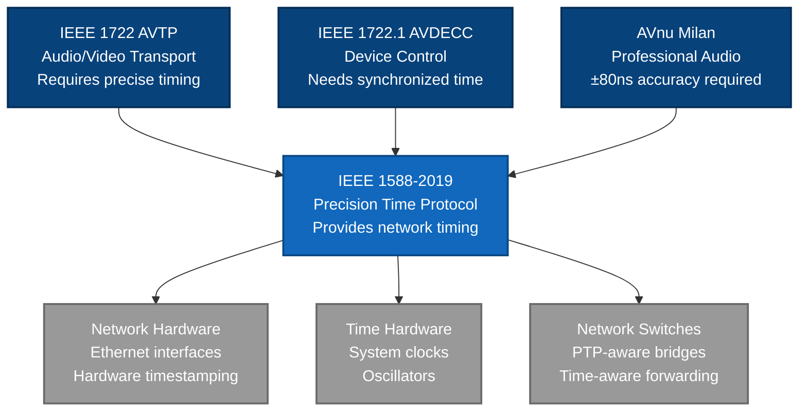
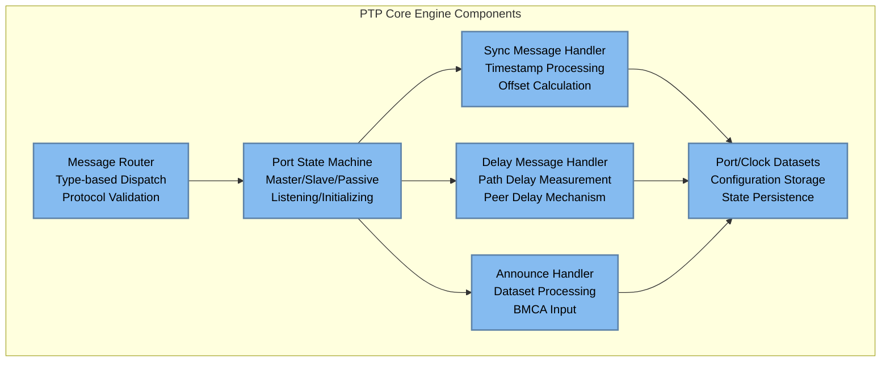
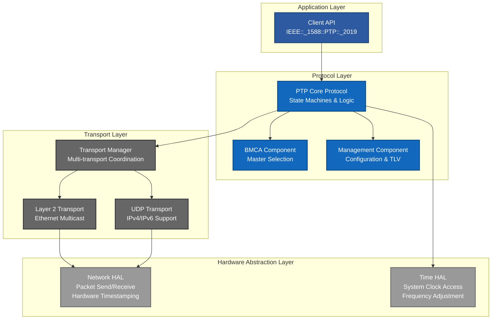
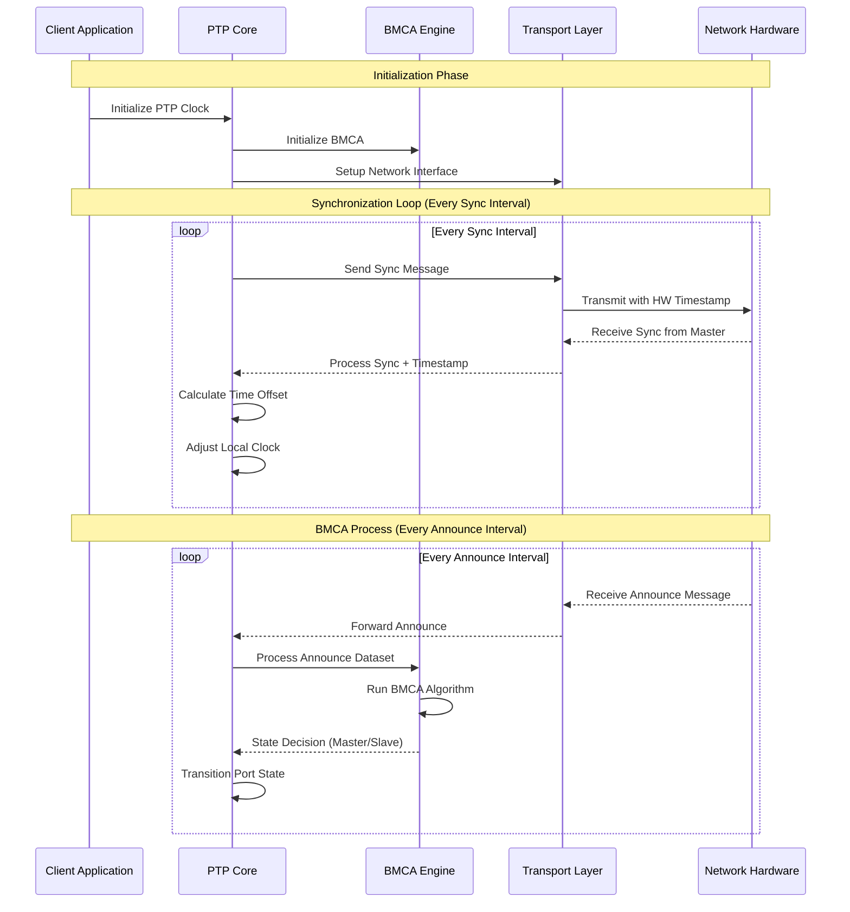

# IEEE 1588-2019 Architecture Design for Missing Components

> **Purpose**: Design architecture for missing IEEE 1588-2019 components to achieve full specification compliance
> **Scope**: Clock state machines, BMCA, message handlers, transport abstraction, management protocol
> **Architecture Standard**: ISO/IEC/IEEE 42010:2011

## 🎯 Architecture Significant Requirements (ASRs)

Based on requirements analysis, the following drive architectural decisions:

### **ASR-1: Hardware Abstraction**
- **Quality Attribute**: Portability, Maintainability
- **Requirement**: IEEE 1588 implementation must work across Intel, ARM, FPGA platforms
- **Architectural Impact**: Dependency injection pattern for hardware interfaces

### **ASR-2: Real-Time Performance**
- **Quality Attribute**: Performance, Timing Accuracy
- **Requirement**: Sub-microsecond synchronization accuracy, deterministic behavior
- **Architectural Impact**: Lock-free algorithms, bounded execution time

### **ASR-3: Protocol Compliance**
- **Quality Attribute**: Standards Compliance, Interoperability  
- **Requirement**: 100% IEEE 1588-2019 specification compliance
- **Architectural Impact**: State machine architecture matching specification exactly

### **ASR-4: Extensibility**
- **Quality Attribute**: Maintainability, Extensibility
- **Requirement**: Support future IEEE 1588 versions and profiles
- **Architectural Impact**: Plugin architecture for profiles and extensions

## 🏗️ C4 Model Architecture

### Level 1: System Context



### Level 2: Container Architecture

```mermaid
graph TB
    subgraph "IEEE 1588-2019 Implementation"
        API[PTP API Layer<br/>C++ Interface<br/>IEEE::_1588::PTP::_2019]
        
        Core[PTP Core Engine<br/>State Machines<br/>Message Processing]
        
        BMCA[Best Master Clock<br/>Algorithm Implementation<br/>Grandmaster Selection]
        
        Transport[Transport Layer<br/>Network Abstraction<br/>Multi-protocol Support]
        
        Management[Management Protocol<br/>Configuration Interface<br/>TLV Processing]
    end
    
    subgraph "Hardware Abstraction"
        NetIface[Network Interface<br/>Send/Receive Packets<br/>Hardware Timestamps]
        
        Timer[Timer Interface<br/>System Time Access<br/>Clock Adjustment]
    end
    
    subgraph "External Systems"
        Client[Client Applications<br/>IEEE 1722/1722.1<br/>Milan/AES67]
        
        Network[Network Infrastructure<br/>Ethernet Switches<br/>PTP-aware Bridges]
    end
    
    Client --> API
    API --> Core
    Core --> BMCA
    Core --> Transport
    Core --> Management
    Transport --> NetIface
    Core --> Timer
    NetIface --> Network
    
    classDef container fill:#1168bd,stroke:#0b4884,stroke-width:2px,color:#fff
    classDef abstraction fill:#666666,stroke:#333333,stroke-width:2px,color:#fff
    classDef external fill:#999999,stroke:#6b6b6b,stroke-width:2px,color:#fff
    
    class API,Core,BMCA,Transport,Management container
    class NetIface,Timer abstraction
    class Client,Network external
```



### Level 3: Component Architecture (PTP Core Engine Detail)



## 🏛️ Architectural Views (ISO 42010)

### Logical View: Component Organization



### Process View: Real-Time Behavior



### Development View: Module Structure

```
IEEE/1588/PTP/2019/
├── include/IEEE/1588/PTP/2019/
│   ├── ieee1588_2019.hpp           # Main API header
│   ├── types.hpp                   # ✅ EXISTS - Core data types
│   ├── messages.hpp                # ✅ EXISTS - Message structures  
│   ├── clock.hpp                   # 🔴 MISSING - Clock management
│   ├── state_machine.hpp           # 🔴 MISSING - Port state machines
│   ├── bmca.hpp                    # 🔴 MISSING - BMCA algorithms
│   ├── transport.hpp               # 🔴 MISSING - Transport abstraction
│   └── management.hpp              # 🔴 MISSING - Management protocol
├── src/
│   ├── clocks.cpp                  # ✅ EXISTS - Basic clock types
│   ├── state_machine.cpp           # 🔴 MISSING - State machine logic
│   ├── bmca.cpp                    # 🔴 MISSING - BMCA implementation
│   ├── message_handlers.cpp        # 🔴 MISSING - Message processing
│   ├── transport/
│   │   ├── ethernet_transport.cpp  # 🔴 MISSING - Layer 2 transport
│   │   ├── udp_transport.cpp       # 🔴 MISSING - UDP transport
│   │   └── transport_manager.cpp   # 🔴 MISSING - Transport coordination
│   └── management/
│       ├── management_tlv.cpp      # 🔴 MISSING - TLV processing
│       └── configuration.cpp       # 🔴 MISSING - Configuration mgmt
└── tests/
    ├── test_state_machines.cpp     # 🔴 MISSING - State machine tests
    ├── test_bmca.cpp               # 🔴 MISSING - BMCA tests
    └── test_transport.cpp          # 🔴 MISSING - Transport tests
```

## 📋 Architecture Decision Records (ADRs)

### ADR-001: Hardware Abstraction Strategy

**Status**: Proposed  
**Context**: Need to support multiple hardware platforms while maintaining IEEE 1588 compliance  
**Decision**: Use dependency injection pattern with abstract interfaces  
**Consequences**:
- ✅ **Pros**: Platform independence, testability, maintainability
- ❌ **Cons**: Slight performance overhead, increased complexity
- **Rationale**: Standards compliance requires hardware abstraction per existing patterns

### ADR-002: State Machine Architecture

**Status**: Proposed  
**Context**: IEEE 1588 defines complex port state machines that must match specification exactly  
**Decision**: Implement hierarchical state machines with explicit state transition tables  
**Consequences**:
- ✅ **Pros**: Specification compliance, traceability, debuggability  
- ❌ **Cons**: More verbose than ad-hoc state handling
- **Rationale**: Protocol correctness is more important than implementation simplicity

### ADR-003: Transport Layer Design

**Status**: Proposed  
**Context**: IEEE 1588 supports multiple transport mechanisms (Ethernet, UDP/IPv4, UDP/IPv6)  
**Decision**: Plugin architecture with transport manager coordinating multiple transports  
**Consequences**:
- ✅ **Pros**: Extensibility, standard compliance, flexibility
- ❌ **Cons**: Added complexity for single-transport deployments
- **Rationale**: IEEE 1588-2019 requires multi-transport support for full compliance

### ADR-004: Real-Time Performance Strategy  

**Status**: Proposed  
**Context**: Media networking requires sub-microsecond timing accuracy  
**Decision**: Lock-free algorithms, bounded execution time, minimal dynamic allocation  
**Consequences**:
- ✅ **Pros**: Deterministic timing, low jitter, real-time suitability
- ❌ **Cons**: More complex implementation, memory pre-allocation required
- **Rationale**: Timing accuracy is fundamental requirement for media networking standards

## 🚦 Architecture Validation

### Quality Attribute Scenarios

#### Performance Scenario
**Scenario**: PTP sync message processing under load  
**Quality Attribute**: Performance  
**Stimulus**: 1000 sync messages per second received  
**Response**: Each message processed within 10µs with <1µs jitter  
**Measure**: Timing accuracy maintained ±1µs

#### Reliability Scenario  
**Scenario**: Network interface failure during operation  
**Quality Attribute**: Reliability  
**Stimulus**: Primary network interface becomes unavailable  
**Response**: Automatic failover to backup interface within 1 sync interval  
**Measure**: Time synchronization maintained without loss

#### Portability Scenario
**Scenario**: Deployment on new hardware platform  
**Quality Attribute**: Portability  
**Stimulus**: Port to ARM-based embedded system  
**Response**: Only hardware abstraction layer needs modification  
**Measure**: >90% of code reuses without changes

## ✅ **Phase 03 Exit Criteria**

### Architecture Completeness
- [ ] All missing components identified with clear interfaces
- [ ] C4 model diagrams complete for all levels
- [ ] Architecture views address all stakeholder concerns
- [ ] ADRs document all significant architectural decisions
- [ ] Quality attribute scenarios validate architecture fitness

### Design Constraints Satisfied
- [ ] Hardware abstraction maintained per existing patterns
- [ ] Real-time performance requirements addressed
- [ ] IEEE 1588-2019 specification compliance ensured
- [ ] Extensibility for future IEEE versions provided
- [ ] Integration with existing IEEE standards framework

### Traceability Established
- [ ] Architecture traces to requirements analysis
- [ ] Each missing component maps to functional requirement
- [ ] Quality attributes address non-functional requirements
- [ ] Design decisions justify requirement satisfaction

## 🔗 **Next Steps**

1. **Use phase-transition_3to4.prompt.md** for detailed design transition
2. **Create detailed interface specifications** for each missing component  
3. **Update ieee-standards-status-tracker.md** with Phase 03 completion
4. **Begin Phase 04 detailed design** for implementation planning

## 📚 **References**

- **Requirements Source**: `02-requirements/functional/ieee-1588-2019-requirements-analysis.md`
- **IEEE 1588-2019 Specification**: Precision Time Protocol standard
- **ISO/IEC/IEEE 42010:2011**: Architecture description standard
- **Existing Implementation**: `IEEE/1588/PTP/2019/` foundation (70% complete)