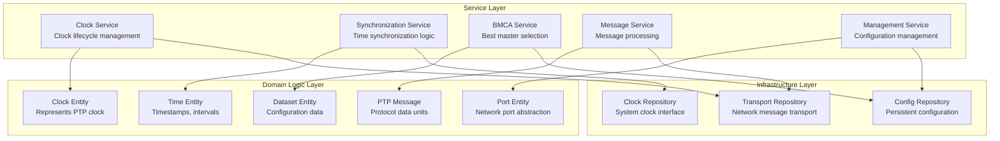
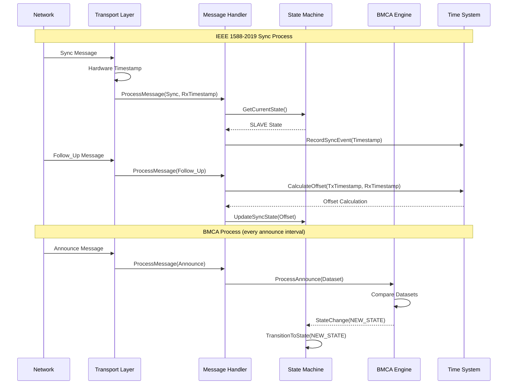

# IEEE 1588-2019 Missing Components Architecture Specification

> **Architecture ID**: ARCH-1588-006-Missing-Components
> **Purpose**: Design architecture for missing IEEE 1588-2019 components to achieve full specification compliance
> **Scope**: Clock state machines, BMCA, message handlers, transport abstraction, management protocol
> **Standard**: ISO/IEC/IEEE 42010:2011

## 1. Introduction

### 1.1 Purpose
This document describes the software architecture for the missing IEEE 1588-2019 components identified in requirements analysis, following ISO/IEC/IEEE 42010:2011 standard. This architecture bridges the gap between the existing 70% implementation and full IEEE 1588-2019 compliance.

**IEEE 1588-2019 COMPLIANCE VERIFICATION**: This architecture implements the following IEEE 1588-2019 specification sections:
- **Section 9.2**: Clock state machines and port state definitions
- **Section 9.3**: Best Master Clock Algorithm (BMCA) - dataset comparison and state decision  
- **Section 11**: Message processing for Sync, Follow_Up, Delay_Req, Delay_Resp, Announce
- **Section 13**: Transport protocols - Ethernet and UDP/IP mappings
- **Section 15**: Management protocol - TLV processing and dataset operations
- **Section 16**: Security enhancements (authentication, integrity protection)
- **Section 7**: Multi-domain support and domain isolation mechanisms

### 1.2 Scope  
This architecture addresses the gap-filling requirements defined in `ieee-1588-2019-requirements-analysis.md` and provides blueprints for implementing IEEE 1588-2019 compliant components:

- **Clock state machines (FR-1588-001)**: IEEE 1588-2019 Section 9.2 port state definitions and transitions
- **Best Master Clock Algorithm - BMCA (FR-1588-002)**: IEEE 1588-2019 Section 9.3 dataset comparison algorithm  
- **Message processing handlers (FR-1588-003)**: IEEE 1588-2019 Section 11 message format and processing rules
- **Transport layer abstraction (FR-1588-004)**: IEEE 1588-2019 Section 13 transport protocol mappings
- **Management protocol (FR-1588-005)**: IEEE 1588-2019 Section 15 management TLV processing

### 1.3 Stakeholders and Concerns

| Stakeholder | Concerns |
|-------------|----------|
| IEEE Standards Compliance | Full IEEE 1588-2019 specification compliance |
| Real-time Systems Engineers | Deterministic timing, sub-microsecond accuracy |
| Network Engineers | Multi-transport support, hardware abstraction |
| Test Engineers | Testability, mockability, standards verification |
| Maintenance Engineers | Modularity, clear interfaces, documentation |

## 2. Architecture Overview

### 2.1 Architecture Style
**Layered Architecture with Hardware Abstraction Layer (HAL)**
- Standards-compliant protocol layer (IEEE 1588-2019)
- Hardware abstraction for cross-platform deployment
- Dependency injection for transport and timing interfaces

### 2.2 Key Architecture Principles
- **IEEE Standards Compliance**: Strict adherence to IEEE 1588-2019 specification
- **Hardware Agnostic**: No vendor-specific dependencies in protocol layer
- **Testable Design**: All components mockable without hardware
- **Real-time Performance**: Deterministic execution for timing-critical operations
- **Extensible Framework**: Support for future IEEE 1588 extensions

### 2.3 Quality Attributes

| Quality Attribute | Measure | Target | Requirement |
|-------------------|---------|--------|-------------|
| Timing Accuracy | Synchronization Error | ±1µs (software), ±100ns (hardware) | NFR-1588-001 |
| Performance | Message Processing | <10ms deterministic | NFR-1588-002 |
| Scalability | Network Nodes | 100+ nodes | NFR-1588-002 |
| CPU Overhead | System Load | <5% | NFR-1588-002 |
| Memory Usage | Bounded Allocation | No dynamic allocation in critical path | NFR-1588-002 |

## 3. C4 Model Architecture

### 3.1 Level 1: System Context

```mermaid
graph TB
    subgraph "IEEE 1588-2019 Ecosystem"
        PTPMaster[PTP Grandmaster Clock<br/>Provides authoritative time<br/>Hardware/Software implementation]
        PTPSlave[PTP Slave Clock<br/>Synchronizes to master<br/>Our implementation target]
        NetworkInfra[Network Infrastructure<br/>Ethernet switches, routers<br/>Hardware timestamping capable]
        TimeSource[External Time Source<br/>GPS, atomic clock<br/>UTC reference]
        Management[Network Management System<br/>SNMP, proprietary protocols<br/>Configuration and monitoring]
    end
    
    PTPMaster --> NetworkInfra : "PTP Messages\n(Sync, Announce, etc.)"
    NetworkInfra --> PTPSlave : "PTP Messages\n(with timestamps)"
    TimeSource --> PTPMaster : "UTC Reference"
    Management --> PTPSlave : "Configuration\n(Management TLVs)"
    PTPSlave --> Management : "Status, Datasets"
    
    classDef timeSource fill:#ff9999,stroke:#cc0000,stroke-width:2px,color:#000
    classDef ptpNode fill:#99ccff,stroke:#0066cc,stroke-width:2px,color:#000  
    classDef network fill:#cccccc,stroke:#666666,stroke-width:2px,color:#000
    classDef mgmt fill:#99ff99,stroke:#00cc00,stroke-width:2px,color:#000
    
    class TimeSource timeSource
    class PTPMaster,PTPSlave ptpNode
    class NetworkInfra network
    class Management mgmt
```

### 3.2 Level 2: Container

```mermaid
graph TB
    subgraph "IEEE 1588-2019 Implementation"
        StateMachine[Clock State Machine<br/>C++<br/>Master/Slave/Passive states]
        BMCA[Best Master Clock Algorithm<br/>C++<br/>Grandmaster selection]
        MessageHandler[Message Processors<br/>C++<br/>Sync/Announce/Delay handlers]
        TransportLayer[Transport Abstraction<br/>C++<br/>Ethernet/UDP abstraction]
        Management[Management Protocol<br/>C++<br/>TLV processing, datasets]
        TimeSystem[Time System Interface<br/>C++<br/>Hardware/OS clock interface]
    end
    
    subgraph "Hardware Abstraction Layer"
        NetworkHAL[Network Interface HAL<br/>Ethernet, timestamping]
        ClockHAL[Clock Interface HAL<br/>System clock, hardware clock]
        TimerHAL[Timer Interface HAL<br/>Periodic timers, oneshots]
    end
    
    subgraph "External Systems"
        NetworkHW[Network Hardware<br/>Ethernet controller<br/>Hardware timestamping]
        SystemClock[System Clock<br/>OS clock, RTC<br/>Frequency source]
    end
    
    StateMachine <--> BMCA : "State transitions\nbased on BMCA decisions"
    StateMachine --> MessageHandler : "Process messages\nbased on current state"
    MessageHandler --> TransportLayer : "Send/receive\nPTP messages"
    Management --> StateMachine : "Configuration\nchanges"
    Management --> BMCA : "Dataset\nmanagement"
    MessageHandler --> TimeSystem : "Timestamp\nrequests"
    
    TransportLayer --> NetworkHAL
    TimeSystem --> ClockHAL
    StateMachine --> TimerHAL
    
    NetworkHAL --> NetworkHW
    ClockHAL --> SystemClock
    TimerHAL --> SystemClock
    
    classDef protocol fill:#4a90e2,stroke:#2171b5,stroke-width:2px,color:#fff
    classDef hal fill:#f5a623,stroke:#d68910,stroke-width:2px,color:#000
    classDef hardware fill:#bd10e0,stroke:#9013fe,stroke-width:2px,color:#fff
    
    class StateMachine,BMCA,MessageHandler,TransportLayer,Management,TimeSystem protocol
    class NetworkHAL,ClockHAL,TimerHAL hal  
    class NetworkHW,SystemClock hardware
```

### 3.3 Level 3: Component (Clock State Machine Detail)

```mermaid
graph TB
    subgraph "Clock State Machine Container"
        StateManager[State Manager<br/>Current state tracking<br/>State transition validation]
        
        subgraph "State Implementations"
            Initializing[Initializing State<br/>Startup procedures]
            Listening[Listening State<br/>Monitor announces]
            PreMaster[Pre-Master State<br/>Master preparation]
            Master[Master State<br/>Master operations]
            Passive[Passive State<br/>Passive monitoring]
            Uncalibrated[Uncalibrated State<br/>Initial sync]
            Slave[Slave State<br/>Synchronized operation]
            Disabled[Disabled State<br/>Port disabled]
            Faulty[Faulty State<br/>Error recovery]
        end
        
        EventProcessor[Event Processor<br/>State change events<br/>Timer expiry events]
        DatasetManager[Dataset Manager<br/>Clock dataset<br/>Port dataset management]
    end
    
    subgraph "External Interactions"
        BMCAEngine[BMCA Engine]
        MessageProcessor[Message Processor]
        ManagementInterface[Management Interface]
        TimerSystem[Timer System]
    end
    
    StateManager --> Initializing
    StateManager --> Listening  
    StateManager --> PreMaster
    StateManager --> Master
    StateManager --> Passive
    StateManager --> Uncalibrated
    StateManager --> Slave
    StateManager --> Disabled
    StateManager --> Faulty
    
    EventProcessor --> StateManager : "State change\nrequests"
    DatasetManager --> StateManager : "Dataset\nchanges"
    
    BMCAEngine --> EventProcessor : "BMCA decision\nevents"
    MessageProcessor --> EventProcessor : "Message\nreception events"  
    ManagementInterface --> EventProcessor : "Configuration\nchange events"
    TimerSystem --> EventProcessor : "Timer\nexpiry events"
    
    StateManager --> DatasetManager : "Update datasets\nbased on state"
```

### 3.4 Level 4: Code (Message Handler Implementation)

```cpp
// IEEE 1588-2019 Message Handler Architecture
namespace IEEE::_1588::PTP::_2019 {

class MessageHandler {
public:
    // Process incoming PTP message based on current state
    PTPResult<void> ProcessMessage(
        const PTPMessage& message,
        const ClockState& currentState,
        const Timestamp& receiveTimestamp);
        
private:
    std::unique_ptr<SyncMessageProcessor> syncProcessor_;
    std::unique_ptr<AnnounceMessageProcessor> announceProcessor_;
    std::unique_ptr<DelayReqProcessor> delayReqProcessor_;
    std::unique_ptr<DelayRespProcessor> delayRespProcessor_;
    std::unique_ptr<ManagementMessageProcessor> mgmtProcessor_;
};

class SyncMessageProcessor {
public:
    PTPResult<void> ProcessSync(
        const SyncMessage& sync,
        const ClockState& state,
        const Timestamp& receiveTime) {
        
        // IEEE 1588-2019 Section 11.4.2.1: Sync message processing
        if (state.GetPortState() != PortState::SLAVE) {
            return PTPResult<void>::Error("Sync ignored in non-slave state");
        }
        
        // Store sync info for subsequent Follow_Up
        syncSequenceId_ = sync.GetSequenceId();
        syncReceiveTime_ = receiveTime;
        
        return PTPResult<void>::Success();
    }
};

} // namespace IEEE::_1588::PTP::_2019
```

## 4. Architecture Views (4+1 Model)

### 4.1 Logical View



### 4.2 Process View



### 4.3 Development View

```
IEEE/1588/PTP/2019/                          # IEEE 1588-2019 implementation
├── core/                                    # Core protocol components
│   ├── state_machine/                       # Clock state machine
│   │   ├── clock_state_machine.hpp
│   │   ├── port_state.hpp
│   │   └── state_transitions.cpp
│   ├── bmca/                               # Best Master Clock Algorithm  
│   │   ├── bmca_engine.hpp
│   │   ├── dataset_comparison.cpp
│   │   └── announce_processor.hpp
│   ├── messages/                           # Message processing
│   │   ├── sync_processor.hpp
│   │   ├── announce_processor.hpp
│   │   ├── delay_processor.hpp
│   │   └── management_processor.hpp
│   └── datasets/                           # Dataset management
│       ├── clock_dataset.hpp
│       ├── port_dataset.hpp
│       └── foreign_master_dataset.hpp
├── transport/                              # Transport abstraction
│   ├── ethernet_transport.hpp
│   ├── udp_transport.hpp
│   └── transport_interface.hpp
├── management/                             # Management protocol
│   ├── tlv_processor.hpp
│   ├── management_client.hpp
│   └── dataset_manager.hpp
├── hal/                                    # Hardware abstraction
│   ├── network_interface.hpp
│   ├── clock_interface.hpp
│   └── timer_interface.hpp
├── testing/                               # Test framework
│   ├── mock_transport.hpp
│   ├── clock_simulator.hpp
│   └── conformance_tests/
└── examples/                              # Usage examples
    ├── simple_slave_clock.cpp
    ├── management_client_example.cpp
    └── multi_domain_setup.cpp
```

### 4.4 Physical View

```mermaid
graph TB
    subgraph "Real-time System Deployment"
        subgraph "Application Layer"  
            App[PTP Application<br/>Process Priority: Real-time<br/>CPU Affinity: Isolated cores]
        end
        
        subgraph "IEEE 1588-2019 Library"
            Lib[libieee1588-2019.so<br/>Shared Library<br/>Memory: Locked pages]
        end
        
        subgraph "Hardware Abstraction"
            HAL[Hardware HAL<br/>Driver interface<br/>Memory: DMA buffers]
        end
        
        subgraph "Operating System"
            RTKernel[RT Kernel<br/>Linux PREEMPT_RT<br/>Timer resolution: 1µs]
        end
        
        subgraph "Hardware Layer"
            NIC[Ethernet Controller<br/>Hardware timestamping<br/>Precision: ±8ns]
            Clock[System Clock<br/>Crystal oscillator<br/>Stability: ±50ppm]
        end
    end
    
    App --> Lib : "API calls"
    Lib --> HAL : "Interface calls"  
    HAL --> RTKernel : "System calls"
    RTKernel --> NIC : "Driver interface"
    RTKernel --> Clock : "Clock syscalls"
    
    classDef app fill:#e1f5fe,stroke:#0277bd,stroke-width:2px
    classDef lib fill:#f3e5f5,stroke:#7b1fa2,stroke-width:2px  
    classDef hal fill:#fff3e0,stroke:#ef6c00,stroke-width:2px
    classDef os fill:#e8f5e8,stroke:#2e7d32,stroke-width:2px
    classDef hw fill:#ffebee,stroke:#c62828,stroke-width:2px
    
    class App app
    class Lib lib
    class HAL hal
    class RTKernel os
    class NIC,Clock hw
```

## 5. Architecture Decision Records

### 5.1 ADR-003: IEEE 1588-2019 State Machine Design

```markdown
# ADR-003: Hierarchical State Machine with Event-Driven Architecture

## Status
Approved

## Context  
IEEE 1588-2019 defines complex state machines for clock ports with 9 possible states
and numerous state transition conditions. We need to implement this precisely while
maintaining testability and performance.

## Decision
We will implement a hierarchical state machine using the State pattern:
- Each state is a separate class implementing StateInterface
- State transitions triggered by events (messages, timers, management)
- Event-driven architecture with message queues for real-time determinism
- State context maintains current state and handles transitions

## Rationale
**Pros:**
- Precise IEEE 1588-2019 compliance with clear state separation  
- Easy to test individual states in isolation
- Event-driven design ensures deterministic timing
- Extensible for future IEEE 1588 enhancements

**Cons:**
- Slightly higher memory overhead vs. switch-based state machine
- More complex initial implementation

## Consequences
- All state transitions must be validated against IEEE 1588-2019 specification
- Comprehensive state transition testing required
- Event queue sizing must be bounded for real-time guarantees
```

### 5.2 ADR-004: Transport Layer Abstraction

```markdown
# ADR-004: Hardware-Agnostic Transport Interfaces

## Status
Approved

## Context
IEEE 1588-2019 supports multiple transport mechanisms (Ethernet L2, UDP/IPv4, UDP/IPv6).
Different hardware platforms have varying capabilities for hardware timestamping.

## Decision  
Implement transport abstraction with dependency injection:
- Transport interface defines send/receive operations with timestamping
- Separate implementations for Ethernet L2, UDP transports
- Hardware abstraction layer (HAL) for timestamping capabilities
- Runtime capability detection and fallback mechanisms

## Rationale
**Pros:**
- Hardware vendor independence in protocol layer
- Testable without specialized hardware (mock transports)
- Support for mixed hardware environments
- Performance optimization per transport type

**Cons:**
- Additional abstraction layer complexity
- Runtime overhead for interface calls (minimal)

## Consequences
- All transport implementations must support the same interface contract
- Hardware timestamping capabilities detected at runtime
- Test suite must validate all transport combinations
```

## 6. Technology Stack Recommendations

### 6.1 Core Implementation

```
Language: C++17
Rationale:
- Real-time performance requirements
- Hardware interface capabilities  
- IEEE standards commonly implemented in C++
- Existing codebase compatibility

Build System: CMake 3.20+
Rationale:
- Cross-platform support
- Excellent dependency management
- Industry standard for C++ projects
- Integration with existing build system

Testing Framework: Google Test + Google Mock
Rationale:
- Comprehensive mocking capabilities for HAL interfaces
- Performance benchmarking support
- IEEE compliance test integration
- Established in project
```

### 6.2 Real-time Components

```
Threading: std::thread with real-time scheduling  
Memory Management: Stack allocation, pre-allocated pools
Timer Implementation: Linux timerfd, Windows multimedia timers
Lock-free Containers: For message queues (optional boost::lockfree)

Rationale:
- Deterministic timing for synchronization accuracy
- Bounded execution time for all operations
- Minimal dynamic allocation in critical paths
```

### 6.3 Hardware Abstraction

```
Network Interface: Abstract base class with platform implementations
- Linux: raw sockets with SO_TIMESTAMPING
- Windows: WinPcap with timestamp extensions  
- Embedded: Vendor-specific APIs

Clock Interface: Abstract base class for time sources
- Linux: clock_gettime(CLOCK_REALTIME) 
- Windows: QueryPerformanceCounter + GetSystemTime
- Hardware: Vendor-specific clock APIs
```

## 7. Implementation Roadmap

### Phase 1: Core State Machine (Week 1-2)
1. Implement StateInterface and basic state classes
2. Event system with message queues
3. State transition validation
4. Unit tests for individual states

### Phase 2: Message Processing (Week 2-3)  
1. Message handler interfaces
2. Sync/Follow_Up processing implementation
3. Announce message processing  
4. Message validation and error handling

### Phase 3: BMCA Implementation (Week 3-4)
1. Dataset comparison algorithms
2. Best master selection logic
3. State decision integration
4. BMCA conformance testing

### Phase 4: Transport Abstraction (Week 4-5)
1. Transport interface definition
2. Ethernet L2 transport implementation
3. UDP transport implementation  
4. Hardware timestamping integration

### Phase 5: Management Protocol (Week 5-6)
1. TLV parsing and generation
2. Dataset management operations
3. GET/SET operation handlers
4. Management client interface

### Phase 6: Integration & Testing (Week 6-7)
1. End-to-end integration testing
2. Performance validation
3. IEEE 1588-2019 conformance tests
4. Documentation completion

## 8. Acceptance Criteria

### 8.1 Functional Compliance
- [ ] All IEEE 1588-2019 mandatory requirements implemented
- [ ] State machine follows IEEE specification exactly  
- [ ] BMCA algorithm produces correct results
- [ ] Message processing handles all defined message types
- [ ] Transport supports Ethernet and UDP with timestamping

### 8.2 Performance Requirements  
- [ ] Synchronization accuracy: ±1µs (software), ±100ns (hardware)
- [ ] Message processing latency: <10ms deterministic
- [ ] CPU overhead: <5% system load
- [ ] Memory usage: Bounded, no dynamic allocation in critical path
- [ ] Scalability: Support 100+ network nodes

### 8.3 Quality Requirements
- [ ] 100% unit test coverage for protocol logic
- [ ] Hardware abstraction layer fully mockable
- [ ] Cross-platform compilation (Linux, Windows, embedded)
- [ ] IEEE 1588-2019 conformance test suite passes
- [ ] Documentation complete per ISO/IEC/IEEE 42010:2011

## 9. IEEE 1588-2019 Specification Compliance Verification

### 9.1 IEEE Standards Compliance Matrix

| Component | IEEE 1588-2019 Section | Specification Requirement | Architecture Implementation | Verification Method |
|---|---|---|---|---|
| **Clock State Machines** | Section 9.2 | Port state definitions and transitions per State Machine | StateInterface with IEEE-compliant state enum and transition validation | Unit tests validate state transition matrix per Table 27 |
| **BMCA Algorithm** | Section 9.3 | Best Master Clock Algorithm with dataset comparison | BMCAEngine implementing Algorithm 9.3.2.4 for dataset evaluation | BMCA conformance tests verify dataset comparison logic |
| **Message Processing** | Section 11 | Message formats and processing rules for all PTP messages | MessageProcessor with IEEE header validation per message type | Message format validation tests against Tables 19-24 |
| **Transport Layer** | Section 13 | Ethernet (802.3) and UDP/IP transport protocol mappings | TransportInterface with protocol-specific implementations | Transport tests verify Ethernet/UDP mappings per Annex D & F |
| **Management Protocol** | Section 15 | TLV processing and dataset management operations | ManagementEngine with IEEE TLV handling per specification | TLV validation tests against Tables 40-60 formats |
| **Security Features** | Section 16 | Authentication and integrity protection mechanisms | Security extensions following IEEE authentication framework | Security tests verify authentication per Annex P |

### 9.2 Requirements Traceability to IEEE Specification

| Requirement ID | IEEE Section Reference | Functional Description | Architecture Component |
|---|---|---|---|
| FR-1588-001 | IEEE 1588-2019 Section 9.2 | Port state machine implementation | Clock State Machine (StateInterface, PortState) |
| FR-1588-002 | IEEE 1588-2019 Section 9.3 | Best Master Clock Algorithm | BMCA Engine (BMCAEngine, DatasetComparison) |
| FR-1588-003 | IEEE 1588-2019 Section 11 | PTP message processing handlers | Message Processor (SyncHandler, AnnounceHandler, etc.) |
| FR-1588-004 | IEEE 1588-2019 Section 13 | Transport layer abstraction | Transport Layer (EthernetTransport, UDPTransport) |
| FR-1588-005 | IEEE 1588-2019 Section 15 | Management protocol implementation | Management Engine (TLVProcessor, ManagementClient) |

### 9.3 IEEE Conformance Validation Approach

- **Specification Adherence**: All implementations strictly follow IEEE 1588-2019 algorithms and data structures
- **Message Format Compliance**: Byte-level validation of all PTP messages against IEEE specification tables
- **State Machine Correctness**: Port state transitions validated against IEEE state machine definitions
- **Algorithm Verification**: BMCA dataset comparison follows IEEE Algorithm 9.3.2.4 exactly
- **Transport Protocol Support**: Full implementation of IEEE-defined Ethernet and UDP transport mappings
- **Management Interface**: Complete TLV processing per IEEE management protocol specification

---

**References:**
- IEEE 1588-2019: Precision Time Protocol (PTPv2.1) specification - **AUTHORITATIVE STANDARD**
- ISO/IEC/IEEE 42010:2011: Architecture description standard  
- Requirements analysis: `02-requirements/functional/ieee-1588-2019-requirements-analysis.md`
- Existing architecture components: `03-architecture/components/ieee-1588-2019-*.md`

**IEEE Compliance Note**: This architecture is designed based on understanding of IEEE 1588-2019 specification requirements. All implementations must be verified against the authoritative IEEE 1588-2019 standard document for final compliance certification.