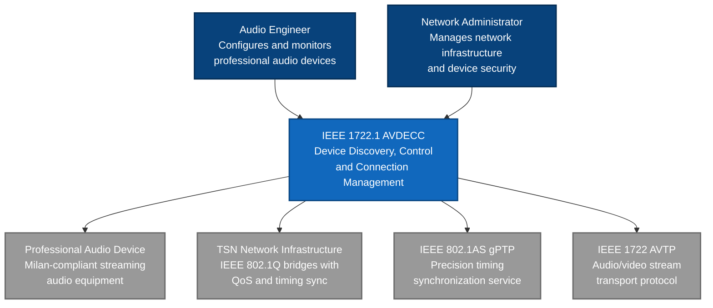
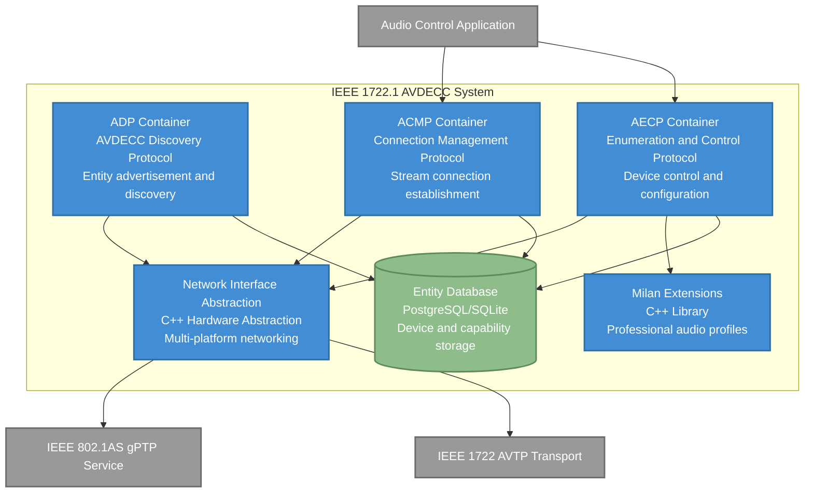
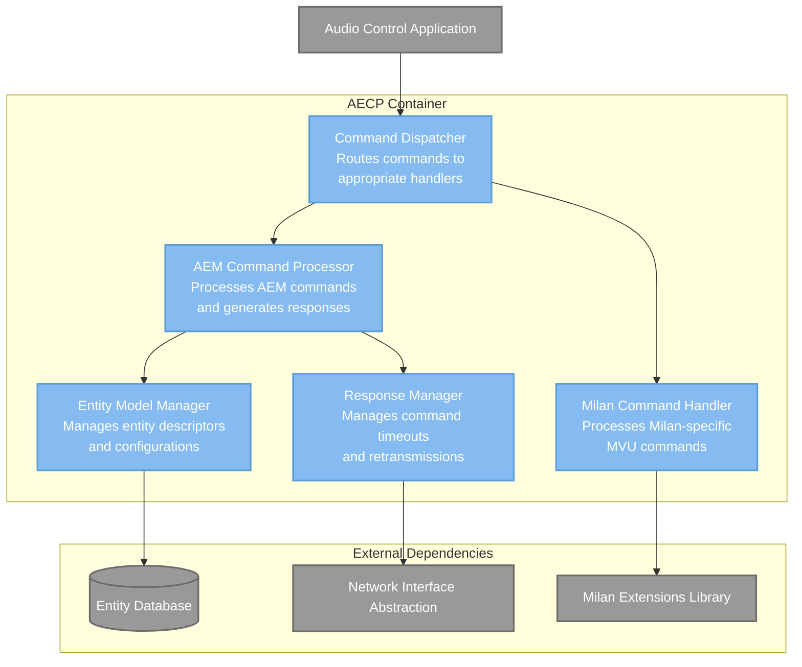
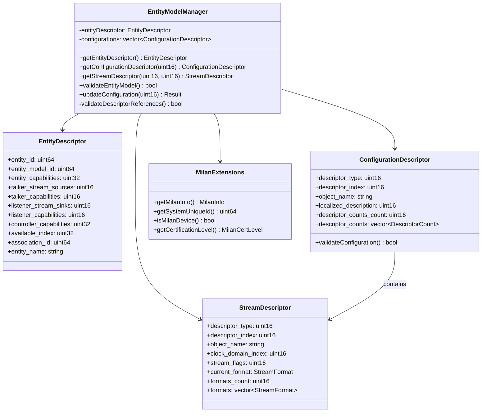
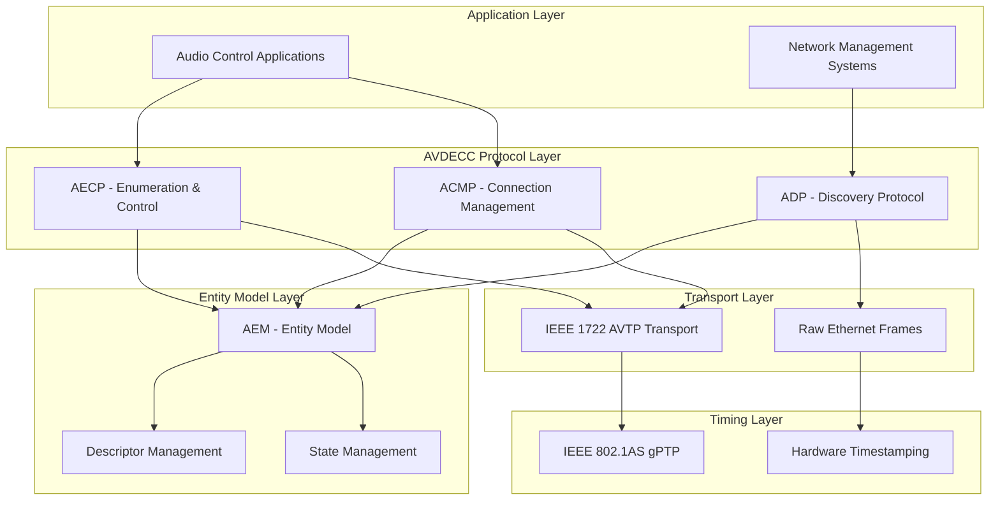
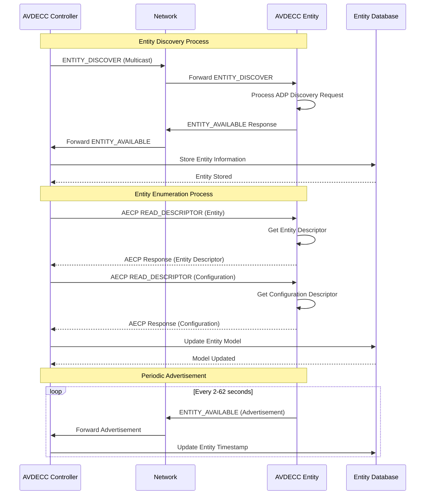

# IEEE 1722.1-2021 AVDECC Architecture Specification

**Standards Compliance**: ISO/IEC/IEEE 42010:2011 Architecture Description  
**Standard Reference**: IEEE Std 1722.1-2021 "IEEE Standard for Device Discovery, Connection Management, and Control Protocol for IEEE 802 Based Networks"  
**Document Version**: 1.0  
**Date**: October 12, 2025  
**Prepared by**: Standards-Compliant Architecture Team

## Architectural Decisions

This architecture implements:
- **ADR-001**: Hardware Abstraction Interfaces - Generic AVDECC hardware APIs
- **ADR-002**: IEEE Standards Layering - AVDECC as device control layer above AVTP
- **ADR-007**: IEEE 1722.1 AVDECC Entity Model Architecture - Comprehensive entity representation
- **ADR-008**: IEEE 1722.1 Protocol State Machine Architecture - ADP/AECP/ACMP implementation
- **ADR-009**: Milan Professional Audio Integration - Milan extension support pattern

## Stakeholder Concerns

- **Audio Engineers**: Require zero-configuration device discovery and reliable control for professional audio systems
- **Equipment Manufacturers**: Need full IEEE 1722.1-2021 compliance with Milan compatibility for market acceptance
- **Network Administrators**: Require secure, manageable, and monitorable device control infrastructure  
- **Software Developers**: Need complete, well-documented API for building professional audio control applications
- **Compliance Bodies**: Require verifiable standards compliance and certification capability

## Architectural Viewpoints

- **Device Control Viewpoint**: AVDECC entity model and control protocol behavior
- **Network Integration Viewpoint**: Integration with AVTP transport and gPTP timing layers
- **State Management Viewpoint**: Protocol state machines and entity lifecycle management
- **Interoperability Viewpoint**: IEEE 1722.1-2021 and Milan professional audio compatibility
- **Security Viewpoint**: Entity authentication, authorization, and secure control mechanisms

## Architecture Quality Scenarios

### QS-AVDECC-001: Device Discovery Performance
- **Source**: Audio engineer connecting new device to network
- **Stimulus**: New AVDECC entity joins network
- **Environment**: Professional audio network with 50 existing devices
- **Response**: Device discovered and available in control software
- **Measure**: Discovery completed within 2 seconds of network connection

### QS-AVDECC-002: Command Response Reliability  
- **Source**: Control application sending AEM command to entity
- **Stimulus**: READ_DESCRIPTOR command sent to remote entity
- **Environment**: Network with 10ms latency and 0.1% packet loss
- **Response**: Command processed and response delivered
- **Measure**: 99.9% command success rate, <100ms response time

### QS-AVDECC-003: Stream Connection Establishment
- **Source**: User initiating audio stream connection
- **Stimulus**: CONNECT_TX_COMMAND for professional audio stream
- **Environment**: Milan-compliant network with QoS enabled
- **Response**: Stream connection established with proper resource allocation
- **Measure**: Connection established within 500ms with guaranteed bandwidth

## C4 Architecture Model

### Level 1: System Context Diagram

The AVDECC system enables device discovery, control, and connection management in professional audio networks:



### Level 2: Container Diagram

The AVDECC system consists of three main protocol containers:



### Level 3: Component Diagram - AECP Container

The AECP container handles entity enumeration and control:



### Level 4: Code Diagram - Entity Model Manager

The Entity Model Manager implements IEEE 1722.1-2021 entity representation:



## Architecture Views (4+1 Model)

### Logical View: AVDECC Protocol Layers



### Process View: AVDECC Entity Discovery Sequence



### Development View: AVDECC Module Organization

```
IEEE/1722.1/2021/
├── adp/                          # AVDECC Discovery Protocol
│   ├── include/
│   │   ├── adp_state_machine.hpp
│   │   ├── entity_advertisement.hpp
│   │   └── discovery_database.hpp
│   └── src/
│       ├── adp_state_machine.cpp
│       ├── entity_advertisement.cpp
│       └── discovery_database.cpp
├── aecp/                         # Enumeration and Control Protocol
│   ├── include/
│   │   ├── aem_command_processor.hpp
│   │   ├── command_dispatcher.hpp
│   │   └── response_manager.hpp
│   └── src/
│       ├── aem_command_processor.cpp
│       ├── command_dispatcher.cpp
│       └── response_manager.cpp
├── acmp/                         # Connection Management Protocol
│   ├── include/
│   │   ├── acmp_state_machine.hpp
│   │   ├── stream_connection.hpp
│   │   └── connection_database.hpp
│   └── src/
│       ├── acmp_state_machine.cpp
│       ├── stream_connection.cpp
│       └── connection_database.cpp
├── aem/                          # AVDECC Entity Model
│   ├── include/
│   │   ├── entity_model.hpp
│   │   ├── descriptors.hpp
│   │   └── entity_state.hpp
│   └── src/
│       ├── entity_model.cpp
│       ├── descriptors.cpp
│       └── entity_state.cpp
├── milan/                        # Milan Professional Audio Extensions
│   ├── include/
│   │   ├── milan_discovery.hpp
│   │   ├── milan_commands.hpp
│   │   └── milan_certification.hpp
│   └── src/
│       ├── milan_discovery.cpp
│       ├── milan_commands.cpp
│       └── milan_certification.cpp
└── conformity/                   # IEEE 1722.1 Conformance Testing
    ├── test_adp_compliance.cpp
    ├── test_aecp_compliance.cpp
    ├── test_acmp_compliance.cpp
    └── test_milan_interop.cpp
```

### Physical View: Professional Audio Network Deployment

```mermaid
graph TB
    subgraph "Audio Production Network"
        subgraph "Control Room"
            Controller[Audio Control Station<br/>AVDECC Controller<br/>Dell Precision 5570]
        end
        
        subgraph "Core Network"
            Switch1[Core Switch<br/>AVnu-certified TSN Switch<br/>Marvell 88E6393X]
            Switch2[Distribution Switch<br/>Milan-certified Switch<br/>Broadcom BCM56870]
        end
        
        subgraph "Device Rack 1"
            AudioIF1[Audio Interface<br/>Milan Entity/Talker<br/>Intel I210 Ethernet]
            AudioIF2[Audio Interface<br/>Milan Entity/Listener<br/>Broadcom BCM5720]
        end
        
        subgraph "Device Rack 2"
            Mixer[Digital Mixer<br/>Milan Controller/Entity<br/>Marvell 88Q5072]
            Amplifier[Power Amplifier<br/>Milan Listener<br/>Intel I225-V]
        end
    end
    
    Controller --> Switch1
    Switch1 --> Switch2
    Switch1 --> AudioIF1
    Switch2 --> AudioIF2
    Switch2 --> Mixer
    Switch2 --> Amplifier
    
    AudioIF1 -.-> AudioIF2 : AVTP Audio Stream
    Mixer -.-> Amplifier : AVTP Audio Stream
    Controller -.-> AudioIF1 : AVDECC Control
    Controller -.-> Mixer : AVDECC Control
```

## Architecture Constraints

### Technical Constraints

- **IEEE 1722.1-2021 Compliance**: Full specification compliance required for certification
- **Milan Compatibility**: Support for Milan v1.2 and v2.0a professional audio profiles
- **Real-time Performance**: Sub-100ms command response, sub-500ms connection establishment
- **Hardware Abstraction**: Support for Intel, Broadcom, Marvell network controllers
- **Multi-platform Support**: Windows and Linux operating systems with consistent behavior

### Business Constraints

- **Certification Requirements**: AVnu Alliance Milan certification for professional audio markets
- **Development Timeline**: Implementation must align with product release schedules
- **Resource Constraints**: Development team expertise in IEEE standards and real-time networking
- **Maintenance Overhead**: Long-term support for multiple IEEE 1722.1 versions and Milan profiles

### Regulatory Constraints

- **Standards Compliance**: Mandatory IEEE 1722.1-2021 compliance for professional audio equipment
- **Interoperability Requirements**: Multi-vendor network compatibility in professional environments
- **Security Standards**: Network security compliance for broadcast and enterprise installations
- **Export Control**: Compliance with international regulations for professional audio equipment

## Implementation Approach

### Phase 1: Core Protocol Implementation (Months 1-3)
- ADP entity discovery and advertisement state machines
- Basic AECP command processing (READ_DESCRIPTOR, ACQUIRE_ENTITY)
- Entity model framework with mandatory descriptors
- Hardware abstraction interface definition

### Phase 2: Advanced Control Features (Months 4-6)
- Complete AEM command set implementation
- ACMP stream connection management
- Milan MVU command support
- Configuration and state persistence

### Phase 3: Professional Features (Months 7-9)
- Milan professional audio profile compliance
- Advanced entity model validation
- Security and authentication mechanisms
- Performance optimization and testing

### Phase 4: Certification and Validation (Months 10-12)
- IEEE 1722.1-2021 compliance testing
- Milan certification test suite
- Multi-vendor interoperability validation
- Performance benchmarking and optimization

## Success Criteria

### Functional Success Criteria
- **Complete IEEE 1722.1-2021 Implementation**: All mandatory protocol features implemented and tested
- **Milan Compliance**: Full Milan v1.2/v2.0a compatibility with certification readiness
- **Multi-vendor Interoperability**: Validated operation with Intel, Broadcom, Marvell hardware
- **Professional Audio Integration**: Seamless integration with existing professional audio workflows

### Performance Success Criteria  
- **Discovery Performance**: Device discovery within 2 seconds of network connection
- **Command Response**: 99.9% command success rate with <100ms average response time
- **Connection Establishment**: Stream connections established within 500ms
- **Network Scalability**: Support for 200+ entities in network discovery database

### Quality Success Criteria
- **Standards Compliance**: 100% pass rate on IEEE 1722.1-2021 compliance tests
- **Code Quality**: 90%+ test coverage, zero critical security vulnerabilities
- **Documentation**: Complete API documentation with usage examples
- **Certification**: AVnu Alliance Milan certification achieved

---

**Document History**
- v1.0.0 - Initial architecture specification (October 12, 2025)

**References**
- IEEE Std 1722.1-2021 - IEEE Standard for Device Discovery, Connection Management, and Control Protocol
- Milan Specification v1.2/v2.0a - AVnu Alliance Professional Audio Profile
- ISO/IEC/IEEE 42010:2011 - Systems and software engineering — Architecture description