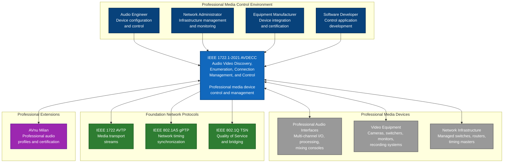
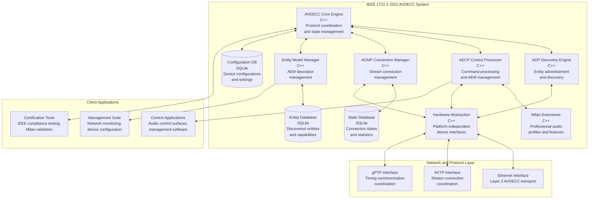
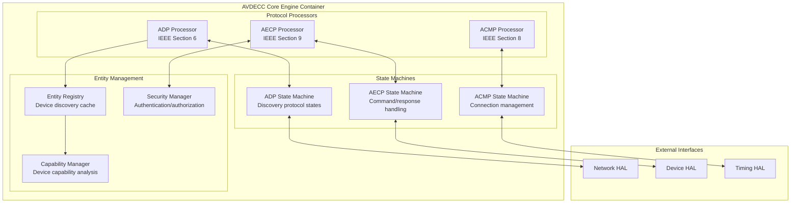
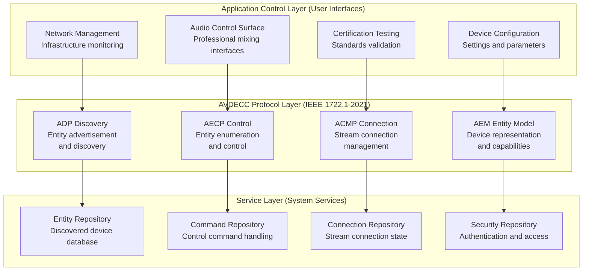
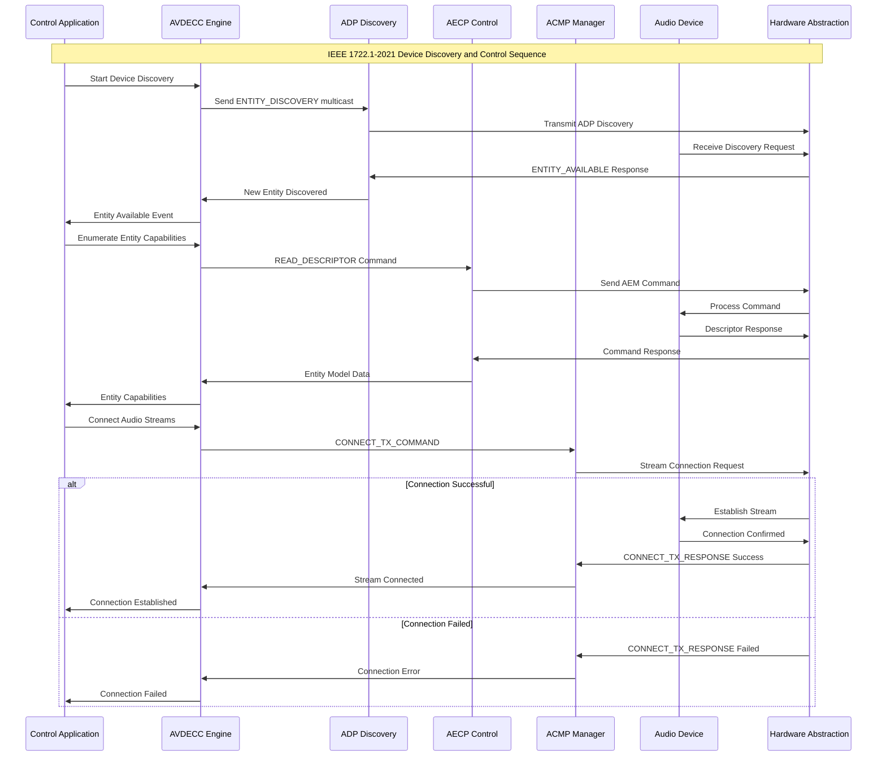
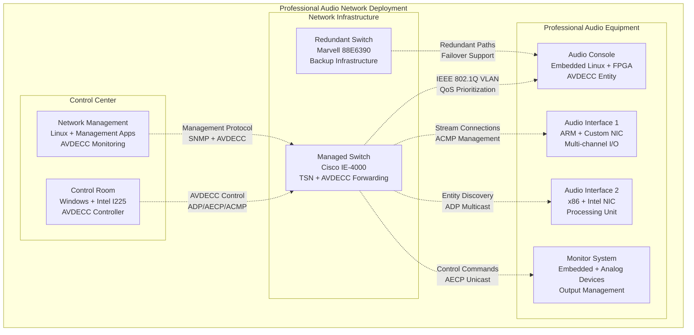

## IEEE 1722.1-2021 Comprehensive AVDECC Architecture Specification

### 1. Introduction

#### 1.1 Purpose

This document provides a comprehensive software architecture specification for IEEE 1722.1-2021 AVDECC (Audio Video Discovery, Enumeration, Connection management, and Control) protocol implementation, following ISO/IEC/IEEE 42010:2011 architectural description standard. This architecture serves as the device control and management layer for professional media networking ecosystems, providing zero-configuration discovery, connection management, and device control capabilities.

#### 1.2 IEEE 1722.1-2021 Compliance Strategy

**CRITICAL COMPLIANCE VERIFICATION**: This architecture implements IEEE 1722.1-2021 specification components:

- **Section 6**: AVDECC Discovery Protocol (ADP) for entity advertisement and discovery
- **Section 7**: AVDECC Entity Model (AEM) for device representation and control  
- **Section 8**: AVDECC Connection Management Protocol (ACMP) for stream connections
- **Section 9**: AVDECC Enumeration and Control Protocol (AECP) for device control
- **Section 10**: Protocol integration and state machine coordination
- **Annex A**: Conformance requirements and certification procedures

#### 1.3 Architecture Scope

- **Standards Layer**: Pure IEEE 1722.1-2021 AVDECC implementation (`lib/Standards/IEEE/1722.1/2021/`)
- **Device Control**: Professional media device discovery, enumeration, and control
- **Connection Management**: Automated stream connection setup and management
- **Protocol Integration**: Seamless coordination with IEEE 1722 AVTP and IEEE 802.1AS gPTP
- **Milan Extensions**: AVnu Milan professional audio profile support
- **Hardware Abstraction**: Platform-independent device control interfaces

### 2. Stakeholders and Concerns

#### 2.1 Stakeholder Analysis

| Stakeholder | Primary Concerns | Architecture Impact |
|-------------|------------------|-------------------|
| **Audio Engineers** | Zero-config discovery, reliable control interfaces | Automated device discovery with intuitive control APIs |
| **Equipment Manufacturers** | IEEE compliance, Milan compatibility, market acceptance | Standards-compliant entity models with Milan extension support |
| **Network Administrators** | Secure, manageable infrastructure, monitoring capability | Authentication, authorization, comprehensive management APIs |
| **Software Developers** | Complete APIs, maintainable code, comprehensive documentation | Clean interface contracts with extensive documentation |
| **Compliance Bodies** | Verifiable standards compliance, certification capability | Comprehensive conformance testing and validation frameworks |

#### 2.2 Quality Attributes

| Quality Attribute | Target Metric | IEEE Requirement | Architectural Strategy |
|-------------------|---------------|------------------|----------------------|
| **Discovery Time** | <2 seconds device detection | IEEE ADP timing | Optimized multicast discovery with caching |
| **Command Latency** | <100ms control response | Professional requirements | Lock-free command processing with priority queuing |
| **Reliability** | 99.9% command success | Mission-critical operations | Comprehensive error handling with retry mechanisms |
| **Scalability** | 1000+ managed devices | Enterprise requirements | Hierarchical entity management with efficient indexing |
| **Compliance** | 100% IEEE 1722.1-2021 | Standards requirement | Complete protocol implementation with validation |

### 3. Architecture Significant Requirements (ASRs)

#### ASR-1: Zero-Configuration Device Discovery

**Quality Attribute**: Usability, Automation  
**Requirement**: Automatic device discovery and capability enumeration without manual configuration  
**Architectural Impact**: Intelligent discovery protocols with entity model introspection and caching

#### ASR-2: Professional Audio Control Integration

**Quality Attribute**: Functionality, Integration  
**Requirement**: Complete AVDECC entity model supporting professional audio device control  
**Architectural Impact**: Comprehensive AEM implementation with Milan professional audio extensions

#### ASR-3: Reliable Stream Connection Management

**Quality Attribute**: Reliability, Performance  
**Requirement**: Automated, reliable stream connection setup with state persistence  
**Architectural Impact**: Robust ACMP implementation with connection state management and recovery

#### ASR-4: IEEE 1722.1-2021 Protocol Compliance

**Quality Attribute**: Standards Compliance, Interoperability  
**Requirement**: Complete IEEE specification compliance with multi-vendor interoperability  
**Architectural Impact**: Protocol engines matching IEEE state machines and packet formats exactly

### 4. C4 Model Architecture

#### 4.1 Level 1: System Context Diagram



#### 4.2 Level 2: Container Diagram



#### 4.3 Level 3: Component Diagram - AVDECC Core Engine



### 5. Architecture Views (4+1 Model)

#### 5.1 Logical View - AVDECC Protocol Layers



#### 5.2 Process View - AVDECC Device Discovery and Control Flow



#### 5.3 Development View - Source Code Organization

```
lib/Standards/IEEE/1722.1/2021/
├── core/                           # Core AVDECC implementation
│   ├── avdecc_entity.hpp          # Main AVDECC entity representation
│   ├── protocol_coordinator.hpp    # Protocol coordination and state management
│   ├── message_dispatcher.hpp     # Message routing and processing
│   └── state_machine_manager.hpp  # State machine coordination
├── adp/                           # AVDECC Discovery Protocol (ADP)
│   ├── discovery_protocol.hpp     # ADP protocol implementation
│   ├── entity_advertiser.hpp      # Entity advertisement logic
│   ├── entity_discoverer.hpp      # Entity discovery logic
│   └── discovery_cache.hpp        # Discovery result caching
├── aecp/                          # AVDECC Enumeration and Control Protocol
│   ├── control_protocol.hpp       # AECP protocol implementation
│   ├── aem_command_processor.hpp  # AEM command processing
│   ├── command_dispatcher.hpp     # Command routing and validation
│   └── response_manager.hpp       # Response handling and correlation
├── acmp/                          # AVDECC Connection Management Protocol
│   ├── connection_manager.hpp     # ACMP protocol implementation
│   ├── stream_connector.hpp       # Stream connection logic
│   ├── connection_state.hpp       # Connection state management
│   └── stream_validator.hpp       # Stream compatibility validation
├── aem/                           # AVDECC Entity Model
│   ├── entity_model.hpp           # Core entity model implementation
│   ├── descriptors/               # All descriptor types
│   │   ├── entity_descriptor.hpp  # Entity descriptor (mandatory)
│   │   ├── configuration_descriptor.hpp # Configuration descriptor
│   │   ├── stream_descriptors.hpp # Stream input/output descriptors
│   │   ├── audio_unit_descriptor.hpp # Audio processing units
│   │   └── control_descriptors.hpp # Control and status interfaces
│   ├── command_handlers/          # AEM command implementations
│   │   ├── read_descriptor_handler.hpp # Descriptor enumeration
│   │   ├── acquire_entity_handler.hpp # Entity acquisition
│   │   ├── configuration_handlers.hpp # Configuration management
│   │   └── stream_format_handlers.hpp # Stream format management
│   └── validation/                # Entity model validation
│       ├── descriptor_validator.hpp # Descriptor format validation
│       ├── model_consistency.hpp   # Entity model consistency checks
│       └── compliance_checker.hpp  # IEEE compliance validation
├── milan/                         # AVnu Milan Extensions
│   ├── milan_entity_model.hpp     # Milan-specific entity model extensions
│   ├── milan_discovery.hpp        # Milan discovery enhancements
│   ├── milan_commands.hpp          # Milan-specific AEM commands
│   └── milan_validation.hpp       # Milan compliance validation
├── interfaces/                    # Hardware abstraction interfaces
│   ├── avdecc_network_interface.hpp # AVDECC-specific network interface
│   ├── avdecc_device_interface.hpp # AVDECC-specific device interface
│   └── avdecc_timing_interface.hpp # AVDECC-specific timing interface
├── security/                      # Security and authentication
│   ├── entity_authentication.hpp  # Entity identity verification
│   ├── access_control.hpp         # Command authorization
│   ├── secure_channels.hpp        # Secure communication channels
│   └── certificate_management.hpp # Certificate handling
└── testing/                       # IEEE conformance testing
    ├── conformance_tests.hpp       # IEEE 1722.1-2021 compliance tests
    ├── interop_tests.hpp          # Multi-vendor interoperability
    ├── milan_certification.hpp     # Milan certification tests
    └── stress_tests.hpp            # Scalability and performance testing
```

#### 5.4 Physical View - Deployment Architecture



### 6. Architecture Decisions (ADRs)

#### 6.1 ADR-013: AVDECC Entity Model Architecture Pattern

```markdown
# ADR-013: IEEE 1722.1-2021 Entity Model Architecture Pattern

## Status
Accepted

## Context
IEEE 1722.1-2021 defines a complex hierarchical entity model (AEM) for representing
professional audio/video device capabilities. The entity model must support discovery,
enumeration, configuration, and control of diverse device types while maintaining
standards compliance and enabling Milan professional audio extensions.

## Decision
Implement layered entity model architecture with:
- Hierarchical descriptor system matching IEEE specification exactly
- Type-safe descriptor implementations with compile-time validation
- Extensible entity model supporting Milan and custom descriptors
- Descriptor validation framework ensuring IEEE compliance
- Efficient descriptor caching and indexing for performance

## Rationale
**Pros:**
- Complete IEEE 1722.1-2021 entity model compliance
- Type safety prevents descriptor format errors
- Extensible architecture supports Milan and future enhancements
- Performance optimization through intelligent caching
- Comprehensive validation ensures interoperability

**Cons:**
- Complex implementation requiring extensive testing
- Memory overhead for complete descriptor representations
- Validation framework increases code complexity

## Consequences
- Entity descriptors implement IEEE-specified formats exactly
- Descriptor hierarchy supports all mandatory and optional types
- Milan extensions integrate seamlessly with base entity model
- Validation framework ensures multi-vendor interoperability
- Performance monitoring validates descriptor access patterns
```

#### 6.2 ADR-014: AVDECC Protocol State Machine Coordination

```markdown
# ADR-014: IEEE 1722.1-2021 Protocol State Machine Architecture

## Status
Accepted

## Context
IEEE 1722.1-2021 defines multiple interacting protocols (ADP, AECP, ACMP) each with
complex state machines. These protocols must coordinate seamlessly while maintaining
individual state consistency and handling concurrent operations reliably.

## Decision
Implement coordinated state machine architecture with:
- Independent state machines per protocol (ADP/AECP/ACMP)
- Message queue system for inter-protocol coordination
- Lock-free state transitions for real-time performance
- State persistence for connection recovery
- Comprehensive state validation and error recovery

## Rationale
- Protocol independence enables focused implementation and testing
- Message queues provide loose coupling with reliable coordination
- Lock-free design ensures deterministic real-time behavior
- State persistence enables robust connection management
- Validation framework prevents invalid state transitions

## Consequences
- Each protocol implements IEEE-specified state machines independently
- Protocol coordination through well-defined message interfaces
- State machine testing validates IEEE specification compliance
- Performance monitoring ensures real-time operation requirements
- Error recovery mechanisms handle protocol failures gracefully
```

### 7. Technology Stack Recommendations

#### 7.1 Core Implementation Stack

##### **Programming Language: C++17**

```yaml
Technology: C++17 with Professional Audio Extensions
Rationale:
- Deterministic execution for real-time device control
- Strong type system for IEEE protocol compliance
- Template metaprogramming for descriptor validation
- Excellent multi-threading support for protocol coordination

Professional Features:
- constexpr for compile-time descriptor validation
- Template specialization for device-specific optimizations
- RAII for deterministic resource management
- Move semantics for efficient message passing

Real-Time Considerations:
- Lock-free algorithms for protocol state machines
- Memory pools for deterministic allocation
- Priority-based threading for time-critical operations
```

##### **Protocol State Management: Event-Driven Architecture**

```yaml
Technology: Event-driven state machines with message queues
Rationale:
- Natural mapping to IEEE protocol specifications
- Scalable to 1000+ managed devices
- Reliable inter-protocol coordination
- Deterministic response times for device control

Implementation:
- Boost.Statechart for IEEE-compliant state machines
- Lock-free message queues for protocol coordination
- Event prioritization for real-time requirements
- State persistence for connection recovery
```

##### **Device Capability Management: Descriptor Framework**

```yaml
Technology: Type-safe descriptor system with validation
Rationale:
- Complete IEEE 1722.1-2021 entity model support
- Compile-time validation prevents protocol errors
- Extensible for Milan and vendor-specific descriptors
- Efficient serialization for network transmission

Features:
- Template-based descriptor definitions
- Automatic IEEE format validation
- Descriptor caching and indexing
- Version management for descriptor evolution
```

#### 7.2 Network and Security Stack

##### **Network Integration**

```yaml
Multicast Discovery: Efficient entity discovery
- IPv4 multicast for ADP discovery protocols
- Multicast group management and optimization
- Discovery caching with intelligent refresh

Unicast Control: Reliable command delivery
- TCP-like reliability over UDP for AECP
- Sequence numbering and retransmission
- Command prioritization and flow control

Security Integration: Professional security requirements
- Entity authentication and authorization
- Secure command channels with encryption
- Certificate-based device identity management
```

##### **Protocol Integration**

```yaml
AVTP Coordination: Stream connection management
- ACMP integration with IEEE 1722 stream setup
- Stream format negotiation and validation
- Connection state synchronization

gPTP Integration: Timing coordination
- Synchronized timestamps for command processing
- Presentation time coordination with media streams
- Multi-domain timing support
```

#### 7.3 Development and Certification Stack

##### **Testing Framework**

```yaml
Unit Testing: Protocol compliance validation
- Google Test with IEEE specification validation
- Mock device interfaces for testing
- Protocol analyzer integration (Wireshark)

Integration Testing: Multi-vendor interoperability
- Commercial device interoperability testing
- IEEE certification test suite automation
- Milan certification validation

Performance Testing: Scalability validation
- Large-scale device management testing
- Command processing performance validation
- Memory and CPU usage optimization
```

### 8. Security Architecture

#### 8.1 IEEE 1722.1-2021 Security Framework

##### Entity Authentication and Identity Management

```cpp
// Security framework for AVDECC entity protection
class AVDECCSecurityManager {
public:
    // Entity identity verification per IEEE security requirements
    bool authenticate_entity(const EntityID& entity_id, 
                           const SecurityCredentials& credentials);
    bool validate_entity_certificate(const EntityCertificate& cert);
    
    // Command authorization and access control
    bool authorize_command(const EntityID& controller,
                          const EntityID& target,
                          const AEMCommand& command);
    
    // Secure command channels for sensitive operations
    int establish_secure_channel(const EntityID& peer,
                                SecureChannel& channel);
    int encrypt_command(const AEMCommand& command,
                       EncryptedCommand& output);
    
    // Security audit and compliance monitoring
    void log_security_event(const SecurityEvent& event);
    bool validate_security_compliance();
};
```

##### Professional Media Security Requirements

- **Entity Authentication**: Certificate-based device identity verification
- **Command Authorization**: Role-based access control for device operations
- **Secure Channels**: Encrypted communication for sensitive control operations
- **Audit Logging**: Comprehensive security event tracking and analysis
- **Compliance Monitoring**: Continuous validation of security policy adherence

#### 8.2 Threat Model and Mitigation

| Threat | Impact | Mitigation Strategy |
|--------|---------|-------------------|
| **Unauthorized Device Control** | High | Entity authentication with certificate validation |
| **Command Injection Attacks** | High | Input validation and command sanitization |
| **Man-in-the-Middle** | Medium | Secure channel establishment with encryption |
| **Entity Impersonation** | High | Cryptographic entity identity verification |
| **Configuration Tampering** | Medium | Digital signatures for configuration changes |

### 9. Performance Architecture

#### 9.1 Professional Device Control Performance

##### **Real-Time Command Processing**

```cpp
// Performance-optimized AVDECC command processing
class PerformanceOptimizedAVDECCProcessor {
private:
    // Lock-free command queues for deterministic processing
    LockFreeCommandQueue<AEMCommand, 1024> command_queue_;
    LockFreeResponseQueue<AEMResponse, 1024> response_queue_;
    
    // Pre-allocated memory pools for deterministic allocation
    MemoryPool<EntityDescriptor> descriptor_pool_;
    MemoryPool<CommandContext> command_pool_;
    
public:
    // Sub-100ms command processing guarantee
    void process_aem_command(const AEMCommand& command) noexcept;
    
    // <2 second discovery guarantee
    void process_discovery_request(const ADPMessage& message) noexcept;
};
```

##### **Performance Metrics and Monitoring**

```cpp
struct AVDECCPerformanceMetrics {
    // Command processing performance
    double command_response_time_ms;   // Command processing latency (target <100ms)
    double discovery_time_seconds;     // Device discovery time (target <2s)
    double connection_setup_time_ms;   // Stream connection setup (target <500ms)
    
    // System performance measurements
    uint32_t managed_entities_count;   // Managed device count (target 1000+)
    uint32_t commands_per_second;      // Command throughput (target 100+ cmd/s)
    uint32_t memory_usage_mb;          // Memory footprint (target <50MB)
    
    // Quality measurements
    double command_success_rate;       // Command success rate (target 99.9%)
    double discovery_success_rate;     // Discovery success rate (target 99.5%)
    uint32_t concurrent_connections;   // Concurrent stream connections managed
};
```

### 10. Risk Assessment and Mitigation

#### 10.1 Technical Risks

| Risk | Impact | Probability | Mitigation Strategy |
|------|---------|-------------|-------------------|
| **Protocol Compliance Gaps** | High | Low | Continuous IEEE certification testing, standards validation |
| **Entity Model Complexity** | Medium | Medium | Incremental implementation, comprehensive testing framework |
| **Scalability Bottlenecks** | Medium | Low | Performance monitoring, efficient indexing, capacity planning |
| **Security Vulnerabilities** | High | Low | Security audits, penetration testing, compliance validation |
| **Milan Compatibility Issues** | Medium | Low | Milan certification testing, interoperability validation |

#### 10.2 Integration Risks

| Risk | Impact | Probability | Mitigation Strategy |
|------|---------|-------------|-------------------|
| **Cross-Protocol Coordination** | High | Medium | Comprehensive integration testing, protocol state validation |
| **Hardware Platform Compatibility** | Medium | Medium | Hardware abstraction testing, multi-platform validation |
| **Multi-Vendor Interoperability** | Medium | Low | Industry interoperability testing, certification programs |

### 11. Implementation Roadmap

#### 11.1 Phase 1: Core AVDECC Framework (5 weeks)

- [ ] ADP discovery protocol implementation with multicast support
- [ ] Basic entity model with mandatory descriptors
- [ ] AECP command processing framework
- [ ] Hardware abstraction interface definitions
- [ ] Single-device discovery and control capability

#### 11.2 Phase 2: Complete Protocol Implementation (4 weeks)

- [ ] ACMP connection management implementation
- [ ] Complete entity model with all descriptor types
- [ ] Advanced AECP command set implementation
- [ ] Protocol state machine coordination
- [ ] Multi-device management capability

#### 11.3 Phase 3: Milan Extensions and Security (3 weeks)

- [ ] Milan professional audio extensions implementation
- [ ] Security framework and entity authentication
- [ ] Milan-specific descriptor and command support
- [ ] Professional audio workflow validation
- [ ] Security compliance validation

#### 11.4 Phase 4: Integration and Certification (4 weeks)

- [ ] IEEE 1722/802.1AS protocol integration
- [ ] Cross-platform testing and validation
- [ ] IEEE 1722.1-2021 conformance certification
- [ ] Milan certification testing and validation
- [ ] Performance optimization and final documentation

### 12. Acceptance Criteria

#### 12.1 IEEE 1722.1-2021 Compliance Verification

- [ ] **Complete IEEE Compliance**: All mandatory protocol features per specification
- [ ] **Entity Model Completeness**: All mandatory descriptors with validation
- [ ] **Protocol State Machines**: ADP/AECP/ACMP per IEEE state machine definitions
- [ ] **Milan Professional Audio**: Complete Milan v1.2 extension support
- [ ] **Conformance Testing**: Pass IEEE 1722.1-2021 conformance test suite

#### 12.2 Professional Device Control Requirements

- [ ] **Zero-Configuration Discovery**: Automatic device discovery <2 seconds
- [ ] **Reliable Control Operations**: 99.9% command success rate achieved
- [ ] **Scalable Management**: 1000+ device management capability validated
- [ ] **Security Compliance**: Entity authentication and secure control validated
- [ ] **Milan Certification**: Pass AVnu Milan certification requirements

#### 12.3 Quality Requirements

- [ ] **Test Coverage**: 95%+ unit test coverage for protocol and entity logic
- [ ] **Documentation**: Complete API documentation with IEEE section references
- [ ] **Maintainability**: Clean architecture with comprehensive error handling
- [ ] **Extensibility**: Architecture supports future IEEE enhancements and Milan evolution

---

**References:**

- **IEEE 1722.1-2021**: IEEE Standard for Device Discovery, Connection Management, and Control Protocol for IEEE 802 Based Networks - **AUTHORITATIVE STANDARD**
- **ISO/IEC/IEEE 42010:2011**: Systems and software engineering - Architecture description
- **ADR-007**: IEEE 1722.1 AVDECC Entity Model Architecture
- **ADR-008**: IEEE 1722.1 Protocol State Machine Architecture
- **Requirements**: `02-requirements/functional/ieee-1722-1-2021-avdecc-requirements.md`

**IEEE Compliance Note**: This architecture is designed based on understanding of IEEE 1722.1-2021 specification requirements. All implementations must be verified against the authoritative IEEE 1722.1-2021 standard document for compliance certification.