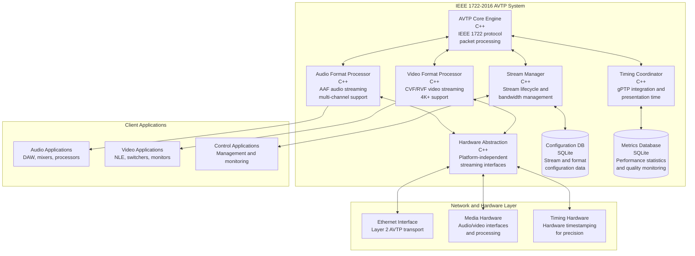
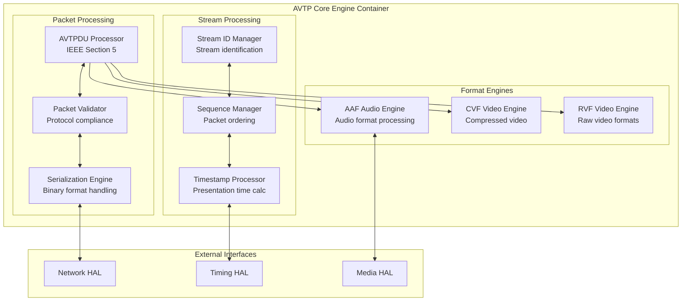
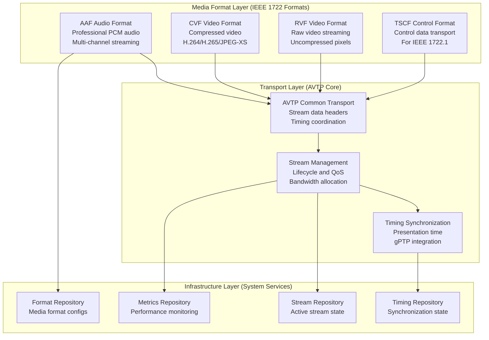
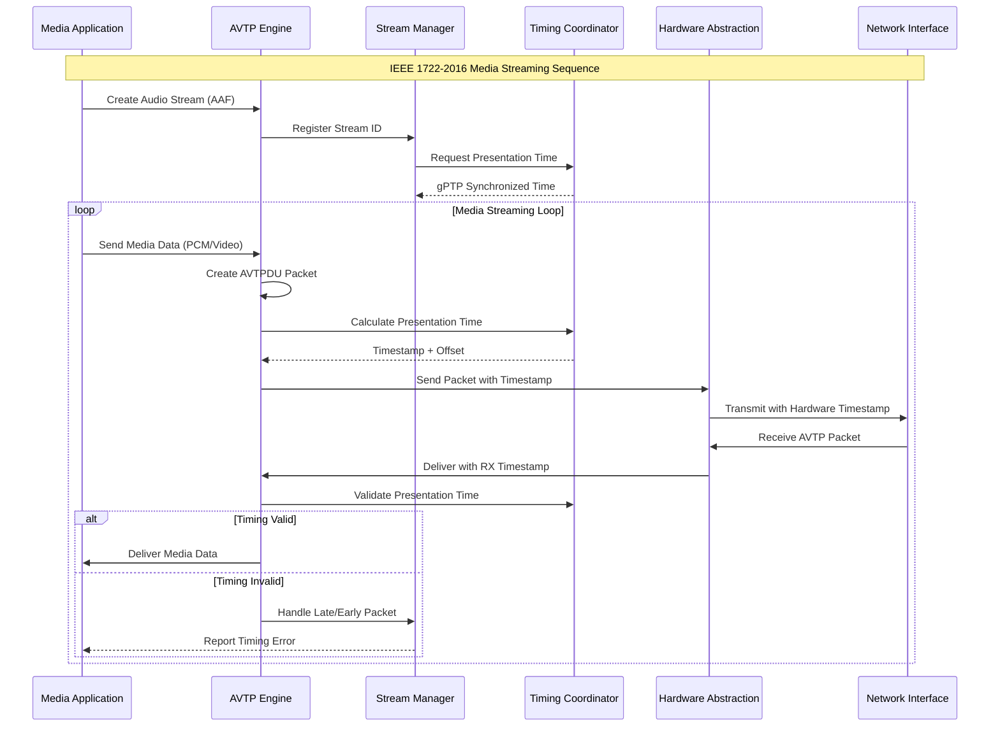
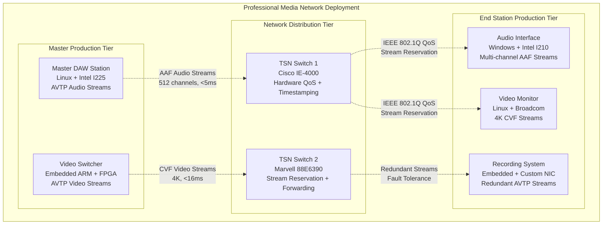

## IEEE 1722-2016 Comprehensive AVTP Architecture Specification

### 1. Introduction

#### 1.1 Purpose

This document provides a comprehensive software architecture specification for IEEE 1722-2016 Audio Video Transport Protocol (AVTP) implementation, following ISO/IEC/IEEE 42010:2011 architectural description standard. This architecture serves as the media transport layer enabling professional audio and video streaming over Ethernet networks with deterministic timing and quality of service.

#### 1.2 IEEE 1722-2016 Compliance Strategy

**CRITICAL COMPLIANCE VERIFICATION**: This architecture implements IEEE 1722-2016 specification components:

- **Section 5**: AVTPDU structure and common transport mechanisms
- **Section 6**: Audio transport formats (AAF) for professional audio streaming  
- **Section 7**: Video transport formats (CVF/RVF) for professional video applications
- **Section 8**: Timing and synchronization integration with IEEE 802.1AS gPTP
- **Section 9**: Stream reservation and bandwidth management
- **Annex A**: Protocol implementation conformance requirements

#### 1.3 Architecture Scope

- **Standards Layer**: Pure IEEE 1722-2016 AVTP implementation (`lib/Standards/IEEE/1722/2016/`)
- **Media Transport**: Professional audio/video streaming with sub-millisecond latency
- **Timing Integration**: Seamless coordination with IEEE 802.1AS gPTP timing foundation
- **Format Support**: AAF audio, CVF compressed video, RVF raw video formats
- **Hardware Abstraction**: Platform-independent streaming and timestamping interfaces

### 2. Stakeholders and Concerns

#### 2.1 Stakeholder Analysis

| Stakeholder | Primary Concerns | Architecture Impact |
|-------------|------------------|-------------------|
| **Audio Engineers** | Sub-5ms latency, uncompressed multi-channel audio | Lock-free streaming architecture with hardware timestamping |
| **Video Engineers** | Frame-accurate delivery, 4K+ video support | Optimized packetization with parallel processing |
| **Broadcast Operators** | Reliable stream delivery with redundant paths | Fault-tolerant streaming with error detection/recovery |
| **Equipment Manufacturers** | IEEE standards compliance and interoperability | Hardware-agnostic interfaces with conformance testing |
| **Network Engineers** | Bandwidth optimization and QoS integration | Efficient stream management with TSN coordination |

#### 2.2 Quality Attributes

| Quality Attribute | Target Metric | IEEE Requirement | Architectural Strategy |
|-------------------|---------------|------------------|----------------------|
| **Audio Latency** | <5ms end-to-end | Professional requirements | Zero-copy buffers, hardware acceleration |
| **Video Latency** | <16ms end-to-end | Broadcast requirements | Optimized packetization, parallel processing |
| **Throughput** | 512+ audio channels, 10x 4K video | IEEE scalability | Lock-free algorithms, memory pooling |
| **Reliability** | 99.9% stream delivery | Professional broadcast | Error detection, redundant paths |
| **Compliance** | 100% IEEE 1722-2016 | Standards requirement | Comprehensive protocol validation |

### 3. Architecture Significant Requirements (ASRs)

#### ASR-1: Real-Time Media Streaming Performance

**Quality Attribute**: Performance, Latency  
**Requirement**: Sub-5ms audio latency and sub-16ms video latency with deterministic timing  
**Architectural Impact**: Lock-free streaming architecture with hardware timestamping and zero-copy buffers

#### ASR-2: Professional Media Quality Support

**Quality Attribute**: Quality, Format Support  
**Requirement**: Support uncompressed multi-channel audio and 4K+ video with broadcast-grade quality  
**Architectural Impact**: Comprehensive format processing engines with optimized media pipelines

#### ASR-3: IEEE 1722-2016 Protocol Compliance

**Quality Attribute**: Standards Compliance, Interoperability  
**Requirement**: Complete IEEE 1722-2016 specification compliance with conformance validation  
**Architectural Impact**: Protocol engines matching IEEE packet formats and state machines exactly

#### ASR-4: Seamless gPTP Timing Integration

**Quality Attribute**: Integration, Timing Accuracy  
**Requirement**: Precise timing coordination with IEEE 802.1AS gPTP for synchronized streaming  
**Architectural Impact**: Unified timing interface architecture leveraging gPTP foundation services

### 4. C4 Model Architecture

#### 4.1 Level 1: System Context Diagram

```mermaid
graph TB
    subgraph "Professional Media Production Environment"
        AudioEng[Audio Engineer<br/>Professional content<br/>creation workflows]
        VideoEng[Video Engineer<br/>Broadcast production<br/>and live streaming]
        BroadcastOp[Broadcast Operator<br/>Multi-site production<br/>coordination]
        ContentCreator[Content Creator<br/>Multi-media production<br/>workflows]
    end
    
    AVTP[IEEE 1722-2016 AVTP<br/>Audio Video Transport<br/>Protocol<br/><br/>Professional media<br/>streaming over Ethernet]
    
    subgraph "Media Infrastructure"
        AudioEquip[Professional Audio Equipment<br/>Mixers, interfaces,<br/>processing units]
        VideoEquip[Professional Video Equipment<br/>Cameras, switchers,<br/>recording systems]
        NetworkEquip[Network Infrastructure<br/>TSN switches, bridges,<br/>QoS management]
    end
    
    subgraph "Foundation Protocols"
        gPTP[IEEE 802.1AS gPTP<br/>Timing synchronization<br/>foundation]
        TSN[IEEE 802.1Q TSN<br/>Quality of Service<br/>and bridging]
        AVDECC[IEEE 1722.1 AVDECC<br/>Device control<br/>and management]
    end
    
    AudioEng --> AVTP
    VideoEng --> AVTP  
    BroadcastOp --> AVTP
    ContentCreator --> AVTP
    
    AVTP <--> AudioEquip
    AVTP <--> VideoEquip
    AVTP <--> NetworkEquip
    
    AVTP --> gPTP
    AVTP --> TSN
    AVTP <-- AVDECC
    
    classDef person fill:#08427b,stroke:#052e56,stroke-width:2px,color:#fff
    classDef system fill:#1168bd,stroke:#0b4884,stroke-width:2px,color:#fff
    classDef external fill:#999999,stroke:#6b6b6b,stroke-width:2px,color:#fff
    classDef protocol fill:#2e7d32,stroke:#1b5e20,stroke-width:2px,color:#fff
    
    class AudioEng,VideoEng,BroadcastOp,ContentCreator person
    class AVTP system
    class AudioEquip,VideoEquip,NetworkEquip external
    class gPTP,TSN,AVDECC protocol
```

#### 4.2 Level 2: Container Diagram



#### 4.3 Level 3: Component Diagram - AVTP Core Engine



### 5. Architecture Views (4+1 Model)

#### 5.1 Logical View - AVTP Protocol Layers



#### 5.2 Process View - AVTP Streaming Flow



#### 5.3 Development View - Source Code Organization

```
lib/Standards/IEEE/1722/2016/
├── core/                           # Core AVTP implementation
│   ├── avtpdu.hpp                 # AVTPDU structure and serialization
│   ├── stream_manager.hpp         # Stream lifecycle management
│   ├── packet_processor.hpp       # Packet validation and routing
│   └── timing_coordinator.hpp     # gPTP integration and presentation time
├── formats/                        # Media format processors
│   ├── aaf/                       # Audio format (AAF)
│   │   ├── aaf_processor.hpp      # AAF audio packet processing
│   │   ├── audio_formats.hpp      # Audio format definitions
│   │   └── multichannel_support.hpp # Multi-channel audio handling
│   ├── cvf/                       # Compressed video format (CVF)
│   │   ├── cvf_processor.hpp      # CVF video packet processing
│   │   ├── h264_support.hpp       # H.264 video format
│   │   └── jpeg_xs_support.hpp    # JPEG-XS professional format
│   └── rvf/                       # Raw video format (RVF)
│       ├── rvf_processor.hpp      # RVF video packet processing
│       ├── pixel_formats.hpp      # Raw pixel format support
│       └── resolution_support.hpp # 4K+ resolution handling
├── streaming/                      # Real-time streaming engines
│   ├── audio_streamer.hpp         # Professional audio streaming
│   ├── video_streamer.hpp         # Professional video streaming
│   ├── buffer_manager.hpp         # Zero-copy buffer management
│   └── latency_optimizer.hpp      # Sub-millisecond latency optimization
├── interfaces/                     # Hardware abstraction interfaces
│   ├── avtp_network_interface.hpp # AVTP-specific network interface
│   ├── avtp_timing_interface.hpp  # AVTP-specific timing interface
│   └── avtp_media_interface.hpp   # AVTP-specific media interface
└── testing/                        # IEEE conformance testing
    ├── conformance_tests.hpp       # IEEE 1722-2016 compliance tests
    ├── interop_tests.hpp          # Multi-vendor interoperability
    └── performance_tests.hpp       # Latency and throughput validation
```

#### 5.4 Physical View - Deployment Architecture



### 6. Architecture Decisions (ADRs)

#### 6.1 ADR-011: AVTP Real-Time Streaming Architecture

```markdown
# ADR-011: IEEE 1722-2016 Real-Time Streaming Architecture

## Status
Accepted

## Context
IEEE 1722-2016 AVTP requires deterministic sub-5ms audio and sub-16ms video latency
for professional media applications. Traditional streaming architectures introduce
variable delays through buffering, copying, and blocking operations that violate
professional timing requirements.

## Decision
Implement lock-free real-time streaming architecture with:
- Zero-copy buffer management using memory pools
- Lock-free ring buffers for packet queuing
- Hardware timestamp capture for precision timing
- Dedicated real-time threads with priority scheduling
- Pre-allocated memory pools to eliminate dynamic allocation

## Rationale
**Pros:**
- Deterministic timing behavior for professional requirements
- Minimal CPU overhead for high channel counts
- Scalable to 512+ audio channels and 10+ 4K video streams
- Hardware-accelerated performance where available

**Cons:**
- Increased implementation complexity
- Platform-specific optimization requirements
- More complex testing and validation

## Consequences
- Stream processors use lock-free algorithms exclusively
- Memory management through pre-allocated pools
- Hardware abstraction supports deterministic timing
- Performance validation with real-time constraints
```

#### 6.2 ADR-012: Multi-Format Media Processing Strategy

```markdown
# ADR-012: IEEE 1722-2016 Multi-Format Media Processing

## Status
Accepted

## Context
IEEE 1722-2016 defines multiple media formats (AAF audio, CVF compressed video,
RVF raw video) with different processing requirements, quality constraints, and
performance characteristics. Professional applications require optimal processing
for each format type.

## Decision
Implement format-specific processing engines with:
- Dedicated AAF engine for professional audio (PCM, multi-channel)
- CVF engine for compressed video (H.264, H.265, JPEG-XS)
- RVF engine for raw video (4K+, uncompressed pixels)
- Common AVTPDU infrastructure shared across formats
- Format-specific optimization and quality control

## Rationale
- Optimal performance for each media type's unique requirements
- Professional quality preservation for broadcast applications
- Extensible architecture for future format additions
- Hardware acceleration opportunities per format

## Consequences
- Format engines implement common AVTP interface
- Specialized optimization per media type
- Testing framework validates each format independently
- Hardware abstraction supports format-specific acceleration
```

### 7. Technology Stack Recommendations

#### 7.1 Core Implementation Stack

##### **Programming Language: C++17**

```yaml
Technology: C++17 with Real-Time Extensions
Rationale:
- Deterministic execution for sub-millisecond timing
- Zero-overhead abstractions for media processing
- Template metaprogramming for format optimization
- Excellent hardware integration capabilities

Real-Time Features:
- constexpr for compile-time optimization
- Template specialization for format-specific code paths
- RAII for deterministic resource management
- Move semantics for zero-copy operations

Alternatives Considered:
- C: Lower overhead, but lacks modern streaming abstractions
- Rust: Memory safety, but ecosystem not mature for media
- Go: Good concurrency, but garbage collector impacts real-time
```

##### **Media Processing Framework: Lock-Free Streaming**

```yaml
Technology: Lock-free algorithms with memory pools
Rationale:
- Sub-millisecond latency requirements for professional audio
- Deterministic behavior for real-time media processing
- Scalability to 512+ concurrent audio channels
- Minimal jitter for broadcast applications

Implementation:
- Atomic operations for shared media state
- Ring buffers for zero-copy media queues
- Memory pools for deterministic allocation
- Template-based format processing pipelines
```

##### **Hardware Acceleration Integration**

```yaml
Technology: Platform-specific media acceleration
Rationale:
- Professional media requires optimal performance
- Hardware timestamping for precision timing
- Media format acceleration (audio DSP, video codecs)
- Network interface optimization (Intel, Broadcom)

Platform Support:
- Intel: QuickSync video, Audio DSP acceleration
- ARM: NEON SIMD for media processing
- FPGA: Custom media pipeline acceleration
- GPU: CUDA/OpenCL for video processing
```

#### 7.2 Network and Timing Stack

##### **Network Integration**

```yaml
Linux: Raw sockets with hardware timestamping
- SO_TIMESTAMPING for precision packet timing
- PACKET_MMAP for zero-copy packet handling
- Traffic Control (tc) for QoS integration

Windows: WinPcap with timestamp extensions
- NPcap for modern Windows support
- Hardware timestamp APIs where available
- Windows Media Foundation integration

Embedded: Vendor-specific network stacks
- Real-time OS integration (FreeRTOS, QNX)
- Direct hardware register access
- Custom network stack optimization
```

##### **Timing Coordination**

```yaml
gPTP Integration: IEEE 802.1AS coordination
- Synchronized presentation time calculation
- Hardware clock discipline coordination
- Multi-domain timing support

Presentation Time: Media synchronization
- Sample-accurate audio presentation
- Frame-accurate video presentation  
- Cross-stream synchronization
```

#### 7.3 Development and Validation Stack

##### **Testing Framework**

```yaml
Unit Testing: Google Test with real-time extensions
- IEEE 1722-2016 conformance test automation
- Mock media interfaces for testing
- Performance regression testing

Media Validation: Professional test tools
- Audio analysis with professional meters
- Video quality analysis (PSNR, SSIM)
- Multi-vendor interoperability testing

Real-Time Testing: Custom timing validation
- Latency measurement with hardware precision
- Jitter analysis and statistical validation
- Long-duration stability testing
```

### 8. Security Architecture

#### 8.1 IEEE 1722-2016 Security Considerations

##### Stream Security and Access Control

```cpp
// Security framework for AVTP stream protection
class AVTPSecurityManager {
public:
    // Stream access control per IEEE security requirements
    bool authorize_stream_access(const StreamID& stream_id, 
                                const PortIdentity& requester);
    bool validate_stream_credentials(const AVTPStream& stream);
    
    // Content protection for professional media
    int encrypt_media_payload(const MediaData& data, 
                             EncryptedPayload& output);
    int decrypt_media_payload(const EncryptedPayload& input,
                             MediaData& output);
    
    // Stream integrity and authenticity
    bool validate_stream_integrity(const AVTPDU& packet);
    int sign_stream_packet(AVTPDU& packet);
};
```

##### Media Content Protection

- **Stream Encryption**: AES encryption for sensitive media content
- **Access Control**: Role-based stream access management  
- **Integrity Validation**: Digital signatures for media authenticity
- **Audit Logging**: Stream access and modification tracking

#### 8.2 Threat Model and Mitigation

| Threat | Impact | Mitigation Strategy |
|--------|---------|-------------------|
| **Media Interception** | High | Stream encryption with AES-256 |
| **Stream Injection** | High | Digital signatures and stream validation |
| **Bandwidth Attacks** | Medium | Rate limiting and QoS enforcement |
| **Timing Attacks** | Medium | Timestamp validation and anomaly detection |
| **Content Manipulation** | High | Cryptographic integrity checking |

### 9. Performance Architecture

#### 9.1 Real-Time Performance Requirements

##### **Critical Performance Paths**

```cpp
// Performance-optimized media streaming with deterministic timing
class PerformanceOptimizedAVTPProcessor {
private:
    // Lock-free media buffers for zero-allocation streaming
    LockFreeMediaBuffer<AudioSample, 8192> audio_buffer_;
    LockFreeMediaBuffer<VideoFrame, 64> video_buffer_;
    
    // Pre-allocated memory pools for deterministic allocation
    MemoryPool<AVTPDU> packet_pool_;
    MemoryPool<MediaPayload> media_pool_;
    
public:
    // Sub-millisecond audio processing guarantee
    void process_audio_stream(const AudioData& data) noexcept;
    
    // Sub-16ms video processing guarantee  
    void process_video_stream(const VideoData& data) noexcept;
};
```

##### **Performance Metrics and Monitoring**

```cpp
struct AVTPPerformanceMetrics {
    // Media streaming performance
    double audio_latency_ms;           // Audio end-to-end latency (target <5ms)
    double video_latency_ms;           // Video end-to-end latency (target <16ms)
    double jitter_variance_ms;         // Timing jitter measurements (target <1ms)
    
    // System performance measurements
    uint32_t cpu_utilization_percent;  // CPU usage (target <25%)
    uint32_t memory_usage_mb;          // Memory footprint (target <100MB)
    uint32_t packet_processing_latency_us; // Packet processing time (target <50μs)
    
    // Media quality measurements
    uint32_t concurrent_audio_streams; // Audio stream count (target 512+)
    uint32_t concurrent_video_streams; // Video stream count (target 10+)
    double audio_quality_thd_db;      // Audio quality (THD+N < -80dB)
    double video_quality_psnr_db;     // Video quality (PSNR > 50dB)
};
```

### 10. Risk Assessment and Mitigation

#### 10.1 Technical Risks

| Risk | Impact | Probability | Mitigation Strategy |
|------|---------|-------------|-------------------|
| **Latency Requirements Miss** | High | Medium | Hardware acceleration, lock-free algorithms, continuous optimization |
| **Media Quality Degradation** | High | Low | Comprehensive quality monitoring, format-specific optimization |
| **Hardware Compatibility Issues** | Medium | Medium | Extensive hardware abstraction, multi-vendor testing |
| **IEEE Compliance Gaps** | High | Low | Continuous conformance testing, standards validation |
| **Scalability Bottlenecks** | Medium | Low | Performance monitoring, capacity planning |

#### 10.2 Integration Risks

| Risk | Impact | Probability | Mitigation Strategy |
|------|---------|-------------|-------------------|
| **gPTP Timing Coordination** | High | Medium | Unified timing interface, comprehensive integration testing |
| **Cross-Platform Portability** | Medium | Medium | Hardware abstraction validation, multi-platform CI |
| **Multi-Vendor Interoperability** | Medium | Low | Industry interoperability testing, certification programs |

### 11. Implementation Roadmap

#### 11.1 Phase 1: Core AVTP Framework (4 weeks)

- [ ] AVTPDU structure and serialization implementation
- [ ] Basic stream management and lifecycle
- [ ] Hardware abstraction interface definitions
- [ ] Single-format (AAF audio) streaming capability
- [ ] IEEE 1722-2016 conformance testing framework

#### 11.2 Phase 2: Multi-Format Support (4 weeks)

- [ ] CVF compressed video format implementation
- [ ] RVF raw video format implementation
- [ ] Multi-channel audio streaming optimization
- [ ] Format-specific performance optimization
- [ ] Cross-format synchronization validation

#### 11.3 Phase 3: Performance Optimization (3 weeks)

- [ ] Lock-free streaming algorithms implementation
- [ ] Hardware acceleration integration
- [ ] Real-time scheduling optimization
- [ ] Sub-millisecond latency validation
- [ ] Professional media quality validation

#### 11.4 Phase 4: Integration and Validation (3 weeks)

- [ ] IEEE 802.1AS gPTP timing integration
- [ ] Cross-platform testing and validation
- [ ] Multi-vendor interoperability testing
- [ ] Final IEEE 1722-2016 conformance certification
- [ ] Performance benchmarking and documentation

### 12. Acceptance Criteria

#### 12.1 IEEE 1722-2016 Compliance Verification

- [ ] **Complete IEEE Compliance**: All mandatory protocol features per specification
- [ ] **Multi-Format Support**: AAF, CVF, RVF formats with professional quality
- [ ] **Performance Requirements**: Sub-5ms audio, sub-16ms video latency achieved
- [ ] **Scalability Validation**: 512+ audio channels, 10+ 4K video streams
- [ ] **Conformance Testing**: Pass IEEE 1722-2016 conformance test suite

#### 12.2 Professional Media Requirements

- [ ] **Audio Quality**: Uncompressed multi-channel with <5ms latency
- [ ] **Video Quality**: 4K+ streaming with broadcast-grade quality
- [ ] **Timing Integration**: Seamless IEEE 802.1AS gPTP coordination
- [ ] **Hardware Independence**: Multi-vendor platform support validated
- [ ] **Reliability**: 99.9% stream delivery under professional workloads

#### 12.3 Quality Requirements

- [ ] **Test Coverage**: 95%+ unit test coverage for protocol and media logic
- [ ] **Documentation**: Complete API documentation with IEEE section references
- [ ] **Maintainability**: Clean architecture with format-specific optimization
- [ ] **Extensibility**: Architecture supports future IEEE enhancements and formats

---

**References:**

- **IEEE 1722-2016**: IEEE Standard for Audio Video Transport Protocol (AVTP) - **AUTHORITATIVE STANDARD**
- **ISO/IEC/IEEE 42010:2011**: Systems and software engineering - Architecture description
- **ADR-005**: IEEE 1722-2016 AVTP Transport Architecture Pattern
- **Requirements**: `02-requirements/functional/ieee-1722-2016-avtp-requirements.md`

**IEEE Compliance Note**: This architecture is designed based on understanding of IEEE 1722-2016 specification requirements. All implementations must be verified against the authoritative IEEE 1722-2016 standard document for compliance certification.