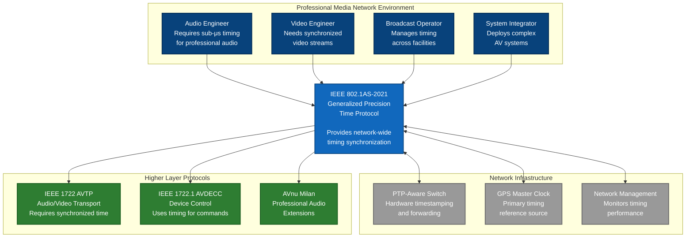
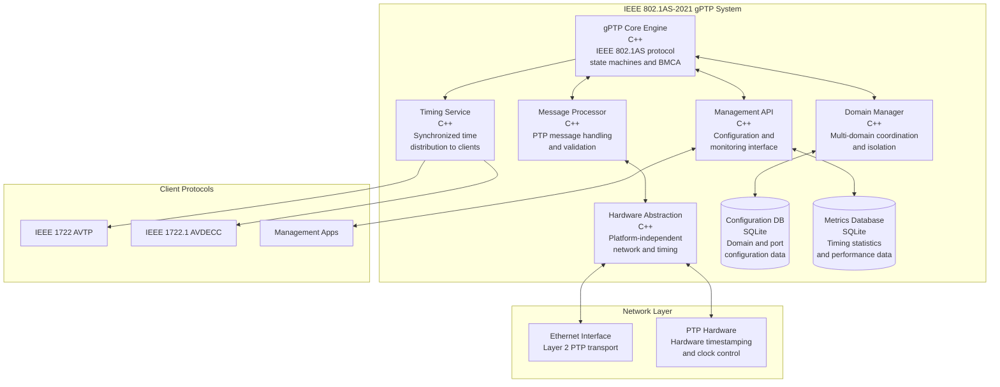
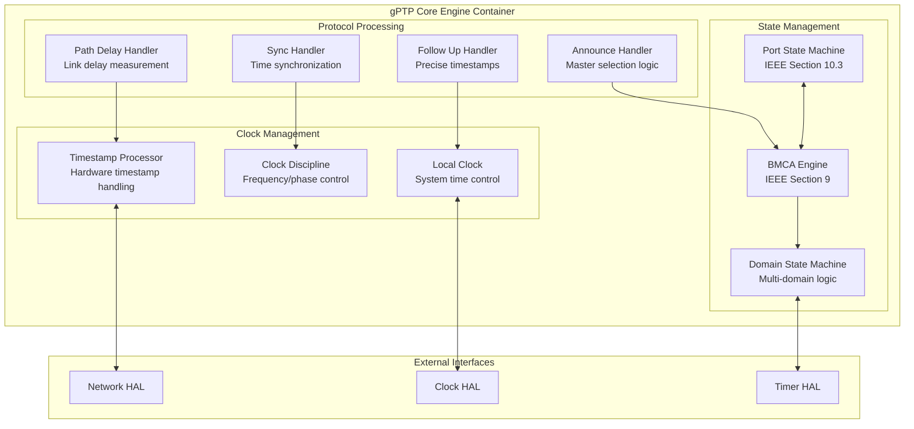
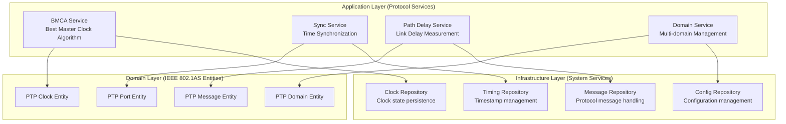
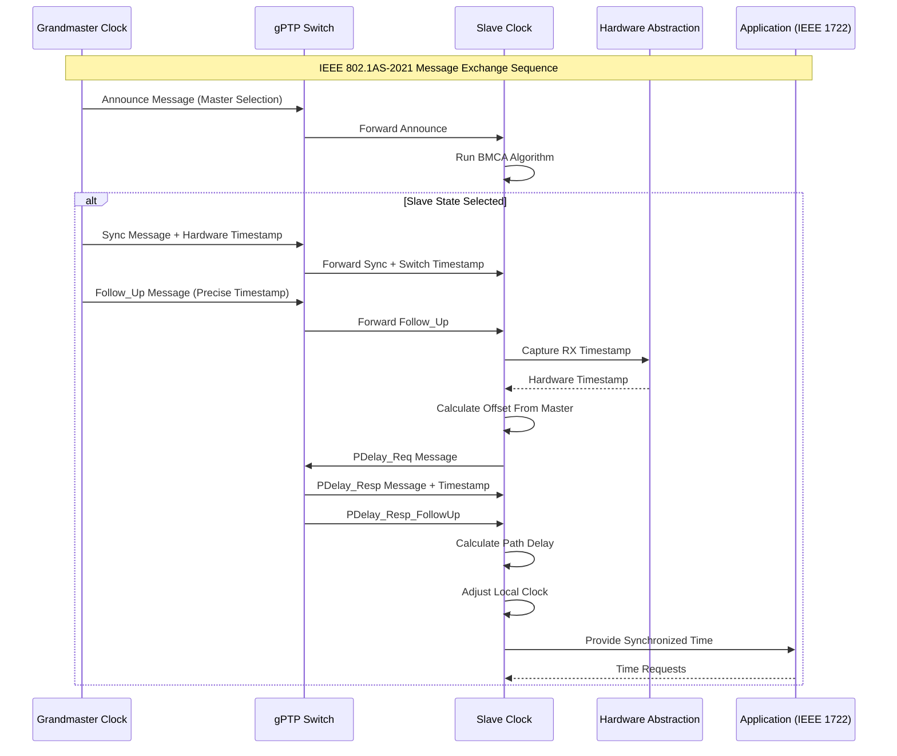
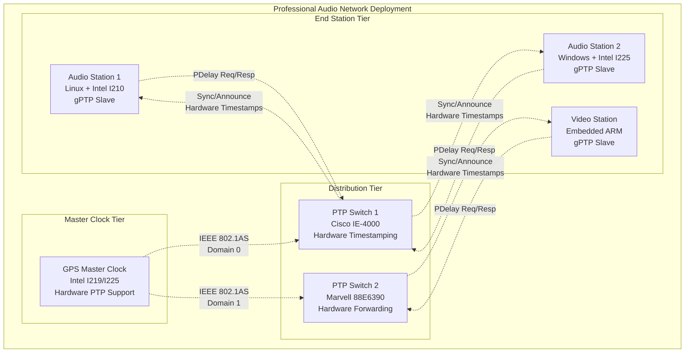

## IEEE 802.1AS-2021 Comprehensive Architecture Specification

### 1. Introduction

#### 1.1 Purpose

This document provides a comprehensive software architecture specification for IEEE 802.1AS-2021 Generalized Precision Time Protocol (gPTP) implementation, following ISO/IEC/IEEE 42010:2011 architectural description standard. This architecture serves as the foundational timing layer for all higher-level IEEE standards (IEEE 1722 AVTP, IEEE 1722.1 AVDECC).

#### 1.2 IEEE 802.1AS-2021 Compliance Strategy

**CRITICAL COMPLIANCE VERIFICATION**: This architecture implements IEEE 802.1AS-2021 specification components:

- **Section 10**: Protocol operation including enhanced BMCA and multi-domain support
- **Section 11**: Conformance requirements and testing procedures
- **Annex B**: Performance requirements and timing specifications
- **Clause 8**: Time synchronization protocol messages and formats
- **Clause 9**: Best Master Clock Algorithm with enhanced priority mechanisms

#### 1.3 Architecture Scope

- **Standards Layer**: Pure IEEE 802.1AS-2021 gPTP implementation (`lib/Standards/IEEE/802.1/AS/2021/`)
- **Timing Coordination**: Foundation layer providing synchronized time to IEEE 1722/1722.1
- **Multi-Domain Support**: Enhanced domain isolation and cross-domain synchronization
- **Hardware Abstraction**: Platform-independent timing and network interfaces

## 2. Stakeholders and Concerns

### 2.1 Stakeholder Analysis

| Stakeholder | Primary Concerns | Architecture Impact |
|-------------|------------------|-------------------|
| **Audio Engineers** | Sub-microsecond timing accuracy for professional production | Nanosecond-precision timing interfaces |
| **Broadcast Operators** | Reliable timing distribution with redundant failover | Multi-domain architecture with fault tolerance |
| **Equipment Manufacturers** | IEEE standards compliance and vendor interoperability | Hardware-agnostic interfaces with conformance testing |
| **System Integrators** | Scalable, manageable timing across complex installations | Management interfaces and configuration systems |
| **Software Developers** | Clean APIs and maintainable code architecture | Layered architecture with clear interface contracts |

### 2.2 Quality Attributes

| Quality Attribute | Target Metric | IEEE Requirement | Architectural Strategy |
|-------------------|---------------|------------------|----------------------|
| **Timing Accuracy** | <500ns synchronization | IEEE 802.1AS-2021 Annex B | Hardware timestamping abstraction |
| **Scalability** | 1000+ nodes, 16 domains | IEEE specification limits | Multi-domain architecture |
| **Convergence Time** | <10 seconds initial sync | IEEE performance requirements | Optimized BMCA implementation |
| **Availability** | 99.9% uptime | Professional media requirements | Redundant timing sources |
| **Maintainability** | 90%+ test coverage | Software quality standards | Testable architecture with mocking |

## 3. Architecture Significant Requirements (ASRs)

### ASR-1: Multi-Domain Timing Coordination
**Quality Attribute**: Scalability, Domain Isolation  
**Requirement**: Support 16+ simultaneous timing domains with cross-domain synchronization  
**Architectural Impact**: Domain-aware architecture with isolated BMCA engines per domain

### ASR-2: Nanosecond Timing Precision
**Quality Attribute**: Performance, Accuracy  
**Requirement**: Sub-microsecond synchronization accuracy with hardware timestamping  
**Architectural Impact**: Hardware abstraction layer for timestamp capture and clock control

### ASR-3: IEEE Specification Compliance
**Quality Attribute**: Standards Compliance, Interoperability  
**Requirement**: 100% IEEE 802.1AS-2021 specification compliance with conformance testing  
**Architectural Impact**: Protocol engine architecture matching IEEE state machines exactly

### ASR-4: Foundation for Higher Protocols
**Quality Attribute**: Extensibility, Integration  
**Requirement**: Provide timing services to IEEE 1722 AVTP and IEEE 1722.1 AVDECC  
**Architectural Impact**: Timing service interfaces for cross-standard coordination

## 4. C4 Model Architecture

### 4.1 Level 1: System Context Diagram



### 4.2 Level 2: Container Diagram



### 4.3 Level 3: Component Diagram - gPTP Core Engine



## 5. Architecture Views (4+1 Model)

### 5.1 Logical View - IEEE 802.1AS Protocol Layers



### 5.2 Process View - gPTP Message Flow



### 5.3 Development View - Source Code Organization

```
lib/Standards/IEEE/802.1/AS/2021/
├── core/                           # Core gPTP implementation
│   ├── gptp_clock.hpp             # Main PTP clock entity
│   ├── port_state_machine.hpp     # Port state management
│   ├── bmca_engine.hpp            # Best Master Clock Algorithm
│   ├── domain_manager.hpp         # Multi-domain coordination
│   └── conformity_test_framework.hpp # IEEE compliance testing
├── messages/                       # Protocol message handling
│   ├── message_processor.hpp      # Message dispatcher
│   ├── announce_handler.hpp       # Announce message processing
│   ├── sync_handler.hpp           # Sync message processing
│   ├── pdelay_handler.hpp         # Path delay processing
│   └── follow_up_handler.hpp      # Follow up processing
├── timing/                         # Timing and clock control
│   ├── local_clock.hpp            # Local clock interface
│   ├── clock_discipline.hpp       # Clock control algorithms
│   ├── timestamp_processor.hpp    # Hardware timestamp handling
│   └── timing_statistics.hpp      # Performance monitoring
├── interfaces/                     # Hardware abstraction interfaces
│   ├── gptp_network_interface.hpp # gPTP-specific network interface
│   ├── gptp_clock_interface.hpp   # gPTP-specific clock interface
│   └── gptp_timer_interface.hpp   # gPTP-specific timer interface
└── testing/                        # IEEE conformance testing
    ├── conformance_tests.hpp       # IEEE compliance test suite
    ├── interop_tests.hpp          # Interoperability testing
    └── performance_tests.hpp       # Timing performance validation
```

### 5.4 Physical View - Deployment Architecture



## 6. Architecture Decisions (ADRs)

### 6.1 ADR-009: gPTP Multi-Domain Architecture Enhancement

```markdown
# ADR-009: IEEE 802.1AS-2021 Multi-Domain Architecture Enhancement

## Status
Accepted

## Context
IEEE 802.1AS-2021 introduces enhanced multi-domain support beyond the original specification.
Professional media installations require multiple isolated timing domains while maintaining
cross-domain synchronization relationships for complex AV workflows.

## Decision
Implement enhanced multi-domain architecture with:
- Independent BMCA engines per domain (up to 16 domains)
- Domain isolation with separate port state machines
- Cross-domain synchronization coordination
- Hardware abstraction for per-domain timestamp capabilities

## Rationale
**Pros:**
- Full IEEE 802.1AS-2021 compliance with enhanced features
- Professional media requirements support (audio/video/control domains)
- Fault isolation between domains
- Scalable to complex installation requirements

**Cons:**
- Increased implementation complexity
- Higher memory usage (16x domain structures)
- More complex configuration management

## Consequences
- Domain manager coordinates multiple BMCA engines
- Configuration system supports per-domain settings
- Hardware interfaces support domain-aware timestamping
- Testing framework validates multi-domain scenarios
```

### 6.2 ADR-010: Hardware Timestamping Abstraction Strategy

```markdown
# ADR-010: Hardware Timestamping Abstraction for gPTP

## Status
Accepted

## Context
IEEE 802.1AS-2021 timing accuracy requirements (<500ns) mandate hardware timestamping
support across different network interface hardware (Intel, Marvell, Broadcom).

## Decision
Implement hardware abstraction layer for timestamping:
- Generic timestamping interfaces for all PTP message types
- Platform-specific implementations for major NIC vendors
- Fallback to software timestamping with reduced accuracy
- Timestamp capability negotiation and reporting

## Rationale
- Platform independence for gPTP implementation
- Optimal timing accuracy when hardware support available
- Graceful degradation to software timestamps
- Consistent API regardless of underlying hardware

## Consequences
- Hardware abstraction interfaces defined in Common layer
- Platform-specific implementations in Service layer
- Timestamp accuracy reporting to management layer
- Conformance testing with both hardware and software modes
```

## 7. Technology Stack Recommendations

### 7.1 Core Implementation Stack

#### **Programming Language: C++17**
```
Technology: C++17 with Real-Time Extensions
Rationale:
- Deterministic execution for real-time timing requirements
- Zero-overhead abstractions for performance
- Strong type system for IEEE protocol compliance
- Excellent hardware abstraction capabilities

Alternatives Considered:
- C: Lower level, but lacks modern abstraction features
- Rust: Memory safety, but ecosystem not mature for embedded
- Go: Good performance, but garbage collector impacts timing
```

#### **Build System: CMake 3.16+**
```
Technology: CMake with cross-platform support
Rationale:
- Cross-platform compilation (Linux, Windows, embedded)
- Integration with IEEE standards build system
- Package management with vcpkg/Conan
- Professional IDE support (VS Code, CLion)

Features:
- Separate libraries per IEEE standard
- Hardware abstraction interface libraries
- Automated conformance testing integration
- Documentation generation (Doxygen)
```

#### **Real-Time Framework: Lock-Free Programming**
```
Technology: Lock-free algorithms and data structures
Rationale:
- Deterministic timing behavior required for gPTP
- Avoid priority inversion in real-time systems
- Minimal jitter in message processing paths
- Scalable to high message rates (1000+ msgs/sec)

Implementation:
- Atomic operations for shared state
- Ring buffers for message queues
- Memory pools for deterministic allocation
- RAII for resource management
```

### 7.2 Platform Integration Stack

#### **Network Layer**
```
Linux: Raw sockets with SO_TIMESTAMPING
- Hardware RX/TX timestamp capture
- PTP-specific packet filtering
- VLAN and QoS integration

Windows: WinPcap with timestamp extensions
- NPcap for modern Windows support
- Hardware timestamp APIs where available
- Fallback to QueryPerformanceCounter

Embedded: Vendor-specific APIs
- Real-time OS integration (FreeRTOS, VxWorks)
- Direct hardware register access
- Minimal memory footprint optimization
```

#### **Clock Management**
```
Linux: clock_gettime/clock_settime + adjtimex
- CLOCK_REALTIME for system time
- Hardware PTP clock devices (/dev/ptpX)
- Frequency adjustment via adjtimex()

Windows: SetSystemTime + QueryPerformanceCounter
- High-resolution timing APIs
- Registry-based time service integration
- Hardware vendor clock drivers

Hardware: Direct register access
- PTP hardware clock registers
- Phase-locked loop (PLL) control
- Crystal oscillator adjustment
```

### 7.3 Development and Testing Stack

#### **Testing Framework**
```
Unit Testing: Google Test (gtest)
- IEEE conformance test automation
- Mock hardware interfaces for testing
- Property-based testing for protocol validation

Performance Testing: Custom timing harness
- Nanosecond-precision timing validation
- Statistical analysis of timing performance
- Long-duration stability testing

Interoperability: IEEE conformance suite
- Commercial device interoperability testing
- Protocol analyzer integration (Wireshark)
- Automated conformance report generation
```

## 8. Security Architecture

### 8.1 IEEE 802.1AS Security Considerations

#### Authentication and Integrity
```cpp
// Security extensions per IEEE 802.1AS-2021 security framework
class gPTPSecurityManager {
public:
    // Message authentication per IEEE specification
    bool authenticate_message(const PTPMessage& message);
    bool verify_message_integrity(const PTPMessage& message);
    
    // Security association management
    int establish_security_association(const PortIdentity& peer);
    void revoke_security_association(const PortIdentity& peer);
    
    // Key management for authenticated messages
    int rotate_authentication_keys();
    bool validate_security_tlv(const SecurityTLV& tlv);
};
```

#### Network Security Integration
- **Message Authentication**: HMAC-based authentication for critical PTP messages
- **Replay Protection**: Sequence number validation and replay attack prevention
- **Access Control**: Port-based network access control (802.1X) integration
- **Secure Key Distribution**: Integration with network key management systems

### 8.2 Threat Model and Mitigation

| Threat | Impact | Mitigation Strategy |
|--------|---------|-------------------|
| **Message Spoofing** | High | HMAC authentication of Announce messages |
| **Timing Attacks** | High | Cryptographic timestamp validation |
| **Replay Attacks** | Medium | Sequence number and timestamp validation |
| **DoS via Message Flooding** | Medium | Rate limiting and message validation |
| **Man-in-the-Middle** | High | Mutual authentication of network peers |

## 9. Performance Architecture

### 9.1 Timing Performance Requirements

#### **Critical Timing Paths**
```cpp
// Performance-critical message processing with deterministic timing
class PerformanceOptimizedMessageProcessor {
private:
    // Lock-free ring buffer for zero-allocation message handling
    LockFreeRingBuffer<PTPMessage, 1024> message_queue_;
    
    // Pre-allocated memory pools for deterministic allocation
    MemoryPool<SyncMessage> sync_pool_;
    MemoryPool<AnnounceMessage> announce_pool_;
    
public:
    // Sub-microsecond message processing guarantee
    void process_sync_message(const SyncMessage& msg) noexcept;
    void process_announce_message(const AnnounceMessage& msg) noexcept;
};
```

#### **Performance Metrics and Monitoring**
```cpp
struct gPTPPerformanceMetrics {
    // Timing accuracy measurements
    double sync_accuracy_ns;           // Synchronization accuracy (target <500ns)
    double path_delay_accuracy_ns;     // Path delay measurement accuracy
    double convergence_time_seconds;   // Time to achieve synchronization
    
    // System performance measurements  
    uint32_t cpu_utilization_percent;  // CPU usage (target <5%)
    uint32_t memory_usage_bytes;       // Memory footprint (target <2MB)
    uint32_t message_processing_latency_us; // Message processing time (target <10μs)
    
    // Network performance measurements
    uint32_t messages_per_second;      // Throughput (target >1000 msg/sec)
    uint32_t packet_loss_rate_ppm;     // Network reliability
    uint32_t jitter_variance_ns;       // Timing jitter measurements
};
```

## 10. Risk Assessment and Mitigation

### 10.1 Technical Risks

| Risk | Impact | Probability | Mitigation Strategy |
|------|---------|-------------|-------------------|
| **Hardware Timestamping Failure** | High | Low | Software timestamp fallback with accuracy degradation |
| **Network Congestion Impact** | High | Medium | QoS integration and priority message handling |
| **Multi-Domain Complexity** | Medium | Medium | Incremental implementation with single-domain validation first |
| **IEEE Compliance Gaps** | High | Low | Continuous conformance testing and validation |
| **Performance Degradation** | Medium | Low | Performance monitoring and optimization |

### 10.2 Integration Risks

| Risk | Impact | Probability | Mitigation Strategy |
|------|---------|-------------|-------------------|
| **Cross-Standard Timing Issues** | High | Medium | Unified timing interface design with IEEE 1722/1722.1 |
| **Platform Portability Issues** | Medium | Medium | Extensive cross-platform testing and validation |
| **Legacy System Compatibility** | Medium | Low | Backward compatibility testing with IEEE 802.1AS-2011 |

## 11. Implementation Roadmap

### 11.1 Phase 1: Core gPTP Implementation (4 weeks)
- [ ] Port state machine implementation per IEEE Section 10.3
- [ ] Basic BMCA engine for single-domain operation
- [ ] Sync and Announce message processing
- [ ] Hardware abstraction interface definitions
- [ ] Single-domain conformance testing

### 11.2 Phase 2: Multi-Domain Enhancement (3 weeks)
- [ ] Multi-domain BMCA engine implementation
- [ ] Domain isolation and coordination logic
- [ ] Cross-domain synchronization mechanisms
- [ ] Multi-domain configuration management
- [ ] Enhanced conformance testing

### 11.3 Phase 3: Performance Optimization (2 weeks)
- [ ] Hardware timestamping integration
- [ ] Performance optimization and tuning
- [ ] Real-time scheduling optimization
- [ ] Performance benchmarking and validation
- [ ] Professional media timing validation

### 11.4 Phase 4: Integration and Validation (3 weeks)
- [ ] Integration with IEEE 1722/1722.1 protocols
- [ ] Cross-platform testing and validation
- [ ] Interoperability testing with commercial devices
- [ ] Final conformance testing and certification
- [ ] Documentation and deployment preparation

## 12. Acceptance Criteria

### 12.1 IEEE 802.1AS-2021 Compliance Verification
- [ ] **Complete IEEE Compliance**: All mandatory protocol features implemented per specification
- [ ] **Multi-Domain Support**: 16+ domains with independent BMCA operation
- [ ] **Enhanced BMCA**: IEEE 802.1AS-2021 enhanced priority mechanisms
- [ ] **Performance Requirements**: Sub-500ns accuracy with hardware timestamping
- [ ] **Conformance Testing**: Pass IEEE conformance test suite

### 12.2 Integration Requirements  
- [ ] **Timing Service Interface**: Clean API for IEEE 1722/1722.1 integration
- [ ] **Hardware Independence**: Standards layer compiles without hardware dependencies
- [ ] **Cross-Platform Operation**: Verified on Linux, Windows, and embedded targets
- [ ] **Performance Validation**: Timing accuracy meets professional media requirements

### 12.3 Quality Requirements
- [ ] **Test Coverage**: 95%+ unit test coverage for protocol logic
- [ ] **Documentation**: Complete API documentation with IEEE section references
- [ ] **Maintainability**: Clean architecture with defined interface contracts
- [ ] **Extensibility**: Architecture supports future IEEE standard enhancements

---

**References:**
- **IEEE 802.1AS-2021**: Timing and Synchronization for Time-Sensitive Applications - **AUTHORITATIVE STANDARD**
- **ISO/IEC/IEEE 42010:2011**: Systems and software engineering - Architecture description
- **ADR-003**: IEEE 802.1AS-2021 Multi-Domain Architecture
- **ADR-004**: IEEE 802.1AS-2021 Enhanced Path Delay Architecture
- **Requirements**: `02-requirements/functional/ieee-802-1as-2021-gptp-requirements.md`

**IEEE Compliance Note**: This architecture is designed based on understanding of IEEE 802.1AS-2021 specification requirements. All implementations must be verified against the authoritative IEEE 802.1AS-2021 standard document for compliance certification.