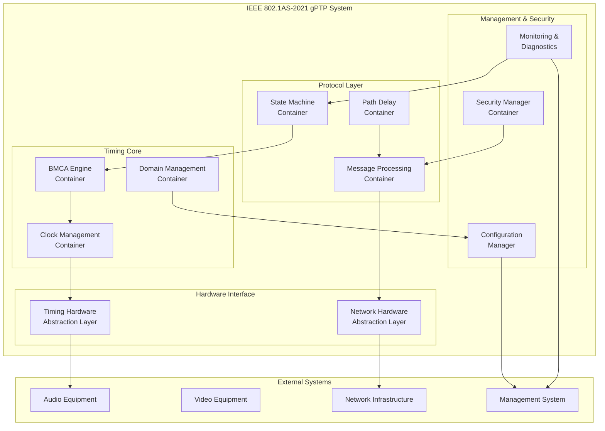
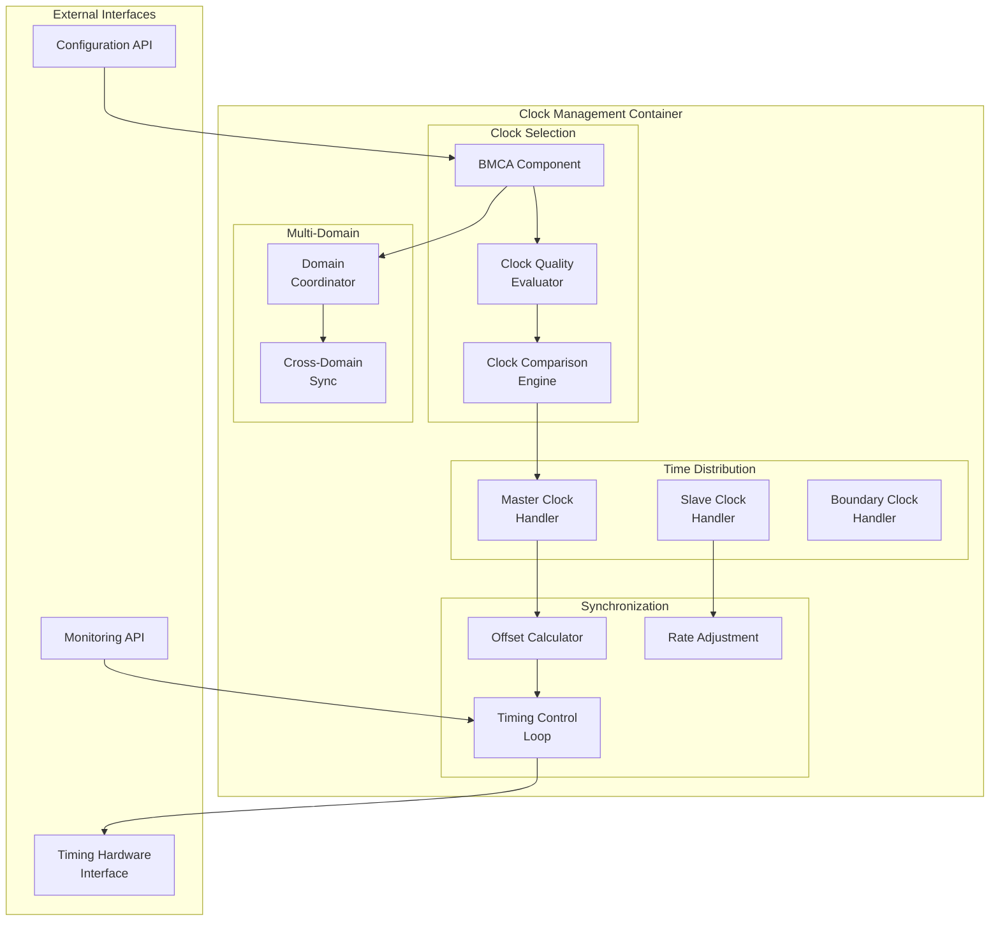
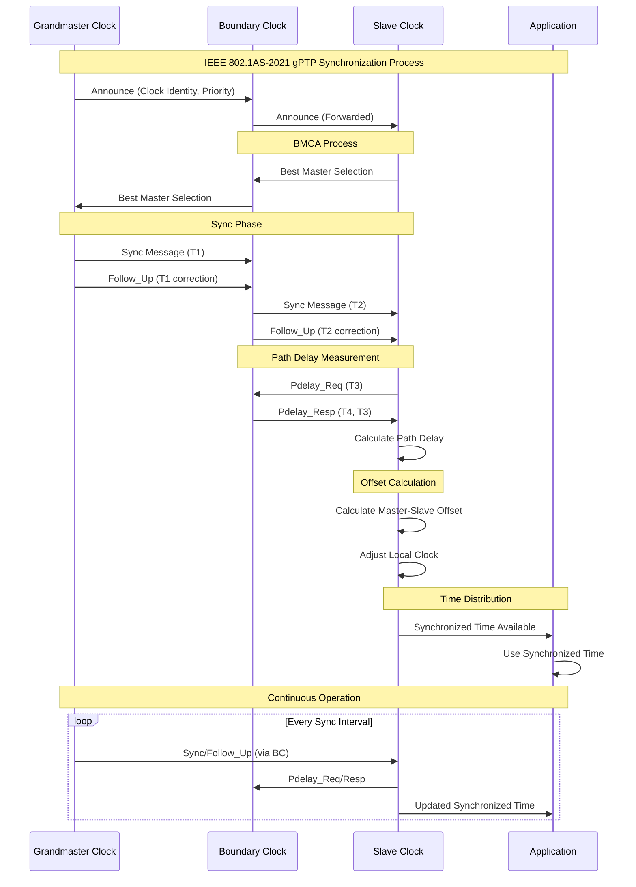

# IEEE 802.1AS-2021 gPTP Architecture Specification

## Architectural Decisions

This architecture implements the following architectural decisions:
- **ADR-001**: Hardware Abstraction Interfaces - Timing hardware abstracted through generic interfaces
- **ADR-002**: IEEE Standards Layering - gPTP as foundational timing layer

## Stakeholder Concerns and Viewpoints

### Stakeholder Concerns
- **Audio Engineers**: Sub-microsecond timing accuracy for professional production
- **Broadcast Operators**: Reliable timing distribution with redundant failover
- **Equipment Manufacturers**: Standards compliance and vendor interoperability
- **System Integrators**: Scalable, manageable timing across complex installations

### Architectural Viewpoints
- **Timing Accuracy Viewpoint**: Nanosecond precision timing distribution
- **Scalability Viewpoint**: Multi-domain support for complex topologies
- **Reliability Viewpoint**: Redundant timing sources with automatic failover
- **Hardware Independence Viewpoint**: Generic timing interfaces across vendors

## C4 Model Architecture

### Level 1: System Context Diagram

```mermaid
graph TB
    subgraph "Professional Media Network Environment"
        AudioEng[Audio Engineer]
        VideoEng[Video Engineer]
        BroadcastOp[Broadcast Operator]
        SystemInt[System Integrator]
        
        gPTP[IEEE 802.1AS-2021<br/>gPTP System]
        
        AudioDev[Professional Audio<br/>Equipment]
        VideoDev[Video Production<br/>Equipment]
        TSNSwitch[TSN Network<br/>Switches]
        NetMgmt[Network Management<br/>System]
        ExternalClock[External Reference<br/>Clock (GPS/PTP)]
    end
    
    AudioEng --> gPTP
    VideoEng --> gPTP
    BroadcastOp --> gPTP
    SystemInt --> gPTP
    
    gPTP --> AudioDev
    gPTP --> VideoDev
    gPTP --> TSNSwitch
    gPTP --> NetMgmt
    ExternalClock --> gPTP
    
    class AudioDev,VideoDev,TSNSwitch,NetMgmt,ExternalClock external
```

### Level 2: Container Diagram



### Level 3: Component Diagram - Clock Management Container



## Architecture Views (4+1 Model)

### Logical View

```mermaid
graph TB
    subgraph "IEEE 802.1AS-2021 Logical Architecture"
        subgraph "Application Layer"
            AudioApp[Audio Applications]
            VideoApp[Video Applications]
            MgmtApp[Management Applications]
        end
        
        subgraph "gPTP Protocol Stack"
            subgraph "Multi-Domain Layer"
                Domain0[Domain 0<br/>Default]
                Domain1[Domain 1<br/>Audio]
                Domain2[Domain 2<br/>Video]
                DomainN[Domain N<br/>Custom]
            end
            
            subgraph "Protocol Engine"
                BMCA[Best Master Clock<br/>Algorithm]
                PDelay[Path Delay<br/>Mechanisms]
                MsgProc[Message Processing<br/>Engine]
                StateMach[Port State<br/>Machines]
            end
            
            subgraph "Timing Services"
                ClockServ[Clock<br/>Services]
                SyncServ[Synchronization<br/>Services]
                TimeServ[Time Distribution<br/>Services]
            end
        end
        
        subgraph "Hardware Abstraction"
            TimingIf[Generic Timing<br/>Interface]
            NetworkIf[Generic Network<br/>Interface]
            ClockIf[Generic Clock<br/>Interface]
        end
        
        subgraph "Hardware Layer"
            TimingHW[Timing Hardware<br/>(Vendor Specific)]
            NetworkHW[Network Hardware<br/>(Vendor Specific)]
            ClockHW[Clock Hardware<br/>(Vendor Specific)]
        end
    end
    
    AudioApp --> Domain1
    VideoApp --> Domain2
    MgmtApp --> Domain0
    
    Domain0 --> BMCA
    Domain1 --> BMCA
    Domain2 --> BMCA
    DomainN --> BMCA
    
    BMCA --> ClockServ
    PDelay --> SyncServ
    MsgProc --> TimeServ
    StateMach --> ClockServ
    
    ClockServ --> TimingIf
    SyncServ --> NetworkIf
    TimeServ --> ClockIf
    
    TimingIf --> TimingHW
    NetworkIf --> NetworkHW
    ClockIf --> ClockHW
```

### Process View



### Development View

```
ieee-802-1as-2021-gptp/
├── src/
│   ├── core/                           # Core gPTP Protocol
│   │   ├── clock/                      # Clock management
│   │   │   ├── bmca.c                  # Best Master Clock Algorithm
│   │   │   ├── clock_selection.c       # Clock quality evaluation
│   │   │   └── multi_domain.c          # Multi-domain support
│   │   ├── protocol/                   # Protocol implementation
│   │   │   ├── message_processing.c    # gPTP message handling
│   │   │   ├── path_delay.c           # Path delay mechanisms
│   │   │   ├── state_machines.c       # Port state machines
│   │   │   └── tlv_processing.c       # TLV support
│   │   └── sync/                      # Synchronization services
│   │       ├── offset_calculation.c    # Master-slave offset
│   │       ├── rate_adjustment.c      # Clock rate adjustment
│   │       └── time_distribution.c    # Time service API
│   ├── interfaces/                    # Hardware abstraction
│   │   ├── timing_interface.h         # Generic timing API
│   │   ├── network_interface.h        # Generic network API
│   │   └── clock_interface.h          # Generic clock API
│   ├── management/                    # Configuration & monitoring
│   │   ├── configuration.c           # Runtime configuration
│   │   ├── monitoring.c              # Performance monitoring
│   │   └── diagnostics.c             # Diagnostic services
│   └── security/                     # Security framework
│       ├── authentication.c          # Message authentication
│       ├── integrity.c               # Integrity verification
│       └── audit.c                   # Security audit logging
├── include/                          # Public headers
│   ├── ieee_802_1as_2021.h          # Main API header
│   ├── gptp_types.h                  # gPTP data types
│   └── gptp_config.h                 # Configuration structures
├── tests/                            # Test suites
│   ├── unit/                         # Unit tests
│   ├── integration/                  # Integration tests
│   ├── conformance/                  # IEEE compliance tests
│   └── performance/                  # Performance benchmarks
├── examples/                         # Usage examples
│   ├── audio_sync_example.c          # Audio synchronization
│   ├── video_sync_example.c          # Video synchronization
│   └── multi_domain_example.c        # Multi-domain setup
└── platform/                        # Platform-specific code
    ├── linux/                        # Linux implementation
    ├── freertos/                     # FreeRTOS implementation
    └── bare_metal/                   # Bare metal implementation
```

### Physical View

```mermaid
graph TB
    subgraph "Professional Media Network Deployment"
        subgraph "Audio Production Rack"
            AudioGM[Audio Grandmaster<br/>gPTP Node]
            AudioMix[Audio Mixer<br/>gPTP Slave]
            AudioRec[Audio Recorder<br/>gPTP Slave]
        end
        
        subgraph "Video Production Area"
            VideoGM[Video Grandmaster<br/>gPTP Node]
            Camera1[Camera 1<br/>gPTP Slave]
            Camera2[Camera 2<br/>gPTP Slave]
            VideoSwitch[Video Switcher<br/>gPTP BC]
        end
        
        subgraph "TSN Network Infrastructure"
            CoreSwitch[Core TSN Switch<br/>gPTP BC]
            DistSwitch1[Distribution Switch<br/>gPTP BC]
            DistSwitch2[Distribution Switch<br/>gPTP BC]
        end
        
        subgraph "Management & Control"
            NMS[Network Management<br/>System]
            TimeRef[External Time<br/>Reference (GPS)]
        end
    end
    
    TimeRef --> AudioGM
    TimeRef --> VideoGM
    
    AudioGM --> CoreSwitch
    VideoGM --> CoreSwitch
    
    CoreSwitch --> DistSwitch1
    CoreSwitch --> DistSwitch2
    
    DistSwitch1 --> AudioMix
    DistSwitch1 --> AudioRec
    DistSwitch2 --> Camera1
    DistSwitch2 --> Camera2
    DistSwitch2 --> VideoSwitch
    
    NMS --> CoreSwitch
    NMS --> DistSwitch1
    NMS --> DistSwitch2
```