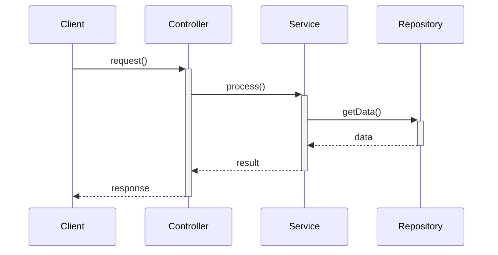
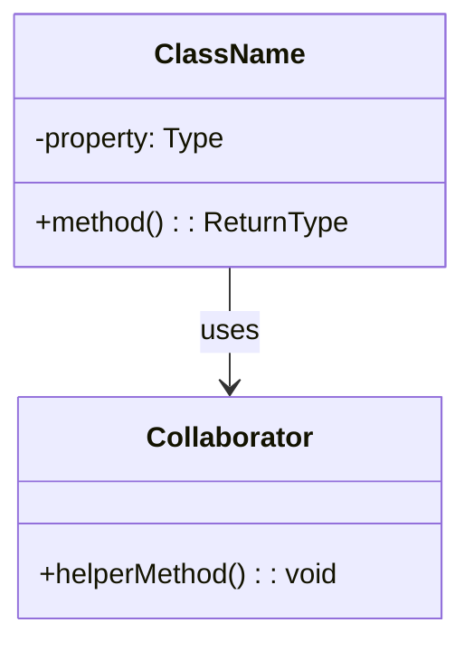
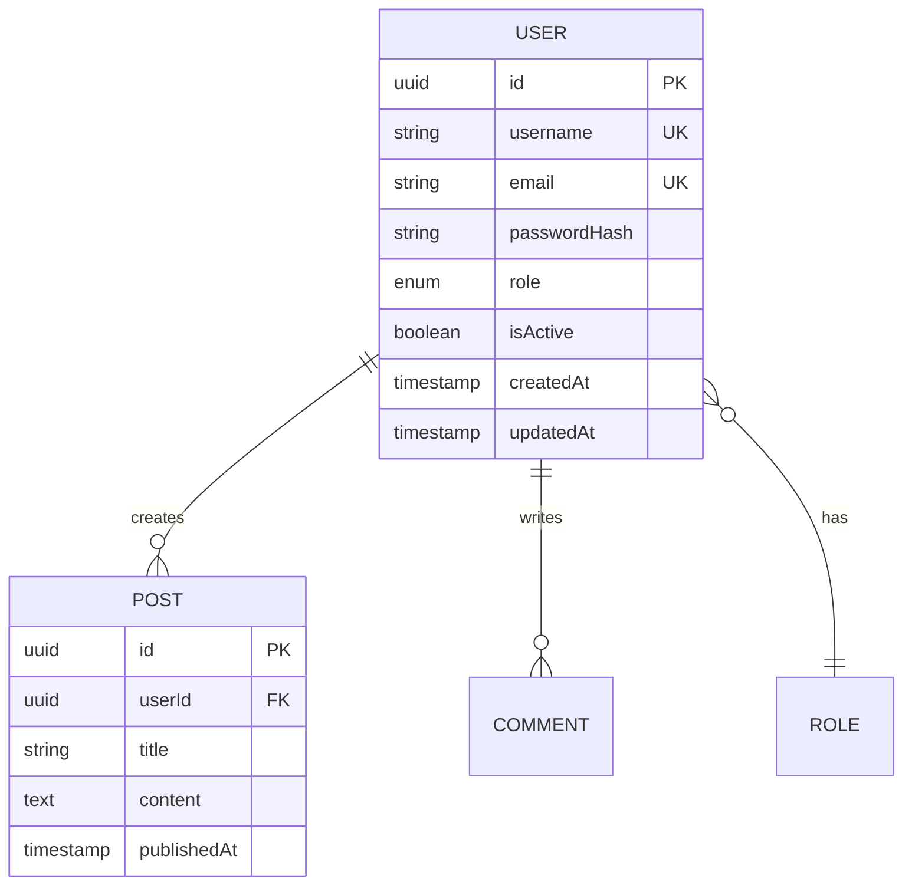

# Phase 04: Detailed Design

**Standards**: IEEE 1016-2009 (Software Design Descriptions)  
**XP Integration**: Simple Design, CRC Cards, Design Patterns

## 🎯 Phase Objectives

1. Transform architecture into detailed component designs
2. Define class structures, interfaces, and algorithms
3. Specify data models and database schemas
4. Document design patterns and implementation approaches
5. Create design specifications enabling implementation

## 📂 Working Directory Context

```yaml
applyTo:
  - "04-design/**/*.md"
  - "04-design/components/**"
  - "04-design/interfaces/**"
  - "04-design/data-models/**"
  - "04-design/patterns/**"
```

## ⚠️ MANDATORY: YAML Front Matter Schema Compliance

**CRITICAL**: All design specification files MUST use EXACT YAML front matter format defined in authoritative schema:

**Authoritative Schema**: `spec-kit-templates/schemas/ieee-design-spec.schema.json`

**Required YAML Front Matter Format**:
```yaml
---
title: "Component Design Specification Title"
type: "design_specification"
standard: "IEEE 1588-2019"  # Use specific IEEE standard 
phase: "04-design"
component: "component-name"
version: "1.0"  # Use X.Y format (NOT semver)
date: "2025-MM-DD"
author: "Your Name"
status: "draft"  # active | draft | review | approved | deprecated
compliance:
  standard: "IEEE 1016-2009"
  section: "Software Design Description"
traceability:
  requirements:
    - "REQ-F-XXX-001"  # Match pattern ^REQ-[A-Z]+-\\d+-\\d{3}$
  architecture:
    - "ARC-C-001"      # Match pattern ^ARC-[A-Z]+-\\d{3}
  tests:
    - "TST-XXX-001"    # Optional - Match pattern ^TST-[A-Z]+-\\d{3}$
---
```

**ENFORCEMENT**:
- Use "type: design_specification" NOT "specType: design" 
- Version format is "X.Y" NOT semver "X.Y.Z"
- Traceability IDs must match exact regex patterns
- Reference authoritative schema file for any questions
- Validation will FAIL if format deviates from schema

## 📋 IEEE 1016-2009 Compliance

### Software Design Description (SDD) Structure

1. **Design Identification**
2. **Design Stakeholders and Concerns**
3. **Design Views**
   - Logical view
   - Implementation view
   - Dependency view
   - Information/Data view
   - Interface view
   - Interaction view
4. **Design Overlays** (Cross-cutting concerns)
5. **Design Rationale**

## 🎨 XP Practices for This Phase

### Simple Design Principles
1. **Runs all tests** - Design must be testable
2. **Contains no duplication** - DRY principle
3. **Expresses intent** - Self-documenting design
4. **Minimizes classes and methods** - YAGNI

### CRC Cards (Class-Responsibility-Collaboration)
- Define class responsibilities
- Identify collaborators
- Keep designs focused

### Design Patterns
- Use proven patterns
- Don't over-pattern (YAGNI)
- Refactor to patterns when needed

## 📝 Required Deliverables

### 1. Software Design Description (SDD)
**Location**: `software-design-description.md`

```markdown
# Software Design Description

## 1. Design Identification
- **Project Name**: [Name]
- **Version**: [Version]
- **Date**: [Date]
- **Authors**: [Names]

## 2. Design Stakeholders and Concerns

### Developers
**Concerns**: Code organization, testability, maintainability

### Testers
**Concerns**: Test interfaces, mock capabilities, test data

### DevOps
**Concerns**: Deployment units, configuration, monitoring hooks

## 3. Design Views

### 3.1 Logical Design View
#### Component: DES-C-001 [Component Name]

**Trace to Architecture**: ARC-C-001

**Purpose**: [What this component does]

**Responsibilities**:
- [Responsibility 1]
- [Responsibility 2]

**Classes/Modules**:

##### Class: [ClassName]
```typescript
/**
 * [Class description]
 * 
 * Responsibilities:
 * - [Responsibility 1]
 * - [Responsibility 2]
 *
 * Collaborators:
 * - [OtherClass]: [How they collaborate]
 */
class ClassName {
  // Properties
  private property1: Type;
  
  // Constructor
  constructor(dependencies: Dependencies) {
    // Dependency injection
  }
  
  // Public methods
  public method1(param: Type): ReturnType {
    // Method description
  }
  
  // Private methods
  private helperMethod(): void {
    // Helper description
  }
}
```

**Design Patterns Used**:
- [Pattern Name]: [Why and how used]

**Key Algorithms**:
- [Algorithm name]: [Complexity, approach]

### 3.2 Implementation View

**Module Structure**:
```
src/
  ├── components/
  │   ├── ComponentName/
  │   │   ├── index.ts
  │   │   ├── ClassName.ts
  │   │   ├── ClassName.test.ts
  │   │   └── types.ts
```

**File Organization**:
- One class per file
- Tests co-located with code
- Shared types in separate files

### 3.3 Dependency View

**Component Dependencies**:
```
DES-C-001 (ComponentName)
  ↓ depends on
DES-C-002 (DataAccess)
DES-C-003 (Logger)
```

**Dependency Injection**:
- Use constructor injection
- Dependencies passed as interfaces
- Enable mocking for tests

### 3.4 Data/Information View

**Data Models**: See `data-models/`

**Caching Strategy**:
- [What is cached]
- [Cache invalidation approach]

**Data Flow**:
```
User Request
  → Controller
  → Service Layer
  → Repository
  → Database
```

### 3.5 Interface View

**Public Interfaces**: See `interfaces/`

**API Contracts**:
- REST endpoints
- GraphQL schemas
- Message contracts

### 3.6 Interaction View

**Sequence Diagrams**:


## 4. Design Overlays (Cross-cutting Concerns)

### 4.1 Error Handling Design
```typescript
// Error hierarchy
class AppError extends Error {
  constructor(
    message: string,
    public code: string,
    public statusCode: number
  ) {}
}

class ValidationError extends AppError {
  constructor(message: string) {
    super(message, 'VALIDATION_ERROR', 400);
  }
}

class NotFoundError extends AppError {
  constructor(resource: string) {
    super(`${resource} not found`, 'NOT_FOUND', 404);
  }
}
```

### 4.2 Logging Design
```typescript
interface ILogger {
  debug(message: string, context?: object): void;
  info(message: string, context?: object): void;
  warn(message: string, context?: object): void;
  error(message: string, error: Error, context?: object): void;
}
```

### 4.3 Security Design
- Authentication: JWT tokens
- Authorization: Role-based access control (RBAC)
- Input validation: All inputs sanitized
- Output encoding: XSS prevention

### 4.4 Transaction Management
```typescript
interface IUnitOfWork {
  beginTransaction(): Promise<void>;
  commit(): Promise<void>;
  rollback(): Promise<void>;
}
```

## 5. Design Rationale

### Key Design Decisions

#### DES-DEC-001: Use Repository Pattern
**Rationale**: Separates data access logic from business logic, enables easy testing

**Alternatives Considered**: Active Record
**Why This Approach**: Better testability (XP requirement), loose coupling

#### DES-DEC-002: Dependency Injection via Constructor
**Rationale**: Makes dependencies explicit, enables testing with mocks

#### DES-DEC-003: Immutable Data Structures
**Rationale**: Thread safety, easier debugging, functional programming benefits

## 6. Traceability

| Design Element | Architecture | Requirements |
|---------------|-------------|--------------|
| DES-C-001     | ARC-C-001   | REQ-F-001    |

## 7. Testing Strategy

### Unit Testing
- Test each class in isolation
- Mock all dependencies
- TDD approach (write tests first)
- Target: >80% code coverage

### Integration Testing
- Test component interactions
- Use test doubles for external systems
- Test error scenarios

## 8. Implementation Notes

### Coding Standards
- Follow [language] style guide
- Use linting tools
- Code review required

### Performance Considerations
- [Optimization approach]
- [Caching strategy]
- [Algorithm complexity]
```

### 2. Component Design Documents
**Location**: `components/[component-name]-design.md`

```markdown
# Component Design: [Component Name]

**ID**: DES-C-001  
**Trace to**: ARC-C-001, REQ-F-XXX

## Purpose
[What this component does]

## Responsibilities
- [Responsibility 1]
- [Responsibility 2]

## CRC Card

### Class: [ClassName]
**Responsibilities**:
- [Responsibility]

**Collaborators**:
- [Class]: [For what purpose]

## Class Diagram


## Detailed Class Specifications

### Class: ClassName

#### Properties
```typescript
private userId: string;           // Unique user identifier
private createdAt: Date;          // Timestamp of creation
private status: UserStatus;       // Active, Suspended, Deleted
```

#### Methods

##### public method1(param: Type): ReturnType
**Purpose**: [What it does]

**Preconditions**:
- [Condition that must be true before calling]

**Postconditions**:
- [What will be true after successful execution]

**Algorithm**:
```
1. Validate input parameters
2. Perform business logic
3. Update state
4. Return result
```

**Error Conditions**:
- `ValidationError` - If param is invalid
- `NotFoundException` - If resource not found

**Complexity**: O(n log n)

**Test Strategy**:
- Test with valid inputs
- Test with invalid inputs
- Test error conditions
- Test edge cases

#### Example Usage
```typescript
// Create instance
const instance = new ClassName(dependencies);

// Use method
const result = instance.method1(validInput);
```

## Design Patterns

### Pattern: Repository Pattern
**Intent**: Abstract data access layer

**Participants**:
- Repository interface
- Concrete repository
- Data models

**Implementation**:
```typescript
interface IUserRepository {
  findById(id: string): Promise<User | null>;
  save(user: User): Promise<User>;
  delete(id: string): Promise<void>;
}

class UserRepository implements IUserRepository {
  constructor(private db: IDatabase) {}
  
  async findById(id: string): Promise<User | null> {
    // Implementation
  }
}
```

## Dependencies
- [Dependency 1]: [Purpose]
- [Dependency 2]: [Purpose]

## Testing Approach

### Unit Tests
```typescript
describe('ClassName', () => {
  let sut: ClassName;
  let mockDependency: jest.Mocked<IDependency>;
  
  beforeEach(() => {
    mockDependency = createMockDependency();
    sut = new ClassName(mockDependency);
  });
  
  it('should do something correctly', () => {
    // Arrange
    const input = createTestInput();
    
    // Act
    const result = sut.method1(input);
    
    // Assert
    expect(result).toEqual(expectedOutput);
  });
});
```

## Performance Considerations
- [Caching strategy]
- [Algorithm complexity]
- [Resource usage]

## Security Considerations
- [Input validation]
- [Authorization checks]
- [Data protection]
```

### 3. Data Model Specifications
**Location**: `data-models/data-model-specification.md`

```markdown
# Data Model Specification

## Entities

### Entity: User

**Trace to**: REQ-F-XXX

#### Attributes
| Attribute | Type | Constraints | Description |
|-----------|------|-------------|-------------|
| id | UUID | Primary Key, Not Null | Unique identifier |
| username | String(50) | Unique, Not Null | User login name |
| email | String(255) | Unique, Not Null | Email address |
| passwordHash | String(255) | Not Null | Hashed password |
| role | Enum | Not Null | USER, ADMIN, MODERATOR |
| isActive | Boolean | Default: true | Account status |
| createdAt | Timestamp | Not Null | Creation timestamp |
| updatedAt | Timestamp | Not Null | Last update timestamp |

#### Business Rules
- Username must be 3-50 characters
- Email must be valid format
- Password must be hashed (bcrypt, 10 rounds)
- Soft delete via isActive flag

#### Relationships
- One User has many Posts (1:N)
- One User has many Comments (1:N)
- One User belongs to one Role (N:1)

### Entity Relationship Diagram


## Database Schema

### Table: users
```sql
CREATE TABLE users (
    id UUID PRIMARY KEY DEFAULT gen_random_uuid(),
    username VARCHAR(50) NOT NULL UNIQUE,
    email VARCHAR(255) NOT NULL UNIQUE,
    password_hash VARCHAR(255) NOT NULL,
    role VARCHAR(20) NOT NULL DEFAULT 'USER',
    is_active BOOLEAN NOT NULL DEFAULT true,
    created_at TIMESTAMP NOT NULL DEFAULT CURRENT_TIMESTAMP,
    updated_at TIMESTAMP NOT NULL DEFAULT CURRENT_TIMESTAMP,
    
    CONSTRAINT chk_role CHECK (role IN ('USER', 'ADMIN', 'MODERATOR')),
    CONSTRAINT chk_username_length CHECK (length(username) >= 3)
);

CREATE INDEX idx_users_email ON users(email);
CREATE INDEX idx_users_username ON users(username);
CREATE INDEX idx_users_role ON users(role);
```

### Indexes
- Primary key index on `id`
- Unique index on `username`
- Unique index on `email`
- Index on `role` (for filtering)

## Object-Relational Mapping

### TypeScript Model
```typescript
import { Entity, Column, PrimaryGeneratedColumn, CreateDateColumn, UpdateDateColumn } from 'typeorm';

@Entity('users')
export class User {
  @PrimaryGeneratedColumn('uuid')
  id: string;
  
  @Column({ type: 'varchar', length: 50, unique: true })
  username: string;
  
  @Column({ type: 'varchar', length: 255, unique: true })
  email: string;
  
  @Column({ name: 'password_hash', type: 'varchar', length: 255 })
  passwordHash: string;
  
  @Column({ type: 'varchar', length: 20, default: 'USER' })
  role: UserRole;
  
  @Column({ name: 'is_active', type: 'boolean', default: true })
  isActive: boolean;
  
  @CreateDateColumn({ name: 'created_at' })
  createdAt: Date;
  
  @UpdateDateColumn({ name: 'updated_at' })
  updatedAt: Date;
}

export enum UserRole {
  USER = 'USER',
  ADMIN = 'ADMIN',
  MODERATOR = 'MODERATOR'
}
```

## Data Validation

### Input Validation
```typescript
class CreateUserDto {
  @IsString()
  @Length(3, 50)
  username: string;
  
  @IsEmail()
  email: string;
  
  @IsString()
  @MinLength(8)
  @Matches(/^(?=.*[a-z])(?=.*[A-Z])(?=.*\d)/, {
    message: 'Password must contain uppercase, lowercase, and number'
  })
  password: string;
  
  @IsEnum(UserRole)
  role: UserRole;
}
```

## Migration Strategy

### Initial Migration
```sql
-- V001_create_users_table.sql
-- Add table creation SQL
```

### Data Migration
- Export existing data
- Transform to new schema
- Import with validation
- Verify data integrity
```

### 4. Interface Design Documents
**Location**: `interfaces/api-design.md`

```markdown
# API Interface Design

## REST API Endpoints

### Endpoint: POST /api/v1/users
**Purpose**: Create new user

**Request**:
```json
{
  "username": "string (3-50 chars)",
  "email": "string (valid email)",
  "password": "string (min 8 chars)",
  "role": "USER | ADMIN | MODERATOR"
}
```

**Response 201 Created**:
```json
{
  "id": "uuid",
  "username": "string",
  "email": "string",
  "role": "string",
  "createdAt": "ISO 8601 timestamp"
}
```

**Error Responses**:
- `400 Bad Request` - Invalid input
  ```json
  {
    "error": "VALIDATION_ERROR",
    "message": "Username must be 3-50 characters",
    "field": "username"
  }
  ```
- `409 Conflict` - Username/email already exists
- `500 Internal Server Error` - Server error

**Authentication**: Not required (registration endpoint)

**Rate Limiting**: 10 requests per hour per IP

### Endpoint: GET /api/v1/users/:id
[Similar detailed specification]

## GraphQL Schema

```graphql
type User {
  id: ID!
  username: String!
  email: String!
  role: UserRole!
  isActive: Boolean!
  createdAt: DateTime!
  posts: [Post!]!
}

enum UserRole {
  USER
  ADMIN
  MODERATOR
}

type Query {
  user(id: ID!): User
  users(filter: UserFilter, page: Int, limit: Int): UserPage!
}

type Mutation {
  createUser(input: CreateUserInput!): User!
  updateUser(id: ID!, input: UpdateUserInput!): User!
  deleteUser(id: ID!): Boolean!
}

input CreateUserInput {
  username: String!
  email: String!
  password: String!
  role: UserRole!
}
```
```

## 🚨 Critical Requirements for This Phase

### Always Do
✅ Follow Simple Design principles (XP)  
✅ Design for testability (TDD-ready)  
✅ Document all public interfaces  
✅ Trace design to architecture and requirements  
✅ Use design patterns appropriately  
✅ Specify error handling  
✅ Define data validation rules  
✅ Include algorithm complexity analysis  

### Never Do
❌ Over-engineer (YAGNI)  
❌ Create designs that can't be tested  
❌ Skip error handling design  
❌ Ignore performance considerations  
❌ Create circular dependencies  
❌ Design without considering refactoring  
❌ Skip documentation of design decisions  

## 📊 Phase Entry Criteria

✅ Architecture Description approved  
✅ Component boundaries defined  
✅ Technical constraints documented  

## 📊 Phase Exit Criteria

✅ Software Design Description (SDD) complete per IEEE 1016  
✅ All components have detailed design specs  
✅ Data models fully specified  
✅ Interface contracts defined  
✅ Design patterns documented  
✅ Traceability to architecture established  
✅ Design reviewed and approved  
✅ Design supports TDD approach  

## 🔗 Traceability

```
ARC-C-XXX (Architecture Component)
  ↓
DES-C-XXX (Design Component)
DES-CL-XXX (Design Class)
  ↓
[Next Phase: Implementation - CODE-XXX]
```

## 🎯 Next Phase

Once this phase is complete, proceed to:
**Phase 05: Implementation** (`05-implementation/`)

---

**Remember**: Design bridges architecture and code. Keep it simple (XP), make it testable (TDD), and document the rationale. Good design enables smooth implementation!
