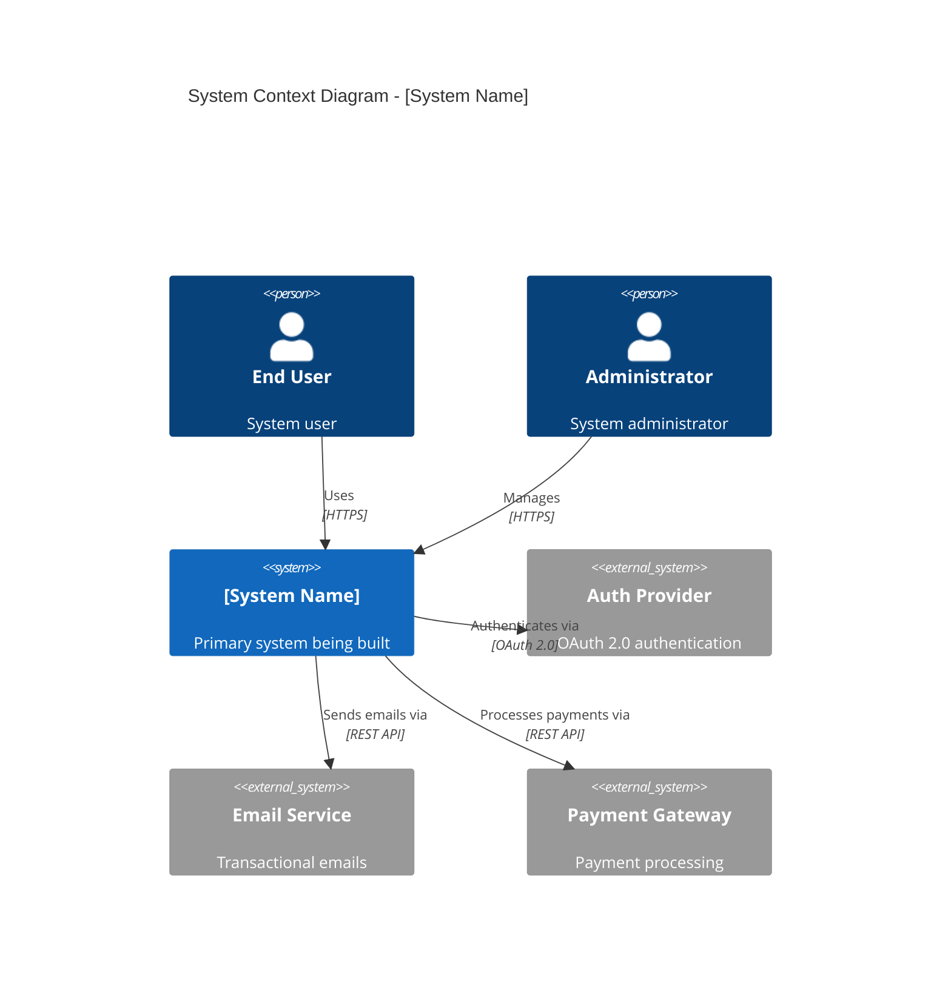
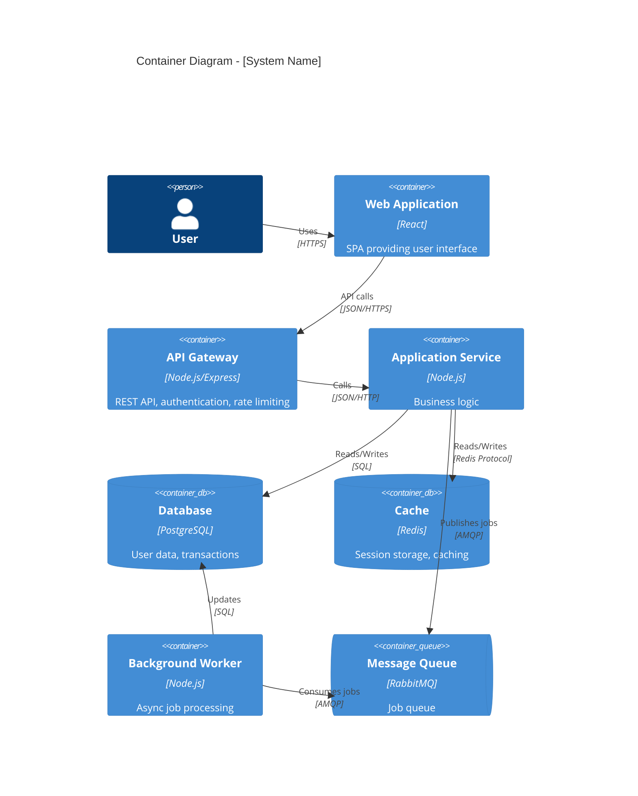
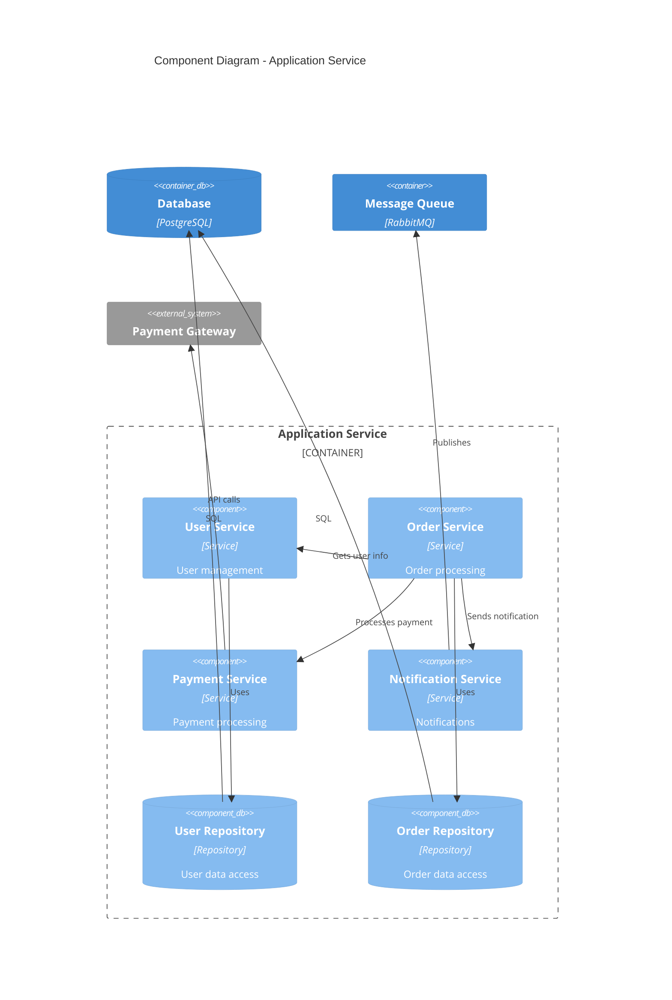

# Architecture Specification Template

> **Spec-Driven Development**: This markdown serves as executable architecture documentation following ISO/IEC/IEEE 42010:2011.
> **Traceability Guardrail**: Ensure every architectural element has IDs:
> - Components: ARC-C-\d{3}
> - Processes (runtime): ARC-P-\d{3}
> - Interfaces: INT-\d{3}
> - Data entities: DATA-\d{3}
> - Deployment nodes: DEP-\d{3}
> - Decisions: ADR-\d{3}
> - Quality attribute scenarios: QA-SC-\d{3}
> Each ADR must reference ≥1 REQ-* or QA-SC-*, and each QA-SC-* must map to ≥1 REQ-NF-*.

---

## Metadata

```yaml
specType: architecture
standard: ISO/IEC/IEEE 42010:2011
phase: 03-architecture
version: 1.0.0
author: [Your Name]
date: 2025-02-15
status: draft
traceability:
  requirements:
    - REQ-F-001
    - REQ-NF-001
```

## Architecture Decision Record

### ADR-001: [Decision Title]

**Status**: Proposed | Accepted | Deprecated | Superseded

**Context**:
[What is the architectural issue or challenge we're addressing?]

**Decision**:
[What architecture approach/pattern/technology have we chosen?]

**Consequences**:

**Positive**:

- [Benefit 1]
- [Benefit 2]

**Negative**:

- [Drawback 1]
- [Trade-off]

**Alternatives Considered**:

1. **[Alternative 1]**: [Why not chosen]
2. **[Alternative 2]**: [Why not chosen]

**Compliance**: Addresses REQ-NF-001 (Scalability)

---

## System Context

### Context Diagram (C4 Level 1)



### Stakeholders and Concerns

| Stakeholder | Concerns | Addressed By |
|-------------|----------|--------------|
| End Users | Usability, Performance, Availability | View: User Experience, View: Deployment |
| Developers | Maintainability, Testability | View: Development, View: Logical |
| Operations | Reliability, Monitoring, Scalability | View: Deployment, View: Operational |
| Security Team | Security, Compliance | View: Security |

---

## Container Diagram (C4 Level 2)



### Container Specifications

#### Container: API Gateway

**Technology**: Node.js 18 + Express 4.x

**Responsibilities**:

- Request routing
- Authentication & Authorization
- Rate limiting
- Request/Response logging
- API versioning

**Interfaces Provided**:

- REST API (JSON over HTTPS)
- WebSocket connections

**Interfaces Required**:

- Application Service (HTTP)
- Auth Provider (OAuth 2.0)
- Cache (Redis protocol)

**Quality Attributes**:

- Performance: < 50ms latency (gateway overhead)
- Availability: 99.95%
- Scalability: Horizontal scaling up to 50 instances

**Configuration**:

```yaml
# Environment variables
PORT: 3000
AUTH_PROVIDER_URL: https://auth.example.com
RATE_LIMIT_REQUESTS: 1000
RATE_LIMIT_WINDOW: 3600  # seconds
```

---

## Component Diagram (C4 Level 3)

### Application Service Components



---

## Architecture Views

### Logical View

**Purpose**: Show key abstractions and their relationships

**Elements**:

- **User Aggregate**: User, Profile, Preferences
- **Order Aggregate**: Order, OrderLine, Payment
- **Notification Aggregate**: Notification, Template

**Patterns**:

- **Domain-Driven Design**: Aggregates with clear boundaries
- **Repository Pattern**: Data access abstraction
- **Service Layer**: Business logic coordination

### Process View

**Purpose**: Show runtime behavior and concurrency

**Key Processes**:

1. **Request Processing**:
   ```
   User Request → API Gateway → Load Balancer → App Service → Database
   ```

2. **Async Job Processing**:
   ```
   App Service → Message Queue → Worker → Database
   ```

**Concurrency Strategy**:

- Stateless application services (horizontal scaling)
- Connection pooling for database (pool size: 10-50 per instance)
- Worker process pool (4 workers per container)

### Development View

**Layer Architecture**:

```text
┌─────────────────────────────────────┐
│     Presentation Layer              │  (API Controllers, DTOs)
├─────────────────────────────────────┤
│     Application Layer               │  (Use Cases, Commands, Queries)
├─────────────────────────────────────┤
│     Domain Layer                    │  (Entities, Value Objects, Domain Services)
├─────────────────────────────────────┤
│     Infrastructure Layer            │  (Repositories, External Services)
└─────────────────────────────────────┘
```

**Module Dependencies**:

```typescript
// domain/ - No dependencies on other layers
export class User {
  // Pure domain logic
}

// application/ - Depends on domain/
import { User } from '../domain/User';

export class CreateUserUseCase {
  // Application orchestration
}

// infrastructure/ - Depends on domain/, implements interfaces
import { IUserRepository } from '../domain/IUserRepository';

export class UserRepository implements IUserRepository {
  // Database implementation
}

// presentation/ - Depends on application/
import { CreateUserUseCase } from '../application/CreateUserUseCase';

export class UserController {
  // HTTP handling
}
```

### Physical/Deployment View

**Production Environment**:

```yaml
# Kubernetes deployment
apiVersion: apps/v1
kind: Deployment
metadata:
  name: app-service
spec:
  replicas: 5
  selector:
    matchLabels:
      app: app-service
  template:
    spec:
      containers:
      - name: app
        image: myapp:1.0.0
        resources:
          requests:
            memory: "512Mi"
            cpu: "500m"
          limits:
            memory: "1Gi"
            cpu: "1000m"
        env:
        - name: DATABASE_URL
          valueFrom:
            secretKeyRef:
              name: db-credentials
              key: url
---
apiVersion: v1
kind: Service
metadata:
  name: app-service
spec:
  type: LoadBalancer
  ports:
  - port: 80
    targetPort: 3000
  selector:
    app: app-service
```

**Infrastructure**:

- **Cloud Provider**: AWS
- **Region**: us-east-1 (primary), us-west-2 (DR)
- **Compute**: EKS (Kubernetes) with auto-scaling
- **Database**: RDS PostgreSQL 14 (Multi-AZ)
- **Cache**: ElastiCache Redis (cluster mode)
- **Storage**: S3 for file storage
- **CDN**: CloudFront

### Data View

**Data Architecture**:

```sql
-- Core tables
CREATE TABLE users (
    id UUID PRIMARY KEY,
    username VARCHAR(50) UNIQUE NOT NULL,
    email VARCHAR(255) UNIQUE NOT NULL,
    created_at TIMESTAMP NOT NULL,
    updated_at TIMESTAMP NOT NULL
);

CREATE TABLE orders (
    id UUID PRIMARY KEY,
    user_id UUID NOT NULL REFERENCES users(id),
    status VARCHAR(20) NOT NULL,
    total_amount DECIMAL(10,2) NOT NULL,
    created_at TIMESTAMP NOT NULL,
    updated_at TIMESTAMP NOT NULL
);

CREATE TABLE order_lines (
    id UUID PRIMARY KEY,
    order_id UUID NOT NULL REFERENCES orders(id),
    product_id UUID NOT NULL,
    quantity INTEGER NOT NULL,
    unit_price DECIMAL(10,2) NOT NULL
);
```

**Data Flow**:

1. Write: App → Database (transactional)
2. Read: App → Cache (if hit) → Database (if miss) → Cache (store)
3. Analytics: Database → ETL → Data Warehouse

**Caching Strategy**:

- **What to cache**: User sessions, frequently accessed data
- **Cache TTL**: 5 minutes for dynamic data, 1 hour for static data
- **Invalidation**: Event-based (on updates)

---

## Cross-Cutting Concerns

### Security Architecture

**Authentication**:

- OAuth 2.0 + OpenID Connect
- JWT tokens (access: 15 min, refresh: 7 days)
- Multi-factor authentication for sensitive operations

**Authorization**:

- Role-Based Access Control (RBAC)
- Roles: Admin, User, Guest
- Permission checks at API Gateway and Application Service

**Data Protection**:

- TLS 1.3 for all communications
- AES-256 encryption for data at rest
- Field-level encryption for PII
- Secure key management (AWS KMS)

### Performance Architecture

**Optimization Strategies**:

- **Caching**: Redis for hot data
- **Database**: Read replicas for scaling reads
- **CDN**: CloudFront for static assets
- **Async Processing**: Background jobs for heavy operations
- **Connection Pooling**: Reuse database connections

**Performance Targets**:

| Operation | Target | Max |
|-----------|--------|-----|
| API Response (p95) | < 200ms | < 500ms |
| API Response (p99) | < 500ms | < 1s |
| Page Load | < 2s | < 3s |
| Database Query (p95) | < 50ms | < 200ms |

### Monitoring & Observability

**Metrics** (Prometheus):

- Request rate, latency, error rate (RED)
- CPU, memory, disk, network (USE)
- Business metrics (orders/sec, revenue)

**Logs** (ELK Stack):

- Structured JSON logs
- Correlation IDs for request tracing
- Log levels: ERROR, WARN, INFO, DEBUG

**Traces** (Jaeger):

- Distributed tracing across services
- Performance bottleneck identification

**Alerts**:

- PagerDuty for critical alerts
- Slack for warning alerts

---

## Technology Stack

| Layer | Technology | Rationale |
|-------|-----------|-----------|
| Frontend | React 18 + TypeScript | Industry standard, strong typing |
| API Gateway | Node.js + Express | Fast, async, mature ecosystem |
| Application | Node.js + TypeScript | Consistency with gateway, strong typing |
| Database | PostgreSQL 14 | ACID compliance, JSON support |
| Cache | Redis 7 | High performance, data structures |
| Message Queue | RabbitMQ 3 | Reliable, feature-rich |
| Container | Docker | Standard containerization |
| Orchestration | Kubernetes | Industry standard, mature |
| Cloud | AWS | Reliability, feature set |

---

## Quality Attributes Scenarios

### Scalability Scenario

**Scenario**: Black Friday traffic spike (10x normal)

**Response**:

- Auto-scaling triggers at 70% CPU
- Scale from 5 to 50 instances in 5 minutes
- Database read replicas handle increased read load
- CDN absorbs static content requests

**Measure**: System handles 100k concurrent users with < 500ms p95 latency

### Availability Scenario

**Scenario**: Database primary fails

**Response**:

- Automatic failover to standby (< 60 seconds)
- Application connections reconnect automatically
- No data loss (synchronous replication)

**Measure**: RTO < 5 minutes, RPO = 0 (no data loss)

### Security Scenario

**Scenario**: SQL injection attack attempt

**Response**:

- Parameterized queries prevent injection
- Web Application Firewall (WAF) detects and blocks
- Security monitoring alerts team
- Attempted attack logged for analysis

**Measure**: Zero successful injections

---

## Risks and Mitigations

| Risk | Probability | Impact | Mitigation |
|------|------------|--------|------------|
| Database becomes bottleneck | Medium | High | Implement caching, read replicas, query optimization |
| Third-party API failure | High | Medium | Circuit breaker pattern, graceful degradation |
| Cloud provider outage | Low | Critical | Multi-region deployment, disaster recovery plan |
| Security breach | Low | Critical | Defense in depth, regular security audits, penetration testing |

---

## Traceability

| Architecture Component | Requirements | ADRs |
|----------------------|-------------|------|
| API Gateway | REQ-NF-001 (Performance), REQ-NF-002 (Security) | ADR-001 |
| Microservices | REQ-NF-003 (Scalability) | ADR-002 |
| PostgreSQL | REQ-F-010 (Data Integrity) | ADR-003 |

---

## Validation

### Architecture Review Checklist

- [ ] All requirements addressed in architecture
- [ ] Quality attributes achievable
- [ ] Technology choices justified
- [ ] Risks identified and mitigated
- [ ] Scalability plan defined
- [ ] Security architecture complete
- [ ] Monitoring strategy defined
- [ ] Deployment approach defined

### Architecture Evaluation

**Method**: ATAM (Architecture Tradeoff Analysis Method)

**Quality Attributes Evaluated**:

- Performance
- Scalability
- Availability
- Security
- Maintainability

**Results**: [Document ATAM results]

---

## Next Steps

1. Review with architecture team
2. Validate with requirements
3. Create detailed component designs (Phase 04)
4. Prototype critical components
5. Update based on feedback
